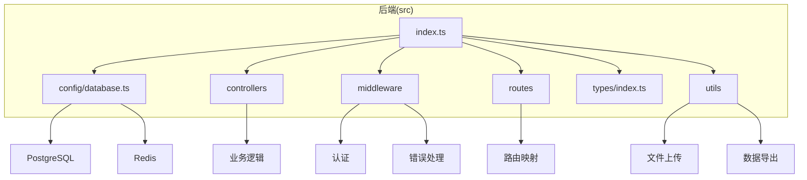
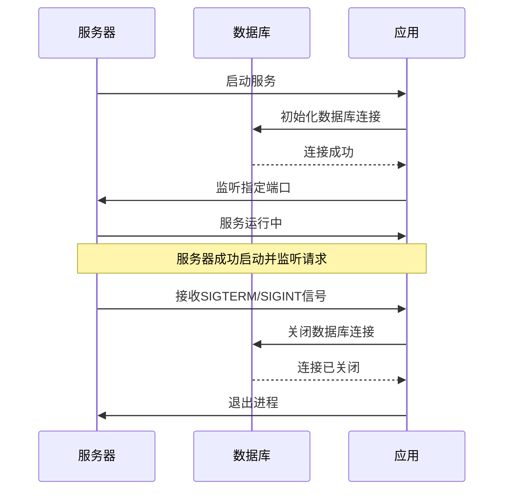
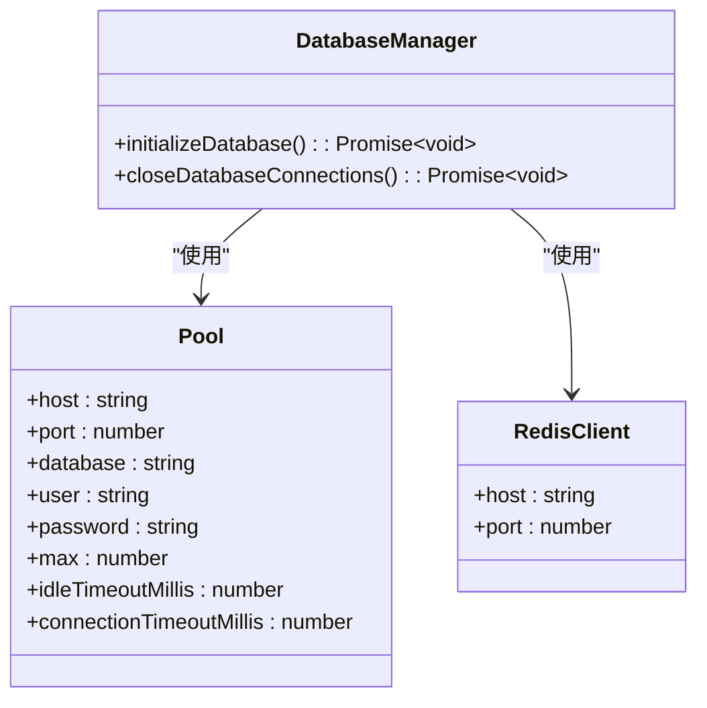
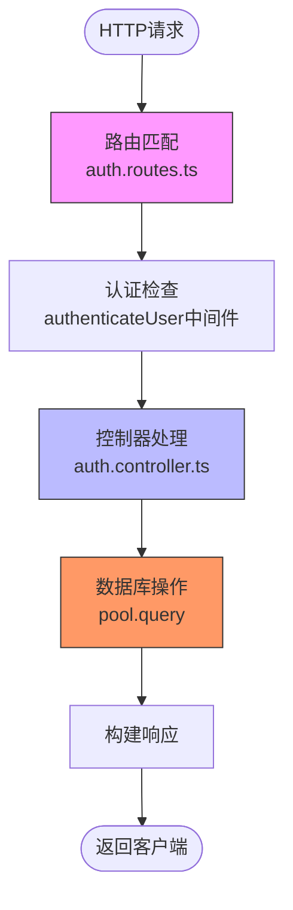
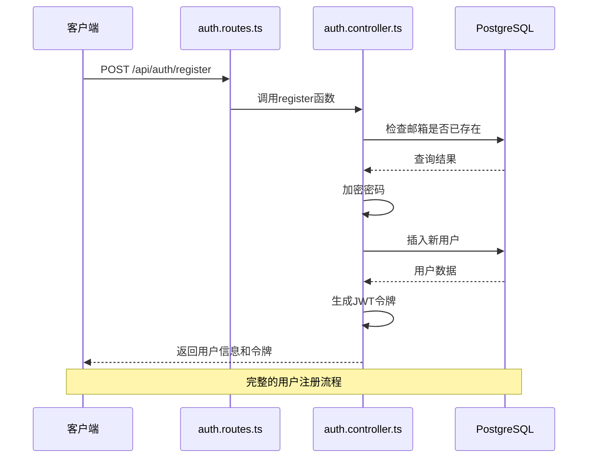
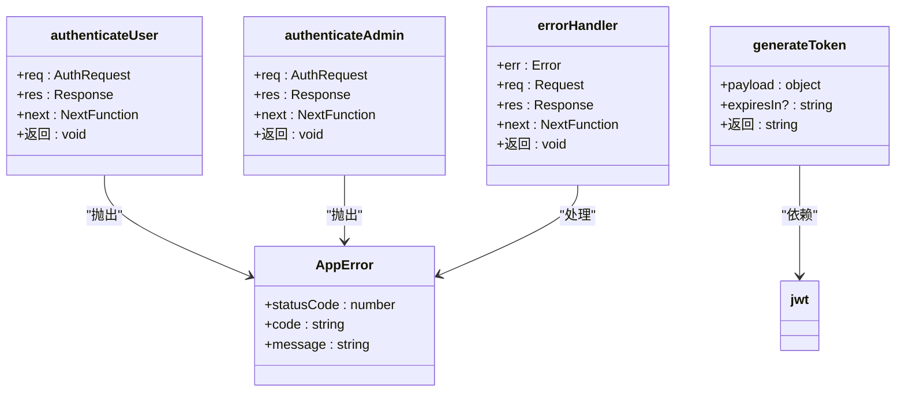
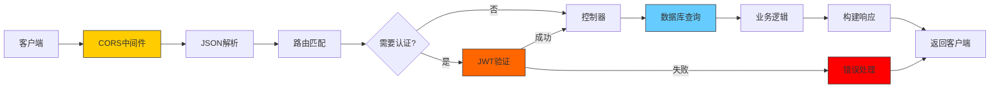
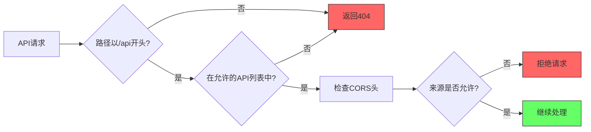

# 后端架构

<cite>
**本文档引用的文件**
- [index.ts](file://backend/src/index.ts)
- [database.ts](file://backend/src/config/database.ts)
- [auth.controller.ts](file://backend/src/controllers/auth.controller.ts)
- [auth.routes.ts](file://backend/src/routes/auth.routes.ts)
- [auth.ts](file://backend/src/middleware/auth.ts)
- [errorHandler.ts](file://backend/src/middleware/errorHandler.ts)
- [logger.ts](file://backend/src/utils/logger.ts)
- [types/index.ts](file://backend/src/types/index.ts)
- [admin.controller.ts](file://backend/src/controllers/admin.controller.ts)
- [method.controller.ts](file://backend/src/controllers/method.controller.ts)
- [upload.ts](file://backend/src/utils/upload.ts)
- [export.ts](file://backend/src/utils/export.ts)
</cite>

## 目录
1. [项目结构](#项目结构)
2. [应用入口与服务器初始化](#应用入口与服务器初始化)
3. [数据库连接与ORM配置](#数据库连接与orm配置)
4. [MVC架构与职责分离](#mvc架构与职责分离)
5. [中间件层设计](#中间件层设计)
6. [系统组件与调用链](#系统组件与调用链)
7. [API版本控制与安全性](#api版本控制与安全性)
8. [日志记录实践](#日志记录实践)

## 项目结构

nian后端系统采用基于Express的MVC架构模式，项目结构清晰，模块化程度高。系统主要分为配置、控制器、中间件、路由、类型定义和工具类等核心模块，实现了关注点分离和职责明确。



**图示来源**
- [index.ts](file://backend/src/index.ts#L1-L85)
- [database.ts](file://backend/src/config/database.ts#L1-L47)

**本节来源**
- [index.ts](file://backend/src/index.ts#L1-L85)
- [database.ts](file://backend/src/config/database.ts#L1-L47)

## 应用入口与服务器初始化

应用入口文件`index.ts`负责初始化Express服务器、加载中间件和注册路由模块。系统通过模块化方式导入各功能路由，并在启动时初始化数据库连接，实现了优雅的启动和关闭流程。



**图示来源**
- [index.ts](file://backend/src/index.ts#L53-L84)

**本节来源**
- [index.ts](file://backend/src/index.ts#L1-L85)

## 数据库连接与ORM配置

`database.ts`文件配置了PostgreSQL连接池和Redis客户端，实现了高效的数据库连接管理。系统采用原生SQL查询而非传统ORM框架，通过TypeScript类型定义实现数据模型的类型安全。



**图示来源**
- [database.ts](file://backend/src/config/database.ts#L5-L47)

**本节来源**
- [database.ts](file://backend/src/config/database.ts#L1-L47)

## MVC架构与职责分离

系统采用标准的MVC模式，实现了控制器与路由的职责分离。以认证模块为例，`auth.routes.ts`负责定义路由映射，`auth.controller.ts`处理业务逻辑，形成了清晰的分层架构。



### 认证流程分析



**图示来源**
- [auth.routes.ts](file://backend/src/routes/auth.routes.ts#L1-L17)
- [auth.controller.ts](file://backend/src/controllers/auth.controller.ts#L1-L150)

**本节来源**
- [auth.routes.ts](file://backend/src/routes/auth.routes.ts#L1-L17)
- [auth.controller.ts](file://backend/src/controllers/auth.controller.ts#L1-L150)
- [method.controller.ts](file://backend/src/controllers/method.controller.ts#L1-L153)

## 中间件层设计

中间件层是系统安全性和错误处理的核心，包含身份验证和全局错误处理两大关键组件。`auth.ts`实现了JWT令牌验证机制，`errorHandler.ts`提供了统一的错误响应格式。



### 身份验证流程

```mermaid
flowchart TD
A[收到请求] --> B{包含Authorization头?}
B --> |否| C[返回401错误]
B --> |是| D{以Bearer开头?}
D --> |否| C
D --> |是| E[提取令牌]
E --> F[验证JWT签名]
F --> G{验证成功?}
G --> |否| H[返回401错误]
G --> |是| I[解析用户信息]
I --> J[附加到请求对象]
J --> K[调用next()]
style C fill:#f66,stroke:#333
style H fill:#f66,stroke:#333
style K fill:#6f6,stroke:#333
```

**图示来源**
- [auth.ts](file://backend/src/middleware/auth.ts#L8-L87)
- [errorHandler.ts](file://backend/src/middleware/errorHandler.ts#L4-L97)

**本节来源**
- [auth.ts](file://backend/src/middleware/auth.ts#L1-L87)
- [errorHandler.ts](file://backend/src/middleware/errorHandler.ts#L1-L97)

## 系统组件与调用链

系统组件图展示了从请求进入服务器到返回响应的完整调用链，体现了各组件之间的协作关系和数据流动。



**图示来源**
- [index.ts](file://backend/src/index.ts#L21-L51)
- [auth.routes.ts](file://backend/src/routes/auth.routes.ts#L1-L17)
- [auth.controller.ts](file://backend/src/controllers/auth.controller.ts#L1-L150)

**本节来源**
- [index.ts](file://backend/src/index.ts#L1-L85)
- [auth.routes.ts](file://backend/src/routes/auth.routes.ts#L1-L17)
- [auth.controller.ts](file://backend/src/controllers/auth.controller.ts#L1-L150)

## API版本控制与安全性

系统通过路由前缀实现了API版本控制，所有API端点均以`/api`为前缀，便于未来进行版本迭代。安全性方面，系统实现了CORS配置、JWT身份验证和CSRF防护等多重安全机制。



**本节来源**
- [index.ts](file://backend/src/index.ts#L38-L43)
- [database.ts](file://backend/src/config/database.ts#L1-L47)

## 日志记录实践

系统采用Winston日志库实现结构化日志记录，支持不同级别的日志输出和JSON格式的日志数据，便于日志收集和分析。

```mermaid
classDiagram
class logger {
+level : string
+format : Format
+transports : Transport[]
}
class Format {
+timestamp()
+errors({stack : true})
+json()
}
class Transport {
+Console
}
logger --> Format : "组合"
logger --> Transport : "使用"
```

**图示来源**
- [logger.ts](file://backend/src/utils/logger.ts#L1-L37)

**本节来源**
- [logger.ts](file://backend/src/utils/logger.ts#L1-L37)