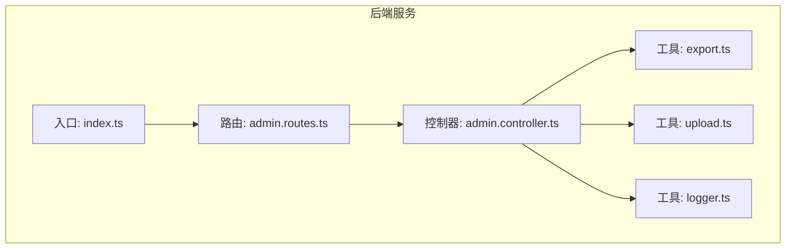
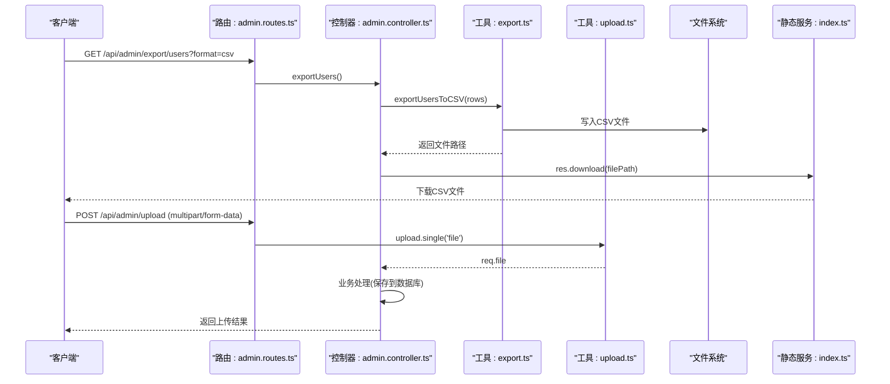
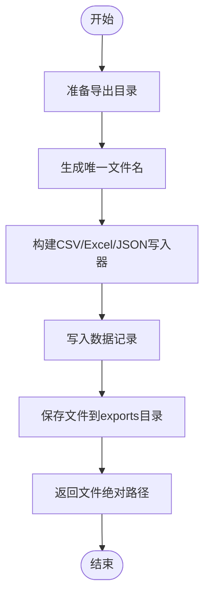
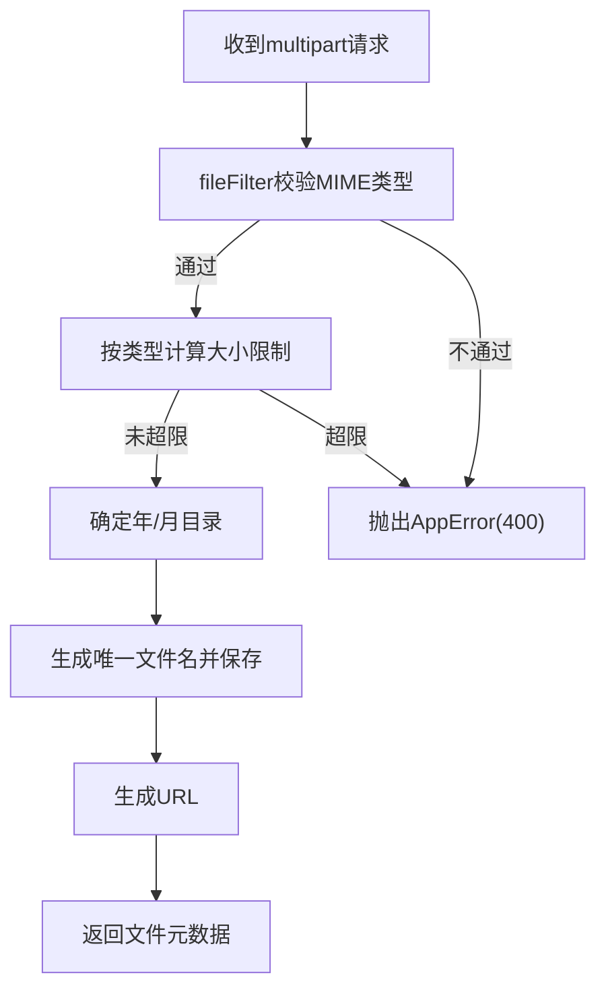
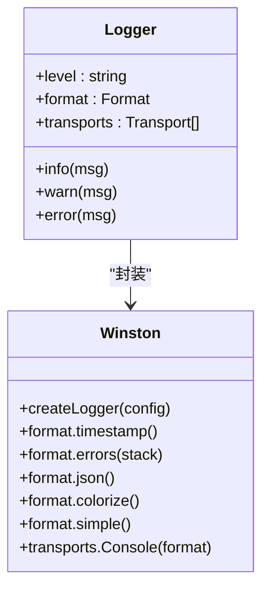
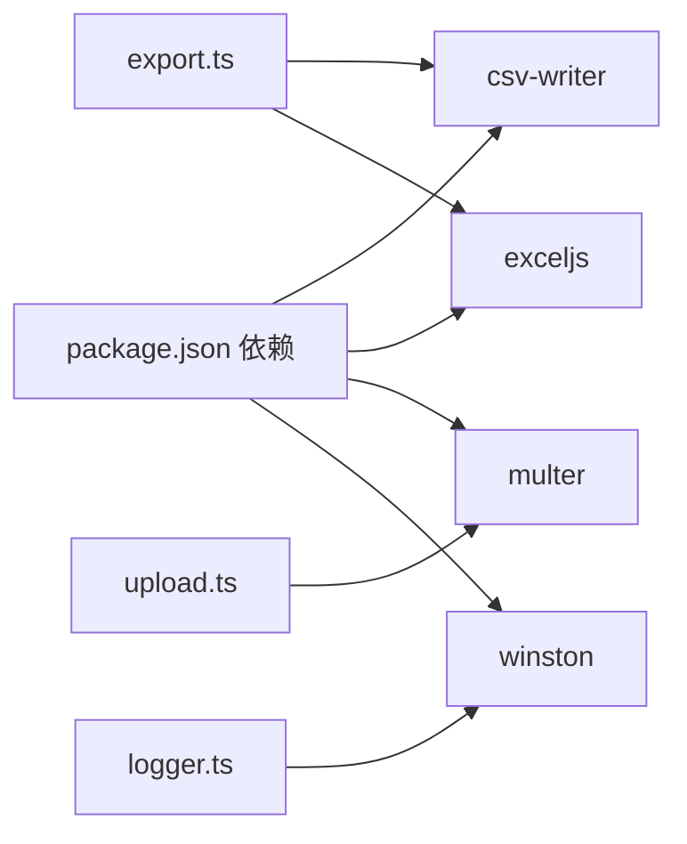

# 工具函数

<cite>
**本文引用的文件**
- [backend/src/utils/export.ts](file://backend/src/utils/export.ts)
- [backend/src/utils/upload.ts](file://backend/src/utils/upload.ts)
- [backend/src/utils/logger.ts](file://backend/src/utils/logger.ts)
- [backend/src/controllers/admin.controller.ts](file://backend/src/controllers/admin.controller.ts)
- [backend/src/routes/admin.routes.ts](file://backend/src/routes/admin.routes.ts)
- [backend/src/middleware/errorHandler.ts](file://backend/src/middleware/errorHandler.ts)
- [backend/src/index.ts](file://backend/src/index.ts)
- [backend/package.json](file://backend/package.json)
</cite>

## 目录
1. [简介](#简介)
2. [项目结构](#项目结构)
3. [核心组件](#核心组件)
4. [架构总览](#架构总览)
5. [详细组件分析](#详细组件分析)
6. [依赖分析](#依赖分析)
7. [性能考虑](#性能考虑)
8. [故障排查指南](#故障排查指南)
9. [结论](#结论)
10. [附录](#附录)

## 简介
本文件系统化梳理 nian 后端工具函数库，重点覆盖以下三类能力：
- 数据导出：CSV/Excel/JSON 格式生成、文件清理与下载
- 文件上传：MIME 类型校验、大小限制、存储路径组织、URL 生成与删除
- 结构化日志：基于 winston 的日志记录、时间戳与上下文输出

同时，文档提供各工具函数的 API 接口说明、参数与返回值、异常处理策略，并结合控制器中的使用示例，给出在控制器中正确调用这些工具函数的最佳实践。

## 项目结构
工具函数位于 backend/src/utils 下，分别对应 export.ts、upload.ts、logger.ts；控制器与路由在 backend/src/controllers 与 backend/src/routes；静态文件挂载在 backend/src/index.ts 中，分别指向 uploads 与 exports 目录。

图表来源
- [backend/src/index.ts](file://backend/src/index.ts#L1-L48)
- [backend/src/routes/admin.routes.ts](file://backend/src/routes/admin.routes.ts#L56-L97)
- [backend/src/controllers/admin.controller.ts](file://backend/src/controllers/admin.controller.ts#L1124-L1227)
- [backend/src/utils/export.ts](file://backend/src/utils/export.ts#L1-L130)
- [backend/src/utils/upload.ts](file://backend/src/utils/upload.ts#L1-L128)
- [backend/src/utils/logger.ts](file://backend/src/utils/logger.ts#L1-L37)

章节来源
- [backend/src/index.ts](file://backend/src/index.ts#L1-L48)
- [backend/src/routes/admin.routes.ts](file://backend/src/routes/admin.routes.ts#L56-L97)

## 核心组件
- export.ts：提供导出用户、方法、练习记录为 CSV/Excel/JSON 的能力，包含文件清理与下载流程。
- upload.ts：提供文件上传中间件、MIME 类型过滤、大小限制、存储路径组织、URL 生成与删除。
- logger.ts：基于 winston 的结构化日志记录器，统一输出格式与级别。

章节来源
- [backend/src/utils/export.ts](file://backend/src/utils/export.ts#L1-L130)
- [backend/src/utils/upload.ts](file://backend/src/utils/upload.ts#L1-L128)
- [backend/src/utils/logger.ts](file://backend/src/utils/logger.ts#L1-L37)

## 架构总览
下图展示“导出”与“上传”两大功能在控制器与工具层之间的交互，以及静态文件服务对导出文件的暴露。

图表来源
- [backend/src/routes/admin.routes.ts](file://backend/src/routes/admin.routes.ts#L56-L97)
- [backend/src/controllers/admin.controller.ts](file://backend/src/controllers/admin.controller.ts#L1124-L1227)
- [backend/src/utils/export.ts](file://backend/src/utils/export.ts#L1-L130)
- [backend/src/utils/upload.ts](file://backend/src/utils/upload.ts#L1-L128)
- [backend/src/index.ts](file://backend/src/index.ts#L29-L31)

## 详细组件分析

### 数据导出模块（export.ts）
- 功能概览
  - 用户导出：将用户数据写入 CSV 文件，列头包含 ID、邮箱、昵称、注册时间、最后登录、状态等。
  - 方法导出：将方法数据写入 CSV 文件，列头包含 ID、标题、分类、难度、时长、状态、浏览/选择次数、创建时间等。
  - 练习记录导出：将练习记录写入 Excel 工作簿，包含用户邮箱、方法名称、练习日期、时长、前后心情、改善值、备注等，并设置表头样式。
  - 通用 JSON 导出：将任意数组序列化为 JSON 文件。
  - 过期文件清理：定期删除 exports 目录下超过 24 小时的文件。
- 关键实现点
  - 目录准备：自动创建 exports 目录。
  - 唯一文件名：基于时间戳与随机数生成，避免冲突。
  - Excel 表头样式：设置加粗与浅灰色填充。
  - 文件清理：遍历目录，按修改时间判断是否删除。
- 使用方式
  - 控制器通过 require 引入导出函数，生成文件路径后通过 res.download 下载。
  - 可根据查询参数选择导出格式（如 CSV/Excel/JSON）。

图表来源
- [backend/src/utils/export.ts](file://backend/src/utils/export.ts#L1-L130)

章节来源
- [backend/src/utils/export.ts](file://backend/src/utils/export.ts#L1-L130)
- [backend/src/controllers/admin.controller.ts](file://backend/src/controllers/admin.controller.ts#L1124-L1227)

API 接口文档（export.ts）
- exportUsersToCSV(users: any[]): Promise<string>
  - 参数：users 为用户记录数组
  - 返回：导出文件的绝对路径
  - 异常：无显式抛出，若写入失败由底层库或文件系统异常传播
- exportMethodsToCSV(methods: any[]): Promise<string>
  - 参数：methods 为方法记录数组
  - 返回：导出文件的绝对路径
- exportPracticesToExcel(practices: any[]): Promise<string>
  - 参数：practices 为练习记录数组
  - 返回：导出文件的绝对路径
  - 处理：计算“心情改善”字段（后-前）
- exportToJSON(data: any[], prefix: string): Promise<string>
  - 参数：data 为任意数组，prefix 为文件前缀
  - 返回：导出文件的绝对路径
- cleanupExpiredExports(): void
  - 参数：无
  - 返回：无
  - 行为：删除 exports 目录下超过 24 小时的文件

最佳实践（控制器中使用）
- 在导出接口中，先根据查询参数决定格式，再调用相应导出函数，最后通过 res.download(filePath) 提供下载。
- 对于 Excel 导出，建议在业务层准备好需要的字段映射，确保导出列与前端展示一致。
- 定期调用 cleanupExpiredExports() 清理过期文件，避免磁盘占用增长。

章节来源
- [backend/src/controllers/admin.controller.ts](file://backend/src/controllers/admin.controller.ts#L1124-L1227)
- [backend/src/utils/export.ts](file://backend/src/utils/export.ts#L1-L130)

### 文件上传模块（upload.ts）
- 功能概览
  - MIME 类型验证：仅允许图片、音频、视频三类常见媒体类型。
  - 文件大小限制：按类型区分上限（图片 5MB、音频 20MB、视频 100MB，默认 5MB），并受全局最大 100MB 限制。
  - 存储路径管理：按“年/月”子目录组织上传文件，自动创建目录。
  - 文件名生成：使用时间戳+随机数保证唯一性。
  - URL 生成：将绝对路径转换为可访问的 URL。
  - 文件删除：安全删除本地文件。
- 关键实现点
  - fileFilter：统一校验 MIME 类型，不支持类型时抛出 AppError。
  - getFileSizeLimit：按类型返回限制，validateFileSize 用于运行时校验。
  - getUploadPath：动态生成年/月目录。
  - generateFileUrl：从绝对路径提取相对 uploads 路径并转换为 URL。
- 使用方式
  - 在路由中使用 upload.single('file') 作为中间件，接收单文件上传。
  - 控制器中读取 req.file 并进行业务处理（如入库、生成 URL）。

图表来源
- [backend/src/utils/upload.ts](file://backend/src/utils/upload.ts#L1-L128)

章节来源
- [backend/src/utils/upload.ts](file://backend/src/utils/upload.ts#L1-L128)
- [backend/src/controllers/admin.controller.ts](file://backend/src/controllers/admin.controller.ts#L472-L513)
- [backend/src/routes/admin.routes.ts](file://backend/src/routes/admin.routes.ts#L80-L84)

API 接口文档（upload.ts）
- upload: multer 实例
  - 用途：Express 中间件，接收单文件上传
  - 配置：destination 按年/月目录存储，filename 唯一命名，fileFilter 校验类型，limits 最大 100MB
- getFileType(mimetype: string): 'image' | 'audio' | 'video'
  - 参数：MIME 类型字符串
  - 返回：类型枚举
  - 异常：无法识别类型时抛出 AppError(400)
- generateFileUrl(filePath: string): string
  - 参数：文件绝对路径
  - 返回：可访问的 URL
  - 异常：路径无效时抛出 Error
- deleteFile(filePath: string): void
  - 参数：文件绝对路径
  - 行为：存在则删除，异常记录到控制台
- validateFileSize(file: Express.Multer.File): void
  - 参数：Multer 文件对象
  - 异常：超过类型限制时抛出 AppError(400)
- getUploadPath(): string
  - 返回：当前年/月目录绝对路径
- storage: multer.diskStorage
  - destination：动态返回年/月目录
  - filename：唯一命名

最佳实践（控制器中使用）
- 在路由层使用 upload.single('file') 接收文件。
- 控制器中先校验 req.admin.id 与 req.file 是否存在，再进行业务处理。
- 使用 generateFileUrl 生成对外可访问的 URL，便于前端展示与下载。
- 对于需要持久化的文件，务必在入库成功后再执行 deleteFile，避免数据丢失。

章节来源
- [backend/src/controllers/admin.controller.ts](file://backend/src/controllers/admin.controller.ts#L472-L513)
- [backend/src/utils/upload.ts](file://backend/src/utils/upload.ts#L1-L128)

### 结构化日志模块（logger.ts）
- 功能概览
  - 基于 winston 创建日志记录器，支持控制台彩色输出与 JSON 格式化。
  - 日志级别可通过环境变量 LOG_LEVEL 覆盖，默认 info。
  - 输出包含时间戳、错误栈、路径与方法等上下文信息。
- 使用方式
  - 在中间件与入口处调用 logger.info/logger.error 等方法输出。
  - errorHandler 中统一记录错误上下文，便于问题定位。

图表来源
- [backend/src/utils/logger.ts](file://backend/src/utils/logger.ts#L1-L37)

章节来源
- [backend/src/utils/logger.ts](file://backend/src/utils/logger.ts#L1-L37)
- [backend/src/middleware/errorHandler.ts](file://backend/src/middleware/errorHandler.ts#L1-L74)
- [backend/src/index.ts](file://backend/src/index.ts#L50-L84)

API 接口文档（logger.ts）
- logger: winston.Logger
  - 方法：info、warn、error 等
  - 配置：timestamp、errors(stack)、json 格式；控制台 transport 彩色 simple 格式

最佳实践（在控制器与中间件中使用）
- 在关键业务节点调用 logger.info 记录操作上下文（如用户、方法、练习等）。
- 在 errorHandler 中记录错误详情（message、stack、path、method），便于排障。
- 在入口启动与优雅关闭时记录生命周期事件。

章节来源
- [backend/src/middleware/errorHandler.ts](file://backend/src/middleware/errorHandler.ts#L1-L74)
- [backend/src/index.ts](file://backend/src/index.ts#L50-L84)
- [backend/src/utils/logger.ts](file://backend/src/utils/logger.ts#L1-L37)

## 依赖分析
- 第三方依赖
  - csv-writer：CSV 写入
  - exceljs：Excel 工作簿与样式
  - multer：文件上传中间件
  - winston：结构化日志
- 项目内依赖
  - 控制器通过 require 引入工具函数，实现导出与上传功能。
  - 静态服务挂载 uploads 与 exports 目录，供下载与预览。

图表来源
- [backend/package.json](file://backend/package.json#L17-L33)
- [backend/src/utils/export.ts](file://backend/src/utils/export.ts#L1-L130)
- [backend/src/utils/upload.ts](file://backend/src/utils/upload.ts#L1-L128)
- [backend/src/utils/logger.ts](file://backend/src/utils/logger.ts#L1-L37)

章节来源
- [backend/package.json](file://backend/package.json#L17-L33)

## 性能考虑
- 导出性能
  - CSV/JSON 写入为同步/异步 IO，建议在后台任务或队列中触发导出，避免阻塞主请求线程。
  - Excel 写入涉及样式设置，数据量较大时注意内存占用与磁盘 IO。
- 上传性能
  - 大文件上传建议配合分片或断点续传（当前实现未包含该能力）。
  - 严格限制文件大小与类型，防止恶意或超大文件占用带宽与存储。
- 日志性能
  - JSON 格式与时间戳开销较小，建议在生产环境开启较低级别日志，避免高频 info 导致磁盘压力。
- 文件清理
  - 定期清理导出文件，建议在定时任务中调用 cleanupExpiredExports()，避免 exports 目录无限增长。

[本节为通用指导，无需列出具体文件来源]

## 故障排查指南
- 导出失败
  - 症状：导出接口返回空或下载失败
  - 排查：确认 exports 目录权限、磁盘空间、文件写入权限；检查控制器是否正确返回文件路径并使用 res.download
  - 参考：导出函数返回文件绝对路径，静态服务需挂载 exports 目录
- 上传失败
  - 症状：返回 400，提示文件类型不支持或文件过大
  - 排查：确认 MIME 类型是否在允许列表；检查 validateFileSize 与全局 limits；确认 getUploadPath 可写
  - 参考：fileFilter 与 getFileSizeLimit 的实现
- 日志异常
  - 症状：日志未输出或格式异常
  - 排查：确认 LOG_LEVEL 环境变量；检查 winston transport 配置；确保在 errorHandler 中记录错误上下文
- 静态资源不可访问
  - 症状：下载导出文件或访问上传文件 404
  - 排查：确认 index.ts 中 /uploads 与 /exports 静态挂载；确认文件路径与 URL 生成一致

章节来源
- [backend/src/utils/export.ts](file://backend/src/utils/export.ts#L1-L130)
- [backend/src/utils/upload.ts](file://backend/src/utils/upload.ts#L1-L128)
- [backend/src/utils/logger.ts](file://backend/src/utils/logger.ts#L1-L37)
- [backend/src/index.ts](file://backend/src/index.ts#L29-L31)

## 结论
本工具函数库围绕“导出”“上传”“日志”三大主题提供了高内聚、低耦合的能力模块。通过明确的 API 设计与严格的类型/大小/路径约束，配合控制器中的规范使用，能够有效支撑后台管理与数据分析场景。建议在生产环境中结合定时任务与队列机制优化导出性能，并持续监控日志与磁盘使用情况。

[本节为总结性内容，无需列出具体文件来源]

## 附录

### 控制器使用示例（片段路径）
- 导出用户数据（CSV/JSON）
  - [backend/src/controllers/admin.controller.ts](file://backend/src/controllers/admin.controller.ts#L1124-L1135)
- 导出方法数据（CSV/JSON）
  - [backend/src/controllers/admin.controller.ts](file://backend/src/controllers/admin.controller.ts#L1138-L1177)
- 导出练习记录（Excel/CSV）
  - [backend/src/controllers/admin.controller.ts](file://backend/src/controllers/admin.controller.ts#L1181-L1226)
- 上传文件（单文件）
  - [backend/src/routes/admin.routes.ts](file://backend/src/routes/admin.routes.ts#L80-L84)
  - [backend/src/controllers/admin.controller.ts](file://backend/src/controllers/admin.controller.ts#L472-L513)

### 静态服务与下载
- 挂载 uploads 与 exports 目录，供下载与预览
  - [backend/src/index.ts](file://backend/src/index.ts#L29-L31)