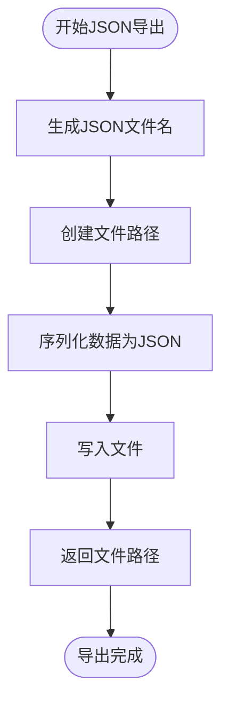
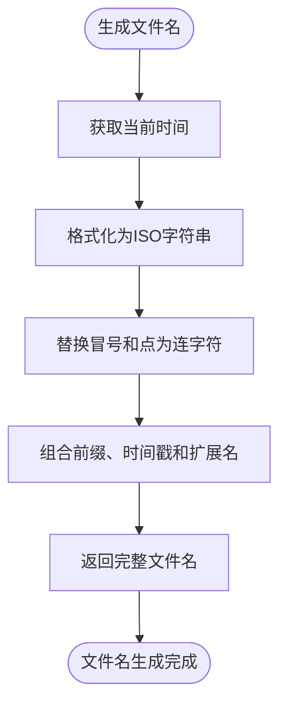
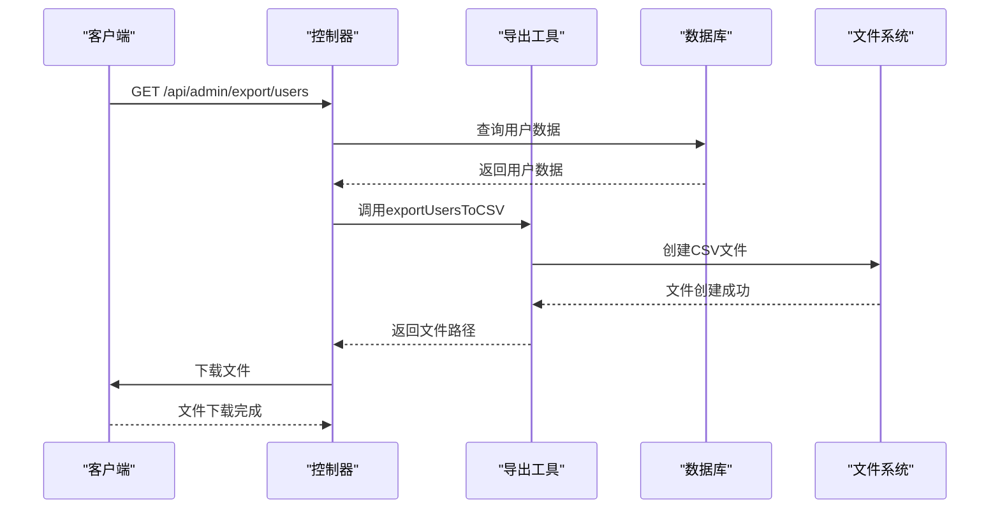
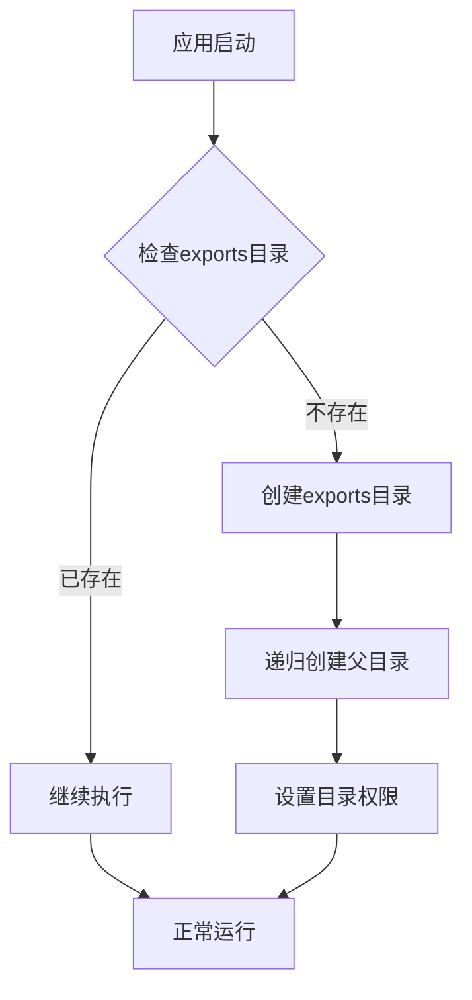

# 数据导出工具

<cite>
**本文档引用的文件**   
- [export.ts](file://backend/src/utils/export.ts#L1-L130)
- [admin.controller.ts](file://backend/src/controllers/admin.controller.ts#L606-L1227)
- [admin.routes.ts](file://backend/src/routes/admin.routes.ts#L56-L59)
- [index.ts](file://backend/src/index.ts#L31)
- [DataExport.tsx](file://home/user/nian/admin-web/src/pages/DataExport.tsx#L24-L294)
</cite>

## 目录
1. [导出功能概述](#导出功能概述)
2. [核心导出函数实现](#核心导出函数实现)
3. [文件名生成与过期清理](#文件名生成与过期清理)
4. [参数类型与异常处理](#参数类型与异常处理)
5. [控制器调用最佳实践](#控制器调用最佳实践)
6. [导出目录管理策略](#导出目录管理策略)
7. [数据模型字段映射](#数据模型字段映射)

## 导出功能概述

nian后端系统提供了全面的数据导出功能，允许管理员将用户、方法和练习记录等关键数据导出为多种格式。该功能主要由`backend/src/utils/export.ts`模块实现，支持CSV、Excel和JSON三种导出格式。导出功能通过管理员控制器暴露为REST API端点，前端管理界面可通过这些端点触发导出操作并下载生成的文件。

系统采用异步处理模式，当用户请求导出数据时，后端会查询数据库获取所需数据，使用相应的导出函数生成文件，然后通过HTTP响应将文件发送给客户端。所有导出的文件都存储在项目根目录下的`exports`文件夹中，并通过Express的静态文件服务暴露，允许客户端直接下载。

**Section sources**
- [export.ts](file://backend/src/utils/export.ts#L1-L130)
- [admin.controller.ts](file://backend/src/controllers/admin.controller.ts#L606-L1227)
- [admin.routes.ts](file://backend/src/routes/admin.routes.ts#L56-L59)

## 核心导出函数实现

### CSV文件生成

系统使用`csv-writer`库来生成CSV文件。`exportUsersToCSV`和`exportMethodsToCSV`函数实现了用户和方法数据的CSV导出功能。这些函数首先调用`generateFileName`生成唯一的文件名，然后配置CSV写入器的列标题，最后将数据写入文件。

**Diagram sources**
- [export.ts](file://backend/src/utils/export.ts#L19-L61)

### Excel工作簿配置

`exportPracticesToExcel`函数专门用于将练习记录导出为Excel文件，使用`exceljs`库创建和配置工作簿。该函数创建一个名为"练习记录"的工作表，设置列宽和标题，然后逐行添加数据。特别的是，该函数在导出时计算"心情改善"字段，其值为练习后心情减去练习前心情。

**Diagram sources**
- [export.ts](file://backend/src/utils/export.ts#L64-L103)

### JSON序列化

`exportToJSON`函数提供JSON格式的数据导出功能。该函数使用Node.js内置的`fs`模块和`JSON.stringify`方法将数据数组序列化为格式化的JSON字符串，并写入文件。JSON导出支持任何数据类型，通过`prefix`参数指定文件名前缀。

**Diagram sources**
- [export.ts](file://backend/src/utils/export.ts#L106-L112)

## 文件名生成与过期清理

### 文件名生成机制

`generateFileName`函数负责生成带时间戳的唯一文件名，确保每次导出的文件都有唯一的标识。该函数使用ISO时间戳格式，但将冒号和点替换为连字符，以避免文件系统中的潜在问题。生成的文件名格式为`{prefix}_{timestamp}.{extension}`。

**Diagram sources**
- [export.ts](file://backend/src/utils/export.ts#L13-L16)

### 过期文件清理

`cleanupExpiredExports`函数负责清理超过24小时的过期导出文件，防止磁盘空间被无限制占用。该函数遍历`exports`目录中的所有文件，检查每个文件的修改时间，如果文件年龄超过24小时，则将其删除。此清理操作通常由定时任务触发。

**Diagram sources**
- [export.ts](file://backend/src/utils/export.ts#L115-L129)

## 参数类型与异常处理

### 导出函数参数与返回值

| 函数名称 | 参数类型 | 返回值类型 | 异常处理 |
|--------|--------|---------|--------|
| exportUsersToCSV | users: any[] | Promise<string> | 文件系统错误 |
| exportMethodsToCSV | methods: any[] | Promise<string> | 文件系统错误 |
| exportPracticesToExcel | practices: any[] | Promise<string> | 文件系统错误 |
| exportToJSON | data: any[], prefix: string | Promise<string> | 文件系统错误 |
| generateFileName | prefix: string, extension: string | string | 无 |
| cleanupExpiredExports | 无 | void | 文件系统错误 |

**Section sources**
- [export.ts](file://backend/src/utils/export.ts#L19-L129)

## 控制器调用最佳实践

### 异步操作处理

在控制器中调用导出功能时，必须使用`async/await`语法正确处理异步操作。`admin.controller.ts`中的导出控制器方法展示了最佳实践：首先查询数据库获取数据，然后根据请求的格式调用相应的导出函数，最后使用`res.download()`方法将生成的文件发送给客户端。

**Diagram sources**
- [admin.controller.ts](file://backend/src/controllers/admin.controller.ts#L609-L655)

### 文件路径管理

系统在启动时自动创建`exports`目录，并通过Express的静态文件中间件暴露该目录，允许客户端直接访问导出的文件。这种设计简化了文件下载流程，避免了在内存中加载整个文件内容。

**Section sources**
- [export.ts](file://backend/src/utils/export.ts#L7-L10)
- [index.ts](file://backend/src/index.ts#L31)

## 导出目录管理策略

系统在项目根目录下创建名为`exports`的专用目录来存储所有导出的文件。该目录的创建是幂等的，即如果目录已存在则不会重复创建。通过`process.cwd()`获取当前工作目录，确保路径的正确性，无论应用从何处启动。

**Diagram sources**
- [export.ts](file://backend/src/utils/export.ts#L7-L10)

## 数据模型字段映射

### 用户数据字段映射

| 数据库字段 | CSV标题 | 说明 |
|---------|-------|-----|
| id | ID | 用户唯一标识符 |
| email | 邮箱 | 用户注册邮箱 |
| nickname | 昵称 | 用户昵称 |
| created_at | 注册时间 | 用户注册时间 |
| last_login_at | 最后登录 | 用户最后登录时间 |
| is_active | 状态 | 用户账户状态 |

**Section sources**
- [export.ts](file://backend/src/utils/export.ts#L26-L31)

### 方法数据字段映射

| 数据库字段 | CSV标题 | 说明 |
|---------|-------|-----|
| id | ID | 方法唯一标识符 |
| title | 标题 | 方法名称 |
| category | 分类 | 方法所属分类 |
| difficulty | 难度 | 方法难度等级 |
| duration_minutes | 时长(分钟) | 方法建议时长 |
| status | 状态 | 方法发布状态 |
| view_count | 浏览次数 | 方法被浏览次数 |
| select_count | 选择次数 | 方法被选择次数 |
| created_at | 创建时间 | 方法创建时间 |

**Section sources**
- [export.ts](file://backend/src/utils/export.ts#L47-L55)

### 练习记录字段映射

| 数据库字段 | Excel列名 | 说明 |
|---------|---------|-----|
| id | ID | 练习记录唯一标识符 |
| user_email | 用户邮箱 | 关联用户邮箱 |
| method_title | 方法名称 | 关联方法名称 |
| practice_date | 练习日期 | 练习发生日期 |
| duration_minutes | 时长(分钟) | 练习持续时间 |
| mood_before | 练习前心情 | 练习前心情评分 |
| mood_after | 练习后心情 | 练习后心情评分 |
| mood_improvement | 心情改善 | 心情改善值（计算字段） |
| notes | 备注 | 练习备注信息 |

**Section sources**
- [export.ts](file://backend/src/utils/export.ts#L73-L81)