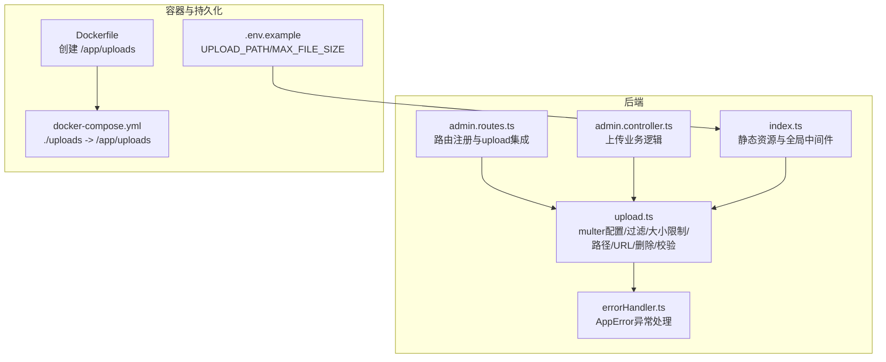
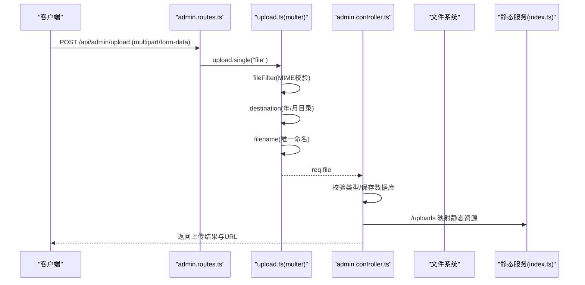
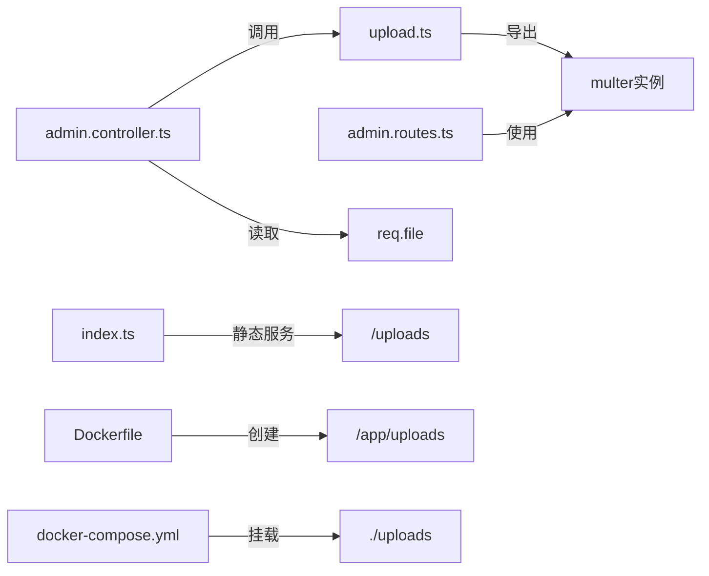
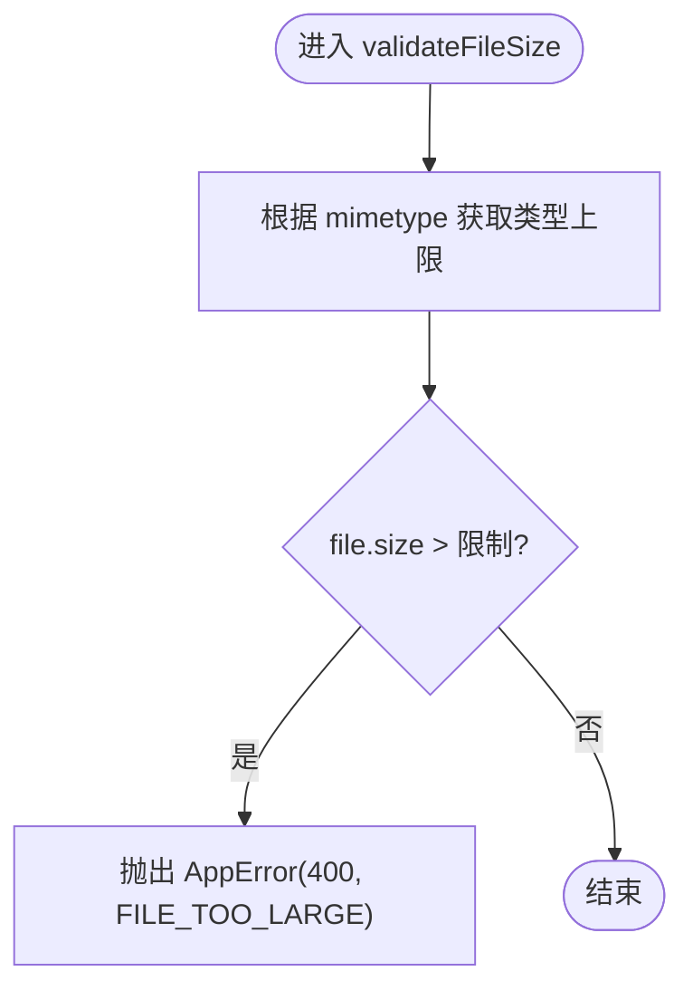
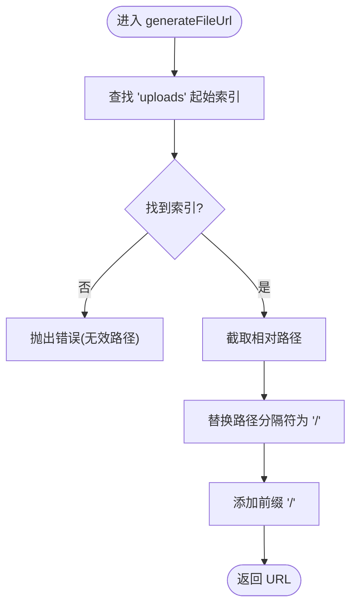

# 文件上传处理

<cite>
**本文引用的文件**
- [backend/src/utils/upload.ts](file://backend/src/utils/upload.ts)
- [backend/src/middleware/errorHandler.ts](file://backend/src/middleware/errorHandler.ts)
- [backend/src/controllers/admin.controller.ts](file://backend/src/controllers/admin.controller.ts)
- [backend/src/routes/admin.routes.ts](file://backend/src/routes/admin.routes.ts)
- [backend/src/index.ts](file://backend/src/index.ts)
- [.env.example](file://.env.example)
- [docker-compose.yml](file://docker-compose.yml)
- [backend/Dockerfile](file://backend/Dockerfile)
</cite>

## 目录
1. [简介](#简介)
2. [项目结构](#项目结构)
3. [核心组件](#核心组件)
4. [架构总览](#架构总览)
5. [组件详解](#组件详解)
6. [依赖关系分析](#依赖关系分析)
7. [性能与容量规划](#性能与容量规划)
8. [故障排查指南](#故障排查指南)
9. [结论](#结论)
10. [附录](#附录)

## 简介
本文件系统化文档化 nian 后端 upload.ts 模块的文件上传处理能力，重点覆盖：
- multer 中间件配置与 diskStorage 存储引擎的 destination/filename 策略
- fileFilter 基于 MIME 类型对图像、音频、视频的合法性校验
- getFileSizeLimit 的差异化大小限制（图片 5MB、音频 20MB、视频 100MB）
- getUploadPath 按年月组织上传目录结构
- generateFileUrl 将服务器文件路径转换为可访问 URL
- deleteFile、validateFileSize 辅助函数的使用场景与错误处理
- 在路由中集成 upload 中间件的正确方式（单文件与多文件）

## 项目结构
upload.ts 位于后端 utils 目录，作为通用上传工具被路由层复用；静态资源通过 express.static 对外暴露 uploads 目录；Docker 环境将宿主机 uploads 目录映射到容器内，确保持久化与可访问性。

图表来源
- [backend/src/utils/upload.ts](file://backend/src/utils/upload.ts#L1-L127)
- [backend/src/routes/admin.routes.ts](file://backend/src/routes/admin.routes.ts#L51-L84)
- [backend/src/controllers/admin.controller.ts](file://backend/src/controllers/admin.controller.ts#L472-L513)
- [backend/src/middleware/errorHandler.ts](file://backend/src/middleware/errorHandler.ts#L1-L96)
- [backend/src/index.ts](file://backend/src/index.ts#L29-L32)
- [backend/Dockerfile](file://backend/Dockerfile#L33-L35)
- [docker-compose.yml](file://docker-compose.yml#L66-L66)
- [.env.example](file://.env.example#L25-L28)

章节来源
- [backend/src/utils/upload.ts](file://backend/src/utils/upload.ts#L1-L127)
- [backend/src/routes/admin.routes.ts](file://backend/src/routes/admin.routes.ts#L51-L84)
- [backend/src/controllers/admin.controller.ts](file://backend/src/controllers/admin.controller.ts#L472-L513)
- [backend/src/middleware/errorHandler.ts](file://backend/src/middleware/errorHandler.ts#L1-L96)
- [backend/src/index.ts](file://backend/src/index.ts#L29-L32)
- [backend/Dockerfile](file://backend/Dockerfile#L33-L35)
- [docker-compose.yml](file://docker-compose.yml#L66-L66)
- [.env.example](file://.env.example#L25-L28)

## 核心组件
- multer 实例与 diskStorage
  - destination：动态生成“年/月”子目录并返回绝对路径
  - filename：生成带时间戳与随机数的唯一文件名，保留原始扩展名
- fileFilter：仅允许指定 MIME 类型集合（图像、音频、视频）
- 大小限制
  - getFileSizeLimit：按类型返回不同上限（图片 5MB、音频 20MB、视频 100MB）
  - multer limits.fileSize：全局最大 100MB
  - validateFileSize：在业务层对单个文件进行更细粒度校验
- 路径与 URL
  - getUploadPath：按年月创建目录
  - generateFileUrl：将服务器路径转换为可访问 URL
- 文件删除
  - deleteFile：安全删除本地文件，捕获异常并记录日志

章节来源
- [backend/src/utils/upload.ts](file://backend/src/utils/upload.ts#L14-L127)

## 架构总览
下图展示一次典型上传请求的端到端流程，从路由到控制器再到存储与 URL 生成。

图表来源
- [backend/src/routes/admin.routes.ts](file://backend/src/routes/admin.routes.ts#L51-L84)
- [backend/src/utils/upload.ts](file://backend/src/utils/upload.ts#L28-L80)
- [backend/src/controllers/admin.controller.ts](file://backend/src/controllers/admin.controller.ts#L472-L513)
- [backend/src/index.ts](file://backend/src/index.ts#L29-L32)

## 组件详解

### multer 配置与 diskStorage
- destination 策略
  - 动态获取当前年份与月份，拼接至 uploads 根目录
  - 若目录不存在则递归创建
  - 返回绝对路径给 multer，确保文件写入目标稳定且按时间分层
- filename 策略
  - 使用时间戳与随机数组合生成唯一文件名，避免同名冲突
  - 保留原文件扩展名，便于浏览器识别与后续处理
- limits.fileSize
  - 全局限制为 100MB，防止超大文件占用资源

章节来源
- [backend/src/utils/upload.ts](file://backend/src/utils/upload.ts#L14-L25)
- [backend/src/utils/upload.ts](file://backend/src/utils/upload.ts#L56-L71)
- [backend/src/utils/upload.ts](file://backend/src/utils/upload.ts#L74-L80)

### fileFilter：MIME 类型合法性校验
- 支持的图像类型：jpeg、jpg、png、gif、webp
- 支持的音频类型：mpeg、mp3、wav、m4a、x-m4a
- 支持的视频类型：mp4、webm、quicktime
- 未在白名单内的 MIME 将触发 AppError，状态码 400

章节来源
- [backend/src/utils/upload.ts](file://backend/src/utils/upload.ts#L28-L41)

### getFileSizeLimit：差异化大小限制
- 图片：5MB
- 音频：20MB
- 视频：100MB
- 默认：5MB
- 与 multer 全局 100MB 上限配合，优先以类型限制为准

章节来源
- [backend/src/utils/upload.ts](file://backend/src/utils/upload.ts#L44-L53)

### getUploadPath：按年月组织上传目录
- 自动创建“年/月”两级目录
- 保证同一月份文件集中存放，便于维护与清理

章节来源
- [backend/src/utils/upload.ts](file://backend/src/utils/upload.ts#L14-L25)

### generateFileUrl：服务器路径转可访问 URL
- 从完整路径中提取“uploads”起始位置后的相对路径
- 将 Windows 路径分隔符统一替换为 Unix 风格
- 返回以斜杠开头的 URL 路径，供前端直接访问

章节来源
- [backend/src/utils/upload.ts](file://backend/src/utils/upload.ts#L95-L106)

### deleteFile：删除本地文件
- 安全检查文件是否存在
- 成功删除后无返回；删除失败时捕获异常并记录日志
- 用于业务层删除媒体记录时同步清理磁盘文件

章节来源
- [backend/src/utils/upload.ts](file://backend/src/utils/upload.ts#L109-L117)
- [backend/src/controllers/admin.controller.ts](file://backend/src/controllers/admin.controller.ts#L591-L600)

### validateFileSize：业务层文件大小校验
- 依据类型计算上限并对比文件大小
- 超限时抛出 AppError，包含明确的错误码与提示

章节来源
- [backend/src/utils/upload.ts](file://backend/src/utils/upload.ts#L120-L127)

### 路由集成：单文件与多文件上传
- 单文件上传
  - 路由：POST /api/admin/upload
  - 中间件：upload.single('file')
  - 控制器：读取 req.file 并执行业务逻辑
- 多文件上传
  - 可使用 upload.array('files', maxCount) 或 upload.fields([...]) 进行批量字段配置
  - 与单文件类似，但 req.files 为数组或对象结构
- 注意事项
  - fileFilter 与 limits.fileSize 已在 upload.ts 内部配置，路由层无需重复声明
  - 业务层仍可调用 validateFileSize 进行额外校验

章节来源
- [backend/src/routes/admin.routes.ts](file://backend/src/routes/admin.routes.ts#L51-L84)
- [backend/src/utils/upload.ts](file://backend/src/utils/upload.ts#L74-L80)

## 依赖关系分析
- upload.ts 依赖
  - express Request 类型
  - AppError 异常类
  - Node.js path/fs 模块
- 控制器依赖
  - admin.controller.ts 通过 req.file 获取上传结果，并结合数据库操作
- 路由依赖
  - admin.routes.ts 注册 /api/admin/upload 并绑定 upload.single
- 静态资源依赖
  - index.ts 提供 /uploads 静态服务，使上传文件可被直接访问
- 容器与持久化依赖
  - Dockerfile 在镜像内创建 /app/uploads
  - docker-compose 将宿主机 ./uploads 挂载到 /app/uploads，实现持久化与外部访问

图表来源
- [backend/src/utils/upload.ts](file://backend/src/utils/upload.ts#L74-L80)
- [backend/src/routes/admin.routes.ts](file://backend/src/routes/admin.routes.ts#L51-L84)
- [backend/src/controllers/admin.controller.ts](file://backend/src/controllers/admin.controller.ts#L472-L513)
- [backend/src/index.ts](file://backend/src/index.ts#L29-L32)
- [backend/Dockerfile](file://backend/Dockerfile#L33-L35)
- [docker-compose.yml](file://docker-compose.yml#L66-L66)

章节来源
- [backend/src/utils/upload.ts](file://backend/src/utils/upload.ts#L1-L127)
- [backend/src/routes/admin.routes.ts](file://backend/src/routes/admin.routes.ts#L51-L84)
- [backend/src/controllers/admin.controller.ts](file://backend/src/controllers/admin.controller.ts#L472-L513)
- [backend/src/index.ts](file://backend/src/index.ts#L29-L32)
- [backend/Dockerfile](file://backend/Dockerfile#L33-L35)
- [docker-compose.yml](file://docker-compose.yml#L66-L66)

## 性能与容量规划
- 目录分层
  - 按年/月组织上传目录，有助于控制单目录文件数量，提升文件系统性能与可维护性
- 并发上传
  - multer 默认内存缓冲与磁盘落盘策略适合中小规模并发；如需高并发建议引入队列或 CDN
- 存储容量
  - 结合环境变量 MAX_FILE_SIZE 与各类型上限，合理评估磁盘配额
- 静态访问
  - 通过 /uploads 静态服务提供直链访问，减少应用层负担；生产环境建议配合反向代理或 CDN

[本节为通用建议，不直接分析具体文件]

## 故障排查指南
- 400 INVALID_FILE_TYPE
  - 症状：上传文件类型不在白名单
  - 排查：确认 MIME 类型是否在允许列表中
  - 参考
    - [backend/src/utils/upload.ts](file://backend/src/utils/upload.ts#L28-L41)
    - [backend/src/middleware/errorHandler.ts](file://backend/src/middleware/errorHandler.ts#L1-L96)
- 400 FILE_TOO_LARGE
  - 症状：文件大小超过类型限制或全局限制
  - 排查：核对类型对应的上限与实际文件大小
  - 参考
    - [backend/src/utils/upload.ts](file://backend/src/utils/upload.ts#L44-L53)
    - [backend/src/utils/upload.ts](file://backend/src/utils/upload.ts#L120-L127)
- 404 NOT_FOUND（删除媒体）
  - 症状：删除媒体记录时找不到对应文件
  - 排查：确认数据库记录与物理文件路径一致
  - 参考
    - [backend/src/controllers/admin.controller.ts](file://backend/src/controllers/admin.controller.ts#L591-L600)
- 500 SERVER_ERROR
  - 症状：未捕获异常导致服务端错误
  - 排查：检查 errorHandler 是否正确拦截 AppError
  - 参考
    - [backend/src/middleware/errorHandler.ts](file://backend/src/middleware/errorHandler.ts#L1-L96)
- 静态资源不可访问
  - 症状：上传成功但无法通过 /uploads 访问
  - 排查：确认 index.ts 已启用静态服务；Docker 环境是否正确挂载
  - 参考
    - [backend/src/index.ts](file://backend/src/index.ts#L29-L32)
    - [docker-compose.yml](file://docker-compose.yml#L66-L66)
    - [backend/Dockerfile](file://backend/Dockerfile#L33-L35)

章节来源
- [backend/src/utils/upload.ts](file://backend/src/utils/upload.ts#L28-L41)
- [backend/src/utils/upload.ts](file://backend/src/utils/upload.ts#L44-L53)
- [backend/src/utils/upload.ts](file://backend/src/utils/upload.ts#L120-L127)
- [backend/src/controllers/admin.controller.ts](file://backend/src/controllers/admin.controller.ts#L591-L600)
- [backend/src/middleware/errorHandler.ts](file://backend/src/middleware/errorHandler.ts#L1-L96)
- [backend/src/index.ts](file://backend/src/index.ts#L29-L32)
- [docker-compose.yml](file://docker-compose.yml#L66-L66)
- [backend/Dockerfile](file://backend/Dockerfile#L33-L35)

## 结论
upload.ts 提供了完善的文件上传基础设施：严格的 MIME 白名单、按类型差异化大小限制、按年月分层存储、统一的 URL 生成与删除接口，以及与业务层的清晰边界。结合路由层的单文件上传与静态资源服务，形成从接收、校验、存储到访问的完整闭环。建议在高并发场景引入队列或 CDN，并持续监控磁盘使用与访问日志。

[本节为总结，不直接分析具体文件]

## 附录

### 关键流程图：validateFileSize 算法

图表来源
- [backend/src/utils/upload.ts](file://backend/src/utils/upload.ts#L44-L53)
- [backend/src/utils/upload.ts](file://backend/src/utils/upload.ts#L120-L127)

### 关键流程图：generateFileUrl 算法

图表来源
- [backend/src/utils/upload.ts](file://backend/src/utils/upload.ts#L95-L106)

### 环境变量与持久化要点
- UPLOAD_PATH：容器内上传根目录（/app/uploads）
- MAX_FILE_SIZE：环境变量中定义的最大文件大小（字节）
- Dockerfile：在镜像内创建 /app/uploads
- docker-compose：将宿主机 ./uploads 挂载到 /app/uploads，实现持久化与外部访问

章节来源
- [.env.example](file://.env.example#L25-L28)
- [backend/Dockerfile](file://backend/Dockerfile#L33-L35)
- [docker-compose.yml](file://docker-compose.yml#L66-L66)