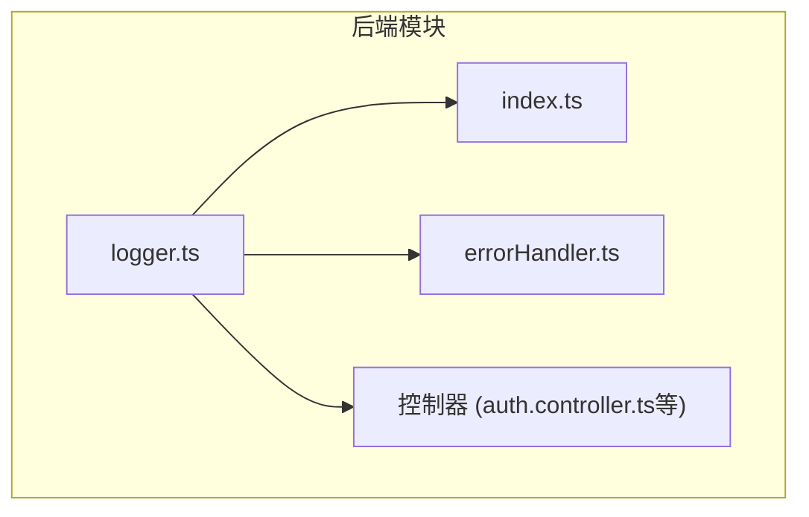
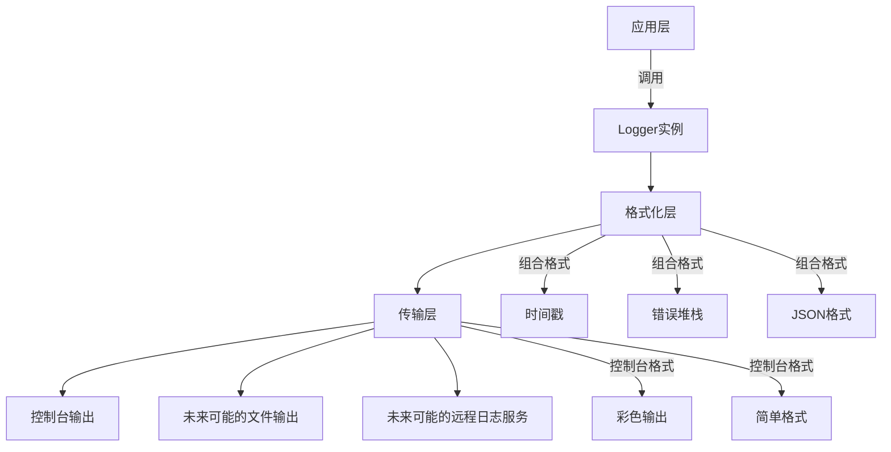
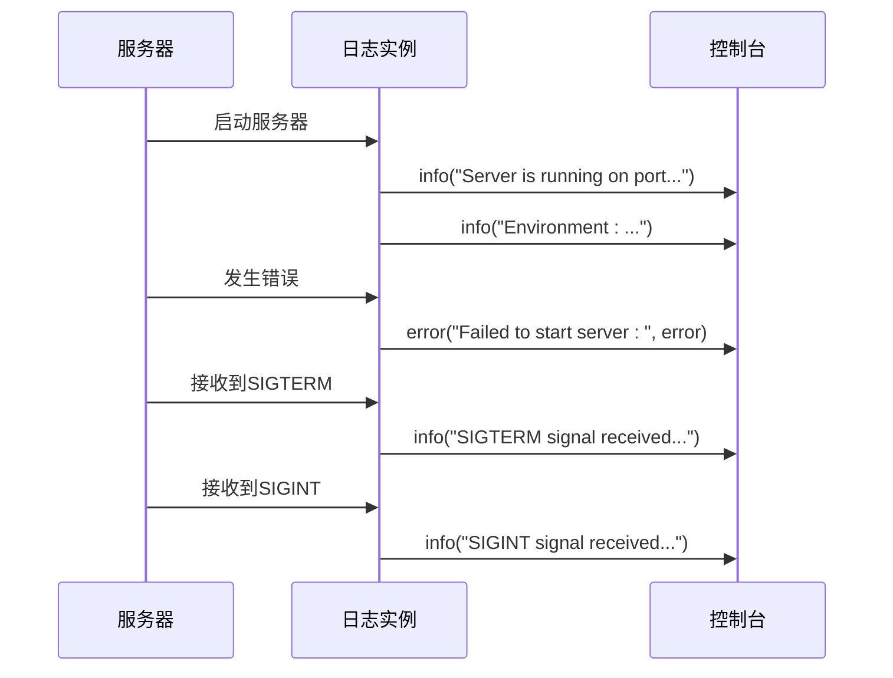
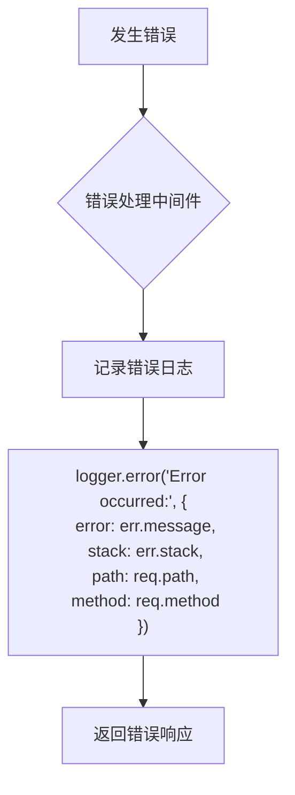
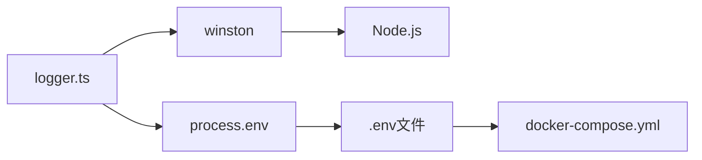

# 日志记录系统

<cite>
**本文档引用的文件**  
- [logger.ts](file://backend/src/utils/logger.ts)
- [index.ts](file://backend/src/index.ts)
- [errorHandler.ts](file://backend/src/middleware/errorHandler.ts)
- [package.json](file://backend/package.json)
- [.env.example](file://.env.example)
- [docker-compose.yml](file://docker-compose.yml)
</cite>

## 目录
1. [简介](#简介)
2. [项目结构](#项目结构)
3. [核心组件](#核心组件)
4. [架构概述](#架构概述)
5. [详细组件分析](#详细组件分析)
6. [依赖分析](#依赖分析)
7. [性能考虑](#性能考虑)
8. [故障排除指南](#故障排除指南)
9. [结论](#结论)

## 简介
本项目后端采用Winston日志库实现结构化日志记录功能，为系统提供统一、可配置的日志输出机制。日志系统支持多级别日志记录、彩色控制台输出、JSON格式化以及错误堆栈跟踪，能够满足开发、测试和生产环境下的不同需求。通过环境变量控制日志级别，系统能够在不同部署环境下灵活调整日志详细程度，同时日志格式设计考虑了后续日志收集和分析系统的集成需求。

## 项目结构
后端日志功能主要集中在`backend/src/utils/logger.ts`文件中，作为独立的工具模块被整个应用程序引用。该模块导出一个预配置的`logger`实例，供控制器、中间件和其他组件统一使用。日志配置遵循集中式管理原则，避免了在多个文件中重复定义日志配置。



**图示来源**  
- [logger.ts](file://backend/src/utils/logger.ts)
- [index.ts](file://backend/src/index.ts)
- [errorHandler.ts](file://backend/src/middleware/errorHandler.ts)

**本节来源**  
- [logger.ts](file://backend/src/utils/logger.ts)
- [project_structure](file://project_structure)

## 核心组件
日志系统的核心是`winston.createLogger`创建的logger实例，该实例配置了特定的日志级别、格式化器和传输器。通过`process.env.LOG_LEVEL`环境变量控制日志级别，默认级别为'info'。日志格式结合了时间戳、错误堆栈跟踪和JSON输出，确保日志信息的完整性和结构化。控制台传输器使用colorize和simple格式实现彩色输出，提高开发时的日志可读性。

**本节来源**  
- [logger.ts](file://backend/src/utils/logger.ts#L3-L18)

## 架构概述
日志系统采用分层架构设计，上层应用组件通过导入统一的logger实例进行日志记录，底层由Winston库处理日志的格式化和输出。这种设计实现了日志功能的解耦，使得应用程序各层无需关心日志的具体实现细节，只需关注何时以及记录何种级别的日志。



**图示来源**  
- [logger.ts](file://backend/src/utils/logger.ts#L3-L18)
- [index.ts](file://backend/src/index.ts#L8)

**本节来源**  
- [logger.ts](file://backend/src/utils/logger.ts#L3-L18)
- [index.ts](file://backend/src/index.ts#L8)

## 详细组件分析
### 日志配置分析
日志配置组件负责创建和配置Winston logger实例，其主要功能包括日志级别管理、格式组合和传输器设置。

```mermaid
classDiagram
class LoggerConfig {
+string level
+Format format
+Transport[] transports
+createLogger() Logger
}
class Format {
+timestamp()
+errors({stack : true})
+json()
+colorize()
+simple()
+combine()
}
class Transport {
+ConsoleTransport
}
LoggerConfig --> Format : "使用"
LoggerConfig --> Transport : "使用"
```

**图示来源**  
- [logger.ts](file://backend/src/utils/logger.ts#L3-L18)

**本节来源**  
- [logger.ts](file://backend/src/utils/logger.ts#L3-L18)

### 日志使用流程分析
日志系统在应用程序启动、运行和关闭的各个阶段都被调用，形成完整的日志记录流程。



**图示来源**  
- [index.ts](file://backend/src/index.ts#L60-L84)

**本节来源**  
- [index.ts](file://backend/src/index.ts#L60-L84)

### 错误处理日志分析
错误处理中间件使用日志实例记录所有未捕获的错误，为系统调试和问题排查提供重要信息。



**图示来源**  
- [errorHandler.ts](file://backend/src/middleware/errorHandler.ts#L21-L26)

**本节来源**  
- [errorHandler.ts](file://backend/src/middleware/errorHandler.ts#L21-L26)

## 依赖分析
日志系统依赖于Winston库作为核心日志处理引擎，同时通过环境变量与系统配置集成。在package.json中明确声明了winston依赖，确保了版本的一致性。



**图示来源**  
- [package.json](file://backend/package.json#L29)
- [logger.ts](file://backend/src/utils/logger.ts#L4)
- [.env.example](file://.env.example)
- [docker-compose.yml](file://docker-compose.yml)

**本节来源**  
- [package.json](file://backend/package.json#L29)
- [logger.ts](file://backend/src/utils/logger.ts#L4)
- [.env.example](file://.env.example)
- [docker-compose.yml](file://docker-compose.yml)

## 性能考虑
当前日志系统仅输出到控制台，对性能影响较小。由于使用了异步的日志记录机制，日志写入不会阻塞主事件循环。在生产环境中，建议监控日志输出对系统性能的影响，特别是在高并发场景下。未来如需增加文件传输器，应考虑使用异步写入和日志轮转机制，避免因日志文件过大影响系统性能。

## 故障排除指南
当遇到日志系统问题时，可按照以下步骤进行排查：
1. 检查环境变量LOG_LEVEL是否正确设置
2. 确认winston库已正确安装且版本兼容
3. 验证logger实例是否在需要的模块中正确导入
4. 检查控制台输出是否被其他配置覆盖
5. 确认错误对象是否包含堆栈信息

**本节来源**  
- [logger.ts](file://backend/src/utils/logger.ts#L4)
- [package.json](file://backend/package.json#L29)

## 结论
nian后端的logger模块通过Winston库实现了功能完整、配置灵活的结构化日志记录系统。系统支持通过环境变量动态调整日志级别，结合时间戳、错误堆栈和JSON格式化提供丰富的日志信息。彩色控制台输出提高了开发体验，而统一的logger实例确保了整个应用程序日志风格的一致性。该日志系统设计考虑了可维护性和扩展性，为后续集成日志收集和分析系统奠定了良好基础。