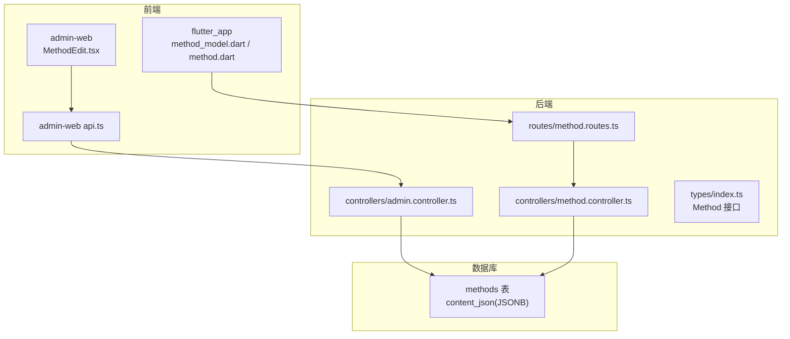
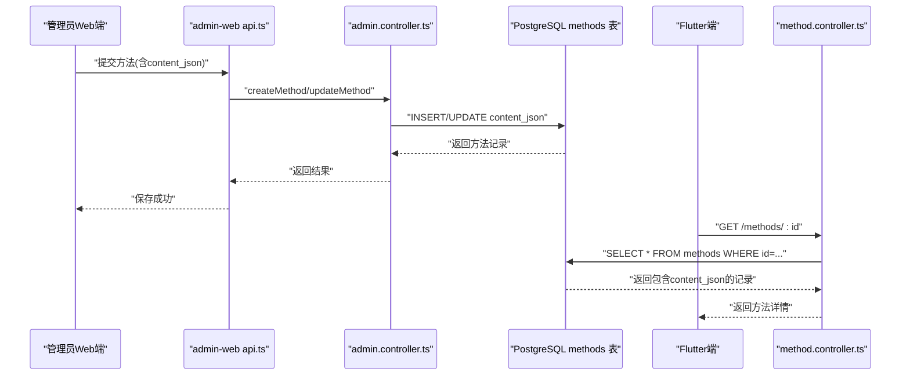
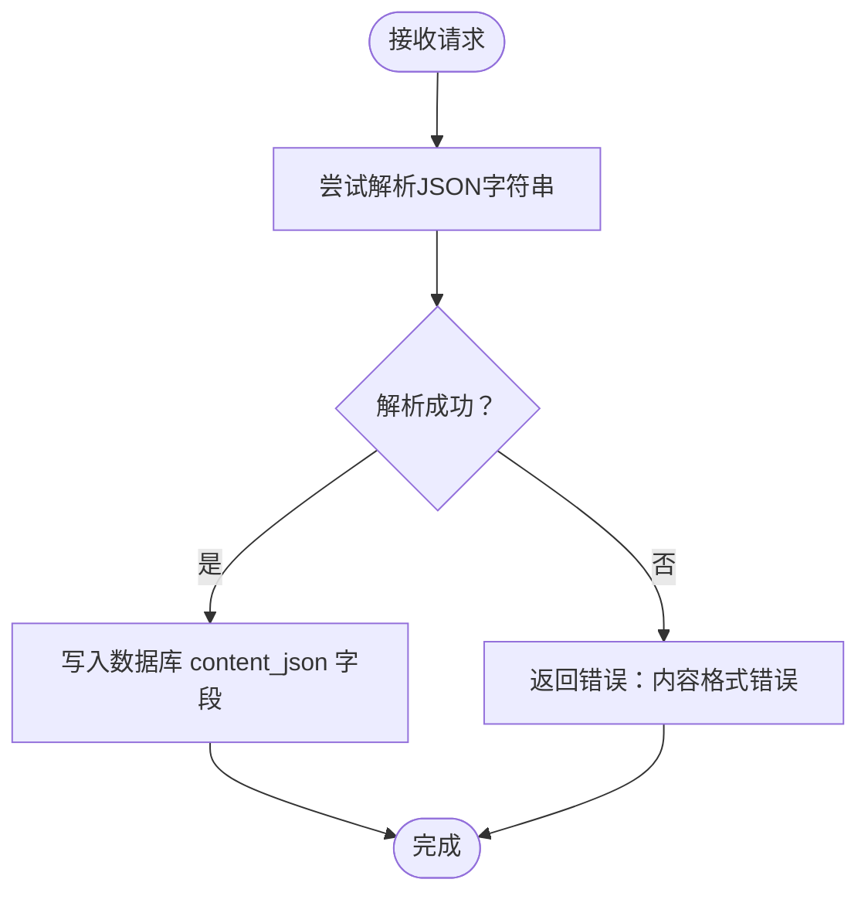
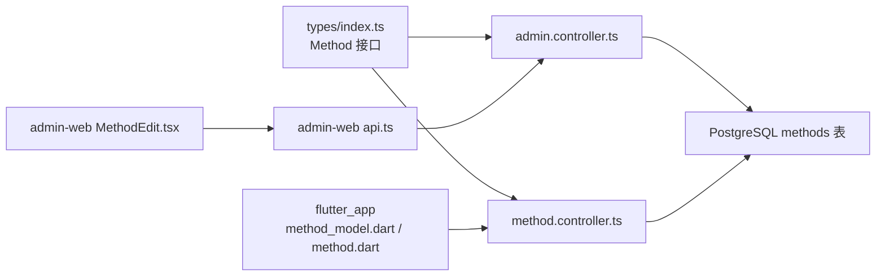

# content_json字段结构

<cite>
**本文引用的文件**
- [init.sql](file://database/init.sql)
- [index.ts](file://backend/src/types/index.ts)
- [admin.controller.ts](file://backend/src/controllers/admin.controller.ts)
- [method.controller.ts](file://backend/src/controllers/method.controller.ts)
- [method.routes.ts](file://backend/src/routes/method.routes.ts)
- [MethodEdit.tsx](file://home/user/nian/admin-web/src/pages/MethodEdit.tsx)
- [api.ts](file://home/user/nian/admin-web/src/services/api.ts)
- [method_model.dart](file://flutter_app/lib/data/models/method_model.dart)
- [method.dart](file://flutter_app/lib/domain/entities/method.dart)
</cite>

## 目录
1. [引言](#引言)
2. [项目结构](#项目结构)
3. [核心组件](#核心组件)
4. [架构总览](#架构总览)
5. [详细组件分析](#详细组件分析)
6. [依赖关系分析](#依赖关系分析)
7. [性能考量](#性能考量)
8. [故障排查指南](#故障排查指南)
9. [结论](#结论)
10. [附录](#附录)

## 引言
本文件围绕nian后端系统心理调节方法模型中的content_json字段进行深入说明。content_json是一个JSONB字段，用于承载方法的动态内容结构，包括章节章节(chapters)、引导练习(exercises)与情绪评估问卷(questionnaires)等模块。本文将结合数据库schema、TypeScript类型定义、后端控制器与路由、以及前后端交互流程，系统阐述该字段的嵌套结构、数据模型、解析与校验策略，以及如何支持不同心理方法的灵活呈现。

## 项目结构
- 数据库层：methods表的content_json为JSONB类型，配合init.sql中的示例数据展示了典型结构。
- 后端层：TypeScript类型定义中Method接口的content_json为any；管理员控制器负责创建/更新方法时写入content_json；方法控制器负责读取方法详情。
- 前端层：管理员Web端对content_json进行编辑与提交；Flutter端接收并存储content_json为Map<String,dynamic>。

图表来源
- [init.sql](file://database/init.sql#L19-L41)
- [method.routes.ts](file://backend/src/routes/method.routes.ts#L1-L20)
- [method.controller.ts](file://backend/src/controllers/method.controller.ts#L75-L98)
- [admin.controller.ts](file://backend/src/controllers/admin.controller.ts#L129-L164)
- [index.ts](file://backend/src/types/index.ts#L18-L35)
- [MethodEdit.tsx](file://home/user/nian/admin-web/src/pages/MethodEdit.tsx#L240-L278)
- [api.ts](file://home/user/nian/admin-web/src/services/api.ts#L8-L16)
- [method_model.dart](file://flutter_app/lib/data/models/method_model.dart#L20-L35)
- [method.dart](file://flutter_app/lib/domain/entities/method.dart#L34-L35)

章节来源
- [init.sql](file://database/init.sql#L19-L41)
- [method.routes.ts](file://backend/src/routes/method.routes.ts#L1-L20)
- [method.controller.ts](file://backend/src/controllers/method.controller.ts#L75-L98)
- [admin.controller.ts](file://backend/src/controllers/admin.controller.ts#L129-L164)
- [index.ts](file://backend/src/types/index.ts#L18-L35)
- [MethodEdit.tsx](file://home/user/nian/admin-web/src/pages/MethodEdit.tsx#L240-L278)
- [api.ts](file://home/user/nian/admin-web/src/services/api.ts#L8-L16)
- [method_model.dart](file://flutter_app/lib/data/models/method_model.dart#L20-L35)
- [method.dart](file://flutter_app/lib/domain/entities/method.dart#L34-L35)

## 核心组件
- 数据库schema：methods表的content_json为JSONB，允许存储任意结构的JSON内容，便于灵活扩展。
- 类型定义：Method接口将content_json声明为any，便于后端直接传递数据库返回值。
- 控制器：
  - 管理员控制器：创建/更新方法时，将请求体中的content_json直接写入数据库。
  - 方法控制器：获取方法详情时，直接返回包含content_json的整行数据。
- 前端：
  - 管理员Web端：编辑页面将content_json序列化为字符串供编辑，提交时再次解析为JSON对象。
  - Flutter端：将content_json作为Map<String,dynamic>存储，便于后续渲染。

章节来源
- [init.sql](file://database/init.sql#L19-L41)
- [index.ts](file://backend/src/types/index.ts#L18-L35)
- [admin.controller.ts](file://backend/src/controllers/admin.controller.ts#L129-L164)
- [method.controller.ts](file://backend/src/controllers/method.controller.ts#L75-L98)
- [MethodEdit.tsx](file://home/user/nian/admin-web/src/pages/MethodEdit.tsx#L240-L278)
- [method_model.dart](file://flutter_app/lib/data/models/method_model.dart#L20-L35)

## 架构总览
content_json在系统中的流转路径如下：
- 管理员Web端编辑content_json并提交；
- 后端管理员控制器接收请求，校验必填字段并写入数据库；
- 前端Flutter端通过方法详情接口获取content_json；
- 前端根据content_json结构渲染章节、练习与问卷。

图表来源
- [MethodEdit.tsx](file://home/user/nian/admin-web/src/pages/MethodEdit.tsx#L240-L278)
- [api.ts](file://home/user/nian/admin-web/src/services/api.ts#L33-L46)
- [admin.controller.ts](file://backend/src/controllers/admin.controller.ts#L129-L164)
- [method.controller.ts](file://backend/src/controllers/method.controller.ts#L75-L98)
- [init.sql](file://database/init.sql#L19-L41)

## 详细组件分析

### content_json字段的数据模型与结构
content_json采用JSONB存储，支持以下顶层键：
- chapters：章节数组，每章包含title、order与contents。
- exercises：引导练习数组，每条练习包含标题、类型与步骤。
- questionnaires：情绪评估问卷数组，每份问卷包含标题与问题列表，问题支持scale与text两种类型及可选的数值范围。

章节来源
- [init.sql](file://database/init.sql#L150-L299)

#### 章节(chapters)结构
- 字段
  - title：章节标题，字符串。
  - order：排序序号，数字。
  - contents：内容块数组，每项为对象，包含type与data。
- contents中的type为text时，data为纯文本字符串。
- 示例参考：深呼吸放松法与正念冥想的章节结构。

章节来源
- [init.sql](file://database/init.sql#L150-L246)

#### 引导练习(exercises)结构
- 字段
  - title：练习标题，字符串。
  - type：练习类型，如guided。
  - steps：步骤数组，字符串列表。
- 示例参考：深呼吸放松法中的引导练习。

章节来源
- [init.sql](file://database/init.sql#L179-L185)

#### 情绪评估问卷(questionnaires)结构
- 字段
  - title：问卷标题，字符串。
  - questions：问题数组，每项包含：
    - question：问题文本，字符串。
    - type：问题类型，支持scale或text。
    - options：当type为scale时，提供数值范围数组。
- 示例参考：情绪日记中的问卷结构。

章节来源
- [init.sql](file://database/init.sql#L247-L277)

### 后端解析与验证策略
- 存储策略
  - 管理员控制器在创建/更新方法时，直接将请求体中的content_json写入数据库，未做额外校验。
- 读取策略
  - 方法详情接口返回整行记录，包含content_json，前端自行解析与渲染。
- 前端校验
  - 管理员Web端在提交前尝试解析JSON字符串，若格式错误则提示“请输入有效的JSON”。

图表来源
- [MethodEdit.tsx](file://home/user/nian/admin-web/src/pages/MethodEdit.tsx#L240-L278)
- [admin.controller.ts](file://backend/src/controllers/admin.controller.ts#L129-L164)

章节来源
- [admin.controller.ts](file://backend/src/controllers/admin.controller.ts#L129-L164)
- [MethodEdit.tsx](file://home/user/nian/admin-web/src/pages/MethodEdit.tsx#L240-L278)

### 前端渲染与类型约束
- Flutter端将content_json存储为Map<String,dynamic>，便于后续按需访问章节、练习与问卷。
- 管理员Web端将content_json序列化为字符串以便编辑，提交时再解析回对象。

章节来源
- [method_model.dart](file://flutter_app/lib/data/models/method_model.dart#L20-L35)
- [method.dart](file://flutter_app/lib/domain/entities/method.dart#L34-L35)
- [MethodEdit.tsx](file://home/user/nian/admin-web/src/pages/MethodEdit.tsx#L220-L237)

### 数据库schema与索引
- methods表的content_json为JSONB类型，支持高效存储与查询。
- 相关索引：methods表包含多个索引，但content_json未单独建立索引；如需按内容检索，可在应用层或数据库层面另行设计。

章节来源
- [init.sql](file://database/init.sql#L19-L41)

## 依赖关系分析
- 后端类型与控制器
  - Method接口定义了content_json为any，便于直接传递数据库返回值。
  - 管理员控制器依赖数据库连接池执行插入/更新操作。
  - 方法控制器依赖数据库连接池执行查询操作。
- 前端与后端
  - 管理员Web端通过api.ts调用后端接口，传入/接收content_json。
  - Flutter端通过方法详情接口获取content_json并渲染。

图表来源
- [index.ts](file://backend/src/types/index.ts#L18-L35)
- [admin.controller.ts](file://backend/src/controllers/admin.controller.ts#L129-L164)
- [method.controller.ts](file://backend/src/controllers/method.controller.ts#L75-L98)
- [api.ts](file://home/user/nian/admin-web/src/services/api.ts#L33-L46)
- [MethodEdit.tsx](file://home/user/nian/admin-web/src/pages/MethodEdit.tsx#L240-L278)
- [method_model.dart](file://flutter_app/lib/data/models/method_model.dart#L20-L35)

章节来源
- [index.ts](file://backend/src/types/index.ts#L18-L35)
- [admin.controller.ts](file://backend/src/controllers/admin.controller.ts#L129-L164)
- [method.controller.ts](file://backend/src/controllers/method.controller.ts#L75-L98)
- [api.ts](file://home/user/nian/admin-web/src/services/api.ts#L33-L46)
- [MethodEdit.tsx](file://home/user/nian/admin-web/src/pages/MethodEdit.tsx#L240-L278)
- [method_model.dart](file://flutter_app/lib/data/models/method_model.dart#L20-L35)

## 性能考量
- JSONB存储优势：PostgreSQL对JSONB提供高效存储与查询能力，适合存储半结构化内容。
- 索引策略：当前未对content_json建立专用索引；如需按内容检索（例如按章节标题或问题类型），可在应用层或数据库层考虑添加GIN索引或物化列。
- 渲染性能：前端按需解析与渲染content_json，避免一次性加载过多内容；建议分页或懒加载章节与练习。

## 故障排查指南
- 提交失败（JSON格式错误）
  - 现象：管理员Web端提示“请输入有效的JSON”。
  - 处理：检查content_json是否为合法JSON格式，确保所有字符串使用双引号，无尾逗号等语法错误。
- 读取不到内容
  - 现象：Flutter端无法显示章节/练习/问卷。
  - 处理：确认方法状态为published且content_json结构正确；检查后端方法详情接口返回值。
- 更新未生效
  - 现象：更新方法后前端仍显示旧内容。
  - 处理：确认管理员控制器已写入content_json；检查缓存与网络请求是否成功。

章节来源
- [MethodEdit.tsx](file://home/user/nian/admin-web/src/pages/MethodEdit.tsx#L240-L278)
- [admin.controller.ts](file://backend/src/controllers/admin.controller.ts#L129-L164)
- [method.controller.ts](file://backend/src/controllers/method.controller.ts#L75-L98)

## 结论
content_json通过JSONB实现了心理方法内容的灵活组织，支持章节、引导练习与情绪问卷等多种模块。后端未对content_json进行强校验，主要依赖前端在提交前进行格式校验；读取时直接返回数据库中的JSONB内容，由前端负责解析与渲染。该设计降低了后端复杂度，提升了内容编辑的灵活性，同时为不同心理方法提供了统一的内容承载方式。

## 附录

### 示例JSON结构（示意）
以下为一个完整的方法内容组织示例，展示chapters、exercises与questionnaires的组合方式。注意：以下为结构示意，非具体代码片段。

- chapters
  - 数组元素包含title、order与contents
  - contents为数组，元素包含type与data
- exercises
  - 数组元素包含title、type与steps
- questionnaires
  - 数组元素包含title与questions
  - questions元素包含question、type与可选options

章节来源
- [init.sql](file://database/init.sql#L150-L299)