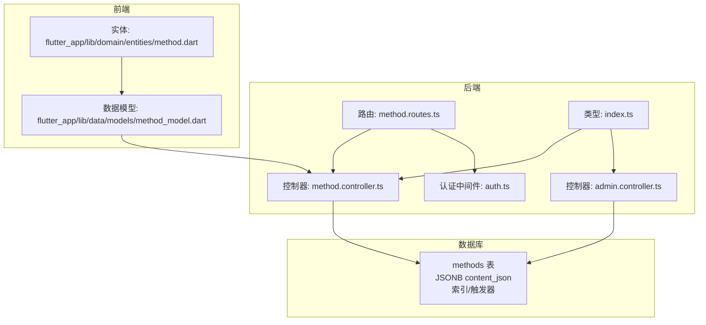
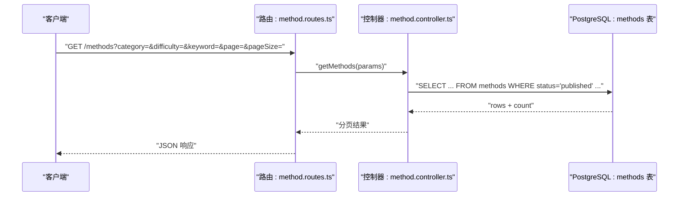
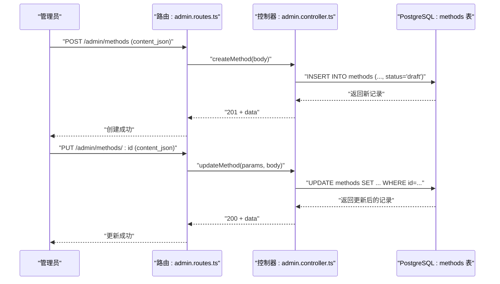
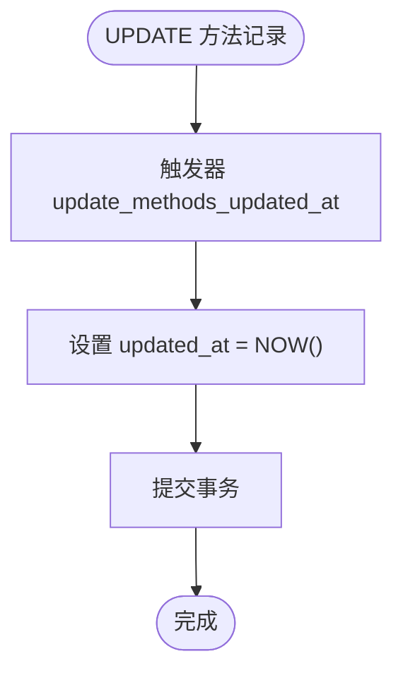
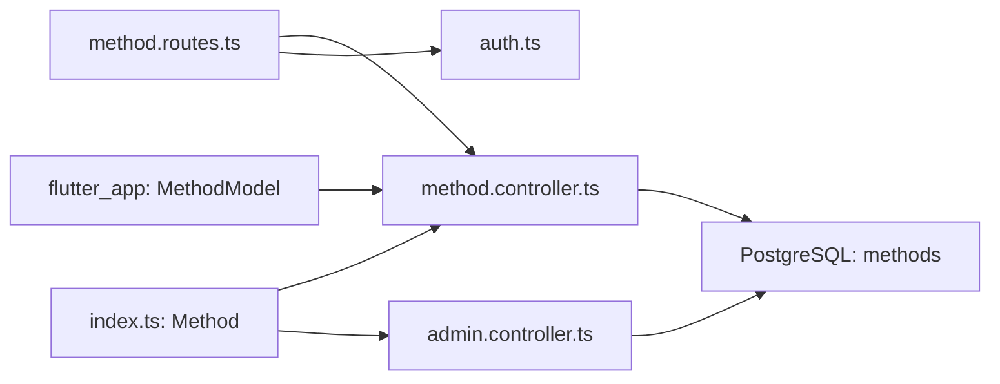

# 心理调节方法模型

<cite>
**本文引用的文件**
- [init.sql](file://database/init.sql)
- [index.ts](file://backend/src/types/index.ts)
- [method.controller.ts](file://backend/src/controllers/method.controller.ts)
- [method.routes.ts](file://backend/src/routes/method.routes.ts)
- [admin.controller.ts](file://backend/src/controllers/admin.controller.ts)
- [auth.ts](file://backend/src/middleware/auth.ts)
- [method_model.dart](file://flutter_app/lib/data/models/method_model.dart)
- [method.dart](file://flutter_app/lib/domain/entities/method.dart)
</cite>

## 目录
1. [简介](#简介)
2. [项目结构](#项目结构)
3. [核心组件](#核心组件)
4. [架构总览](#架构总览)
5. [详细组件分析](#详细组件分析)
6. [依赖分析](#依赖分析)
7. [性能考虑](#性能考虑)
8. [故障排查指南](#故障排查指南)
9. [结论](#结论)
10. [附录](#附录)

## 简介
本文件面向nian后端系统的“心理调节方法”数据模型，基于PostgreSQL的methods表与TypeScript的Method接口进行系统化梳理。重点覆盖以下方面：
- 字段定义：id、title、description、category、difficulty、duration_minutes、cover_image_url、content_json、status、view_count、select_count、created_by、created_at、updated_at、published_at 的数据类型、约束与业务规则
- content_json字段：JSONB类型存储方法内容，结构化组织章节、练习、问卷等
- status字段：状态机设计（draft、pending、published、archived），配合后台审核流程
- updated_at字段：触发器自动更新机制
- ORM映射关系：PostgreSQL表与TypeScript接口的对应关系
- 示例数据：展示content_json的典型结构

## 项目结构
围绕“心理调节方法”模型，涉及的关键文件与职责如下：
- 数据库层：init.sql中定义methods表及索引、触发器、示例数据
- 后端层：TypeScript类型定义、控制器与路由、管理员操作
- 前端层：Flutter端实体与数据模型，用于展示与交互



图表来源
- [init.sql](file://database/init.sql#L19-L42)
- [method.routes.ts](file://backend/src/routes/method.routes.ts#L1-L20)
- [method.controller.ts](file://backend/src/controllers/method.controller.ts#L1-L153)
- [admin.controller.ts](file://backend/src/controllers/admin.controller.ts#L130-L278)
- [index.ts](file://backend/src/types/index.ts#L18-L36)
- [auth.ts](file://backend/src/middleware/auth.ts#L1-L87)
- [method_model.dart](file://flutter_app/lib/data/models/method_model.dart#L1-L54)
- [method.dart](file://flutter_app/lib/domain/entities/method.dart#L1-L77)

章节来源
- [init.sql](file://database/init.sql#L19-L42)
- [method.routes.ts](file://backend/src/routes/method.routes.ts#L1-L20)
- [method.controller.ts](file://backend/src/controllers/method.controller.ts#L1-L153)
- [admin.controller.ts](file://backend/src/controllers/admin.controller.ts#L130-L278)
- [index.ts](file://backend/src/types/index.ts#L18-L36)
- [auth.ts](file://backend/src/middleware/auth.ts#L1-L87)
- [method_model.dart](file://flutter_app/lib/data/models/method_model.dart#L1-L54)
- [method.dart](file://flutter_app/lib/domain/entities/method.dart#L1-L77)

## 核心组件
- PostgreSQL methods表：承载方法实体的持久化结构，含JSONB字段content_json、状态字段status、计数字段view_count/select_count、时间戳字段created_at/updated_at/published_at，以及外键created_by指向users表
- TypeScript Method接口：定义后端服务层与前端交互的数据契约，包含与methods表字段一一对应的属性
- 控制器与路由：提供方法列表、详情、分类、推荐等读取能力；管理员提供创建、更新、提交审核、删除等写入与状态变更能力
- 前端实体与模型：Flutter端的Method实体与数据模型，负责JSON序列化/反序列化content_json

章节来源
- [init.sql](file://database/init.sql#L19-L42)
- [index.ts](file://backend/src/types/index.ts#L18-L36)
- [method.controller.ts](file://backend/src/controllers/method.controller.ts#L1-L153)
- [admin.controller.ts](file://backend/src/controllers/admin.controller.ts#L130-L278)
- [method_model.dart](file://flutter_app/lib/data/models/method_model.dart#L1-L54)
- [method.dart](file://flutter_app/lib/domain/entities/method.dart#L1-L77)

## 架构总览
下面的类图展示了数据库表、TypeScript接口与前端实体之间的映射关系。

```mermaid
classDiagram
class MethodsTable {
"+id : integer"
"+title : varchar(50)"
"+description : varchar(200)"
"+category : varchar(50)"
"+difficulty : varchar(20)"
"+duration_minutes : integer"
"+cover_image_url : varchar(255)"
"+content_json : jsonb"
"+status : varchar(20)"
"+view_count : integer"
"+select_count : integer"
"+created_by : integer"
"+created_at : timestamp"
"+updated_at : timestamp"
"+published_at : timestamp"
}
class MethodInterface {
"+id : number"
"+title : string"
"+description : string"
"+category : string"
"+difficulty : string"
"+duration_minutes : number"
"+cover_image_url? : string"
"+content_json : any"
"+status : 'draft'|'pending'|'published'|'archived'"
"+view_count : number"
"+select_count : number"
"+created_by? : number"
"+created_at : Date"
"+updated_at : Date"
"+published_at? : Date"
}
class MethodEntity {
"+id : int"
"+name : String"
"+description : String"
"+category : String"
"+difficulty : String"
"+durationMinutes : int?"
"+imageUrl : String?"
"+audioUrl : String?"
"+videoUrl : String?"
"+contentJson : Map<String,dynamic>?"
"+viewCount : int"
"+createdAt : DateTime"
}
class MethodModel {
"+fromJson(json)"
"+toJson()"
}
MethodsTable <.. MethodInterface : "字段映射"
MethodInterface <.. MethodEntity : "后端->领域"
MethodEntity <.. MethodModel : "领域->数据模型"
```

图表来源
- [init.sql](file://database/init.sql#L19-L42)
- [index.ts](file://backend/src/types/index.ts#L18-L36)
- [method.dart](file://flutter_app/lib/domain/entities/method.dart#L1-L77)
- [method_model.dart](file://flutter_app/lib/data/models/method_model.dart#L1-L54)

## 详细组件分析

### 数据库表：methods
- 主键与自增：id为SERIAL主键
- 标准字段
  - title、description、category、difficulty、duration_minutes、cover_image_url、status、view_count、select_count、created_by、created_at、updated_at、published_at
- JSONB字段
  - content_json：存储方法内容的结构化JSON，支持章节、练习、问卷等
- 索引
  - idx_methods_status、idx_methods_category、idx_methods_difficulty、idx_methods_created_at
- 触发器
  - update_methods_updated_at：在UPDATE时自动更新updated_at为当前时间

章节来源
- [init.sql](file://database/init.sql#L19-L42)
- [init.sql](file://database/init.sql#L301-L312)

### TypeScript接口：Method
- 字段与类型
  - id、duration_minutes、view_count、select_count为number
  - created_at、updated_at、published_at为Date
  - status为联合字面量类型，限定draft、pending、published、archived
  - content_json为any，表示JSONB内容在TS侧以任意对象形式接收
- 业务规则
  - created_by为可选，表示创建者管理员ID
  - cover_image_url为可选封面图URL
  - content_json为必填（由后端创建逻辑保证）

章节来源
- [index.ts](file://backend/src/types/index.ts#L18-L36)

### 控制器与路由：方法读取与推荐
- 路由
  - GET /methods：获取方法列表（支持按category、difficulty、keyword筛选）
  - GET /methods/categories：获取分类列表
  - GET /methods/recommend：获取推荐方法（需用户认证）
  - GET /methods/:id：获取方法详情（公开状态）
- 控制器
  - getMethods：构建动态WHERE条件，分页查询，并返回分页响应
  - getMethodById：仅返回status为published的方法，并增加view_count
  - getRecommendedMethods：基于用户已选方法的分类与select_count进行推荐
  - getCategories：按分类聚合统计



图表来源
- [method.routes.ts](file://backend/src/routes/method.routes.ts#L1-L20)
- [method.controller.ts](file://backend/src/controllers/method.controller.ts#L1-L73)

章节来源
- [method.routes.ts](file://backend/src/routes/method.routes.ts#L1-L20)
- [method.controller.ts](file://backend/src/controllers/method.controller.ts#L1-L73)

### 管理员操作：创建、更新、提交审核、删除
- 创建方法
  - 调用createMethod，校验必填字段（title、description、category、difficulty、duration_minutes、content_json），默认status为draft，created_by来自管理员上下文
- 更新方法
  - 支持对title、description、category、difficulty、duration_minutes、cover_image_url、content_json等字段进行部分更新
- 提交审核
  - 将status从draft置为pending，等待审核
- 删除方法
  - 支持删除指定id的方法



图表来源
- [admin.controller.ts](file://backend/src/controllers/admin.controller.ts#L130-L245)

章节来源
- [admin.controller.ts](file://backend/src/controllers/admin.controller.ts#L130-L245)

### content_json 字段：JSONB结构化内容
- 存储类型：JSONB（PostgreSQL）
- 作用：承载方法的结构化内容，如章节、练习、问卷等
- 示例结构（来自初始化数据）
  - chapters：章节数组，每章包含title、order、contents（文本块）
  - exercises/questionnaires：可选练习或问卷集合
- 前端处理
  - Flutter端MethodModel.fromJson将contentJson解析为Map<String, dynamic>，便于UI渲染

章节来源
- [init.sql](file://database/init.sql#L150-L299)
- [method_model.dart](file://flutter_app/lib/data/models/method_model.dart#L20-L35)
- [method.dart](file://flutter_app/lib/domain/entities/method.dart#L34-L35)

### status 字段：状态机设计
- 取值范围：draft、pending、published、archived
- 生命周期
  - draft：管理员创建后初始状态
  - pending：提交审核
  - published：审核通过后对外发布
  - archived：归档（可由管理员操作）
- 审核流程
  - 提交审核：将status从draft置为pending
  - 审核通过/拒绝：通常由管理员在后台完成（具体实现可在审核相关控制器中扩展）

章节来源
- [index.ts](file://backend/src/types/index.ts#L28-L28)
- [admin.controller.ts](file://backend/src/controllers/admin.controller.ts#L266-L278)

### updated_at 字段：触发器自动更新机制
- 触发器函数：update_updated_at_column
- 触发时机：在UPDATE时自动将updated_at设为当前时间
- 适用表：methods、reminder_settings等（由init.sql定义）



图表来源
- [init.sql](file://database/init.sql#L301-L312)

章节来源
- [init.sql](file://database/init.sql#L301-L312)

### ORM 映射关系：PostgreSQL 与 TypeScript
- 字段映射
  - methods.id ↔ Method.id
  - methods.title ↔ Method.title
  - methods.description ↔ Method.description
  - methods.category ↔ Method.category
  - methods.difficulty ↔ Method.difficulty
  - methods.duration_minutes ↔ Method.duration_minutes
  - methods.cover_image_url ↔ Method.cover_image_url
  - methods.content_json ↔ Method.content_json
  - methods.status ↔ Method.status
  - methods.view_count ↔ Method.view_count
  - methods.select_count ↔ Method.select_count
  - methods.created_by ↔ Method.created_by
  - methods.created_at ↔ Method.created_at
  - methods.updated_at ↔ Method.updated_at
  - methods.published_at ↔ Method.published_at
- 类型约束
  - PostgreSQL整型/时间戳与TypeScript number/Date保持一致
  - status使用联合字面量类型，确保枚举安全
  - content_json在TS侧为any，实际为JSONB对象

章节来源
- [init.sql](file://database/init.sql#L19-L42)
- [index.ts](file://backend/src/types/index.ts#L18-L36)

### 示例数据记录
- 初始化数据包含多条方法记录，均使用JSONB格式的content_json，结构包含chapters、exercises或questionnaires等
- 示例字段
  - title、description、category、difficulty、duration_minutes、status、published_at
  - content_json：包含章节、练习或问卷等结构化内容

章节来源
- [init.sql](file://database/init.sql#L150-L299)

## 依赖分析
- 控制器依赖
  - method.controller.ts依赖数据库连接池与AppError错误处理
  - admin.controller.ts依赖管理员认证中间件与数据库连接池
- 路由依赖
  - method.routes.ts依赖method.controller.ts与用户认证中间件
- 类型依赖
  - index.ts中的Method接口被控制器与路由广泛使用
- 前端依赖
  - flutter_app的Method实体与数据模型依赖后端返回的JSON结构



图表来源
- [method.routes.ts](file://backend/src/routes/method.routes.ts#L1-L20)
- [method.controller.ts](file://backend/src/controllers/method.controller.ts#L1-L153)
- [admin.controller.ts](file://backend/src/controllers/admin.controller.ts#L130-L278)
- [auth.ts](file://backend/src/middleware/auth.ts#L1-L87)
- [index.ts](file://backend/src/types/index.ts#L18-L36)
- [method_model.dart](file://flutter_app/lib/data/models/method_model.dart#L1-L54)

章节来源
- [method.routes.ts](file://backend/src/routes/method.routes.ts#L1-L20)
- [method.controller.ts](file://backend/src/controllers/method.controller.ts#L1-L153)
- [admin.controller.ts](file://backend/src/controllers/admin.controller.ts#L130-L278)
- [auth.ts](file://backend/src/middleware/auth.ts#L1-L87)
- [index.ts](file://backend/src/types/index.ts#L18-L36)
- [method_model.dart](file://flutter_app/lib/data/models/method_model.dart#L1-L54)

## 性能考虑
- 索引策略
  - methods表已建立status、category、difficulty、created_at等索引，有助于筛选与排序
- 查询优化
  - 列表查询采用LIMIT/OFFSET分页，建议结合created_at/published_at降序排序
  - 推荐算法基于分类与select_count，避免全表扫描
- JSONB查询
  - content_json为JSONB，适合存储半结构化内容；若需复杂检索，可考虑引入GIN索引或物化视图
- 触发器开销
  - update_updated_at_column为轻量函数，每次UPDATE都会执行，对性能影响极小

[本节为通用指导，无需列出具体文件来源]

## 故障排查指南
- 认证失败
  - 用户认证中间件要求Bearer Token，缺失或过期会返回401
- 方法不存在
  - getMethodById在未找到或非published状态下抛出404错误
- 参数校验
  - 创建方法时缺少必填字段会返回400
  - 更新方法时若无字段可更新会返回400
- 审核流程
  - 仅draft状态可提交审核；若状态不符，更新将失败

章节来源
- [auth.ts](file://backend/src/middleware/auth.ts#L1-L87)
- [method.controller.ts](file://backend/src/controllers/method.controller.ts#L76-L98)
- [admin.controller.ts](file://backend/src/controllers/admin.controller.ts#L130-L245)

## 结论
本文件系统性梳理了nian后端“心理调节方法”的数据模型，明确了PostgreSQL methods表与TypeScript Method接口的映射关系，深入解析了content_json的JSONB结构、status状态机与updated_at触发器机制，并结合前后端实现给出示例数据与调用流程。该模型具备良好的扩展性与可维护性，适合后续在内容结构、审核流程与统计维度上进一步完善。

[本节为总结性内容，无需列出具体文件来源]

## 附录
- 字段对照表（简要）
  - id：整型，主键
  - title：字符串，长度限制
  - description：字符串，长度限制
  - category/difficulty：字符串
  - duration_minutes：整型
  - cover_image_url：字符串（可空）
  - content_json：JSONB（结构化内容）
  - status：枚举（draft/pending/published/archived）
  - view_count/select_count：整型
  - created_by：整型（外键）
  - created_at/updated_at/published_at：时间戳

[本节为概览性内容，无需列出具体文件来源]