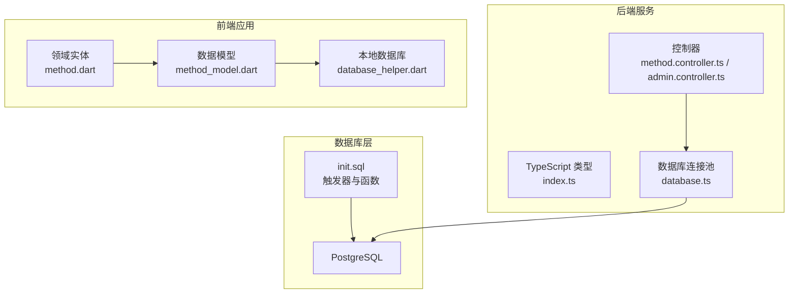
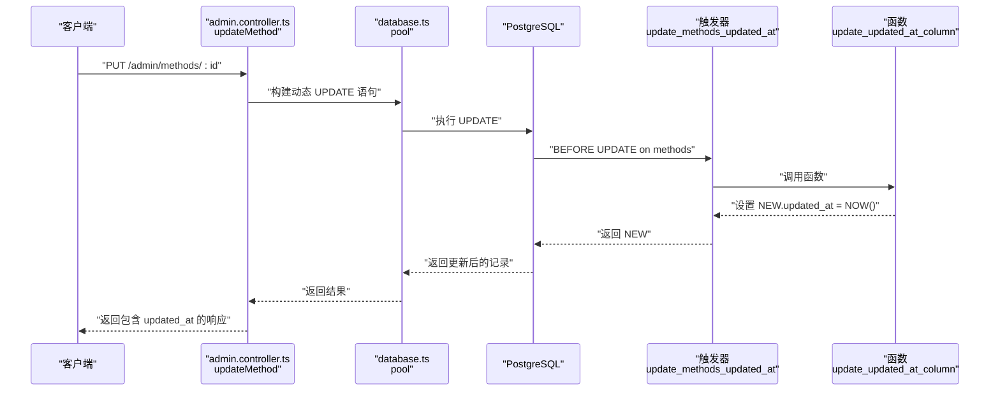
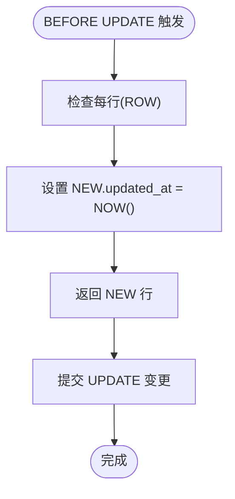
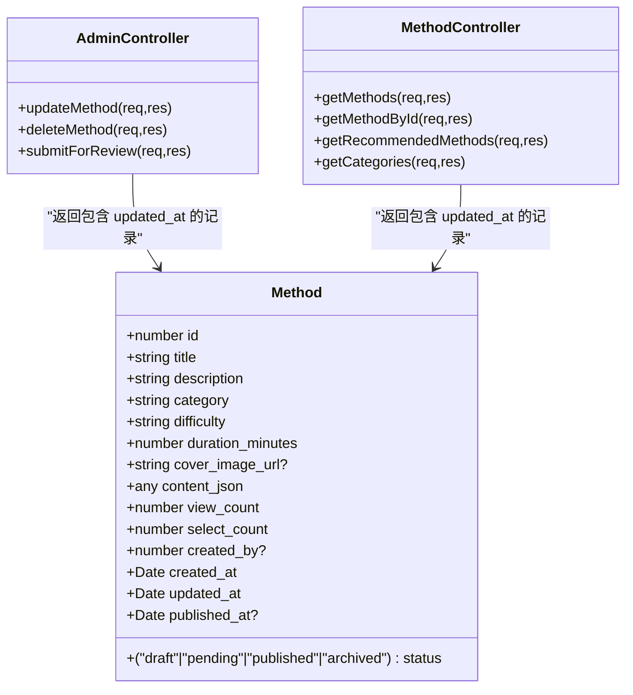
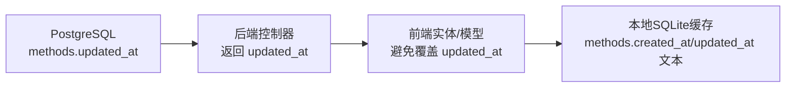
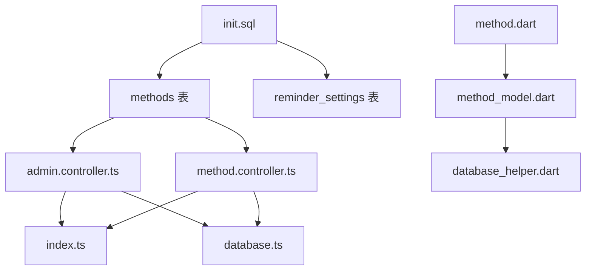

# 数据库触发器与自动更新

<cite>
**本文引用的文件**
- [init.sql](file://database/init.sql)
- [index.ts](file://backend/src/types/index.ts)
- [method.controller.ts](file://backend/src/controllers/method.controller.ts)
- [admin.controller.ts](file://backend/src/controllers/admin.controller.ts)
- [database.ts](file://backend/src/config/database.ts)
- [database_helper.dart](file://flutter_app/lib/core/storage/database_helper.dart)
- [method_model.dart](file://flutter_app/lib/data/models/method_model.dart)
- [method.dart](file://flutter_app/lib/domain/entities/method.dart)
</cite>

## 目录
1. [简介](#简介)
2. [项目结构](#项目结构)
3. [核心组件](#核心组件)
4. [架构总览](#架构总览)
5. [详细组件分析](#详细组件分析)
6. [依赖关系分析](#依赖关系分析)
7. [性能考量](#性能考量)
8. [故障排查指南](#故障排查指南)
9. [结论](#结论)
10. [附录](#附录)

## 简介
本文件围绕 nian 系统的数据库触发器与自动更新机制展开，重点解释 PostgreSQL 中 update_updated_at_column 函数以及针对 methods 和 reminder_settings 表的 BEFORE UPDATE 触发器如何在每次记录更新时自动设置 updated_at 字段为当前时间戳。同时结合后端 TypeScript 类型定义与前端 Flutter 模型，说明前后端如何协同处理这一自动行为，确保数据一致性并避免客户端手动更新时间戳带来的错误。

## 项目结构
- 数据库初始化脚本位于 database/init.sql，其中定义了 update_updated_at_column 函数及对 methods、reminder_settings 的触发器。
- 后端使用 TypeScript + Express + PostgreSQL，类型定义位于 backend/src/types/index.ts，控制器位于 backend/src/controllers/*。
- 前端 Flutter 使用 SQLite 作为本地存储，数据库结构定义于 flutter_app/lib/core/storage/database_helper.dart，实体与模型分别位于 flutter_app/lib/domain/entities/method.dart 与 flutter_app/lib/data/models/method_model.dart。

图表来源
- [init.sql](file://database/init.sql#L301-L315)
- [index.ts](file://backend/src/types/index.ts#L18-L35)
- [method.controller.ts](file://backend/src/controllers/method.controller.ts#L1-L153)
- [admin.controller.ts](file://backend/src/controllers/admin.controller.ts#L166-L245)
- [database.ts](file://backend/src/config/database.ts#L1-L46)
- [database_helper.dart](file://flutter_app/lib/core/storage/database_helper.dart#L54-L143)
- [method_model.dart](file://flutter_app/lib/data/models/method_model.dart#L1-L54)
- [method.dart](file://flutter_app/lib/domain/entities/method.dart#L1-L77)

章节来源
- [init.sql](file://database/init.sql#L301-L315)
- [index.ts](file://backend/src/types/index.ts#L18-L35)
- [method.controller.ts](file://backend/src/controllers/method.controller.ts#L1-L153)
- [admin.controller.ts](file://backend/src/controllers/admin.controller.ts#L166-L245)
- [database.ts](file://backend/src/config/database.ts#L1-L46)
- [database_helper.dart](file://flutter_app/lib/core/storage/database_helper.dart#L54-L143)
- [method_model.dart](file://flutter_app/lib/data/models/method_model.dart#L1-L54)
- [method.dart](file://flutter_app/lib/domain/entities/method.dart#L1-L77)

## 核心组件
- 触发器函数 update_updated_at_column：在 PL/pgSQL 中为每个被更新的行设置 NEW.updated_at 为当前时间。
- 触发器 update_methods_updated_at：在 methods 表的每次 UPDATE 前调用上述函数。
- 触发器 update_reminder_settings_updated_at：在 reminder_settings 表的每次 UPDATE 前调用上述函数。
- 后端类型定义 Method.updated_at：确保后端接收与返回的数据包含 updated_at 字段。
- 前端实体与模型：Method 与 MethodModel 对 updated_at 的处理方式不同，需注意序列化/反序列化差异。

章节来源
- [init.sql](file://database/init.sql#L301-L315)
- [index.ts](file://backend/src/types/index.ts#L18-L35)
- [method_model.dart](file://flutter_app/lib/data/models/method_model.dart#L1-L54)
- [method.dart](file://flutter_app/lib/domain/entities/method.dart#L1-L77)

## 架构总览
以下序列图展示了“更新方法”请求在后端的典型流程，强调 updated_at 的自动更新路径。

图表来源
- [admin.controller.ts](file://backend/src/controllers/admin.controller.ts#L166-L245)
- [database.ts](file://backend/src/config/database.ts#L1-L46)
- [init.sql](file://database/init.sql#L301-L315)

## 详细组件分析

### 触发器函数与执行时机
- 函数 update_updated_at_column 在 PL/pgSQL 中实现，其职责是在每条被更新的行上将 NEW.updated_at 设置为当前时间。
- 执行时机：BEFORE UPDATE 阶段，即在 UPDATE 语句真正写入数据库之前，触发器会拦截并修改 NEW 行，随后由数据库引擎继续执行 UPDATE。
- 适用范围：对 methods 与 reminder_settings 表均生效，确保这两张表的 updated_at 字段始终反映最近一次更新时间。

图表来源
- [init.sql](file://database/init.sql#L301-L315)

章节来源
- [init.sql](file://database/init.sql#L301-L315)

### 后端类型与控制器协作
- 后端类型定义 Method 接口包含 updated_at: Date 字段，保证 API 返回值包含 updated_at。
- 控制器 admin.controller.ts 的 updateMethod 支持按需字段更新，最终通过 RETURNING * 返回完整记录，其中 updated_at 由触发器自动填充。
- 控制器 method.controller.ts 的 getMethods/getMethodById 等查询未直接涉及 updated_at 的更新，但返回的记录仍受触发器约束。

图表来源
- [index.ts](file://backend/src/types/index.ts#L18-L35)
- [admin.controller.ts](file://backend/src/controllers/admin.controller.ts#L166-L245)
- [method.controller.ts](file://backend/src/controllers/method.controller.ts#L1-L153)

章节来源
- [index.ts](file://backend/src/types/index.ts#L18-L35)
- [admin.controller.ts](file://backend/src/controllers/admin.controller.ts#L166-L245)
- [method.controller.ts](file://backend/src/controllers/method.controller.ts#L1-L153)

### 前后端协同与数据一致性
- 后端：updated_at 由数据库触发器自动维护，客户端无需传入 updated_at；控制器返回的记录包含 updated_at。
- 前端：Flutter 端实体 Method 与数据模型 MethodModel 的字段定义与后端略有差异（例如前端实体未显式声明 updated_at），在序列化/反序列化时应避免覆盖 updated_at 字段，以免破坏数据库侧的自动更新。
- 本地缓存：Flutter 的本地数据库表 methods 中 created_at 与 updated_at 以文本形式存储，查询排序与索引策略与远程表不同，需注意同步策略与一致性。

图表来源
- [init.sql](file://database/init.sql#L19-L36)
- [index.ts](file://backend/src/types/index.ts#L18-L35)
- [method_model.dart](file://flutter_app/lib/data/models/method_model.dart#L1-L54)
- [database_helper.dart](file://flutter_app/lib/core/storage/database_helper.dart#L54-L143)

章节来源
- [init.sql](file://database/init.sql#L19-L36)
- [index.ts](file://backend/src/types/index.ts#L18-L35)
- [method_model.dart](file://flutter_app/lib/data/models/method_model.dart#L1-L54)
- [database_helper.dart](file://flutter_app/lib/core/storage/database_helper.dart#L54-L143)

### 触发器覆盖范围与扩展建议
- 当前覆盖：methods、reminder_settings。
- 建议扩展：若其他表也存在 updated_at 字段，可在相应表上添加相同类型的触发器，保持一致的更新策略。

章节来源
- [init.sql](file://database/init.sql#L301-L315)

## 依赖关系分析
- 数据库层依赖：init.sql 定义函数与触发器，依赖 PostgreSQL 的 PL/pgSQL 能力。
- 后端依赖：index.ts 定义 Method 类型，admin.controller.ts 与 method.controller.ts 依赖数据库连接池 database.ts。
- 前端依赖：Flutter 本地数据库结构 database_helper.dart 与实体/模型 method.dart、method_model.dart。

图表来源
- [init.sql](file://database/init.sql#L301-L315)
- [index.ts](file://backend/src/types/index.ts#L18-L35)
- [admin.controller.ts](file://backend/src/controllers/admin.controller.ts#L166-L245)
- [method.controller.ts](file://backend/src/controllers/method.controller.ts#L1-L153)
- [database.ts](file://backend/src/config/database.ts#L1-L46)
- [method.dart](file://flutter_app/lib/domain/entities/method.dart#L1-L77)
- [method_model.dart](file://flutter_app/lib/data/models/method_model.dart#L1-L54)
- [database_helper.dart](file://flutter_app/lib/core/storage/database_helper.dart#L54-L143)

章节来源
- [init.sql](file://database/init.sql#L301-L315)
- [index.ts](file://backend/src/types/index.ts#L18-L35)
- [admin.controller.ts](file://backend/src/controllers/admin.controller.ts#L166-L245)
- [method.controller.ts](file://backend/src/controllers/method.controller.ts#L1-L153)
- [database.ts](file://backend/src/config/database.ts#L1-L46)
- [method.dart](file://flutter_app/lib/domain/entities/method.dart#L1-L77)
- [method_model.dart](file://flutter_app/lib/data/models/method_model.dart#L1-L54)
- [database_helper.dart](file://flutter_app/lib/core/storage/database_helper.dart#L54-L143)

## 性能考量
- 触发器开销：BEFORE UPDATE 触发器在每行更新时执行一次函数调用，成本极低，主要为赋值操作与返回 NEW。
- 并发安全：updated_at 由数据库服务器时间生成，避免客户端时间偏差导致的不一致。
- 索引影响：updated_at 列本身未见专用索引，通常不需要额外索引即可满足查询需求。
- 批量更新：批量 UPDATE 不影响触发器行为，每行仍会被逐一触发，updated_at 将反映最后一次更新的时间点。

[本节为通用性能讨论，不直接分析具体文件]

## 故障排查指南
- 症状：updated_at 未更新或与预期不符
  - 检查是否对 methods 或 reminder_settings 发生了 UPDATE 操作（触发器仅作用于这两张表）。
  - 确认客户端未显式传入 updated_at 字段，避免覆盖数据库自动值。
- 症状：返回记录缺少 updated_at
  - 确认控制器使用 RETURNING * 返回完整记录，且类型定义包含 updated_at。
- 症状：前端显示异常
  - 检查前端实体/模型的序列化/反序列化逻辑，避免覆盖数据库侧的 updated_at。
  - 确认本地缓存表的 created_at/updated_at 字段命名与时间格式与后端一致。

章节来源
- [init.sql](file://database/init.sql#L301-L315)
- [index.ts](file://backend/src/types/index.ts#L18-L35)
- [admin.controller.ts](file://backend/src/controllers/admin.controller.ts#L166-L245)
- [method_model.dart](file://flutter_app/lib/data/models/method_model.dart#L1-L54)
- [database_helper.dart](file://flutter_app/lib/core/storage/database_helper.dart#L54-L143)

## 结论
nian 系统通过 PostgreSQL 触发器实现了 updated_at 字段的自动化更新，确保所有更新操作都能可靠地记录最新变更时间。后端类型与控制器配合，使 updated_at 自动填充并返回给客户端；前端在序列化/反序列化过程中应避免覆盖该字段，从而维持数据一致性。该方案简单、稳健、性能开销低，适合在多表场景中推广使用。

[本节为总结性内容，不直接分析具体文件]

## 附录
- 关键实现位置参考
  - 触发器函数与触发器定义：[init.sql](file://database/init.sql#L301-L315)
  - 后端类型定义（含 updated_at）：[index.ts](file://backend/src/types/index.ts#L18-L35)
  - 更新方法控制器（返回 updated_at）：[admin.controller.ts](file://backend/src/controllers/admin.controller.ts#L166-L245)
  - 前端实体与模型（updated_at 处理）：[method.dart](file://flutter_app/lib/domain/entities/method.dart#L1-L77)，[method_model.dart](file://flutter_app/lib/data/models/method_model.dart#L1-L54)
  - 本地数据库结构（methods 表字段）：[database_helper.dart](file://flutter_app/lib/core/storage/database_helper.dart#L54-L143)