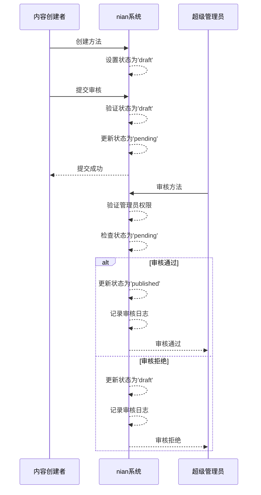
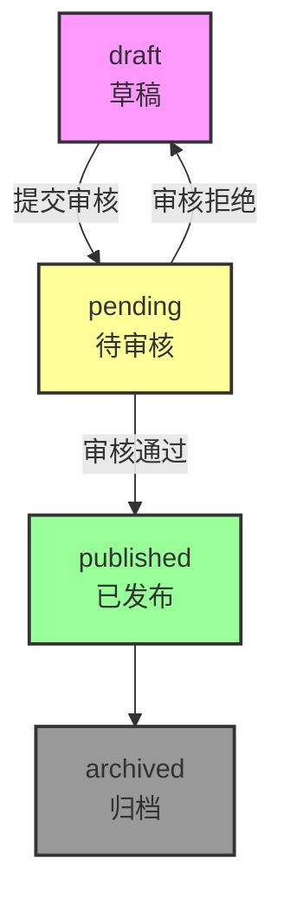

# 状态机与审核流程

<cite>
**本文档引用的文件**   
- [init.sql](file://database/init.sql#L29)
- [index.ts](file://backend/src/types/index.ts#L28)
- [admin.controller.ts](file://backend/src/controllers/admin.controller.ts#L267-L387)
- [method.controller.ts](file://backend/src/controllers/method.controller.ts#L20)
</cite>

## 目录
1. [状态机概述](#状态机概述)
2. [状态定义与业务含义](#状态定义与业务含义)
3. [状态转换规则](#状态转换规则)
4. [状态变更业务逻辑](#状态变更业务逻辑)
5. [审核流程与权限控制](#审核流程与权限控制)
6. [状态变更历史记录](#状态变更历史记录)
7. [状态转换图](#状态转换图)

## 状态机概述

nian系统心理调节方法的状态机设计用于管理心理调节方法从创建到发布的完整生命周期。系统通过四个明确的状态来控制方法的可见性和可用性：草稿（draft）、待审核（pending）、已发布（published）和归档（archived）。这种状态机设计确保了内容的质量控制和发布流程的规范性。

**Section sources**
- [init.sql](file://database/init.sql#L29)
- [index.ts](file://backend/src/types/index.ts#L28)

## 状态定义与业务含义

心理调节方法的状态字段定义了方法在其生命周期中的不同阶段，每个状态都有明确的业务含义和访问控制规则。

- **草稿（draft）**：方法的初始状态，表示方法正在创建或编辑中。只有创建者和管理员可以查看和编辑此状态的方法。在`init.sql`中，status字段的默认值被设置为'draft'，确保新创建的方法从草稿状态开始。

- **待审核（pending）**：方法提交审核后的状态，表示方法正在等待管理员审核。在此状态下，方法对普通用户不可见，只有管理员可以查看和处理。

- **已发布（published）**：方法通过审核后的状态，表示方法已正式发布，所有用户都可以查看和使用。这是方法的最终可用状态。

- **归档（archived）**：表示方法已被移出常规使用，但保留历史记录。目前系统中尚未实现此状态的转换逻辑。

```typescript
// 在index.ts中定义的联合类型确保了状态值的类型安全
export interface Method {
  status: 'draft' | 'pending' | 'published' | 'archived';
  // 其他属性...
}
```

**Section sources**
- [init.sql](file://database/init.sql#L29)
- [index.ts](file://backend/src/types/index.ts#L28)

## 状态转换规则

状态机的状态转换遵循严格的业务规则，确保内容发布的质量和流程的规范性。以下是主要的状态转换路径：

- **draft → pending**：当内容创建者完成方法编辑并提交审核时发生。此转换通过`submitForReview`接口触发，确保只有完成的方法才能进入审核流程。

- **pending → published**：当超级管理员审核通过方法时发生。此转换是内容发布的最终步骤，使方法对所有用户可见。

- **pending → draft**：当超级管理员审核拒绝方法时发生。此转换允许创建者根据反馈修改方法内容。

- **published → archived**：当前系统中尚未实现此转换，但已预留状态值以支持未来的内容归档功能。

值得注意的是，系统不允许直接从draft到published的转换，必须经过pending状态的审核流程，这确保了所有发布内容都经过质量审查。

**Section sources**
- [admin.controller.ts](file://backend/src/controllers/admin.controller.ts#L267-L387)

## 状态变更业务逻辑

状态变更的业务逻辑实现在`admin.controller.ts`文件中，通过一系列控制器方法来处理不同的状态转换请求。



**Diagram sources**
- [admin.controller.ts](file://backend/src/controllers/admin.controller.ts#L267-L387)

**Section sources**
- [admin.controller.ts](file://backend/src/controllers/admin.controller.ts#L267-L387)

## 审核流程与权限控制

系统的审核流程设计了严格的权限控制机制，确保只有授权人员才能执行关键操作。审核流程主要涉及以下控制器方法：

- **submitForReview**：允许内容创建者将方法从draft状态提交到pending状态。此操作不需要特殊权限，任何已认证的管理员都可以提交自己创建的方法。

- **approveMethod**：仅允许超级管理员（super_admin）将方法从pending状态批准为published状态。系统通过检查管理员角色来实施此权限控制。

- **rejectMethod**：同样仅允许超级管理员将方法从pending状态拒绝回draft状态。

在`method.controller.ts`中，获取方法列表和详情的接口都包含了状态过滤逻辑，确保普通用户只能访问published状态的方法：

```typescript
// 获取方法列表时只返回已发布的方法
const conditions: string[] = ["status = 'published'"];
```

这种设计确保了未通过审核的内容对普通用户完全不可见，维护了平台内容的质量和专业性。

**Section sources**
- [admin.controller.ts](file://backend/src/controllers/admin.controller.ts#L308-L316)
- [method.controller.ts](file://backend/src/controllers/method.controller.ts#L20)

## 状态变更历史记录

系统通过`audit_logs`表记录所有状态变更的历史，提供完整的审核追踪功能。每次状态变更都会在该表中创建一条记录，包含以下信息：

- **method_id**：关联的心理调节方法ID
- **admin_id**：执行操作的管理员ID
- **action**：操作类型（submit、approve、reject）
- **status_before**：状态变更前的值
- **status_after**：状态变更后的值
- **comment**：审核意见（仅在拒绝时必填）
- **created_at**：操作时间戳

例如，当提交审核时，系统会执行以下SQL操作：

```sql
INSERT INTO audit_logs (method_id, admin_id, action, status_before, status_after)
VALUES ($1, $2, 'submit', 'draft', 'pending')
```

这些日志记录不仅提供了操作审计功能，还可以用于分析内容审核的效率和模式，为系统优化提供数据支持。

**Section sources**
- [admin.controller.ts](file://backend/src/controllers/admin.controller.ts#L285-L288)
- [init.sql](file://database/init.sql#L110-L119)

## 状态转换图



**Diagram sources**
- [admin.controller.ts](file://backend/src/controllers/admin.controller.ts#L267-L387)
- [init.sql](file://database/init.sql#L29)

**Section sources**
- [admin.controller.ts](file://backend/src/controllers/admin.controller.ts#L267-L387)
- [init.sql](file://database/init.sql#L29)