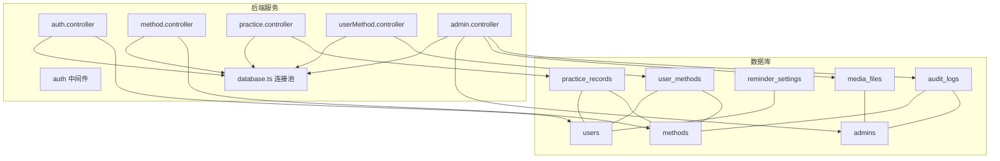
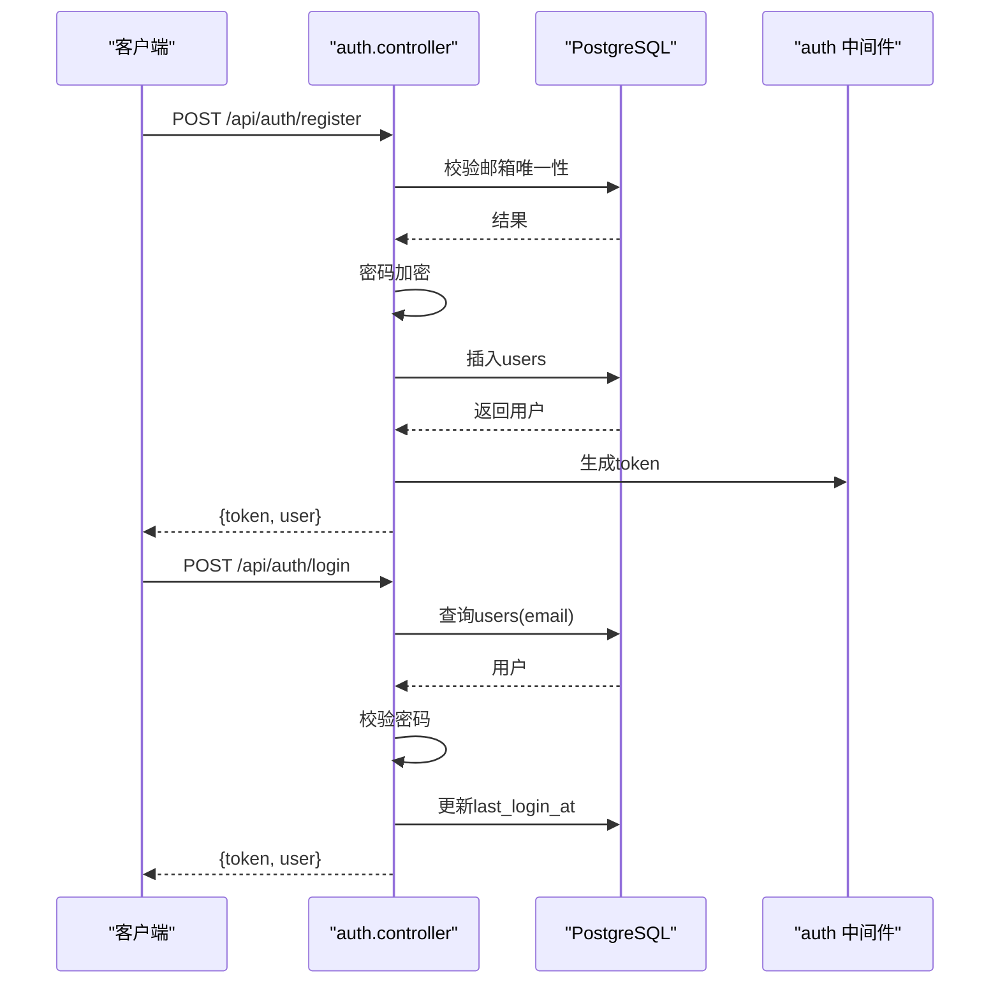

# 数据模型

<cite>
**本文引用的文件**
- [init.sql](file://database/init.sql)
- [index.ts](file://backend/src/types/index.ts)
- [database.ts](file://backend/src/config/database.ts)
- [auth.controller.ts](file://backend/src/controllers/auth.controller.ts)
- [method.controller.ts](file://backend/src/controllers/method.controller.ts)
- [practice.controller.ts](file://backend/src/controllers/practice.controller.ts)
- [userMethod.controller.ts](file://backend/src/controllers/userMethod.controller.ts)
- [admin.controller.ts](file://backend/src/controllers/admin.controller.ts)
- [auth.ts](file://backend/src/middleware/auth.ts)
</cite>

## 目录
1. [简介](#简介)
2. [项目结构与数据模型概览](#项目结构与数据模型概览)
3. [核心实体与字段定义](#核心实体与字段定义)
4. [架构总览](#架构总览)
5. [详细组件分析](#详细组件分析)
6. [依赖关系分析](#依赖关系分析)
7. [性能与索引策略](#性能与索引策略)
8. [数据验证与约束](#数据验证与约束)
9. [示例数据与取值范围](#示例数据与取值范围)
10. [故障排查指南](#故障排查指南)
11. [结论](#结论)

## 简介
本文件面向nian后端系统，基于PostgreSQL数据库初始化脚本与TypeScript类型定义，系统化梳理用户、心理调节方法、练习记录、用户方法等核心实体的数据模型。文档覆盖字段定义、数据类型、约束条件、业务规则、外键关联、索引策略、数据完整性、视图与触发器，并给出ER图与流程图，帮助开发者与产品人员快速理解与使用该数据模型。

## 项目结构与数据模型概览
后端采用Express + PostgreSQL架构，数据库初始化脚本定义了核心表结构与索引；TypeScript类型定义用于API层的请求/响应与业务对象建模；控制器负责业务逻辑与SQL交互；中间件处理鉴权与错误处理。



图表来源
- [init.sql](file://database/init.sql#L1-L124)
- [auth.controller.ts](file://backend/src/controllers/auth.controller.ts#L1-L150)
- [method.controller.ts](file://backend/src/controllers/method.controller.ts#L1-L153)
- [practice.controller.ts](file://backend/src/controllers/practice.controller.ts#L1-L261)
- [userMethod.controller.ts](file://backend/src/controllers/userMethod.controller.ts#L1-L162)
- [admin.controller.ts](file://backend/src/controllers/admin.controller.ts#L1-L1428)
- [database.ts](file://backend/src/config/database.ts#L1-L47)

章节来源
- [init.sql](file://database/init.sql#L1-L124)
- [index.ts](file://backend/src/types/index.ts#L1-L126)
- [database.ts](file://backend/src/config/database.ts#L1-L47)

## 核心实体与字段定义
以下按PostgreSQL表结构与TypeScript类型定义进行对照说明，标注字段类型、约束、默认值与业务含义。

- 用户 users
  - 字段
    - id: 整型自增主键
    - email: 非空唯一字符串
    - password_hash: 非空字符串（bcrypt哈希）
    - nickname: 可空字符串
    - avatar_url: 可空字符串
    - created_at: 时间戳，默认当前时间
    - last_login_at: 可空时间戳
    - is_active: 布尔，默认true
  - 约束
    - 唯一索引: idx_users_email
    - 索引: idx_users_created_at
  - 业务规则
    - 注册时校验邮箱唯一性与密码长度
    - 登录时校验密码并更新最后登录时间
    - 默认激活状态

- 心理自助方法 methods
  - 字段
    - id: 整型自增主键
    - title: 非空字符串
    - description: 非空字符串
    - category: 非空字符串
    - difficulty: 非空字符串
    - duration_minutes: 非空整数（分钟）
    - cover_image_url: 可空字符串
    - content_json: JSONB，非空
    - status: 非空字符串，默认draft
    - view_count: 整数，默认0
    - select_count: 整数，默认0
    - created_by: 外键users(id)，可空
    - created_at: 时间戳，默认当前时间
    - updated_at: 时间戳，默认当前时间（触发器自动更新）
    - published_at: 可空时间戳
  - 约束
    - 索引: idx_methods_status, idx_methods_category, idx_methods_difficulty, idx_methods_created_at
    - 触发器: update_methods_updated_at
  - 业务规则
    - 管理员创建方法默认draft，提交审核后进入pending，超级管理员批准后publish
    - 列表查询仅返回published状态
    - 查看方法时增加view_count

- 用户方法 user_methods
  - 字段
    - id: 整型自增主键
    - user_id: 非空外键users(id)，级联删除
    - method_id: 非空外键methods(id)，级联删除
    - selected_at: 时间戳，默认当前时间
    - target_count: 整数，默认0
    - completed_count: 整数，默认0
    - total_duration_minutes: 整数，默认0
    - continuous_days: 整数，默认0
    - last_practice_at: 可空时间戳
    - is_favorite: 布尔，默认false
    - 唯一约束: (user_id, method_id)
  - 约束
    - 索引: idx_user_methods_user_id, idx_user_methods_method_id, idx_user_methods_selected_at
  - 业务规则
    - 将方法加入个人库时增加methods.select_count
    - 删除个人方法时减少select_count（最小0）

- 练习记录 practice_records
  - 字段
    - id: 整型自增主键
    - user_id: 非空外键users(id)，级联删除
    - method_id: 非空外键methods(id)，级联删除
    - practice_date: 日期，非空
    - duration_minutes: 非空整数（分钟）
    - mood_before: 整数，检查1-10
    - mood_after: 整数，检查1-10
    - notes: 文本
    - questionnaire_result: JSONB
    - created_at: 时间戳，默认当前时间
  - 约束
    - 索引: idx_practice_records_user_id_date, idx_practice_records_user_id_method_id, idx_practice_records_created_at
  - 业务规则
    - 记录练习时，同时更新user_methods的完成次数、总时长与最近练习时间
    - 连续打卡天数根据昨日是否有记录决定+1或重置为1
    - 支持分页查询与按日期范围过滤

- 提醒设置 reminder_settings
  - 字段
    - id: 整型自增主键
    - user_id: 非空唯一外键users(id)，级联删除
    - enabled: 布尔，默认true
    - reminder_times: JSONB，非空
    - reminder_days: JSONB，非空
    - notification_type: 字符串，默认all
    - created_at: 时间戳，默认当前时间
    - updated_at: 时间戳，默认当前时间（触发器自动更新）
  - 约束
    - 索引: idx_reminder_settings_user_id
    - 触发器: update_reminder_settings_updated_at
  - 业务规则
    - 一对一绑定用户，支持启用/禁用与通知类型配置

- 管理员 admins
  - 字段
    - id: 整型自增主键
    - username: 非空唯一字符串
    - password_hash: 非空字符串
    - role: 非空字符串，检查为super_admin/content_admin/analyst之一
    - email: 非空唯一字符串
    - is_active: 布尔，默认true
    - created_at: 时间戳，默认当前时间
    - last_login_at: 可空时间戳
  - 约束
    - 索引: idx_admins_username, idx_admins_email
  - 业务规则
    - 登录时校验密码并更新最后登录时间
    - 超级管理员拥有审核方法的最高权限

- 审核记录 audit_logs
  - 字段
    - id: 整型自增主键
    - method_id: 外键methods(id)，删除时设为空
    - admin_id: 外键admins(id)，删除时设为空
    - action: 非空字符串，检查为submit/approve/reject之一
    - status_before: 字符串
    - status_after: 字符串
    - comment: 文本
    - created_at: 时间戳，默认当前时间
  - 约束
    - 索引: idx_audit_logs_method_id, idx_audit_logs_admin_id, idx_audit_logs_created_at

- 媒体文件 media_files
  - 字段
    - id: 整型自增主键
    - filename: 非空字符串
    - original_name: 非空字符串
    - file_type: 非空字符串，检查为image/audio/video之一
    - mime_type: 非空字符串
    - file_size: 非空整数（字节）
    - file_path: 非空字符串
    - url: 非空字符串
    - uploaded_by: 外键admins(id)，删除时设为空
    - created_at: 时间戳，默认当前时间
    - updated_at: 时间戳，默认当前时间
  - 约束
    - 索引: idx_media_files_file_type, idx_media_files_uploaded_by, idx_media_files_created_at

- 视图
  - user_practice_stats: 用户练习统计视图
  - method_popularity: 方法热度统计视图

章节来源
- [init.sql](file://database/init.sql#L1-L124)
- [init.sql](file://database/init.sql#L301-L349)
- [index.ts](file://backend/src/types/index.ts#L1-L126)

## 架构总览
后端通过Express路由与控制器访问PostgreSQL，使用pg连接池管理连接；TypeScript类型定义贯穿请求/响应与业务对象；JWT中间件负责用户与管理员鉴权。



图表来源
- [auth.controller.ts](file://backend/src/controllers/auth.controller.ts#L1-L150)
- [auth.ts](file://backend/src/middleware/auth.ts#L1-L87)
- [database.ts](file://backend/src/config/database.ts#L1-L47)

## 详细组件分析

### 用户模块
- 注册流程
  - 输入校验：邮箱格式、密码长度
  - 去重：查询users(email)
  - 密码哈希：bcrypt
  - 写入：插入users，返回token
- 登录流程
  - 查询：users(email)
  - 校验：is_active、密码
  - 更新：last_login_at
  - 返回：token与用户信息
- 当前用户信息
  - 通过JWT解析用户id，查询users

章节来源
- [auth.controller.ts](file://backend/src/controllers/auth.controller.ts#L1-L150)
- [auth.ts](file://backend/src/middleware/auth.ts#L1-L87)

### 方法模块
- 列表查询
  - 过滤：status=published，category/difficulty/keyword
  - 分页：limit/offset
  - 排序：published_at降序
- 详情查询
  - 过滤：status=published
  - 增加view_count
- 推荐算法
  - 基于用户已选方法的category或select_count>10进行推荐
- 分类统计
  - 统计各分类数量

章节来源
- [method.controller.ts](file://backend/src/controllers/method.controller.ts#L1-L153)
- [init.sql](file://database/init.sql#L1-L124)

### 练习记录模块
- 记录一次练习
  - 参数校验：method_id、duration_minutes、mood_before/after范围
  - 事务：插入practice_records，更新user_methods（ON CONFLICT UPSERT）
  - 连续天数：根据昨日记录+1或重置为1
- 练习历史
  - 条件：user_id、method_id、start_date、end_date
  - 分页：page/pageSize
  - 排序：practice_date、created_at降序
- 练习统计
  - 总体：总次数、总时长、练习天数、平均情绪改善
  - 趋势：按日期聚合mood前后均值
  - 分布：按方法类别统计
  - 最长连续天数：取user_methods.max(continuous_days)

章节来源
- [practice.controller.ts](file://backend/src/controllers/practice.controller.ts#L1-L261)

### 用户方法模块
- 添加方法到个人库
  - 校验：方法存在且status=published
  - 去重：UNIQUE(user_id, method_id)
  - 写入：插入user_methods
  - 同步：增加methods.select_count
- 获取个人方法列表
  - JOIN methods，按selected_at降序
- 更新个人方法
  - 支持target_count、is_favorite
  - 校验：必须有可更新字段
- 删除个人方法
  - 删除：RETURNING method_id
  - 同步：减少methods.select_count（最小0）

章节来源
- [userMethod.controller.ts](file://backend/src/controllers/userMethod.controller.ts#L1-L162)

### 管理员模块
- 方法管理
  - 创建：默认status=draft
  - 更新：动态拼接字段
  - 删除：软/硬删除取决于业务需求
- 审核流程
  - 提交：draft -> pending
  - 通过：pending -> published，写入audit_logs
  - 拒绝：pending -> draft，写入audit_logs
- 媒体管理
  - 上传：根据mimetype判断file_type，写入media_files
  - 列表：按type/search分页
  - 删除：删除记录并清理物理文件
- 数据导出
  - 用户、方法、练习记录支持JSON/CSV/Excel导出

章节来源
- [admin.controller.ts](file://backend/src/controllers/admin.controller.ts#L1-L1428)
- [init.sql](file://database/init.sql#L1-L124)

## 依赖关系分析
- 控制器依赖
  - 所有控制器依赖database.ts中的pool进行数据库操作
  - auth.controller与admin.controller分别依赖auth.ts中间件进行JWT鉴权
- 类型定义
  - index.ts中User、Method、UserMethod、PracticeRecord、Admin、MediaFile等类型与数据库字段一一对应
- 外键关系
  - user_methods.user_id -> users(id) ON DELETE CASCADE
  - user_methods.method_id -> methods(id) ON DELETE CASCADE
  - practice_records.user_id -> users(id) ON DELETE CASCADE
  - practice_records.method_id -> methods(id) ON DELETE CASCADE
  - reminder_settings.user_id -> users(id) ON DELETE CASCADE
  - audit_logs.method_id -> methods(id) ON DELETE SET NULL
  - audit_logs.admin_id -> admins(id) ON DELETE SET NULL
  - media_files.uploaded_by -> admins(id) ON DELETE SET NULL

```mermaid
erDiagram
USERS {
int id PK
string email UK
string password_hash
string nickname
string avatar_url
timestamp created_at
timestamp last_login_at
boolean is_active
}
METHODS {
int id PK
string title
string description
string category
string difficulty
int duration_minutes
string cover_image_url
jsonb content_json
string status
int view_count
int select_count
int created_by FK
timestamp created_at
timestamp updated_at
timestamp published_at
}
USER_METHODS {
int id PK
int user_id FK
int method_id FK
timestamp selected_at
int target_count
int completed_count
int total_duration_minutes
int continuous_days
timestamp last_practice_at
boolean is_favorite
}
PRACTICE_RECORDS {
int id PK
int user_id FK
int method_id FK
date practice_date
int duration_minutes
int mood_before
int mood_after
text notes
jsonb questionnaire_result
timestamp created_at
}
REMINDER_SETTINGS {
int id PK
int user_id FK UK
boolean enabled
jsonb reminder_times
jsonb reminder_days
string notification_type
timestamp created_at
timestamp updated_at
}
ADMINS {
int id PK
string username UK
string password_hash
string role
string email UK
boolean is_active
timestamp created_at
timestamp last_login_at
}
AUDIT_LOGS {
int id PK
int method_id FK
int admin_id FK
string action
string status_before
string status_after
text comment
timestamp created_at
}
MEDIA_FILES {
int id PK
string filename
string original_name
string file_type
string mime_type
bigint file_size
string file_path
string url
int uploaded_by FK
timestamp created_at
timestamp updated_at
}
USERS ||--o{ USER_METHODS : "has"
METHODS ||--o{ USER_METHODS : "selected_by"
USERS ||--o{ PRACTICE_RECORDS : "practiced"
METHODS ||--o{ PRACTICE_RECORDS : "used"
USERS ||--o{ REMINDER_SETTINGS : "configured"
ADMINS ||--o{ AUDIT_LOGS : "performed"
METHODS ||--o{ AUDIT_LOGS : "audited"
ADMINS ||--o{ MEDIA_FILES : "uploaded"
```

图表来源
- [init.sql](file://database/init.sql#L1-L124)
- [index.ts](file://backend/src/types/index.ts#L1-L126)

## 性能与索引策略
- 索引
  - users: idx_users_email, idx_users_created_at
  - methods: idx_methods_status, idx_methods_category, idx_methods_difficulty, idx_methods_created_at
  - user_methods: idx_user_methods_user_id, idx_user_methods_method_id, idx_user_methods_selected_at
  - practice_records: idx_practice_records_user_id_date, idx_practice_records_user_id_method_id, idx_practice_records_created_at
  - reminder_settings: idx_reminder_settings_user_id
  - admins: idx_admins_username, idx_admins_email
  - audit_logs: idx_audit_logs_method_id, idx_audit_logs_admin_id, idx_audit_logs_created_at
  - media_files: idx_media_files_file_type, idx_media_files_uploaded_by, idx_media_files_created_at
- 触发器
  - update_updated_at_column：在methods与reminder_settings更新时自动设置updated_at
- 视图
  - user_practice_stats：按用户聚合练习统计
  - method_popularity：按发布状态聚合方法热度

章节来源
- [init.sql](file://database/init.sql#L1-L124)
- [init.sql](file://database/init.sql#L301-L349)

## 数据验证与约束
- 字段约束
  - 非空：email/password_hash/title/description/category/difficulty/duration_minutes/content_json/status等
  - 唯一：users.email、admins.username、admins.email、reminder_settings.user_id
  - 检查：mood_before/mood_after范围1-10；role枚举；file_type枚举；action枚举
  - 外键：user_methods、practice_records、reminder_settings、audit_logs、media_files
- 业务校验
  - 注册：邮箱格式、密码长度、邮箱唯一
  - 登录：账号激活、密码正确
  - 练习：mood范围校验、method存在且published
  - 审核：仅超级管理员可批准/拒绝
- 默认值
  - created_at/updated_at默认NOW()；is_active默认TRUE；select_count/view_count默认0；duration_minutes默认0；continuous_days默认0；enabled默认TRUE；notification_type默认all

章节来源
- [auth.controller.ts](file://backend/src/controllers/auth.controller.ts#L1-L150)
- [practice.controller.ts](file://backend/src/controllers/practice.controller.ts#L1-L261)
- [admin.controller.ts](file://backend/src/controllers/admin.controller.ts#L1-L1428)
- [init.sql](file://database/init.sql#L1-L124)

## 示例数据与取值范围
- 用户 users
  - email: 有效邮箱格式
  - password_hash: bcrypt哈希字符串
  - nickname/avatar_url: 可空字符串
  - is_active: true/false
- 心理自助方法 methods
  - title/description: 字符串
  - category: 如“放松技巧”、“认知调整”、“情绪管理”
  - difficulty: “入门”、“进阶”
  - duration_minutes: 正整数（分钟）
  - content_json: 结构化内容（章节、练习、问卷等）
  - status: draft/pending/published/archived
- 用户方法 user_methods
  - target_count/completed_count/total_duration_minutes/continuous_days: 非负整数
  - is_favorite: true/false
- 练习记录 practice_records
  - practice_date: 日期
  - duration_minutes: 正整数
  - mood_before/mood_after: 1-10
  - questionnaire_result: JSON结构
- 提醒设置 reminder_settings
  - enabled: true/false
  - reminder_times/reminder_days: JSON数组（时间点/星期）
  - notification_type: all/...
- 管理员 admins
  - role: super_admin/content_admin/analyst
- 审核记录 audit_logs
  - action: submit/approve/reject
- 媒体文件 media_files
  - file_type: image/audio/video
  - file_size: 正整数（字节）

章节来源
- [init.sql](file://database/init.sql#L150-L299)
- [index.ts](file://backend/src/types/index.ts#L1-L126)

## 故障排查指南
- 认证失败
  - 检查Authorization头格式与JWT签名；确认用户/管理员账户未被禁用
- 数据唯一冲突
  - users.email、admins.username/email、reminder_settings.user_id重复
- 外键约束错误
  - user_methods.method_id或user_methods.user_id不存在
  - practice_records.method_id或practice_records.user_id不存在
- 数据范围错误
  - mood_before/mood_after超出1-10范围
- 审核权限不足
  - 仅super_admin可approve/reject
- 导出参数缺失
  - 导出练习记录需提供起止日期

章节来源
- [auth.controller.ts](file://backend/src/controllers/auth.controller.ts#L1-L150)
- [userMethod.controller.ts](file://backend/src/controllers/userMethod.controller.ts#L1-L162)
- [practice.controller.ts](file://backend/src/controllers/practice.controller.ts#L1-L261)
- [admin.controller.ts](file://backend/src/controllers/admin.controller.ts#L1-L1428)
- [auth.ts](file://backend/src/middleware/auth.ts#L1-L87)

## 结论
本数据模型围绕用户、方法、练习记录与用户方法四类核心实体构建，辅以外键、索引、触发器与视图，形成清晰的业务闭环。TypeScript类型定义与控制器逻辑确保了前后端一致的数据契约与健壮的业务流程。建议在生产环境中：
- 使用ORM（如Prisma）进一步抽象SQL，提升可维护性
- 对高频查询建立复合索引与物化视图
- 引入数据迁移工具管理schema演进
- 增强审计与备份策略