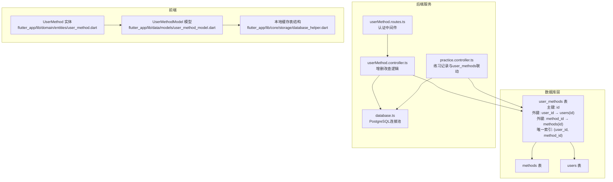
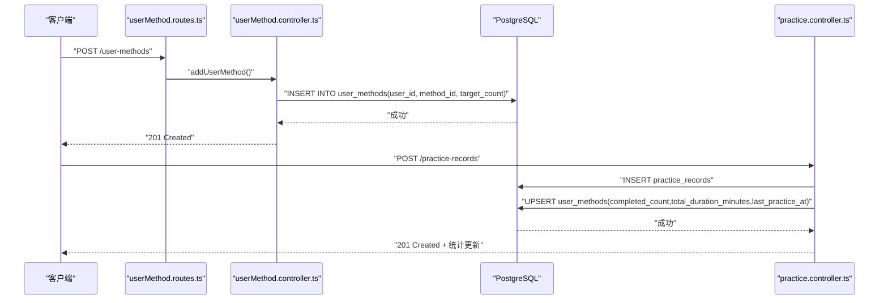
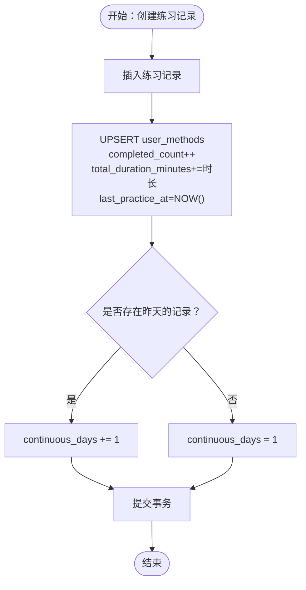
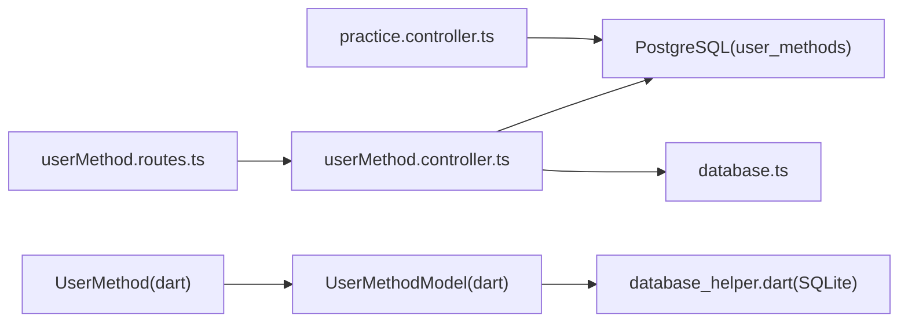

# 用户方法关联模型

<cite>
**本文引用的文件**
- [init.sql](file://database/init.sql)
- [index.ts](file://backend/src/types/index.ts)
- [userMethod.controller.ts](file://backend/src/controllers/userMethod.controller.ts)
- [userMethod.routes.ts](file://backend/src/routes/userMethod.routes.ts)
- [practice.controller.ts](file://backend/src/controllers/practice.controller.ts)
- [database.ts](file://backend/src/config/database.ts)
- [user_method.dart](file://flutter_app/lib/domain/entities/user_method.dart)
- [user_method_model.dart](file://flutter_app/lib/data/models/user_method_model.dart)
- [database_helper.dart](file://flutter_app/lib/core/storage/database_helper.dart)
</cite>

## 目录
1. [简介](#简介)
2. [项目结构](#项目结构)
3. [核心组件](#核心组件)
4. [架构总览](#架构总览)
5. [详细组件分析](#详细组件分析)
6. [依赖分析](#依赖分析)
7. [性能考虑](#性能考虑)
8. [故障排查指南](#故障排查指南)
9. [结论](#结论)
10. [附录](#附录)

## 简介
本文件围绕 nian 后端系统的“用户方法关联”数据模型展开，基于 PostgreSQL 的 user_methods 表与 TypeScript 的 UserMethod 接口进行系统化梳理。内容涵盖：
- 字段定义与数据类型、约束条件与业务规则
- 外键约束与复合唯一索引的设计目的
- 计数类字段与时间类字段的业务含义
- 与 init.sql 中表结构及 index.ts 中 TypeScript 接口的 ORM 映射关系
- 示例数据记录与在个性化推荐与练习进度跟踪中的应用

## 项目结构
用户方法关联模型涉及后端数据库层、控制器层、类型定义层，以及 Flutter 前端的实体与本地存储层。关键文件如下：
- 数据库初始化：database/init.sql
- 类型定义：backend/src/types/index.ts
- 控制器与路由：backend/src/controllers/userMethod.controller.ts、backend/src/routes/userMethod.routes.ts
- 练习记录与关联更新：backend/src/controllers/practice.controller.ts
- 数据库连接配置：backend/src/config/database.ts
- 前端实体与模型：flutter_app/lib/domain/entities/user_method.dart、flutter_app/lib/data/models/user_method_model.dart
- 前端本地缓存表结构：flutter_app/lib/core/storage/database_helper.dart

图表来源
- [init.sql](file://database/init.sql#L43-L61)
- [userMethod.routes.ts](file://backend/src/routes/userMethod.routes.ts#L1-L23)
- [userMethod.controller.ts](file://backend/src/controllers/userMethod.controller.ts#L1-L162)
- [practice.controller.ts](file://backend/src/controllers/practice.controller.ts#L1-L99)
- [database.ts](file://backend/src/config/database.ts#L1-L47)
- [user_method.dart](file://flutter_app/lib/domain/entities/user_method.dart#L1-L59)
- [user_method_model.dart](file://flutter_app/lib/data/models/user_method_model.dart#L1-L89)
- [database_helper.dart](file://flutter_app/lib/core/storage/database_helper.dart#L54-L143)

章节来源
- [init.sql](file://database/init.sql#L43-L61)
- [userMethod.routes.ts](file://backend/src/routes/userMethod.routes.ts#L1-L23)
- [userMethod.controller.ts](file://backend/src/controllers/userMethod.controller.ts#L1-L162)
- [practice.controller.ts](file://backend/src/controllers/practice.controller.ts#L1-L99)
- [database.ts](file://backend/src/config/database.ts#L1-L47)
- [user_method.dart](file://flutter_app/lib/domain/entities/user_method.dart#L1-L59)
- [user_method_model.dart](file://flutter_app/lib/data/models/user_method_model.dart#L1-L89)
- [database_helper.dart](file://flutter_app/lib/core/storage/database_helper.dart#L54-L143)

## 核心组件
- PostgreSQL 表 user_methods：用于记录用户与方法之间的个人库关联、练习统计与偏好标记。
- TypeScript 接口 UserMethod：后端类型定义，用于控制器与数据库交互时的参数与返回值校验与映射。
- 控制器 userMethod.controller.ts：提供添加、查询、更新、删除用户方法的业务逻辑。
- 练习控制器 practice.controller.ts：在记录练习时同步更新 user_methods 的计数与时间字段，并维护连续天数。
- 前端实体与模型：UserMethod 与 UserMethodModel，用于 Flutter 层的数据展示与本地缓存。
- 本地缓存表结构：Flutter 端使用 SQLite 存储 user_methods 的本地副本，包含外键与索引。

章节来源
- [init.sql](file://database/init.sql#L43-L61)
- [index.ts](file://backend/src/types/index.ts#L37-L49)
- [userMethod.controller.ts](file://backend/src/controllers/userMethod.controller.ts#L1-L162)
- [practice.controller.ts](file://backend/src/controllers/practice.controller.ts#L1-L99)
- [user_method.dart](file://flutter_app/lib/domain/entities/user_method.dart#L1-L59)
- [user_method_model.dart](file://flutter_app/lib/data/models/user_method_model.dart#L1-L89)
- [database_helper.dart](file://flutter_app/lib/core/storage/database_helper.dart#L54-L143)

## 架构总览
用户方法关联模型贯穿“认证 → 路由 → 控制器 → 数据库”的调用链路，并与练习记录流程协同，形成“个人库管理 + 练习进度追踪”的闭环。

图表来源
- [userMethod.routes.ts](file://backend/src/routes/userMethod.routes.ts#L1-L23)
- [userMethod.controller.ts](file://backend/src/controllers/userMethod.controller.ts#L1-L56)
- [practice.controller.ts](file://backend/src/controllers/practice.controller.ts#L1-L99)

## 详细组件分析

### 字段定义与业务规则
以下字段均来自 PostgreSQL 表 user_methods 与 TypeScript 接口 UserMethod 的映射关系：

- id
  - 类型：整型自增主键
  - 约束：PRIMARY KEY
  - 用途：唯一标识每条用户方法关联记录

- user_id
  - 类型：整型
  - 约束：NOT NULL；REFERENCES users(id) ON DELETE CASCADE
  - 用途：关联用户表，删除用户时级联删除其所有方法关联

- method_id
  - 类型：整型
  - 约束：NOT NULL；REFERENCES methods(id) ON DELETE CASCADE
  - 用途：关联方法表，删除方法时级联删除其被用户选择的记录

- selected_at
  - 类型：时间戳
  - 默认值：NOW()
  - 用途：记录用户选择该方法的时间，用于排序与追踪

- target_count
  - 类型：整型
  - 默认值：0
  - 用途：用户设定的练习目标次数（如周目标），用于个性化推荐与进度可视化

- completed_count
  - 类型：整型
  - 默认值：0
  - 用途：累计完成次数，配合练习记录自动递增

- total_duration_minutes
  - 类型：整型
  - 默认值：0
  - 用途：累计练习时长（分钟），配合练习记录自动累加

- continuous_days
  - 类型：整型
  - 默认值：0
  - 用途：连续练习天数，用于激励与习惯追踪

- last_practice_at
  - 类型：时间戳
  - 可空
  - 用途：最近一次练习时间，用于计算连续天数与提醒策略

- is_favorite
  - 类型：布尔
  - 默认值：FALSE
  - 用途：收藏标记，影响个人库排序与推荐权重

复合唯一索引设计目的
- (user_id, method_id)：确保同一用户不能重复选择同一方法，避免冗余记录，保证统计准确性与推荐一致性。

章节来源
- [init.sql](file://database/init.sql#L43-L61)
- [index.ts](file://backend/src/types/index.ts#L37-L49)
- [userMethod.controller.ts](file://backend/src/controllers/userMethod.controller.ts#L1-L56)
- [practice.controller.ts](file://backend/src/controllers/practice.controller.ts#L1-L99)

### 外键约束与索引
- 外键约束
  - user_id → users(id) ON DELETE CASCADE：用户删除时，其所有方法关联被级联删除
  - method_id → methods(id) ON DELETE CASCADE：方法删除时，其被用户选择的记录被级联删除
- 复合唯一索引
  - UNIQUE(user_id, method_id)：防止重复选择
- 单列索引
  - idx_user_methods_user_id、idx_user_methods_method_id、idx_user_methods_selected_at：提升查询与统计性能

章节来源
- [init.sql](file://database/init.sql#L43-L61)

### 计数字段与时间字段的业务含义
- target_count
  - 业务含义：用户为该方法设定的目标练习次数，用于个性化推荐与进度对比
  - 设置入口：添加方法时可传入，后续可通过更新接口调整
- completed_count
  - 业务含义：该用户对该方法的完成次数，驱动“完成度”与“达成率”
- total_duration_minutes
  - 业务含义：该用户对该方法的累计练习时长，用于健康与习惯追踪
- continuous_days
  - 业务含义：连续练习天数，用于激励与习惯养成
- last_practice_at
  - 业务含义：最近一次练习时间，用于判断是否断连与重置连续天数

章节来源
- [userMethod.controller.ts](file://backend/src/controllers/userMethod.controller.ts#L1-L56)
- [practice.controller.ts](file://backend/src/controllers/practice.controller.ts#L1-L99)

### ORM 映射关系
- 后端 TypeScript 接口 UserMethod 与 PostgreSQL 表 user_methods 字段一一对应，便于控制器层进行参数校验与返回值映射。
- 前端实体 UserMethod 与模型 UserMethodModel 与后端接口保持一致的字段命名与语义，便于 Flutter 层展示与本地缓存。
- Flutter 本地缓存表 database_helper.dart 中也存在 user_methods 表结构，包含外键与索引，确保离线场景下的数据一致性与查询效率。

章节来源
- [index.ts](file://backend/src/types/index.ts#L37-L49)
- [user_method.dart](file://flutter_app/lib/domain/entities/user_method.dart#L1-L59)
- [user_method_model.dart](file://flutter_app/lib/data/models/user_method_model.dart#L1-L89)
- [database_helper.dart](file://flutter_app/lib/core/storage/database_helper.dart#L54-L143)

### 示例数据记录
以下为典型记录样例，体现字段间的业务关系与取值范围：
- 记录1：用户A选择了方法X，设定了周目标为5次，尚未开始练习
  - 字段取值：user_id=A、method_id=X、target_count=5、completed_count=0、total_duration_minutes=0、continuous_days=0、last_practice_at=NULL、is_favorite=false
- 记录2：用户A完成第1次练习，持续时间为10分钟
  - 字段取值：completed_count=1、total_duration_minutes=10、last_practice_at=当前时间、continuous_days=1（若前一天无记录则重置为1）
- 记录3：用户A收藏了方法Y
  - 字段取值：is_favorite=true

这些记录支撑个性化推荐与进度跟踪：
- 个性化推荐：结合 target_count、completed_count、continuous_days、is_favorite 等字段，可筛选高优先级与高完成度的方法，或对收藏方法给予更高权重
- 练习进度跟踪：通过 completed_count、total_duration_minutes、continuous_days、last_practice_at 的组合，可生成“完成度曲线”“时长趋势”“连续打卡统计”等指标

章节来源
- [userMethod.controller.ts](file://backend/src/controllers/userMethod.controller.ts#L1-L56)
- [practice.controller.ts](file://backend/src/controllers/practice.controller.ts#L1-L99)

### 与练习记录的联动流程
练习记录创建时，后端会同时更新 user_methods 的计数与时间字段，并维护连续天数。流程如下：

图表来源
- [practice.controller.ts](file://backend/src/controllers/practice.controller.ts#L1-L99)

章节来源
- [practice.controller.ts](file://backend/src/controllers/practice.controller.ts#L1-L99)

## 依赖分析
- 控制器依赖
  - userMethod.controller.ts 依赖 database.ts 的连接池进行数据库操作
  - userMethod.routes.ts 使用 authenticateUser 中间件进行鉴权
- 数据库依赖
  - user_methods 表依赖 users 与 methods 表的外键约束
  - 复合唯一索引与单列索引用于查询与统计优化
- 前端依赖
  - UserMethod 实体与 UserMethodModel 与后端接口字段保持一致
  - Flutter 本地缓存表结构与数据库表结构一致，便于离线展示与同步

图表来源
- [userMethod.routes.ts](file://backend/src/routes/userMethod.routes.ts#L1-L23)
- [userMethod.controller.ts](file://backend/src/controllers/userMethod.controller.ts#L1-L162)
- [database.ts](file://backend/src/config/database.ts#L1-L47)
- [practice.controller.ts](file://backend/src/controllers/practice.controller.ts#L1-L99)
- [user_method.dart](file://flutter_app/lib/domain/entities/user_method.dart#L1-L59)
- [user_method_model.dart](file://flutter_app/lib/data/models/user_method_model.dart#L1-L89)
- [database_helper.dart](file://flutter_app/lib/core/storage/database_helper.dart#L54-L143)

章节来源
- [userMethod.routes.ts](file://backend/src/routes/userMethod.routes.ts#L1-L23)
- [userMethod.controller.ts](file://backend/src/controllers/userMethod.controller.ts#L1-L162)
- [database.ts](file://backend/src/config/database.ts#L1-L47)
- [practice.controller.ts](file://backend/src/controllers/practice.controller.ts#L1-L99)
- [user_method.dart](file://flutter_app/lib/domain/entities/user_method.dart#L1-L59)
- [user_method_model.dart](file://flutter_app/lib/data/models/user_method_model.dart#L1-L89)
- [database_helper.dart](file://flutter_app/lib/core/storage/database_helper.dart#L54-L143)

## 性能考虑
- 索引策略
  - idx_user_methods_user_id、idx_user_methods_method_id、idx_user_methods_selected_at：用于按用户查询、按方法查询、按选择时间排序
  - idx_user_methods_user_id + 复合唯一索引：保障去重与高效查询
- 事务与并发
  - 练习记录创建采用事务，确保 user_methods 与 practice_records 的一致性
- 前端缓存
  - Flutter 本地缓存表包含外键与索引，减少网络依赖，提升离线体验

[本节为通用建议，无需列出具体文件来源]

## 故障排查指南
- 认证失败
  - 现象：401 AUTH_FAILED
  - 排查：确认请求头 Authorization 是否为 Bearer Token，Token 是否有效
  - 参考：[userMethod.routes.ts](file://backend/src/routes/userMethod.routes.ts#L1-L23)、[auth.ts](file://backend/src/middleware/auth.ts#L1-L87)
- 参数校验错误
  - 现象：400 VALIDATION_ERROR
  - 排查：检查 method_id、duration_minutes、mood_before/mood_after 范围等
  - 参考：[userMethod.controller.ts](file://backend/src/controllers/userMethod.controller.ts#L1-L56)、[practice.controller.ts](file://backend/src/controllers/practice.controller.ts#L1-L99)
- 重复添加
  - 现象：409 DUPLICATE_ENTRY
  - 排查：确认 (user_id, method_id) 是否已存在
  - 参考：[userMethod.controller.ts](file://backend/src/controllers/userMethod.controller.ts#L1-L56)
- 记录不存在
  - 现象：404 NOT_FOUND
  - 排查：确认 id 与 user_id 组合是否存在
  - 参考：[userMethod.controller.ts](file://backend/src/controllers/userMethod.controller.ts#L96-L161)

章节来源
- [userMethod.routes.ts](file://backend/src/routes/userMethod.routes.ts#L1-L23)
- [userMethod.controller.ts](file://backend/src/controllers/userMethod.controller.ts#L1-L162)
- [practice.controller.ts](file://backend/src/controllers/practice.controller.ts#L1-L99)

## 结论
用户方法关联模型通过 PostgreSQL 的 user_methods 表与 TypeScript 的 UserMethod 接口实现了“个人库管理 + 练习进度追踪”的完整闭环。其关键特性包括：
- 外键约束与复合唯一索引确保数据一致性与去重
- 计数与时间字段清晰表达练习行为与习惯指标
- 控制器与练习控制器协同，保障统计准确性与用户体验
- 前后端字段映射一致，便于个性化推荐与进度可视化

[本节为总结性内容，无需列出具体文件来源]

## 附录
- 字段对照表（后端接口与数据库字段）
  - id → id
  - user_id → user_id
  - method_id → method_id
  - selected_at → selected_at
  - target_count → target_count
  - completed_count → completed_count
  - total_duration_minutes → total_duration_minutes
  - continuous_days → continuous_days
  - last_practice_at → last_practice_at
  - is_favorite → is_favorite

章节来源
- [index.ts](file://backend/src/types/index.ts#L37-L49)
- [init.sql](file://database/init.sql#L43-L61)