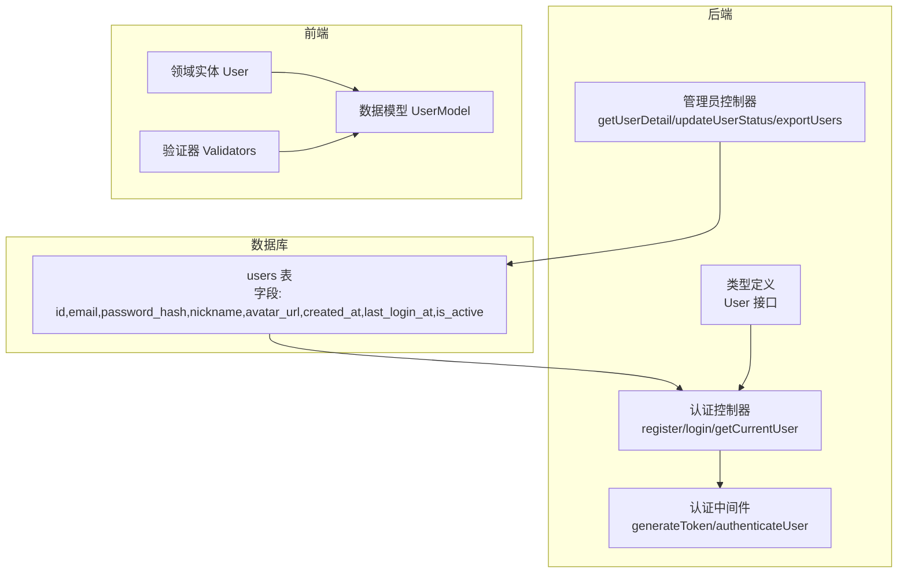
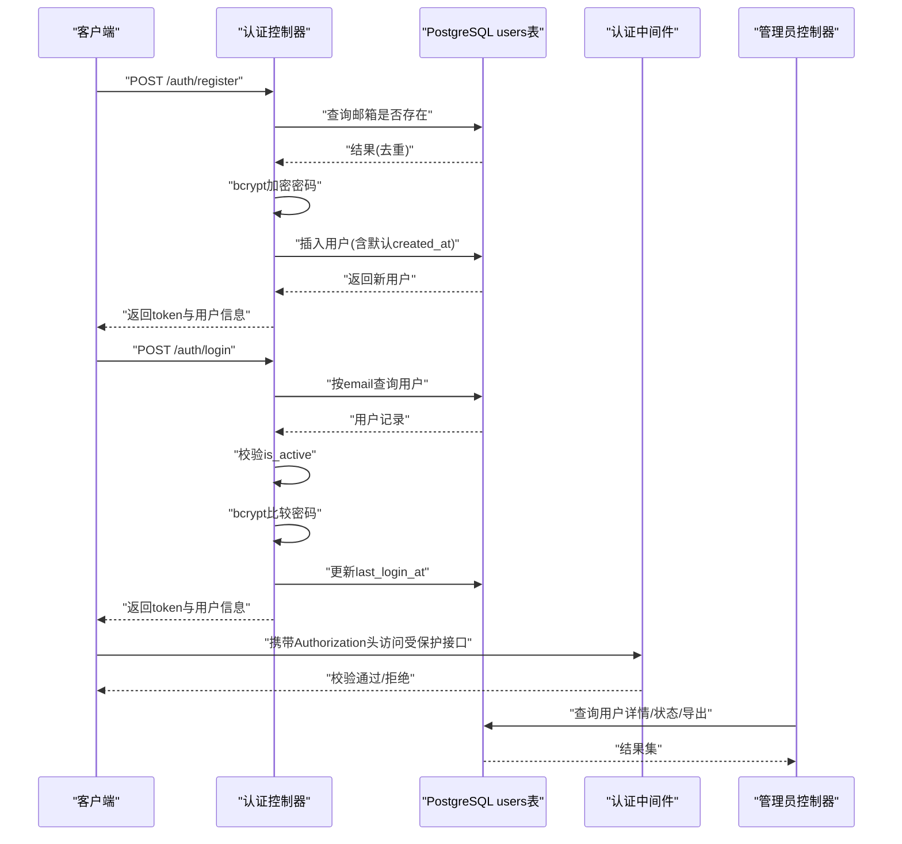
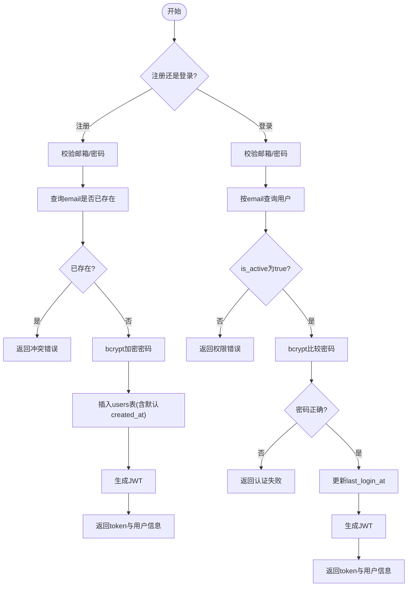
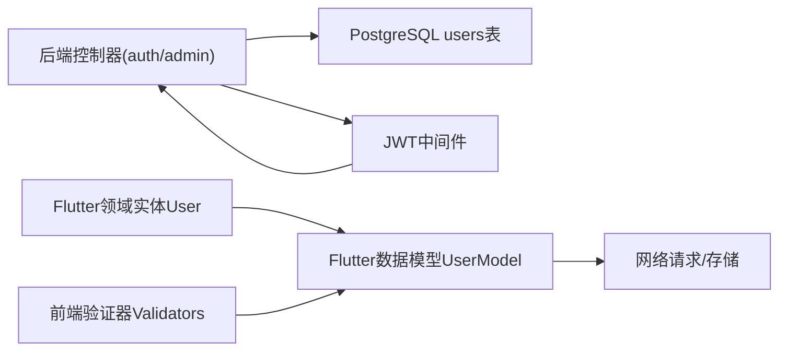

# 用户模型

<cite>
**本文引用的文件**
- [init.sql](file://database/init.sql)
- [index.ts](file://backend/src/types/index.ts)
- [auth.controller.ts](file://backend/src/controllers/auth.controller.ts)
- [admin.controller.ts](file://backend/src/controllers/admin.controller.ts)
- [auth.ts](file://backend/src/middleware/auth.ts)
- [user.dart](file://flutter_app/lib/domain/entities/user.dart)
- [user_model.dart](file://flutter_app/lib/data/models/user_model.dart)
- [validators.dart](file://flutter_app/lib/core/utils/validators.dart)
</cite>

## 目录
1. [简介](#简介)
2. [项目结构](#项目结构)
3. [核心组件](#核心组件)
4. [架构总览](#架构总览)
5. [详细组件分析](#详细组件分析)
6. [依赖分析](#依赖分析)
7. [性能考虑](#性能考虑)
8. [故障排查指南](#故障排查指南)
9. [结论](#结论)
10. [附录](#附录)

## 简介
本文件面向nian后端系统的用户数据模型，围绕PostgreSQL的users表与TypeScript的User接口展开，系统性说明字段定义、数据类型、约束条件、业务规则、加密存储机制、默认值设置、示例数据与取值范围，并结合init.sql与index.ts展示ORM映射关系。同时补充前端Flutter侧对用户实体与数据模型的使用方式，以及数据验证规则与生命周期钩子（如登录时的last_login_at更新）。

## 项目结构
用户模型涉及以下关键位置：
- 数据库层：PostgreSQL初始化脚本定义users表结构与索引
- 后端层：TypeScript类型定义User接口；控制器处理注册/登录/查询；中间件负责JWT鉴权
- 前端层：Flutter领域实体与数据模型，用于JSON序列化与转换

图表来源
- [init.sql](file://database/init.sql#L1-L20)
- [index.ts](file://backend/src/types/index.ts#L1-L20)
- [auth.controller.ts](file://backend/src/controllers/auth.controller.ts#L1-L150)
- [admin.controller.ts](file://backend/src/controllers/admin.controller.ts#L1298-L1348)
- [auth.ts](file://backend/src/middleware/auth.ts#L1-L87)
- [user.dart](file://flutter_app/lib/domain/entities/user.dart#L1-L31)
- [user_model.dart](file://flutter_app/lib/data/models/user_model.dart#L1-L43)
- [validators.dart](file://flutter_app/lib/core/utils/validators.dart#L1-L164)

章节来源
- [init.sql](file://database/init.sql#L1-L20)
- [index.ts](file://backend/src/types/index.ts#L1-L20)
- [auth.controller.ts](file://backend/src/controllers/auth.controller.ts#L1-L150)
- [admin.controller.ts](file://backend/src/controllers/admin.controller.ts#L1298-L1348)
- [auth.ts](file://backend/src/middleware/auth.ts#L1-L87)
- [user.dart](file://flutter_app/lib/domain/entities/user.dart#L1-L31)
- [user_model.dart](file://flutter_app/lib/data/models/user_model.dart#L1-L43)
- [validators.dart](file://flutter_app/lib/core/utils/validators.dart#L1-L164)

## 核心组件
- Postgres users表：包含id、email、password_hash、nickname、avatar_url、created_at、last_login_at、is_active等字段，具备唯一索引与默认值约束
- TypeScript User接口：在后端类型系统中描述用户对象的结构
- 认证控制器：实现注册、登录、获取当前用户信息，包含密码加密、邮箱唯一性检查、登录成功后的last_login_at更新
- 管理员控制器：提供用户详情、状态更新、用户数据导出等管理能力
- 认证中间件：生成与校验JWT令牌
- Flutter领域实体与数据模型：定义用户实体与JSON序列化/反序列化逻辑
- 前端验证器：提供邮箱与密码强度等校验规则

章节来源
- [init.sql](file://database/init.sql#L1-L20)
- [index.ts](file://backend/src/types/index.ts#L1-L20)
- [auth.controller.ts](file://backend/src/controllers/auth.controller.ts#L1-L150)
- [admin.controller.ts](file://backend/src/controllers/admin.controller.ts#L1298-L1348)
- [auth.ts](file://backend/src/middleware/auth.ts#L1-L87)
- [user.dart](file://flutter_app/lib/domain/entities/user.dart#L1-L31)
- [user_model.dart](file://flutter_app/lib/data/models/user_model.dart#L1-L43)
- [validators.dart](file://flutter_app/lib/core/utils/validators.dart#L1-L164)

## 架构总览
用户模型在系统中的交互流程如下：

图表来源
- [auth.controller.ts](file://backend/src/controllers/auth.controller.ts#L1-L150)
- [admin.controller.ts](file://backend/src/controllers/admin.controller.ts#L1298-L1348)
- [auth.ts](file://backend/src/middleware/auth.ts#L1-L87)
- [init.sql](file://database/init.sql#L1-L20)

## 详细组件分析

### 数据库users表字段定义与约束
- 字段与类型
  - id: 整型自增主键
  - email: 变长字符串，唯一且非空
  - password_hash: 变长字符串，非空，存储bcrypt哈希
  - nickname: 变长字符串，可空
  - avatar_url: 变长字符串，可空
  - created_at: 时间戳，默认为当前时间
  - last_login_at: 时间戳，可空
  - is_active: 布尔，默认true
- 约束与索引
  - email唯一性约束
  - created_at默认值
  - email与created_at索引
- 生命周期钩子
  - created_at默认值由数据库触发器或默认值保证
  - 登录成功后由后端更新last_login_at

章节来源
- [init.sql](file://database/init.sql#L1-L20)
- [init.sql](file://database/init.sql#L16-L18)

### TypeScript User接口与ORM映射
- 接口字段
  - id: 数字
  - email: 字符串
  - nickname?: 字符串
  - avatar_url?: 字符串
  - created_at: 日期
  - last_login_at?: 日期
  - is_active: 布尔
- 映射关系
  - 后端控制器在注册/登录/查询时，从users表读取字段并映射到User接口
  - UserWithPassword扩展了密码字段，仅用于内部处理（如登录时比对）
- 类型安全
  - 使用UserWithPassword确保在需要密码哈希的场景显式传递
  - 在对外响应中避免泄露password_hash

章节来源
- [index.ts](file://backend/src/types/index.ts#L1-L20)
- [index.ts](file://backend/src/types/index.ts#L14-L16)
- [auth.controller.ts](file://backend/src/controllers/auth.controller.ts#L41-L67)
- [auth.controller.ts](file://backend/src/controllers/auth.controller.ts#L79-L124)

### 认证流程与密码加密
- 注册
  - 输入校验：邮箱必填、格式校验、密码长度校验
  - 去重：按email查询users表，若存在则报冲突
  - 加密：使用bcrypt对明文密码进行哈希存储
  - 写入：插入users表，created_at默认值生效
  - 响应：返回token与用户基本信息
- 登录
  - 输入校验：邮箱与密码必填
  - 查询：按email查询用户
  - 激活态校验：is_active为false则拒绝
  - 密码校验：bcrypt比较
  - 更新：成功后更新last_login_at为当前时间
  - 响应：返回token与用户基本信息
- 中间件
  - generateToken：签发JWT
  - authenticateUser：解析Authorization头并校验token

图表来源
- [auth.controller.ts](file://backend/src/controllers/auth.controller.ts#L1-L150)
- [auth.ts](file://backend/src/middleware/auth.ts#L1-L87)

章节来源
- [auth.controller.ts](file://backend/src/controllers/auth.controller.ts#L1-L150)
- [auth.ts](file://backend/src/middleware/auth.ts#L1-L87)

### 管理员视角的用户管理
- 用户详情：聚合用户的方法数量、练习次数、总时长、平均情绪改善度
- 用户状态更新：支持启用/禁用用户
- 用户数据导出：支持按时间段与状态过滤导出

章节来源
- [admin.controller.ts](file://backend/src/controllers/admin.controller.ts#L1298-L1348)
- [admin.controller.ts](file://backend/src/controllers/admin.controller.ts#L1089-L1122)

### 前端用户实体与数据模型
- 领域实体User：包含id、email、nickname、createdAt等属性，用于业务逻辑
- 数据模型UserModel：提供fromJson与toJson，便于网络传输与本地存储
- 验证器Validators：提供邮箱格式与密码强度等校验

章节来源
- [user.dart](file://flutter_app/lib/domain/entities/user.dart#L1-L31)
- [user_model.dart](file://flutter_app/lib/data/models/user_model.dart#L1-L43)
- [validators.dart](file://flutter_app/lib/core/utils/validators.dart#L1-L164)

## 依赖分析
- 后端
  - users表依赖bcrypt进行密码哈希存储
  - 认证控制器依赖数据库连接池执行SQL
  - 管理员控制器依赖users表进行统计与导出
  - 认证中间件依赖JWT进行令牌签发与校验
- 前端
  - 领域实体与数据模型依赖JSON序列化
  - 验证器依赖正则表达式与字符串工具

图表来源
- [auth.controller.ts](file://backend/src/controllers/auth.controller.ts#L1-L150)
- [admin.controller.ts](file://backend/src/controllers/admin.controller.ts#L1298-L1348)
- [auth.ts](file://backend/src/middleware/auth.ts#L1-L87)
- [user.dart](file://flutter_app/lib/domain/entities/user.dart#L1-L31)
- [user_model.dart](file://flutter_app/lib/data/models/user_model.dart#L1-L43)
- [validators.dart](file://flutter_app/lib/core/utils/validators.dart#L1-L164)

## 性能考虑
- 索引策略
  - users.email与users.created_at已建立索引，有利于高频查询与排序
- 默认值与触发器
  - created_at默认值减少写入开销；last_login_at在登录成功后更新，避免频繁写入
- 导出与统计
  - 管理端导出支持按时间范围与状态过滤，建议配合索引提升查询效率

章节来源
- [init.sql](file://database/init.sql#L16-L18)
- [admin.controller.ts](file://backend/src/controllers/admin.controller.ts#L1089-L1122)

## 故障排查指南
- 注册失败
  - 邮箱格式错误：检查邮箱正则与前端验证
  - 邮箱已存在：确认数据库email唯一约束
  - 密码过短：遵循最小长度要求
- 登录失败
  - 账号未激活：检查is_active字段
  - 密码错误：确认bcrypt哈希匹配
  - 令牌无效：检查Authorization头与JWT签名
- 查询异常
  - 当前用户为空：确认鉴权中间件是否正确注入用户信息
  - 管理端导出无数据：检查时间范围与状态参数

章节来源
- [auth.controller.ts](file://backend/src/controllers/auth.controller.ts#L1-L150)
- [auth.ts](file://backend/src/middleware/auth.ts#L1-L87)
- [admin.controller.ts](file://backend/src/controllers/admin.controller.ts#L1298-L1348)

## 结论
用户模型在nian系统中通过PostgreSQL的users表与TypeScript的User接口实现清晰的数据结构与约束，配合bcrypt加密与JWT鉴权，保障了安全性与一致性。数据库层面的默认值与索引提升了性能，后端控制器与中间件提供了完整的认证与授权流程，前端实体与模型确保了跨端的一致性与可维护性。

## 附录

### 字段定义与取值范围
- id: 整型自增主键，唯一标识用户
- email: 字符串，长度上限依据表定义，唯一且非空
- nickname: 字符串，长度上限依据表定义，可空
- avatar_url: 字符串，长度上限依据表定义，可空
- created_at: 时间戳，默认值为当前时间
- last_login_at: 时间戳，可空
- is_active: 布尔，默认true

章节来源
- [init.sql](file://database/init.sql#L1-L20)

### 示例数据记录
- 注册时插入users表，created_at默认为当前时间，last_login_at在登录成功后更新
- 管理端导出users表时，可按created_at降序排列，支持按状态筛选

章节来源
- [auth.controller.ts](file://backend/src/controllers/auth.controller.ts#L41-L67)
- [auth.controller.ts](file://backend/src/controllers/auth.controller.ts#L102-L106)
- [admin.controller.ts](file://backend/src/controllers/admin.controller.ts#L1116-L1122)

### ORM映射关系
- 后端类型：User接口映射users表字段
- 密码字段：UserWithPassword扩展用于登录比对
- 控制器：注册/登录/查询均从users表读取并映射到User接口

章节来源
- [index.ts](file://backend/src/types/index.ts#L1-L20)
- [index.ts](file://backend/src/types/index.ts#L14-L16)
- [auth.controller.ts](file://backend/src/controllers/auth.controller.ts#L41-L67)
- [auth.controller.ts](file://backend/src/controllers/auth.controller.ts#L79-L124)