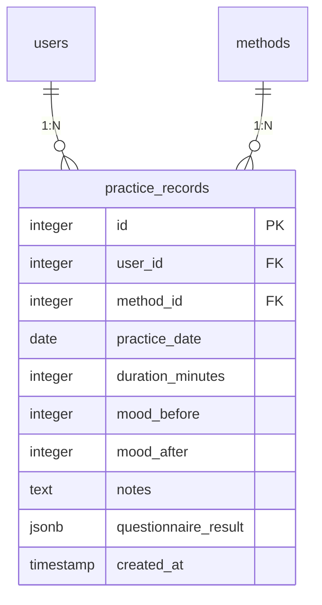
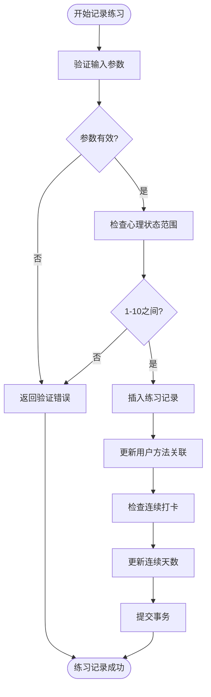
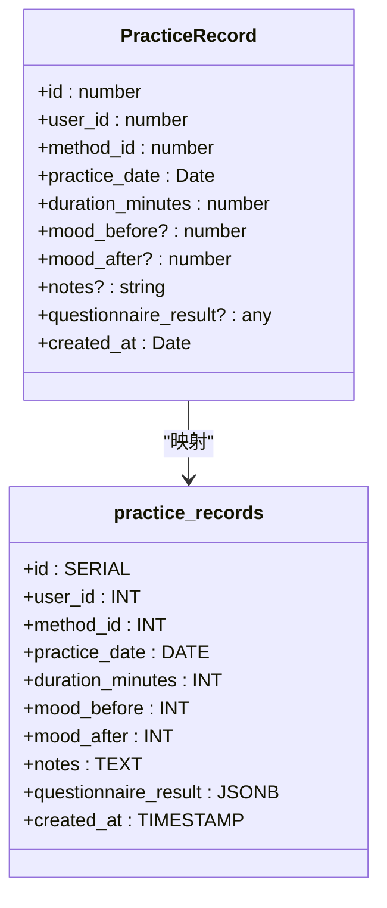
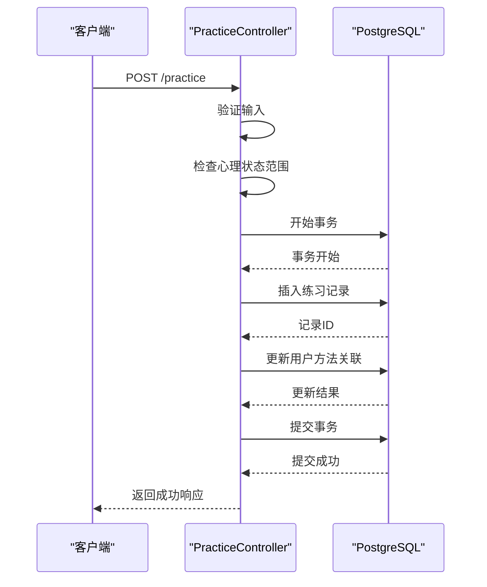

# 练习记录模型

<cite>
**本文档引用的文件**
- [init.sql](file://database/init.sql#L62-L78)
- [index.ts](file://backend/src/types/index.ts#L51-L63)
- [practice.controller.ts](file://backend/src/controllers/practice.controller.ts#L7-L98)
- [practice.routes.ts](file://backend/src/routes/practice.routes.ts#L1-L20)
- [practice_record_model.dart](file://flutter_app/lib/data/models/practice_record_model.dart#L1-L93)
- [practice_record.dart](file://flutter_app/lib/domain/entities/practice_record.dart#L1-L67)
</cite>

## 目录
1. [介绍](#介绍)
2. [核心组件](#核心组件)
3. [字段定义](#字段定义)
4. [约束条件与业务规则](#约束条件与业务规则)
5. [索引设计](#索引设计)
6. [ORM映射关系](#orm映射关系)
7. [示例数据](#示例数据)
8. [功能支持](#功能支持)

## 介绍
练习记录模型是nian后端系统的核心数据结构之一，用于存储用户的心理自助练习数据。该模型基于PostgreSQL的practice_records表和TypeScript的PracticeRecord接口，支持情绪改善分析和练习历史追踪功能。通过详细的字段定义、约束条件和索引设计，该模型确保了数据的完整性和查询效率。

**Section sources**
- [init.sql](file://database/init.sql#L62-L78)
- [index.ts](file://backend/src/types/index.ts#L51-L63)

## 核心组件
练习记录模型由两个主要部分组成：数据库表结构和TypeScript接口。数据库表practice_records定义了数据的存储格式，而TypeScript接口PracticeRecord则提供了类型安全的编程接口。这两个组件通过ORM映射关系紧密耦合，确保了前后端数据的一致性。



**Diagram sources**
- [init.sql](file://database/init.sql#L62-L78)
- [index.ts](file://backend/src/types/index.ts#L51-L63)

**Section sources**
- [init.sql](file://database/init.sql#L62-L78)
- [index.ts](file://backend/src/types/index.ts#L51-L63)

## 字段定义
练习记录模型包含以下字段：

- **id**: 唯一标识符，自增主键
- **user_id**: 用户ID，外键引用users表
- **method_id**: 方法ID，外键引用methods表
- **practice_date**: 练习日期，DATE类型
- **duration_minutes**: 练习时长（分钟），整数类型
- **mood_before**: 练习前心理状态，1-10分制
- **mood_after**: 练习后心理状态，1-10分制
- **notes**: 练习笔记，文本类型
- **questionnaire_result**: 问卷结果，JSONB类型
- **created_at**: 创建时间，TIMESTAMP类型，默认为当前时间

**Section sources**
- [init.sql](file://database/init.sql#L64-L74)
- [index.ts](file://backend/src/types/index.ts#L53-L63)

## 约束条件与业务规则
练习记录模型实施了严格的约束条件和业务规则：

1. **心理状态评分范围**: mood_before和mood_after字段使用CHECK约束，确保值在1-10之间
2. **非空约束**: user_id、method_id、practice_date和duration_minutes字段为NOT NULL
3. **外键约束**: user_id和method_id字段引用users和methods表，确保数据完整性
4. **默认值**: created_at字段默认为当前时间



**Diagram sources**
- [init.sql](file://database/init.sql#L69-L70)
- [practice.controller.ts](file://backend/src/controllers/practice.controller.ts#L27-L32)

**Section sources**
- [init.sql](file://database/init.sql#L69-L70)
- [practice.controller.ts](file://backend/src/controllers/practice.controller.ts#L27-L32)

## 索引设计
为了优化查询性能，练习记录表设计了多个复合索引：

- **用户-日期索引**: idx_practice_records_user_id_date (user_id, practice_date)，用于快速查询特定用户在特定日期范围内的练习记录
- **用户-方法索引**: idx_practice_records_user_id_method_id (user_id, method_id)，用于快速查询特定用户对特定方法的练习历史
- **创建时间索引**: idx_practice_records_created_at (created_at)，用于按创建时间排序的查询

这些索引设计支持了练习历史查询、统计分析等高频操作，显著提升了查询效率。

**Section sources**
- [init.sql](file://database/init.sql#L75-L78)

## ORM映射关系
练习记录模型在后端通过TypeScript接口与数据库表进行ORM映射。PracticeRecord接口定义了与practice_records表对应的字段和类型，确保了类型安全和数据一致性。



**Diagram sources**
- [index.ts](file://backend/src/types/index.ts#L51-L63)
- [init.sql](file://database/init.sql#L62-L78)

**Section sources**
- [index.ts](file://backend/src/types/index.ts#L51-L63)
- [init.sql](file://database/init.sql#L62-L78)

## 示例数据
以下是一个练习记录的示例数据：

```json
{
  "id": 1,
  "user_id": 1001,
  "method_id": 5,
  "practice_date": "2024-01-15",
  "duration_minutes": 15,
  "mood_before": 4,
  "mood_after": 7,
  "notes": "今天的练习感觉很好，深呼吸帮助我放松了很多。",
  "questionnaire_result": {
    "情绪评估": {
      "整体心情": 7,
      "压力水平": 3,
      "专注度": 8
    }
  },
  "created_at": "2024-01-15T08:30:00Z"
}
```

这个示例展示了用户1001使用方法5（深呼吸放松法）进行15分钟练习的记录。练习前心理状态为4分，练习后提升到7分，显示了3分的改善。问卷结果以JSONB格式存储了更详细的评估数据。

**Section sources**
- [practice.controller.ts](file://backend/src/controllers/practice.controller.ts#L40-L46)
- [practice_record_model.dart](file://flutter_app/lib/data/models/practice_record_model.dart#L19-L32)

## 功能支持
练习记录模型支持以下核心功能：

1. **情绪改善分析**: 通过比较mood_before和mood_after的差值，量化练习对用户心理状态的影响
2. **练习历史追踪**: 利用practice_date和created_at字段，构建用户完整的练习时间线
3. **统计分析**: 结合user_methods表，计算连续打卡天数、总练习时长等指标
4. **个性化推荐**: 基于用户对不同方法的练习效果，推荐最适合的练习方法

这些功能通过后端控制器和路由的配合实现，如practice.controller.ts中的createPracticeRecord和getPracticeHistory方法，以及practice.routes.ts中定义的API端点。



**Diagram sources**
- [practice.controller.ts](file://backend/src/controllers/practice.controller.ts#L7-L98)
- [practice.routes.ts](file://backend/src/routes/practice.routes.ts#L1-L20)

**Section sources**
- [practice.controller.ts](file://backend/src/controllers/practice.controller.ts#L7-L98)
- [practice.routes.ts](file://backend/src/routes/practice.routes.ts#L1-L20)