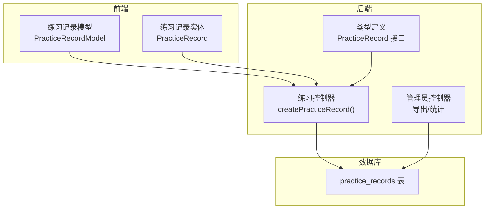
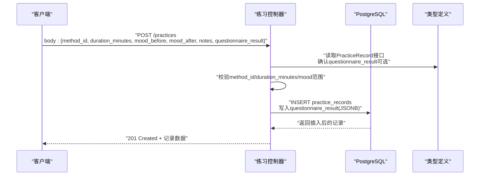
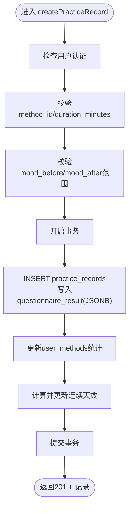
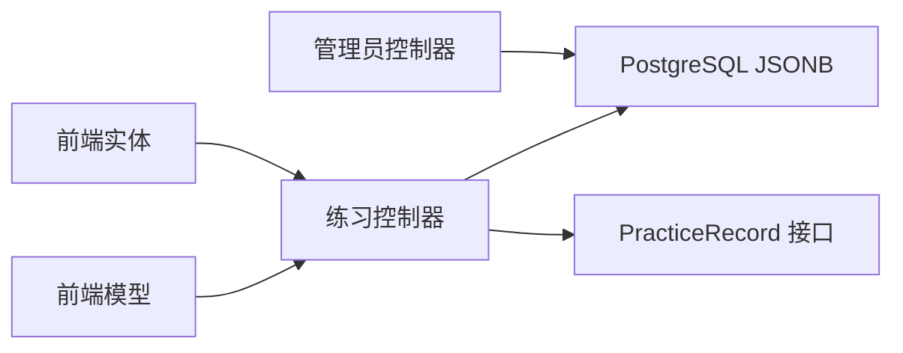

# 问卷结果结构

<cite>
**本文引用的文件**
- [init.sql](file://database/init.sql)
- [index.ts](file://backend/src/types/index.ts)
- [practice.controller.ts](file://backend/src/controllers/practice.controller.ts)
- [admin.controller.ts](file://backend/src/controllers/admin.controller.ts)
- [practice_record_model.dart](file://flutter_app/lib/data/models/practice_record_model.dart)
- [practice_record.dart](file://flutter_app/lib/domain/entities/practice_record.dart)
</cite>

## 目录
1. [引言](#引言)
2. [项目结构](#项目结构)
3. [核心组件](#核心组件)
4. [架构总览](#架构总览)
5. [详细组件分析](#详细组件分析)
6. [依赖关系分析](#依赖关系分析)
7. [性能考量](#性能考量)
8. [故障排查指南](#故障排查指南)
9. [结论](#结论)
10. [附录](#附录)

## 引言
本文件聚焦于nian后端系统中“练习记录”模型的问卷结果嵌套结构设计，围绕PostgreSQL的JSONB类型字段questionnaire_result与TypeScript接口PracticeRecord中的questionnaire_result属性展开。目标是：
- 解释该嵌套结构的设计目的：在练习前后收集用户完成的心理评估问卷数据，支持灵活的问卷模板与多类型问题（如量表评分、单选/多选、开放式文本）。
- 说明JSONB字段的优势：灵活的模式存储、高效的查询性能、对复杂嵌套数据的支持。
- 结合init.sql中的表结构定义与index.ts中的接口定义，说明在实际应用中如何进行序列化与反序列化。
- 提供具体JSON示例，展示包含多个问题的回答数据结构，并说明后端如何验证与处理这些数据。
- 探讨该设计对系统扩展性的影响，例如添加新的问卷模板或分析维度。

## 项目结构
后端采用Express + PostgreSQL架构，练习记录相关的核心位置如下：
- 数据库层：练习记录表practice_records包含JSONB字段questionnaire_result。
- 类型定义层：后端TypeScript接口PracticeRecord声明questionnaire_result为可选的任意类型。
- 控制器层：练习控制器负责接收请求、校验输入、写入数据库；管理员控制器负责数据导出与统计分析。
- 前端层：Flutter应用的练习记录模型与实体未直接包含questionnaire_result字段，但后端会返回该字段用于导出与分析。

图表来源
- [init.sql](file://database/init.sql#L62-L79)
- [index.ts](file://backend/src/types/index.ts#L51-L63)
- [practice.controller.ts](file://backend/src/controllers/practice.controller.ts#L1-L99)
- [admin.controller.ts](file://backend/src/controllers/admin.controller.ts#L700-L747)
- [practice_record_model.dart](file://flutter_app/lib/data/models/practice_record_model.dart#L1-L93)
- [practice_record.dart](file://flutter_app/lib/domain/entities/practice_record.dart#L1-L67)

章节来源
- [init.sql](file://database/init.sql#L62-L79)
- [index.ts](file://backend/src/types/index.ts#L51-L63)
- [practice.controller.ts](file://backend/src/controllers/practice.controller.ts#L1-L99)
- [admin.controller.ts](file://backend/src/controllers/admin.controller.ts#L700-L747)
- [practice_record_model.dart](file://flutter_app/lib/data/models/practice_record_model.dart#L1-L93)
- [practice_record.dart](file://flutter_app/lib/domain/entities/practice_record.dart#L1-L67)

## 核心组件
- 练习记录表practice_records
  - 字段：包含JSONB类型的questionnaire_result，用于存储问卷结果。
  - 索引：为用户与日期、用户与方法、创建时间等建立索引，提升查询效率。
- PracticeRecord接口
  - 属性：questionnaire_result?: any，表示该字段可选且类型为任意对象。
- 练习控制器
  - 职责：接收请求参数，进行基本校验（如method_id、duration_minutes），并将questionnaire_result原样写入数据库。
- 管理员控制器
  - 职责：提供数据导出接口，便于后台分析使用。

章节来源
- [init.sql](file://database/init.sql#L62-L79)
- [index.ts](file://backend/src/types/index.ts#L51-L63)
- [practice.controller.ts](file://backend/src/controllers/practice.controller.ts#L1-L99)
- [admin.controller.ts](file://backend/src/controllers/admin.controller.ts#L700-L747)

## 架构总览
下面的序列图展示了从客户端提交练习记录到后端持久化的流程，重点标注了questionnaire_result的处理路径。

图表来源
- [practice.controller.ts](file://backend/src/controllers/practice.controller.ts#L1-L99)
- [index.ts](file://backend/src/types/index.ts#L51-L63)
- [init.sql](file://database/init.sql#L62-L79)

## 详细组件分析

### 练习记录表与JSONB字段
- 字段定义
  - practice_records表包含JSONB字段questionnaire_result，允许存储任意结构的问卷结果。
- 索引策略
  - 为user_id+practice_date、user_id+method_id、created_at建立索引，有助于按用户与时间维度检索。
- 设计优势
  - 灵活：无需预定义固定字段，支持不同问卷模板与问题类型。
  - 高效：PostgreSQL对JSONB提供高效存储与查询能力，支持部分路径查询与聚合。
  - 可扩展：新增问卷维度或问题类型时，无需迁移数据库结构。

章节来源
- [init.sql](file://database/init.sql#L62-L79)

### PracticeRecord接口与questionnaire_result属性
- 接口位置：backend/src/types/index.ts
- 属性说明：questionnaire_result?: any，表明该字段可为空，类型为任意对象，便于与JSONB兼容。
- 使用建议：在业务逻辑中对questionnaire_result进行必要的校验与转换，确保后续分析可用。

章节来源
- [index.ts](file://backend/src/types/index.ts#L51-L63)

### 练习控制器：序列化与入库
- 请求处理
  - 从请求体提取method_id、duration_minutes、mood_before、mood_after、notes、questionnaire_result。
  - 对关键字段进行基础校验（如method_id与duration_minutes必填，mood范围1-10）。
- 数据入库
  - 将questionnaire_result作为JSONB原样写入数据库，保持其原始结构。
  - 同步更新user_methods与连续天数逻辑，保证练习统计一致性。

图表来源
- [practice.controller.ts](file://backend/src/controllers/practice.controller.ts#L1-L99)

章节来源
- [practice.controller.ts](file://backend/src/controllers/practice.controller.ts#L1-L99)

### 管理后台：数据导出与分析
- 数据导出
  - 管理员控制器提供导出练习记录接口，支持CSV/Excel/JSON格式，便于离线分析。
- 分析维度
  - 可基于questionnaire_result进行二次聚合与分析（例如按问题维度统计均值、分布等），但需在后端实现相应解析逻辑。

章节来源
- [admin.controller.ts](file://backend/src/controllers/admin.controller.ts#L700-L747)

### 前端交互与questionnaire_result
- 前端实体与模型
  - Flutter侧的练习记录实体与模型未直接包含questionnaire_result字段，但后端返回的练习记录会包含该字段，可用于导出与分析。
- 序列化/反序列化
  - 前端通常以JSON形式与后端交互，questionnaire_result作为普通键值对参与序列化与反序列化过程。

章节来源
- [practice_record_model.dart](file://flutter_app/lib/data/models/practice_record_model.dart#L1-L93)
- [practice_record.dart](file://flutter_app/lib/domain/entities/practice_record.dart#L1-L67)

## 依赖关系分析
- 组件耦合
  - 练习控制器依赖数据库连接池与类型定义，同时与practice_records表结构强相关。
  - 管理员控制器依赖练习记录表进行数据导出与统计。
- 外部依赖
  - PostgreSQL JSONB类型提供灵活存储与查询能力。
  - Express中间件与错误处理机制保障请求校验与异常处理。

图表来源
- [practice.controller.ts](file://backend/src/controllers/practice.controller.ts#L1-L99)
- [admin.controller.ts](file://backend/src/controllers/admin.controller.ts#L700-L747)
- [index.ts](file://backend/src/types/index.ts#L51-L63)
- [init.sql](file://database/init.sql#L62-L79)
- [practice_record_model.dart](file://flutter_app/lib/data/models/practice_record_model.dart#L1-L93)
- [practice_record.dart](file://flutter_app/lib/domain/entities/practice_record.dart#L1-L67)

## 性能考量
- JSONB存储与查询
  - PostgreSQL对JSONB提供高效存储与索引能力，适合存储非结构化或半结构化数据。
  - 对questionnaire_result的频繁查询建议在必要时引入GIN索引或物化视图，以优化分析性能。
- 写入性能
  - 练习记录写入为单条INSERT，JSONB原样写入，开销较低。
- 扩展性
  - 新增问卷模板或问题类型无需变更表结构，降低维护成本与停机风险。

## 故障排查指南
- 常见问题
  - 缺少必填字段：method_id与duration_minutes缺失会导致校验失败。
  - 心理状态评分越界：mood_before或mood_after不在1-10范围内会触发校验错误。
  - 权限不足：未认证用户无法创建练习记录。
- 排查步骤
  - 检查请求体是否包含method_id与duration_minutes。
  - 校验mood字段范围。
  - 确认用户已登录并携带有效令牌。
  - 查看数据库事务是否正常提交，必要时回滚并重试。

章节来源
- [practice.controller.ts](file://backend/src/controllers/practice.controller.ts#L1-L99)

## 结论
通过在练习记录表中引入JSONB类型的questionnaire_result字段，并在TypeScript接口中以可选的任意类型进行声明，nian系统实现了对心理评估问卷数据的灵活存储与高效查询。该设计具备以下优势：
- 灵活的问卷模板支持，无需迁移数据库结构即可扩展新问题类型。
- 高效的写入与查询能力，满足日常练习记录与后台分析需求。
- 清晰的职责边界：前端负责提交问卷结果，后端负责校验与持久化，管理员负责导出与统计。

## 附录

### JSONB字段设计目的与优势
- 设计目的
  - 存储用户在练习前后完成的心理评估问卷数据，覆盖量表评分、单选/多选、开放式文本等多种题型。
- 优势
  - 灵活的模式存储：无需预定义固定字段，支持动态问卷模板。
  - 高效查询：PostgreSQL对JSONB提供高效存储与部分路径查询能力。
  - 复杂嵌套支持：便于表达层级化的问题与答案结构。

章节来源
- [init.sql](file://database/init.sql#L62-L79)

### 实际应用中的序列化与反序列化
- 后端
  - 练习控制器直接将questionnaire_result作为JSONB写入数据库，保持原始结构。
  - 类型定义中questionnaire_result为可选的任意类型，便于与JSONB兼容。
- 前端
  - 练习记录模型与实体未直接包含questionnaire_result字段，但后端返回的记录会包含该字段，可用于导出与分析。

章节来源
- [practice.controller.ts](file://backend/src/controllers/practice.controller.ts#L1-L99)
- [index.ts](file://backend/src/types/index.ts#L51-L63)
- [practice_record_model.dart](file://flutter_app/lib/data/models/practice_record_model.dart#L1-L93)

### JSON示例（结构示意）
以下为问卷结果的典型结构示意（仅展示结构，不包含具体数据内容）：
- 包含多个问题的回答，支持：
  - 量表评分：如1-10分的主观评分。
  - 单选/多选：选项数组或布尔标记。
  - 开放式回答：字符串文本。
- 示例结构要点：
  - 顶层为问题集合，每个问题包含问题标识、问题类型、答案值等。
  - 支持嵌套：如分组问题或子问题。
  - 可扩展：新增问题类型或维度时无需变更数据库结构。

说明：由于仓库未提供具体示例数据，此处为结构示意，实际字段名称与结构以业务定义为准。

### 后端验证与处理
- 输入校验
  - method_id与duration_minutes必填。
  - mood_before与mood_after范围校验（1-10）。
- 数据处理
  - questionnaire_result原样写入JSONB字段。
  - 事务保证练习记录与统计更新的一致性。

章节来源
- [practice.controller.ts](file://backend/src/controllers/practice.controller.ts#L1-L99)

### 管理后台数据分析
- 数据导出
  - 支持CSV/Excel/JSON格式导出练习记录，便于离线分析。
- 分析维度
  - 可基于questionnaire_result进行二次聚合与分析（例如按问题维度统计均值、分布等），需在后端实现相应解析逻辑。

章节来源
- [admin.controller.ts](file://backend/src/controllers/admin.controller.ts#L700-L747)

### 扩展性影响
- 添加新的问卷模板或分析维度
  - 无需变更数据库结构，直接在questionnaire_result中扩展字段或新增问题类型。
  - 后端可在解析与导出环节适配新结构，保持向前兼容。