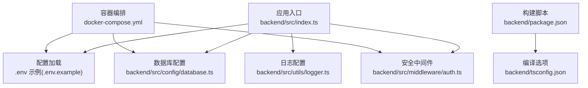
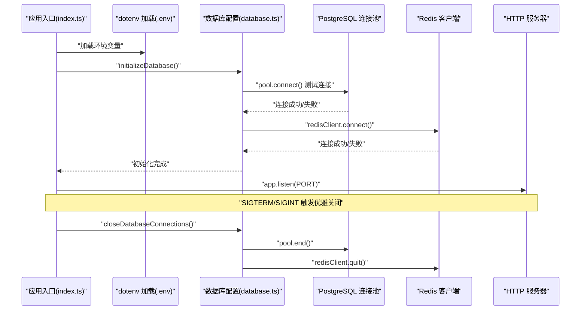
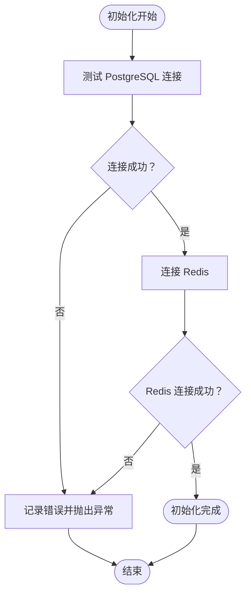
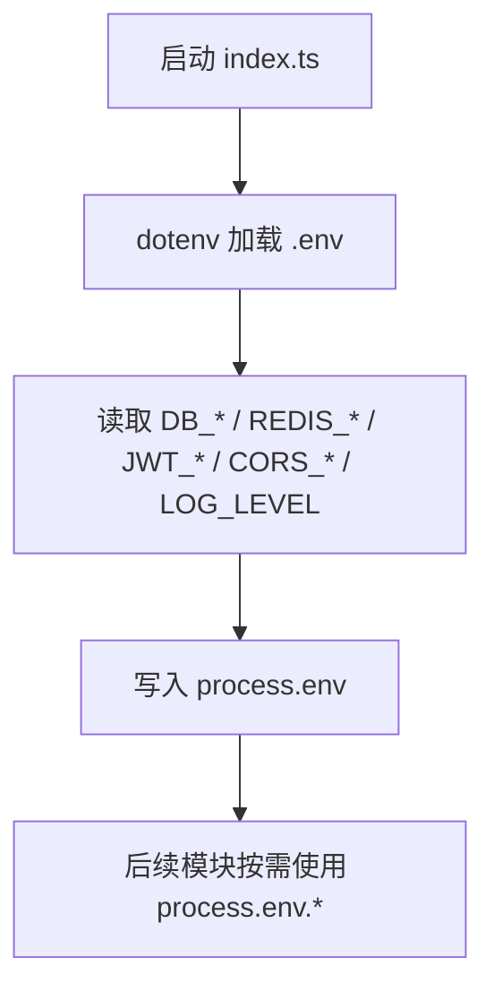
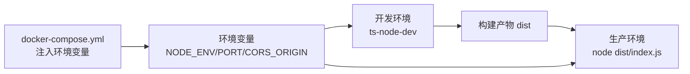
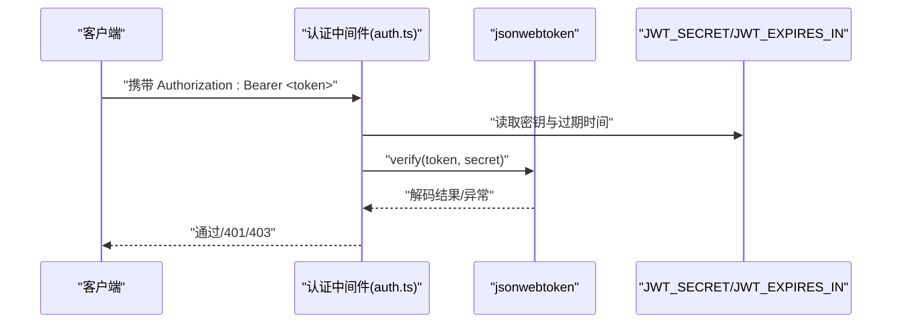
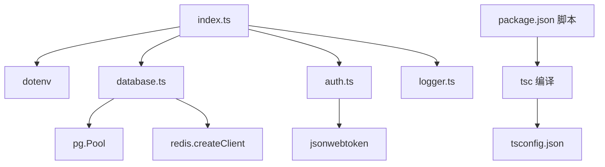

# 配置管理

<cite>
**本文引用的文件**
- [backend/src/config/database.ts](file://backend/src/config/database.ts)
- [backend/tsconfig.json](file://backend/tsconfig.json)
- [.env.example](file://.env.example)
- [backend/src/index.ts](file://backend/src/index.ts)
- [docker-compose.yml](file://docker-compose.yml)
- [backend/src/middleware/auth.ts](file://backend/src/middleware/auth.ts)
- [backend/package.json](file://backend/package.json)
- [backend/src/utils/logger.ts](file://backend/src/utils/logger.ts)
</cite>

## 目录
1. [简介](#简介)
2. [项目结构](#项目结构)
3. [核心组件](#核心组件)
4. [架构总览](#架构总览)
5. [详细组件分析](#详细组件分析)
6. [依赖关系分析](#依赖关系分析)
7. [性能考量](#性能考量)
8. [故障排查指南](#故障排查指南)
9. [结论](#结论)
10. [附录](#附录)

## 简介
本文件系统性梳理 nian 后端系统的配置管理策略，重点覆盖以下方面：
- database.ts 中 PostgreSQL 连接池的参数配置与初始化流程
- .env 环境变量文件的敏感信息读取方式（数据库连接串、JWT 密钥、Redis 配置等）
- tsconfig.json 的 TypeScript 编译选项及其对代码质量的影响
- 不同环境（开发、测试、生产）的配置切换方案
- 配置文件的安全最佳实践（敏感信息保护与配置验证）

## 项目结构
后端配置相关的关键位置如下：
- 配置入口：backend/src/config/database.ts
- 应用入口：backend/src/index.ts（加载 dotenv 并初始化数据库）
- 环境变量模板：.env.example
- 构建与运行：backend/package.json、docker-compose.yml
- 安全与日志：backend/src/middleware/auth.ts、backend/src/utils/logger.ts
- 编译配置：backend/tsconfig.json

图表来源
- [backend/src/index.ts](file://backend/src/index.ts#L1-L85)
- [.env.example](file://.env.example#L1-L61)
- [backend/src/config/database.ts](file://backend/src/config/database.ts#L1-L47)
- [backend/src/middleware/auth.ts](file://backend/src/middleware/auth.ts#L1-L87)
- [backend/src/utils/logger.ts](file://backend/src/utils/logger.ts#L1-L36)
- [backend/package.json](file://backend/package.json#L1-L55)
- [backend/tsconfig.json](file://backend/tsconfig.json#L1-L28)
- [docker-compose.yml](file://docker-compose.yml#L1-L241)

章节来源
- [backend/src/index.ts](file://backend/src/index.ts#L1-L85)
- [.env.example](file://.env.example#L1-L61)
- [backend/src/config/database.ts](file://backend/src/config/database.ts#L1-L47)
- [backend/package.json](file://backend/package.json#L1-L55)
- [docker-compose.yml](file://docker-compose.yml#L1-L241)

## 核心组件
- PostgreSQL 连接池与 Redis 客户端初始化
- 环境变量读取与默认值处理
- TypeScript 编译严格模式与输出控制
- 多环境配置切换与容器化部署

章节来源
- [backend/src/config/database.ts](file://backend/src/config/database.ts#L1-L47)
- [backend/src/index.ts](file://backend/src/index.ts#L1-L85)
- [backend/tsconfig.json](file://backend/tsconfig.json#L1-L28)
- [docker-compose.yml](file://docker-compose.yml#L1-L241)

## 架构总览
下图展示后端在启动阶段如何加载配置、建立数据库与缓存连接，并在优雅退出时释放资源。

图表来源
- [backend/src/index.ts](file://backend/src/index.ts#L1-L85)
- [backend/src/config/database.ts](file://backend/src/config/database.ts#L1-L47)

## 详细组件分析

### PostgreSQL 连接池配置与初始化
- 连接池参数
  - 最大连接数：在连接池构造函数中设置为固定值
  - 空闲超时：毫秒级空闲超时阈值
  - 连接超时：毫秒级连接超时阈值
- Redis 客户端
  - 通过 socket.host/port 进行连接
- 初始化流程
  - 先进行一次连接测试，再连接 Redis
  - 异常时记录错误并抛出
- 优雅关闭
  - 关闭连接池与 Redis 客户端，确保资源回收

图表来源
- [backend/src/config/database.ts](file://backend/src/config/database.ts#L1-L47)

章节来源
- [backend/src/config/database.ts](file://backend/src/config/database.ts#L1-L47)

### 环境变量与敏感信息读取
- .env.example 中定义了数据库、Redis、JWT、端口、CORS 等关键变量
- 应用入口通过 dotenv 加载 .env 文件，随后按需读取环境变量
- 关键敏感信息读取点：
  - 数据库连接：host、port、database、user、password
  - Redis 连接：host、port
  - JWT 密钥与过期时间：JWT_SECRET、JWT_EXPIRES_IN
  - CORS 来源：CORS_ORIGIN
  - 日志级别：LOG_LEVEL

图表来源
- [backend/src/index.ts](file://backend/src/index.ts#L1-L85)
- [.env.example](file://.env.example#L1-L61)

章节来源
- [backend/src/index.ts](file://backend/src/index.ts#L1-L85)
- [.env.example](file://.env.example#L1-L61)

### TypeScript 编译选项与代码质量
- 编译目标与模块：ES2020、CommonJS
- 严格模式：开启多项严格检查，减少隐式类型问题
- 输出与根目录：dist、src
- 资源映射：生成 declaration、declarationMap、sourceMap
- 包含/排除规则：包含 src 下全部文件，排除 node_modules、dist、测试文件

这些选项显著提升类型安全性、可维护性与调试体验。

章节来源
- [backend/tsconfig.json](file://backend/tsconfig.json#L1-L28)

### 多环境配置切换方案
- 环境变量驱动
  - NODE_ENV 控制运行环境（开发/测试/生产）
  - PORT 控制监听端口
  - CORS_ORIGIN 控制跨域来源
- 容器化部署
  - docker-compose.yml 将环境变量注入后端容器
  - 数据库与缓存服务通过健康检查保证可用性
- 开发/生产差异
  - 开发：使用 ts-node-dev 实时编译运行
  - 生产：先 tsc 构建，再 node dist/index.js 启动

图表来源
- [backend/package.json](file://backend/package.json#L1-L55)
- [docker-compose.yml](file://docker-compose.yml#L1-L241)

章节来源
- [backend/package.json](file://backend/package.json#L1-L55)
- [docker-compose.yml](file://docker-compose.yml#L1-L241)

### JWT 密钥与安全中间件
- JWT 密钥来源：process.env.JWT_SECRET
- 过期时间来源：process.env.JWT_EXPIRES_IN 或默认值
- 认证中间件：
  - 用户认证：校验 Bearer Token
  - 管理员认证：除校验 Token 外，还要求 isAdmin 标记
- 生成 Token：基于 payload 与密钥，支持自定义过期时间

图表来源
- [backend/src/middleware/auth.ts](file://backend/src/middleware/auth.ts#L1-L87)

章节来源
- [backend/src/middleware/auth.ts](file://backend/src/middleware/auth.ts#L1-L87)

### 日志与运行时配置
- 日志级别：process.env.LOG_LEVEL 控制（默认 info）
- 日志格式：JSON 结构化输出，便于采集与检索
- 服务器启动：读取 PORT，输出环境信息

章节来源
- [backend/src/utils/logger.ts](file://backend/src/utils/logger.ts#L1-L36)
- [backend/src/index.ts](file://backend/src/index.ts#L1-L85)

## 依赖关系分析
- 应用入口依赖 dotenv、数据库配置、错误处理与路由
- 数据库配置依赖 pg 连接池与 redis 客户端
- 安全中间件依赖 jsonwebtoken 与环境变量
- 构建脚本与编译配置共同决定产物质量与体积

图表来源
- [backend/src/index.ts](file://backend/src/index.ts#L1-L85)
- [backend/src/config/database.ts](file://backend/src/config/database.ts#L1-L47)
- [backend/src/middleware/auth.ts](file://backend/src/middleware/auth.ts#L1-L87)
- [backend/src/utils/logger.ts](file://backend/src/utils/logger.ts#L1-L36)
- [backend/package.json](file://backend/package.json#L1-L55)
- [backend/tsconfig.json](file://backend/tsconfig.json#L1-L28)

章节来源
- [backend/src/index.ts](file://backend/src/index.ts#L1-L85)
- [backend/src/config/database.ts](file://backend/src/config/database.ts#L1-L47)
- [backend/src/middleware/auth.ts](file://backend/src/middleware/auth.ts#L1-L87)
- [backend/src/utils/logger.ts](file://backend/src/utils/logger.ts#L1-L36)
- [backend/package.json](file://backend/package.json#L1-L55)
- [backend/tsconfig.json](file://backend/tsconfig.json#L1-L28)

## 性能考量
- 连接池大小与超时
  - 固定最大连接数，结合 idleTimeoutMillis 与 connectionTimeoutMillis，有助于避免资源泄露与连接堆积
  - 建议根据并发请求量与数据库承载能力调整最大连接数
- Redis 连接
  - 采用 socket 连接，建议在高并发场景下评估连接复用与重连策略
- 编译优化
  - 严格模式与声明文件生成提升类型检查效率，但会增加构建时间
  - 排除测试文件与 node_modules，减少编译范围

章节来源
- [backend/src/config/database.ts](file://backend/src/config/database.ts#L1-L47)
- [backend/tsconfig.json](file://backend/tsconfig.json#L1-L28)

## 故障排查指南
- 启动失败
  - 检查 .env 是否存在且字段完整（DB_HOST/DB_PORT/DB_NAME/DB_USER/DB_PASSWORD、REDIS_HOST/REDIS_PORT、JWT_SECRET、JWT_EXPIRES_IN、CORS_ORIGIN、PORT、NODE_ENV）
  - 查看健康检查与容器日志
- 数据库连接失败
  - 确认数据库服务健康、凭据正确、网络可达
  - 检查连接池参数是否合理
- Redis 连接失败
  - 确认 Redis 服务健康、端口开放、网络可达
- JWT 认证失败
  - 确认 JWT_SECRET 与签发方一致，过期时间未过期
- 日志级别与输出
  - 设置 LOG_LEVEL 控制日志粒度，JSON 格式便于采集

章节来源
- [backend/src/index.ts](file://backend/src/index.ts#L1-L85)
- [backend/src/config/database.ts](file://backend/src/config/database.ts#L1-L47)
- [backend/src/middleware/auth.ts](file://backend/src/middleware/auth.ts#L1-L87)
- [backend/src/utils/logger.ts](file://backend/src/utils/logger.ts#L1-L36)
- [docker-compose.yml](file://docker-compose.yml#L1-L241)

## 结论
nian 后端采用“环境变量驱动 + 容器化部署”的配置管理模式，具备清晰的启动与关闭流程、严格的 TypeScript 编译选项以及完善的日志与安全中间件。通过 .env.example 与 docker-compose.yml，可在不同环境中快速切换配置；建议进一步引入配置验证与密钥轮换机制，以增强安全性与可运维性。

## 附录

### PostgreSQL 连接池参数说明（来自 database.ts）
- 最大连接数：固定值
- 空闲超时：毫秒级
- 连接超时：毫秒级

章节来源
- [backend/src/config/database.ts](file://backend/src/config/database.ts#L1-L47)

### 环境变量清单（来自 .env.example）
- 数据库：DB_HOST、DB_PORT、DB_NAME、DB_USER、DB_PASSWORD
- Redis：REDIS_HOST、REDIS_PORT
- 后端：NODE_ENV、PORT、JWT_SECRET、JWT_EXPIRES_IN、CORS_ORIGIN
- 日志：LOG_LEVEL
- 文件上传：UPLOAD_PATH、MAX_FILE_SIZE

章节来源
- [.env.example](file://.env.example#L1-L61)

### TypeScript 编译选项要点（来自 tsconfig.json）
- 严格模式：noImplicitAny、strictNullChecks、strictFunctionTypes、noUnusedLocals、noUnusedParameters、noImplicitReturns、noFallthroughCasesInSwitch
- 输出与根目录：outDir、rootDir
- 资源映射：declaration、declarationMap、sourceMap
- 包含/排除：include/exclude

章节来源
- [backend/tsconfig.json](file://backend/tsconfig.json#L1-L28)

### 安全最佳实践建议
- 敏感信息加密
  - 使用密钥管理服务（KMS）或环境变量加密工具，避免明文存储
  - 对 .env 文件进行权限限制，仅允许运行用户访问
- 配置验证机制
  - 启动时对关键配置进行校验（如端口范围、JWT 密钥长度、数据库连接字符串格式）
  - 对缺失或非法配置直接终止启动，避免静默失败
- 密钥轮换
  - 定期轮换 JWT_SECRET，确保旧令牌在过期前被回收
  - 使用短期令牌与刷新令牌策略，降低泄露风险
- 网络与访问控制
  - 限制 CORS 来源，避免通配符在生产环境使用
  - 仅暴露必要端口，启用防火墙与 TLS