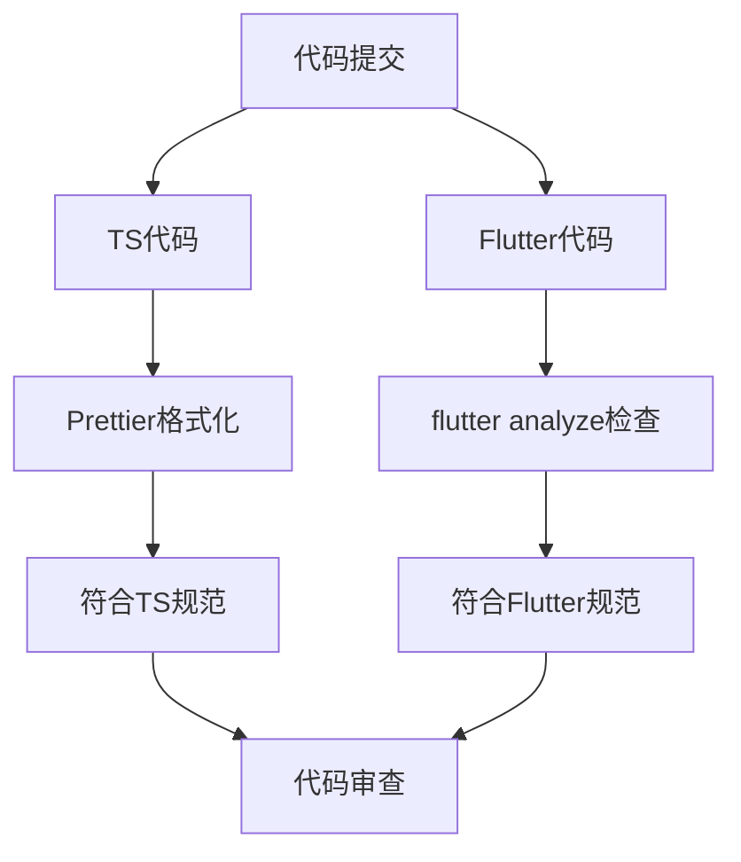
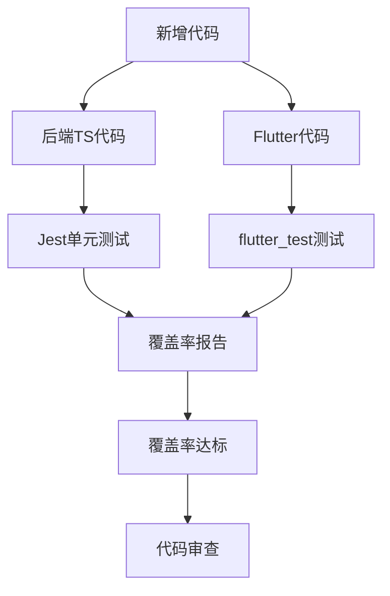
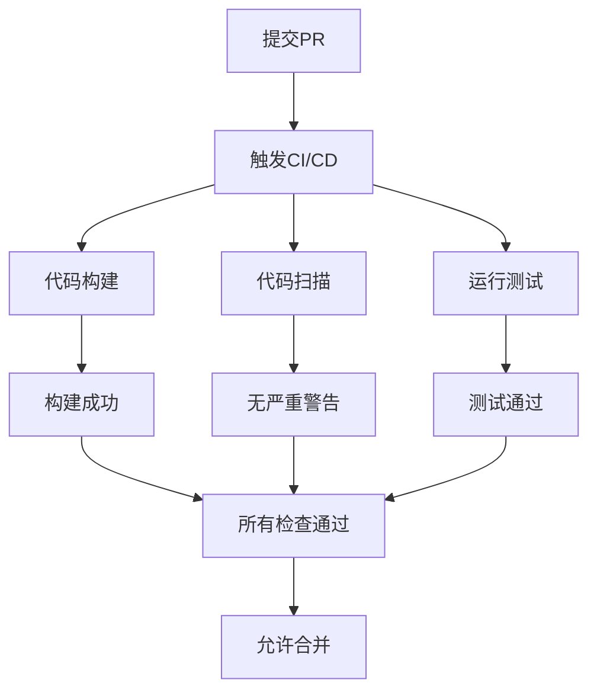

# 代码审查流程

<cite>
**本文档引用的文件**
- [README.md](file://README.md)
- [FLUTTER_DEVELOPMENT_GUIDE.md](file://FLUTTER_DEVELOPMENT_GUIDE.md)
- [FLUTTER_SETUP_GUIDE.md](file://FLUTTER_SETUP_GUIDE.md)
- [backend/TEST_GUIDE.md](file://backend/TEST_GUIDE.md)
- [FLUTTER_ARCHITECTURE.md](file://FLUTTER_ARCHITECTURE.md)
- [docs/DEPLOYMENT.md](file://docs/DEPLOYMENT.md)
- [flutter_app/pubspec.yaml](file://flutter_app/pubspec.yaml)
- [flutter_app/analysis_options.yaml](file://flutter_app/analysis_options.yaml)
- [backend/src/controllers/auth.controller.ts](file://backend/src/controllers/auth.controller.ts)
- [backend/src/middleware/auth.ts](file://backend/src/middleware/auth.ts)
- [flutter_app/lib/presentation/auth/pages/login_page.dart](file://flutter_app/lib/presentation/auth/pages/login_page.dart)
- [flutter_app/lib/domain/entities/user.dart](file://flutter_app/lib/domain/entities/user.dart)
- [docker-compose.yml](file://docker-compose.yml)
</cite>

## 目录
1. [Pull Request创建规范](#pull-request创建规范)
2. [代码评审必检项清单](#代码评审必检项清单)
3. [审查反馈处理流程](#审查反馈处理流程)
4. [自动化检查要求](#自动化检查要求)
5. [审查超时处理机制](#审查超时处理机制)
6. [紧急合并例外流程](#紧急合并例外流程)

## Pull Request创建规范

在提交Pull Request之前，开发者必须遵循以下规范确保代码变更的质量和可追溯性。

首先，每个Pull Request必须关联一个相关的issue，以确保所有代码变更都有明确的需求背景和问题描述。这有助于审查人员理解变更的目的和上下文。

PR描述必须使用标准模板填写，包括但不限于：变更目的、实现方案、影响范围、测试情况等关键信息。描述应清晰、完整，便于审查人员快速理解变更内容。

根据变更涉及的模块，必须标记相应的审查人员。例如，后端API变更应标记后端开发人员，Flutter界面变更应标记前端开发人员，架构或核心逻辑变更应标记技术负责人。

**Section sources**
- [README.md](file://README.md#L1-L130)
- [FLUTTER_DEVELOPMENT_GUIDE.md](file://FLUTTER_DEVELOPMENT_GUIDE.md#L1-L242)

## 代码评审必检项清单

### 功能实现正确性

审查人员必须验证代码变更是否正确实现了预期功能，包括业务逻辑的准确性、边界条件的处理、异常情况的应对等。功能测试必须覆盖正常流程和异常流程。

对于后端API变更，需验证接口的输入验证、业务逻辑处理、数据库操作和返回结果是否符合设计要求。对于Flutter应用变更，需验证用户界面交互、状态管理和数据流是否正确。

### 代码风格一致性

代码必须遵循项目规定的编码规范。TypeScript代码应遵循项目TS规范，包括命名约定、代码格式、类型定义等。Flutter代码应遵循项目Flutter规范，包括Dart语言风格、Widget构建方式、BLoC模式使用等。

TypeScript代码应使用Prettier进行格式化，确保代码风格统一。Flutter代码应遵循`analysis_options.yaml`中的lint规则，使用`flutter analyze`命令检查代码质量。

**Diagram sources**
- [FLUTTER_DEVELOPMENT_GUIDE.md](file://FLUTTER_DEVELOPMENT_GUIDE.md#L1-L242)
- [flutter_app/analysis_options.yaml](file://flutter_app/analysis_options.yaml#L1-L29)

### 测试覆盖率

所有新增代码必须包含相应的单元测试，确保测试覆盖率达标。后端TypeScript代码的测试覆盖率要求为：语句覆盖率>80%，分支覆盖率>75%，函数覆盖率>80%，行覆盖率>80%。

测试应使用Jest和Supertest框架编写，覆盖正常情况、边界条件和异常情况。测试用例应具有明确的描述，便于理解测试目的。

Flutter代码的测试应使用`flutter_test`包，包括单元测试和widget测试。BLoC状态管理的测试应使用`bloc_test`包，确保状态转换的正确性。

**Diagram sources**
- [backend/TEST_GUIDE.md](file://backend/TEST_GUIDE.md#L1-L283)
- [flutter_app/pubspec.yaml](file://flutter_app/pubspec.yaml#L1-L111)

### 文档更新

代码变更必须同步更新相关文档，确保文档与代码保持一致。需要更新的文档包括API文档、README文件、配置说明等。

API变更必须更新API文档，包括新增接口、修改接口参数、变更返回结构等。配置变更必须更新相关配置说明文档，确保部署和使用人员能够正确配置。

### 安全性检查

代码必须经过安全性检查，确保无敏感信息泄露和完整的输入验证。环境变量、密钥等敏感信息不得硬编码在代码中，应通过环境变量或配置文件管理。

所有用户输入必须进行验证和清理，防止注入攻击等安全漏洞。认证和授权逻辑必须正确实现，确保系统安全。

**Section sources**
- [backend/TEST_GUIDE.md](file://backend/TEST_GUIDE.md#L1-L283)
- [docs/DEPLOYMENT.md](file://docs/DEPLOYMENT.md#L1-L140)
- [backend/src/controllers/auth.controller.ts](file://backend/src/controllers/auth.controller.ts#L1-L150)
- [backend/src/middleware/auth.ts](file://backend/src/middleware/auth.ts#L1-L87)

## 审查反馈处理流程

审查人员在代码审查过程中发现的问题，应通过PR评论的方式提出反馈。反馈应具体、明确，指出问题所在并提供改进建议。

开发者收到审查反馈后，应及时回应评论，说明将如何修改或解释代码设计。对于同意修改的问题，应在代码中进行相应调整；对于有异议的问题，应提供充分的理由进行讨论。

当所有审查意见都得到妥善处理后，审查人员可以批准PR。开发者在收到批准后，可以进行合并操作。如果审查人员要求重新审查，开发者在修改后应请求重新审查。

**Section sources**
- [README.md](file://README.md#L1-L130)
- [FLUTTER_DEVELOPMENT_GUIDE.md](file://FLUTTER_DEVELOPMENT_GUIDE.md#L1-L242)

## 自动化检查要求

在合并PR之前，所有自动化检查必须通过。这包括CI构建、代码扫描、测试覆盖率检查等。

CI/CD流程会自动运行测试并生成覆盖率报告。只有当所有测试通过且覆盖率达标时，才能进行合并。自动化检查结果会在PR页面显示，开发者和审查人员可以查看详细报告。

**Diagram sources**
- [backend/TEST_GUIDE.md](file://backend/TEST_GUIDE.md#L236-L252)
- [docker-compose.yml](file://docker-compose.yml#L1-L241)

## 审查超时处理机制

为了确保代码审查的及时性，项目设定了审查超时处理机制。普通PR的审查应在48小时内完成，重要PR的审查应在24小时内完成。

如果在规定时间内未收到审查反馈，开发者可以提醒审查人员。如果多次提醒后仍未得到响应，可以寻求技术负责人或其他团队成员的帮助。

审查超时不应成为阻碍项目进度的因素，团队成员应优先处理代码审查任务，确保代码变更能够及时集成。

**Section sources**
- [README.md](file://README.md#L1-L130)
- [FLUTTER_DEVELOPMENT_GUIDE.md](file://FLUTTER_DEVELOPMENT_GUIDE.md#L1-L242)

## 紧急合并例外流程

在特殊情况下，如生产环境紧急修复，可以执行紧急合并例外流程。紧急合并必须满足以下条件之一：严重安全漏洞、导致系统不可用的bug、影响核心功能的重大问题。

执行紧急合并时，必须至少获得一位核心开发人员的口头或即时消息批准，并在合并后立即通知团队。紧急合并的代码必须在24小时内补全代码审查流程，包括补充测试和文档。

紧急合并应作为例外情况，不应成为常规操作。团队应分析紧急情况的原因，改进开发和部署流程，减少紧急合并的发生。

**Section sources**
- [README.md](file://README.md#L1-L130)
- [docs/DEPLOYMENT.md](file://docs/DEPLOYMENT.md#L1-L140)