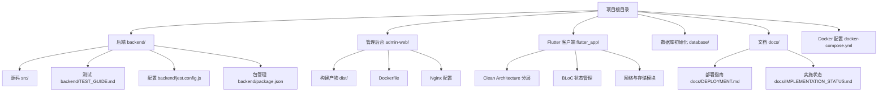
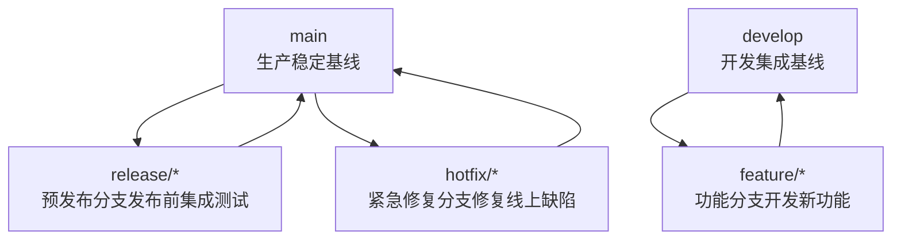
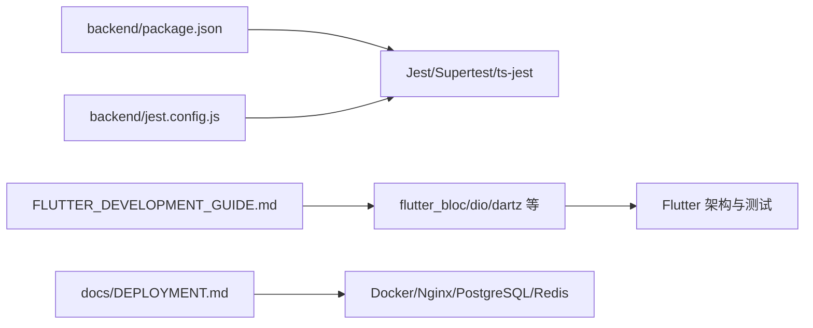

# 分支管理

<cite>
**本文引用的文件**
- [README.md](file://README.md)
- [docs/DEPLOYMENT.md](file://docs/DEPLOYMENT.md)
- [docs/IMPLEMENTATION_STATUS.md](file://docs/IMPLEMENTATION_STATUS.md)
- [backend/TEST_GUIDE.md](file://backend/TEST_GUIDE.md)
- [backend/jest.config.js](file://backend/jest.config.js)
- [backend/package.json](file://backend/package.json)
- [FLUTTER_DEVELOPMENT_GUIDE.md](file://FLUTTER_DEVELOPMENT_GUIDE.md)
- [FLUTTER_ARCHITECTURE.md](file://FLUTTER_ARCHITECTURE.md)
</cite>

## 目录
1. [简介](#简介)
2. [项目结构](#项目结构)
3. [核心组件](#核心组件)
4. [架构总览](#架构总览)
5. [详细组件分析](#详细组件分析)
6. [依赖分析](#依赖分析)
7. [性能考虑](#性能考虑)
8. [故障排查指南](#故障排查指南)
9. [结论](#结论)
10. [附录](#附录)

## 简介
本文件围绕基于 Git Flow 的分支管理策略进行系统化说明，结合项目实际，明确主分支（main）作为生产环境稳定基线、预发布分支（release）用于版本发布前的集成测试、功能分支（feature/*）用于开发新功能、修复分支（hotfix/*）用于紧急缺陷修复的职责与协作流程。同时给出创建与合并分支的命令路径指引、生命周期与命名规范、代码同步机制，以及在合并前必须通过 CI/CD 流水线的构建与测试要求，并提供常见问题的解决方案，如分支冲突处理与过期分支清理。

## 项目结构
项目由多模块构成，包括后端 API、管理后台、Flutter 客户端、数据库初始化脚本与文档。整体采用 Docker 一键部署，便于在本地快速验证与集成测试。

图表来源
- [README.md](file://README.md#L58-L69)
- [docs/DEPLOYMENT.md](file://docs/DEPLOYMENT.md#L1-L60)
- [docs/IMPLEMENTATION_STATUS.md](file://docs/IMPLEMENTATION_STATUS.md#L1-L20)
- [FLUTTER_ARCHITECTURE.md](file://FLUTTER_ARCHITECTURE.md#L1-L40)

章节来源
- [README.md](file://README.md#L58-L69)
- [docs/DEPLOYMENT.md](file://docs/DEPLOYMENT.md#L1-L60)
- [docs/IMPLEMENTATION_STATUS.md](file://docs/IMPLEMENTATION_STATUS.md#L1-L20)

## 核心组件
- 后端 API：提供用户认证、方法管理、练习记录、管理员功能等接口，使用 TypeScript + Express，具备测试与覆盖率配置。
- 管理后台：React + Ant Design + Vite，提供方法管理、内容审核、统计与导出等功能。
- Flutter 客户端：采用 Clean Architecture + BLoC，支持多平台（Android/iOS/Web/macOS/Windows），包含认证、方法、练习、个人中心等模块。
- 部署与运维：Docker 一键部署，支持健康检查与日志查看；提供 HTTPS 配置与备份恢复指引。
- 测试与质量：Jest + Supertest + ts-jest，覆盖语句、分支、函数、行覆盖率目标；建议纳入 CI/CD 流水线。

章节来源
- [backend/package.json](file://backend/package.json#L1-L55)
- [backend/TEST_GUIDE.md](file://backend/TEST_GUIDE.md#L1-L60)
- [FLUTTER_ARCHITECTURE.md](file://FLUTTER_ARCHITECTURE.md#L1-L40)
- [docs/DEPLOYMENT.md](file://docs/DEPLOYMENT.md#L1-L60)

## 架构总览
下图展示 Git Flow 在本项目中的落地方式：以 main 为生产稳定基线，develop 作为集成基线，feature/* 从 develop 拆分开发，hotfix/* 从 main 修复紧急缺陷，release/* 用于发布前的最终集成测试与校验。

图表来源
- [backend/TEST_GUIDE.md](file://backend/TEST_GUIDE.md#L236-L254)
- [docs/IMPLEMENTATION_STATUS.md](file://docs/IMPLEMENTATION_STATUS.md#L1-L20)

## 详细组件分析

### Git Flow 分支策略与生命周期
- 主分支（main）
  - 职责：承载生产环境的稳定基线，仅接收来自 release/* 与 hotfix/* 的合并。
  - 合并时机：发布版本后，通过标签标记并保持只读。
- 预发布分支（release/*）
  - 职责：在发布前进行最终集成测试、回归测试与质量门禁，确保版本稳定性。
  - 合并时机：测试通过后合并回 main 并打标签，同时合并回 develop 以同步补丁。
- 功能分支（feature/*）
  - 职责：日常开发新功能，从 develop 拆分，开发完成后合并回 develop。
  - 命名规范：feature/<功能简述>，例如 feature/user-authentication。
- 修复分支（hotfix/*）
  - 职责：紧急修复线上缺陷，从 main 拆分，修复后合并回 main 并打标签，同时合并回 develop。

章节来源
- [backend/TEST_GUIDE.md](file://backend/TEST_GUIDE.md#L236-L254)

### 分支创建与合并命令路径
- 创建功能分支
  - 从 develop 拆分：git checkout -b feature/<功能简述>
  - 示例路径：[创建功能分支命令参考](file://backend/TEST_GUIDE.md#L236-L254)
- 合并到 develop
  - 在本地完成开发后：git checkout develop && git merge feature/<功能简述>
  - 示例路径：[合并到 develop 命令参考](file://backend/TEST_GUIDE.md#L236-L254)
- 预发布与发布
  - 从 develop 创建 release/*：git checkout -b release/<版本号>
  - 测试通过后合并回 main 并打标签：git checkout main && git merge release/<版本号> && git tag v<版本号>
  - 同时合并回 develop：git checkout develop && git merge release/<版本号>
  - 示例路径：[预发布与发布流程参考](file://backend/TEST_GUIDE.md#L236-L254)
- 紧急修复
  - 从 main 创建 hotfix/*：git checkout -b hotfix/<问题简述>
  - 修复后合并回 main 并打标签：git checkout main && git merge hotfix/<问题简述> && git tag v<版本号>.patch
  - 同时合并回 develop：git checkout develop && git merge hotfix/<问题简述>
  - 示例路径：[紧急修复流程参考](file://backend/TEST_GUIDE.md#L236-L254)

章节来源
- [backend/TEST_GUIDE.md](file://backend/TEST_GUIDE.md#L236-L254)

### 命名规范与代码同步机制
- 命名规范
  - feature/*：用于新功能开发
  - release/<版本号>：用于发布前集成测试
  - hotfix/*：用于紧急缺陷修复
- 代码同步
  - develop 作为集成基线，定期与 main 对齐，避免长期偏离。
  - feature/* 在开发过程中定期 rebase develop，减少合并冲突。
  - release/* 仅允许最小化变更，聚焦测试与修复。
  - hotfix/* 严格限定修复范围，避免引入新功能。

章节来源
- [backend/TEST_GUIDE.md](file://backend/TEST_GUIDE.md#L236-L254)

### 合并前的 CI/CD 要求
- 后端测试
  - 使用 Jest + Supertest 进行单元与集成测试，覆盖率目标：语句、分支、函数、行均高于阈值。
  - 建议在 CI/CD 中自动执行测试与覆盖率报告生成。
  - 示例路径：[测试运行与覆盖率配置](file://backend/TEST_GUIDE.md#L44-L70)，[Jest 配置](file://backend/jest.config.js#L1-L37)，[测试脚本](file://backend/package.json#L6-L13)
- Flutter 开发规范
  - 采用 Clean Architecture + BLoC，建议在 CI/CD 中加入代码检查、单元测试与构建任务。
  - 示例路径：[Flutter 开发规范](file://FLUTTER_DEVELOPMENT_GUIDE.md#L1-L60)，[Flutter 架构设计](file://FLUTTER_ARCHITECTURE.md#L1-L40)
- 部署与验证
  - Docker 一键部署，建议在 CI/CD 中执行健康检查与日志采集，确保服务可用性。
  - 示例路径：[Docker 部署与健康检查](file://docs/DEPLOYMENT.md#L1-L60)

章节来源
- [backend/TEST_GUIDE.md](file://backend/TEST_GUIDE.md#L44-L70)
- [backend/jest.config.js](file://backend/jest.config.js#L1-L37)
- [backend/package.json](file://backend/package.json#L6-L13)
- [FLUTTER_DEVELOPMENT_GUIDE.md](file://FLUTTER_DEVELOPMENT_GUIDE.md#L1-L60)
- [FLUTTER_ARCHITECTURE.md](file://FLUTTER_ARCHITECTURE.md#L1-L40)
- [docs/DEPLOYMENT.md](file://docs/DEPLOYMENT.md#L1-L60)

### 分支冲突处理与过期分支清理
- 分支冲突处理
  - 在 feature/* 开发过程中定期 rebase develop，减少冲突规模。
  - 若出现冲突，优先解决冲突后再提交，必要时与团队沟通协调。
  - 示例路径：[rebase 与合并参考](file://backend/TEST_GUIDE.md#L236-L254)
- 过期分支清理
  - release/* 与 hotfix/* 在合并后及时删除，避免分支冗余。
  - feature/* 在合并后保留短期以便追溯，超过一定周期未活动的分支应清理。
  - 示例路径：[分支合并与删除参考](file://backend/TEST_GUIDE.md#L236-L254)

章节来源
- [backend/TEST_GUIDE.md](file://backend/TEST_GUIDE.md#L236-L254)

## 依赖分析
- 后端测试依赖
  - Jest、ts-jest、Supertest、TypeScript 编译器与类型声明。
  - 示例路径：[依赖与脚本](file://backend/package.json#L1-L55)
- Flutter 依赖
  - flutter_bloc、dio、dartz、flutter_secure_storage、shared_preferences 等。
  - 示例路径：[Flutter 依赖配置](file://FLUTTER_DEVELOPMENT_GUIDE.md#L196-L207)
- 部署与运维
  - Docker Compose、Nginx、PostgreSQL、Redis 等服务。
  - 示例路径：[Docker 部署](file://docs/DEPLOYMENT.md#L1-L60)

图表来源
- [backend/package.json](file://backend/package.json#L1-L55)
- [backend/jest.config.js](file://backend/jest.config.js#L1-L37)
- [FLUTTER_DEVELOPMENT_GUIDE.md](file://FLUTTER_DEVELOPMENT_GUIDE.md#L196-L207)
- [docs/DEPLOYMENT.md](file://docs/DEPLOYMENT.md#L1-L60)

章节来源
- [backend/package.json](file://backend/package.json#L1-L55)
- [backend/jest.config.js](file://backend/jest.config.js#L1-L37)
- [FLUTTER_DEVELOPMENT_GUIDE.md](file://FLUTTER_DEVELOPMENT_GUIDE.md#L196-L207)
- [docs/DEPLOYMENT.md](file://docs/DEPLOYMENT.md#L1-L60)

## 性能考虑
- 分支粒度与频率
  - 功能分支应尽量小而聚焦，减少长周期分支带来的同步成本与冲突风险。
- 测试效率
  - 在 CI/CD 中并行执行测试与构建任务，缩短反馈周期。
- 部署效率
  - 使用 Docker 一键部署，减少环境差异导致的性能波动。

## 故障排查指南
- 测试相关
  - 测试超时：可在测试配置中调整超时时间。
  - 数据库连接问题：确认测试数据库服务状态与配置。
  - 端口占用：更换端口或停止占用服务。
  - 示例路径：[测试故障排查](file://backend/TEST_GUIDE.md#L254-L276)
- 部署相关
  - 健康检查失败：等待服务初始化完成或查看容器日志。
  - HTTPS 配置：按部署指南启用证书。
  - 示例路径：[部署故障排查](file://docs/DEPLOYMENT.md#L120-L140)

章节来源
- [backend/TEST_GUIDE.md](file://backend/TEST_GUIDE.md#L254-L276)
- [docs/DEPLOYMENT.md](file://docs/DEPLOYMENT.md#L120-L140)

## 结论
本项目采用 Git Flow 作为分支管理基础，明确 main、develop、feature/*、release/*、hotfix/* 的职责与生命周期，配合 CI/CD 流水线的测试与构建，确保每次合并都经过充分的质量门禁。通过规范的命名与同步机制，降低冲突概率，提升协作效率。建议在团队内持续推广该策略，并结合项目实际不断优化流程与工具链。

## 附录
- 快速参考
  - 创建功能分支：git checkout -b feature/<功能简述>
  - 合并到 develop：git checkout develop && git merge feature/<功能简述>
  - 预发布与发布：git checkout -b release/<版本号> ... 合并回 main 并打标签
  - 紧急修复：git checkout -b hotfix/<问题简述> ... 合并回 main 并打标签
  - 示例路径：[命令参考](file://backend/TEST_GUIDE.md#L236-L254)

章节来源
- [backend/TEST_GUIDE.md](file://backend/TEST_GUIDE.md#L236-L254)