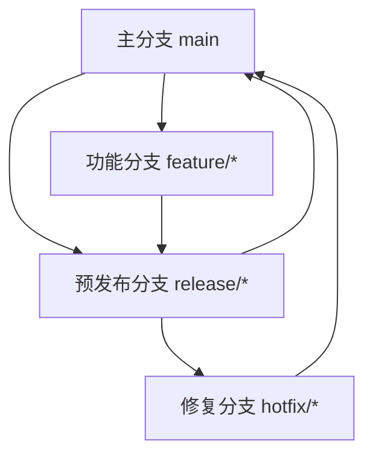

# 协作流程

<cite>
**本文档引用的文件**  
- [README.md](file://README.md)
- [docker-compose.yml](file://docker-compose.yml)
- [backend/TEST_GUIDE.md](file://backend/TEST_GUIDE.md)
- [backend/package.json](file://backend/package.json)
- [backend/tsconfig.json](file://backend/tsconfig.json)
- [backend/jest.config.js](file://backend/jest.config.js)
- [flutter_app/README.md](file://flutter_app/README.md)
- [flutter_app/pubspec.yaml](file://flutter_app/pubspec.yaml)
- [FLUTTER_DEVELOPMENT_GUIDE.md](file://FLUTTER_DEVELOPMENT_GUIDE.md)
- [FLUTTER_ARCHITECTURE.md](file://FLUTTER_ARCHITECTURE.md)
- [FLUTTER_SETUP_GUIDE.md](file://FLUTTER_SETUP_GUIDE.md)
- [docs/DEPLOYMENT.md](file://docs/DEPLOYMENT.md)
</cite>

## 目录
1. [简介](#简介)
2. [Git分支管理策略](#git分支管理策略)
3. [Pull Request审查流程](#pull-request审查流程)
4. [提交信息规范](#提交信息规范)
5. [本地开发环境搭建](#本地开发环境搭建)
6. [跨团队沟通与冲突解决](#跨团队沟通与冲突解决)

## 简介
本项目为全平台心理自助应用系统，采用多技术栈架构，包含Node.js后端、React管理后台和Flutter移动端应用。项目已实现完整的CI/CD流程，支持Docker一键部署。本文档定义了团队协作开发的标准流程，涵盖分支管理、代码审查、提交规范、环境配置及团队协作机制，确保开发过程高效、规范且可追溯。

## Git分支管理策略

项目采用Git Flow分支模型，确保代码质量和发布稳定性。所有开发必须基于功能分支进行，禁止直接在主分支上提交代码。



**Diagram sources**
- [README.md](file://README.md#L1-L130)

### 主分支（main）
主分支代表生产环境的稳定代码，仅允许通过合并预发布分支或修复分支的方式更新。每次合并到主分支将触发自动化部署流程。

**Section sources**
- [README.md](file://README.md#L1-L130)

### 预发布分支（release/*）
当功能开发完成并准备发布时，从主分支创建预发布分支。此分支用于最终测试和bug修复，不再添加新功能。

**Section sources**
- [README.md](file://README.md#L1-L130)

### 功能分支（feature/*）
所有新功能开发必须创建功能分支，命名格式为`feature/功能描述`。开发完成后，通过Pull Request合并到主分支。

**Section sources**
- [README.md](file://README.md#L1-L130)

### 修复分支（hotfix/*）
当生产环境发现紧急bug时，从主分支创建修复分支，命名格式为`hotfix/问题描述`。修复完成后，同时合并到主分支和预发布分支。

**Section sources**
- [README.md](file://README.md#L1-L130)

## Pull Request审查流程

所有代码变更必须通过Pull Request（PR）进行审查，确保代码质量和团队知识共享。

### 代码评审要点
- 代码是否符合项目架构和设计模式
- 是否存在重复代码或可复用的组件
- 错误处理是否完善
- 性能考虑是否充分
- 是否遵循命名和代码风格规范

### 必检项清单
- [x] 测试覆盖：新增功能必须包含单元测试和集成测试
- [x] 文档更新：API文档、README和相关技术文档已同步更新
- [x] 安全性：无敏感信息泄露，输入验证完整
- [x] 代码风格：符合ESLint/Dart分析规则
- [x] 构建通过：CI/CD流水线全部通过

### 合并条件
PR必须满足以下条件方可合并：
1. 至少两名团队成员批准
2. 所有自动化测试通过
3. 代码覆盖率达标（后端>80%，Flutter>75%）
4. 无严重代码质量问题
5. 相关文档已更新

**Section sources**
- [backend/TEST_GUIDE.md](file://backend/TEST_GUIDE.md#L1-L283)
- [FLUTTER_DEVELOPMENT_GUIDE.md](file://FLUTTER_DEVELOPMENT_GUIDE.md#L1-L242)

## 提交信息规范

项目采用Conventional Commits规范，支持自动化版本发布和变更日志生成。

### 提交格式
```
<类型>(<范围>): <描述>

<正文>

<脚注>
```

### 类型定义
- **feat**: 新功能
- **fix**: bug修复
- **docs**: 文档更新
- **style**: 代码格式调整
- **refactor**: 代码重构
- **test**: 测试相关
- **chore**: 构建过程或辅助工具变动

### 示例
```
feat(user): 添加用户注册功能

实现邮箱密码注册流程，包含表单验证和错误提示
- 添加注册API接口
- 实现前端注册页面
- 编写相关测试用例

Closes #123
```

**Section sources**
- [backend/package.json](file://backend/package.json#L1-L55)
- [flutter_app/pubspec.yaml](file://flutter_app/pubspec.yaml#L1-L111)

## 本地开发环境搭建

为确保所有成员环境一致性，项目提供完整的Docker化开发环境。

### 环境准备步骤
1. 克隆项目仓库
2. 复制环境变量模板：`cp .env.example .env`
3. 编辑`.env`文件，设置`POSTGRES_PASSWORD`和`JWT_SECRET`
4. 启动服务：`docker-compose up -d`

### 服务地址
| 服务 | 地址 |
|------|------|
| 后端API | http://localhost:3000 |
| 管理后台 | http://localhost:8080 |

### 平台特定配置
- **Windows用户**: 需开启开发者模式
- **macOS用户**: 需安装Xcode命令行工具
- **Linux用户**: 需安装桌面开发依赖


**Diagram sources**
- [docker-compose.yml](file://docker-compose.yml#L1-L241)
- [docs/DEPLOYMENT.md](file://docs/DEPLOYMENT.md#L1-L140)

**Section sources**
- [README.md](file://README.md#L1-L130)
- [docker-compose.yml](file://docker-compose.yml#L1-L241)

## 跨团队沟通与冲突解决

项目涉及多个技术栈和功能模块，建立有效的沟通机制至关重要。

### 沟通机制
- **每日站会**: 同步开发进度和阻塞问题
- **代码审查**: 通过PR进行技术讨论和知识传递
- **文档驱动**: 重大决策和架构变更必须文档化
- **定期回顾**: 每周进行开发流程回顾和优化

### 冲突解决建议
1. **技术分歧**: 通过原型验证和数据支持决策
2. **优先级冲突**: 由产品经理协调，基于用户价值排序
3. **代码风格争议**: 遵循项目既定规范，必要时更新规范文档
4. **资源竞争**: 透明化工作负载，合理分配开发资源

**Section sources**
- [README.md](file://README.md#L1-L130)
- [FLUTTER_ARCHITECTURE.md](file://FLUTTER_ARCHITECTURE.md#L1-L143)