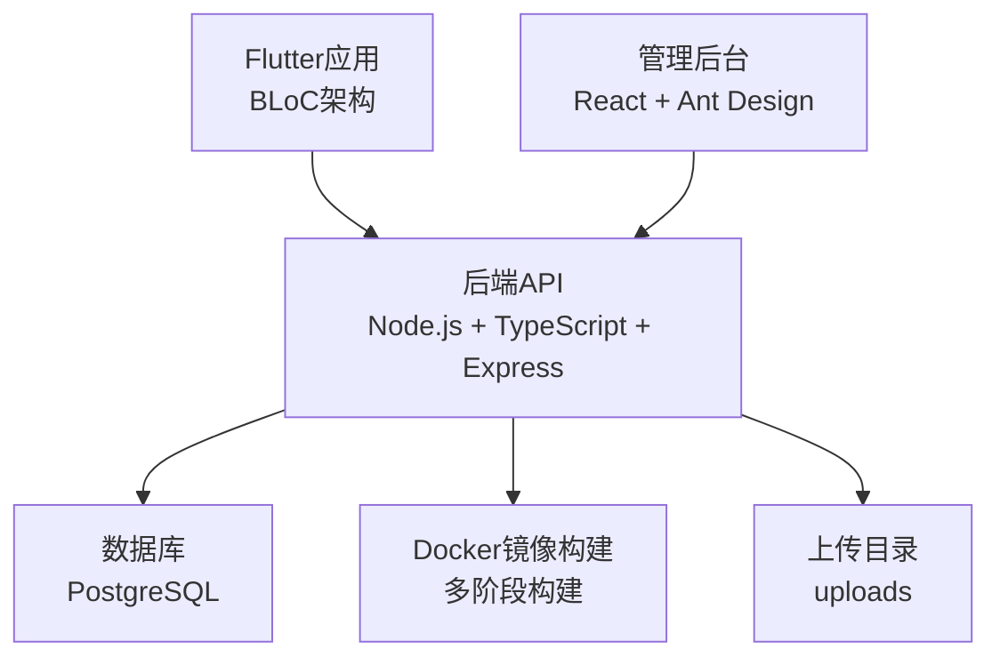
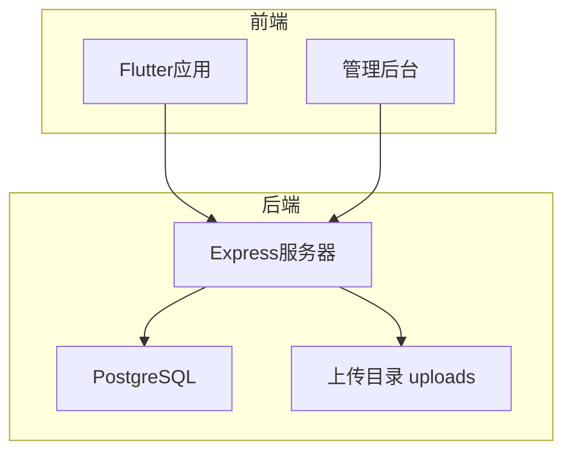
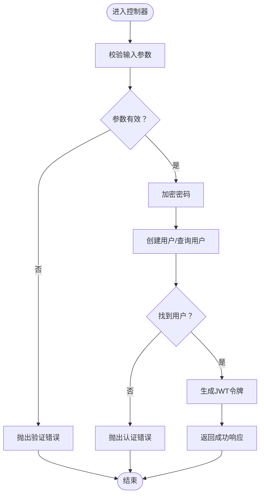
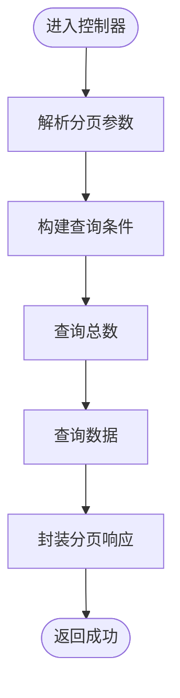
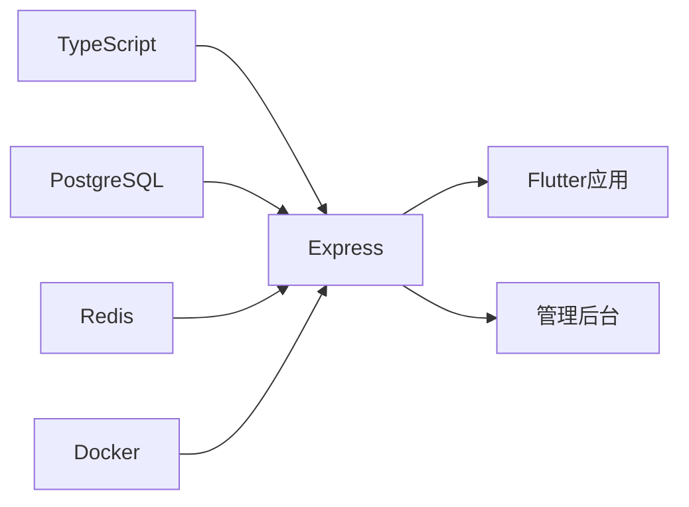

# 提交规范

<cite>
**本文引用的文件**
- [README.md](file://README.md)
- [docs/IMPLEMENTATION_STATUS.md](file://docs/IMPLEMENTATION_STATUS.md)
- [docs/DEPLOYMENT.md](file://docs/DEPLOYMENT.md)
- [backend/src/controllers/auth.controller.ts](file://backend/src/controllers/auth.controller.ts)
- [backend/src/controllers/method.controller.ts](file://backend/src/controllers/method.controller.ts)
- [backend/Dockerfile](file://backend/Dockerfile)
- [.gitignore](file://.gitignore)
- [flutter_app/.gitignore](file://flutter_app/.gitignore)
- [home/user/nian/admin-web/.gitignore](file://home/user/nian/admin-web/.gitignore)
</cite>

## 目录
1. [简介](#简介)
2. [项目结构](#项目结构)
3. [核心组件](#核心组件)
4. [架构总览](#架构总览)
5. [详细组件分析](#详细组件分析)
6. [依赖关系分析](#依赖关系分析)
7. [性能考虑](#性能考虑)
8. [故障排查指南](#故障排查指南)
9. [结论](#结论)
10. [附录](#附录)

## 简介
本规范旨在统一团队在各模块（后端、Flutter前端、管理后台）中的提交信息风格，推荐采用 Conventional Commits 格式：type(scope): description。其中：
- type 包括 feat、fix、docs、style、refactor、test、chore 等
- scope 表示影响范围，如 auth、method、practice 等
- 描述需使用英文、简洁明了、动词开头
- 该规范有助于自动化生成变更日志、支持语义化版本发布、便于代码历史追溯

## 项目结构
项目由三部分组成：
- 后端 API（Node.js + TypeScript + Express）
- Flutter 应用（BLoC 架构）
- 管理后台（React + Ant Design）

图表来源
- [backend/Dockerfile](file://backend/Dockerfile#L1-L44)
- [docs/IMPLEMENTATION_STATUS.md](file://docs/IMPLEMENTATION_STATUS.md#L1-L160)
- [.gitignore](file://.gitignore#L100-L120)

章节来源
- [README.md](file://README.md#L48-L68)
- [docs/IMPLEMENTATION_STATUS.md](file://docs/IMPLEMENTATION_STATUS.md#L1-L160)

## 核心组件
- 后端控制器：负责用户认证、方法管理、练习记录等业务逻辑
- Flutter 应用：用户端交互、页面导航、状态管理
- 管理后台：管理员登录、方法管理、审核、统计、导出
- 部署与运行：Docker 一键部署、健康检查、环境变量

章节来源
- [backend/src/controllers/auth.controller.ts](file://backend/src/controllers/auth.controller.ts#L1-L150)
- [backend/src/controllers/method.controller.ts](file://backend/src/controllers/method.controller.ts#L1-L153)
- [docs/IMPLEMENTATION_STATUS.md](file://docs/IMPLEMENTATION_STATUS.md#L1-L160)
- [docs/DEPLOYMENT.md](file://docs/DEPLOYMENT.md#L1-L140)

## 架构总览
后端通过 Express 提供 REST API，Flutter 与管理后台分别调用后端接口；Dockerfile 定义了多阶段构建与健康检查流程。

图表来源
- [backend/Dockerfile](file://backend/Dockerfile#L1-L44)
- [docs/IMPLEMENTATION_STATUS.md](file://docs/IMPLEMENTATION_STATUS.md#L1-L160)

## 详细组件分析

### 后端控制器（auth.controller.ts）
- 功能：注册、登录、获取当前用户
- 关键点：参数校验、密码加密、JWT 令牌生成、错误处理中间件
- 提交建议：涉及用户认证、权限控制、安全策略变更时，优先使用 fix、feat、docs、security 等类型

图表来源
- [backend/src/controllers/auth.controller.ts](file://backend/src/controllers/auth.controller.ts#L1-L150)

章节来源
- [backend/src/controllers/auth.controller.ts](file://backend/src/controllers/auth.controller.ts#L1-L150)

### 后端控制器（method.controller.ts）
- 功能：方法列表、详情、推荐、分类
- 关键点：分页查询、全文检索、浏览计数更新、推荐算法
- 提交建议：涉及查询逻辑、排序规则、推荐策略调整时，使用 feat、fix、refactor

图表来源
- [backend/src/controllers/method.controller.ts](file://backend/src/controllers/method.controller.ts#L1-L153)

章节来源
- [backend/src/controllers/method.controller.ts](file://backend/src/controllers/method.controller.ts#L1-L153)

### 提交信息规范与模板配置
- 规范格式：type(scope): description
  - type：feat、fix、docs、style、refactor、test、chore 等
  - scope：auth、method、practice、admin、backend、frontend、deployment 等
  - 描述：英文、简洁、动词开头
- 示例：
  - feat(user): add password reset functionality
  - fix(api): resolve race condition in method listing
- Git 提交模板配置方法（适用于 Windows/Linux/macOS）
  - 在仓库根目录创建 .gitmessage 文件，内容为提交模板
  - 在 .git/config 中配置 commit.template
  - 也可使用 Git 别名简化提交流程
- 团队协作建议
  - 在 PR 标题中体现 type(scope): description
  - 将变更归类到对应 scope，便于 CHANGELOG 生成与版本发布

（本节为通用规范说明，不直接分析具体源码文件）

## 依赖关系分析
- 后端依赖：TypeScript、Express、PostgreSQL、Redis、Docker
- Flutter 依赖：BLoC、Dio、Equatable、安全存储等
- 管理后台依赖：React、Ant Design、Vite

图表来源
- [docs/IMPLEMENTATION_STATUS.md](file://docs/IMPLEMENTATION_STATUS.md#L48-L68)
- [backend/Dockerfile](file://backend/Dockerfile#L1-L44)

章节来源
- [docs/IMPLEMENTATION_STATUS.md](file://docs/IMPLEMENTATION_STATUS.md#L48-L68)
- [docs/DEPLOYMENT.md](file://docs/DEPLOYMENT.md#L1-L140)

## 性能考虑
- 后端：合理使用分页、索引、缓存（Redis），避免 N+1 查询
- Flutter：使用 const 构造、ListView.builder、BlocSelector 精准监听
- 管理后台：按需加载、懒编译、CDN 资源

（本节为通用指导，不直接分析具体源码文件）

## 故障排查指南
- 健康检查失败：等待服务初始化或检查容器日志
- 端口冲突：定位占用进程并释放
- 数据库连接失败：确认 .env 中的凭据
- 上传文件异常：检查 uploads 目录权限与大小限制

章节来源
- [docs/DEPLOYMENT.md](file://docs/DEPLOYMENT.md#L120-L140)
- [.gitignore](file://.gitignore#L100-L120)
- [flutter_app/.gitignore](file://flutter_app/.gitignore#L1-L178)
- [home/user/nian/admin-web/.gitignore](file://home/user/nian/admin-web/.gitignore#L1-L48)

## 结论
通过统一的提交规范，团队可以：
- 自动生成 CHANGELOG，提升发布效率
- 支持语义化版本（SemVer）发布
- 便于回溯与审计，降低协作成本
- 保持跨模块一致的沟通语言

（本节为总结性内容，不直接分析具体源码文件）

## 附录
- 提交示例参考
  - feat(auth): implement password reset endpoint
  - fix(method): correct pagination offset calculation
  - refactor(practice): extract statistics computation
  - docs(deployment): update health check instructions
  - chore(ci): add conventional commit lint
- 提交模板配置步骤（概念流程）
  - 在仓库根目录创建 .gitmessage 文件，包含模板字段
  - 在 .git/config 中设置 commit.template 指向该文件
  - 可选：创建别名简化提交，例如 git alias commit
- 团队落地建议
  - 在 CI 中增加提交信息校验（可选）
  - 在 PR 模plate 中要求填写 type(scope): description
  - 定期回顾与优化规范

（本节为概念性内容，不直接分析具体源码文件）