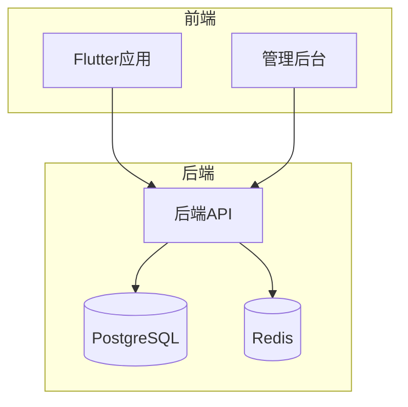

# 开发指南

<cite>
**本文档引用文件**  
- [analysis_options.yaml](file://flutter_app/analysis_options.yaml)
- [tsconfig.json](file://backend/tsconfig.json)
- [jest.config.js](file://backend/jest.config.js)
- [widget_test.dart](file://flutter_app/test/widget_test.dart)
- [TEST_GUIDE.md](file://backend/TEST_GUIDE.md)
- [FLUTTER_DEVELOPMENT_GUIDE.md](file://FLUTTER_DEVELOPMENT_GUIDE.md)
- [README.md](file://README.md)
- [package.json](file://backend/package.json)
- [pubspec.yaml](file://flutter_app/pubspec.yaml)
- [index.ts](file://backend/src/index.ts)
- [main.dart](file://flutter_app/lib/main.dart)
- [auth.controller.ts](file://backend/src/controllers/auth.controller.ts)
- [login_page.dart](file://flutter_app/lib/presentation/auth/pages/login_page.dart)
- [App.tsx](file://home/user/nian/admin-web/src/App.tsx)
</cite>

## 目录
1. [介绍](#介绍)
2. [项目结构](#项目结构)
3. [代码风格规范](#代码风格规范)
4. [提交信息与分支管理](#提交信息与分支管理)
5. [静态检查与类型配置](#静态检查与类型配置)
6. [前后端接口联调](#前后端接口联调)
7. [测试策略](#测试策略)
8. [调试与性能分析](#调试与性能分析)
9. [常见陷阱规避](#常见陷阱规避)

## 介绍
本开发指南旨在为“全平台心理自助应用系统”（Nian）提供统一的开发规范与协作流程，确保团队高效开发。文档涵盖代码风格、提交信息规范、分支管理策略、Pull Request审查流程、静态检查规则、接口联调技巧、测试策略、调试技巧与性能分析工具使用等内容。

**Section sources**
- [README.md](file://README.md)

## 项目结构
项目采用多模块架构，包含后端API、管理后台、Flutter应用三大核心模块：

```
nian/
├── backend/                # 后端API（Node.js + TypeScript + Express）
├── home/user/nian/admin-web/  # 管理后台（React + Ant Design + Vite）
├── flutter_app/            # Flutter应用（BLoC架构）
├── database/               # 数据库初始化脚本
├── docs/                   # 项目文档
└── docker-compose.yml      # Docker部署配置
```

后端采用分层架构，包含控制器、路由、中间件、工具类等目录；Flutter应用采用标准的BLoC架构，包含domain、data、presentation等层次；管理后台基于React实现，包含页面、服务、工具等模块。



**Diagram sources**
- [README.md](file://README.md)
- [index.ts](file://backend/src/index.ts)
- [main.dart](file://flutter_app/lib/main.dart)
- [App.tsx](file://home/user/nian/admin-web/src/App.tsx)

**Section sources**
- [README.md](file://README.md)

## 代码风格规范

### TypeScript代码风格
后端API与管理后台均采用TypeScript开发，遵循以下规范：
- 使用ES2020语法目标
- 严格模式启用（strict: true）
- 强制一致的文件名大小写
- 启用严格空值检查
- 禁止未使用的局部变量和参数
- 禁止switch语句中的贯穿情况

### Dart代码风格
Flutter应用遵循Dart官方推荐的代码风格，通过`analysis_options.yaml`配置：
- 遵循`flutter_lints/flutter.yaml`推荐规则
- 可自定义启用或禁用特定规则
- 推荐使用const构造函数优化性能
- 避免使用print语句

**Section sources**
- [tsconfig.json](file://backend/tsconfig.json)
- [analysis_options.yaml](file://flutter_app/analysis_options.yaml)

## 提交信息与分支管理

### Git Flow分支策略
项目采用标准Git Flow工作流：
- `main`：生产环境分支，受保护
- `develop`：开发主分支
- `feature/*`：功能开发分支
- `release/*`：发布准备分支
- `hotfix/*`：紧急修复分支

### 提交信息规范
提交信息应遵循Conventional Commits规范：
- 类型：feat、fix、docs、style、refactor、test、chore等
- 范围：可选，如(auth、user、method等)
- 主题：简明扼要的描述
- 正文：详细说明变更内容
- 脚注：可包含BREAKING CHANGE等信息

示例：`feat(auth): 添加用户注册功能`

**Section sources**
- [README.md](file://README.md)

## 静态检查与类型配置

### TypeScript配置
后端与管理后台的`tsconfig.json`配置了严格的类型检查规则：

```json
{
  "compilerOptions": {
    "target": "ES2020",
    "strict": true,
    "strictNullChecks": true,
    "noUnusedLocals": true,
    "noUnusedParameters": true,
    "noImplicitReturns": true,
    "noFallthroughCasesInSwitch": true
  }
}
```

### Dart静态检查
Flutter应用通过`analysis_options.yaml`配置静态分析规则：

```yaml
include: package:flutter_lints/flutter.yaml
linter:
  rules:
    # prefer_const_constructors: true
    # avoid_print: true
```

**Diagram sources**
- [tsconfig.json](file://backend/tsconfig.json)
- [analysis_options.yaml](file://flutter_app/analysis_options.yaml)

**Section sources**
- [tsconfig.json](file://backend/tsconfig.json)
- [analysis_options.yaml](file://flutter_app/analysis_options.yaml)

## 前后端接口联调

### API文档同步
后端使用Swagger UI自动生成API文档，可通过`/api-docs`路径访问。前后端开发人员应定期同步接口定义，确保一致性。

### Mock数据生成
为支持并行开发，建议使用以下Mock方案：
- 后端提供测试环境API
- 前端可使用Dio拦截器模拟响应
- 管理后台可使用MSW（Mock Service Worker）进行网络层模拟

### 联调技巧
- 使用`.env`文件管理不同环境的API地址
- 开启后端CORS配置以支持前端跨域请求
- 利用Docker一键部署完整环境进行集成测试

**Section sources**
- [README.md](file://README.md)
- [index.ts](file://backend/src/index.ts)

## 测试策略

### 后端单元测试
后端采用Jest框架进行测试，配置文件`jest.config.js`包含：
- 使用ts-jest处理TypeScript文件
- 测试环境设置为node
- 覆盖率报告生成（text、lcov、html格式）
- 测试文件匹配模式

```javascript
module.exports = {
  preset: 'ts-jest',
  testEnvironment: 'node',
  collectCoverageFrom: ['src/**/*.ts'],
  coverageReporters: ['text', 'lcov', 'html']
};
```

### Flutter Widget测试
Flutter应用使用`flutter_test`包进行Widget测试，示例：

```dart
testWidgets('Counter increments smoke test', (WidgetTester tester) async {
  await tester.pumpWidget(const MyApp());
  expect(find.text('0'), findsOneWidget);
  await tester.tap(find.byIcon(Icons.add));
  await tester.pump();
  expect(find.text('1'), findsOneWidget);
});
```

### 测试执行
```bash
# 后端测试
npm test
npm run test:coverage

# Flutter测试
flutter test
flutter analyze
```

**Diagram sources**
- [jest.config.js](file://backend/jest.config.js)
- [widget_test.dart](file://flutter_app/test/widget_test.dart)

**Section sources**
- [TEST_GUIDE.md](file://backend/TEST_GUIDE.md)
- [jest.config.js](file://backend/jest.config.js)
- [widget_test.dart](file://flutter_app/test/widget_test.dart)

## 调试与性能分析

### 调试技巧
- 后端使用`winston`日志库记录详细日志
- Flutter应用使用`logger`包进行调试输出
- 管理后台使用React DevTools进行组件调试
- 所有服务支持通过Docker日志查看运行状态

### 性能分析工具
- **后端**：使用Node.js内置性能钩子或clinic.js工具
- **Flutter**：使用DevTools进行CPU、内存、帧率分析
- **前端**：使用Chrome DevTools进行性能剖析
- **数据库**：使用pg_stat_statements监控慢查询

### 性能优化建议
- Flutter中使用const构造函数减少重建
- 使用ListView.builder进行懒加载
- 合理使用BlocSelector精确监听状态变化
- 图片资源使用cached_network_image缓存

**Section sources**
- [FLUTTER_DEVELOPMENT_GUIDE.md](file://FLUTTER_DEVELOPMENT_GUIDE.md)
- [backend/package.json](file://backend/package.json)
- [flutter_app/pubspec.yaml](file://flutter_app/pubspec.yaml)

## 常见陷阱规避

### 类型安全陷阱
- TypeScript中避免使用any类型
- Dart中合理使用late和?操作符
- 接口响应数据应进行充分验证

### 异步处理陷阱
- 正确处理Promise的异常情况
- Flutter中避免在Widget build方法中执行异步操作
- 使用async/await替代回调地狱

### 状态管理陷阱
- BLoC中避免事件处理逻辑过于复杂
- 合理设计状态类的继承关系
- 注意Bloc生命周期管理，及时关闭流

### 安全性陷阱
- 敏感信息不硬编码在代码中
- 使用HTTPS传输认证信息
- 密码必须加密存储（bcrypt）
- JWT令牌设置合理过期时间

**Section sources**
- [FLUTTER_DEVELOPMENT_GUIDE.md](file://FLUTTER_DEVELOPMENT_GUIDE.md)
- [README.md](file://README.md)
- [auth.controller.ts](file://backend/src/controllers/auth.controller.ts)