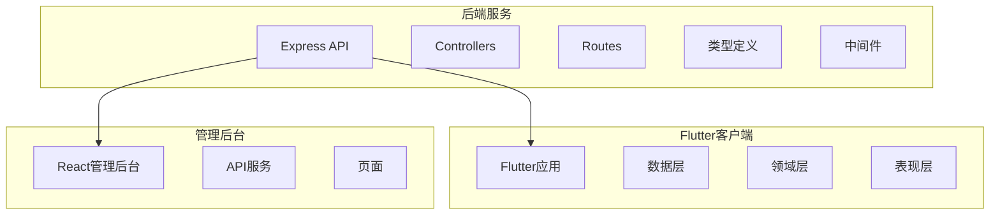
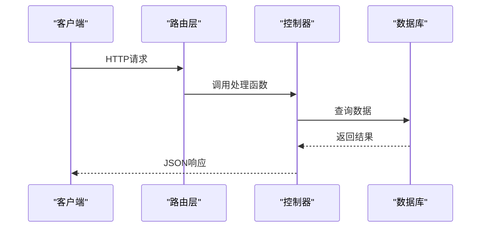
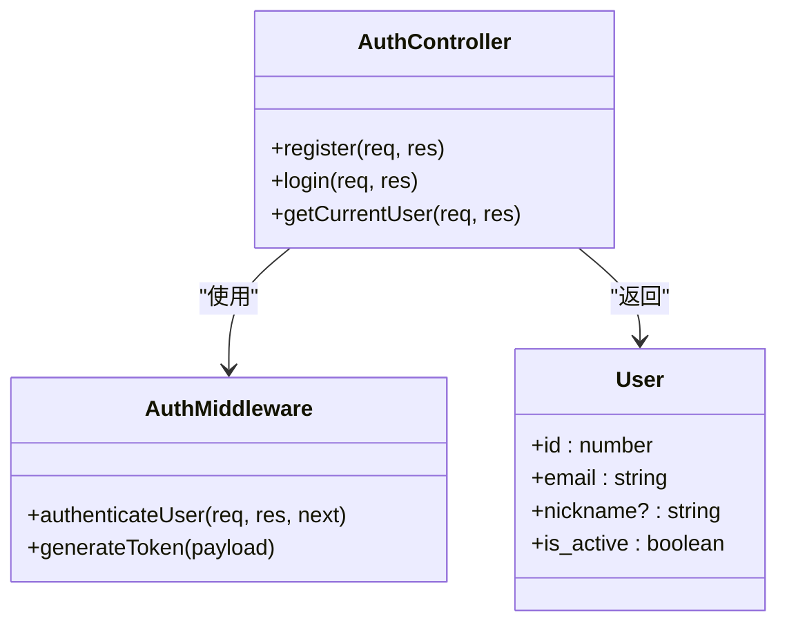
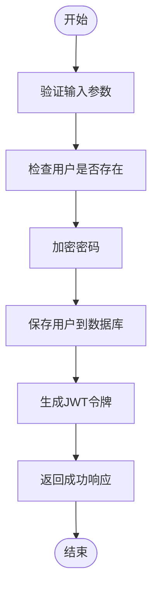
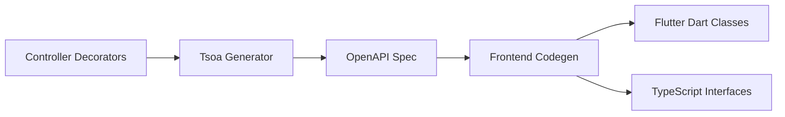
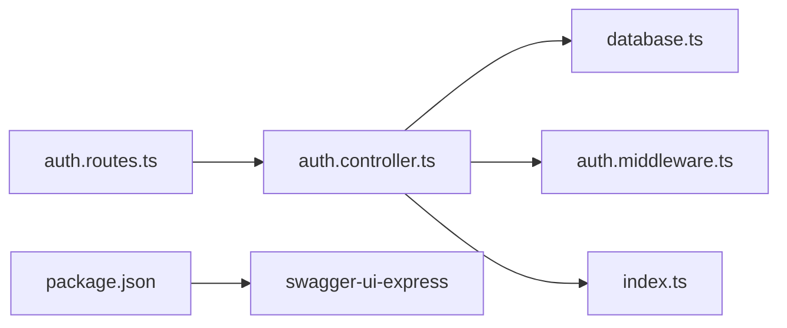

# API文档同步机制

<cite>
**本文档引用文件**  
- [auth.controller.ts](file://backend/src/controllers/auth.controller.ts)
- [auth.routes.ts](file://backend/src/routes/auth.routes.ts)
- [package.json](file://backend/package.json)
- [types/index.ts](file://backend/src/types/index.ts)
- [middleware/auth.ts](file://backend/src/middleware/auth.ts)
- [index.ts](file://backend/src/index.ts)
- [TEST_GUIDE.md](file://backend/TEST_GUIDE.md)
- [export.ts](file://backend/src/utils/export.ts)
- [admin.routes.ts](file://backend/src/routes/admin.routes.ts)
- [docker-compose.yml](file://docker-compose.yml)
- [FLUTTER_DEVELOPMENT_GUIDE.md](file://FLUTTER_DEVELOPMENT_GUIDE.md)
- [admin-web/Dockerfile](file://home/user/nian/admin-web/Dockerfile)
</cite>

## 目录
1. [引言](#引言)
2. [项目结构](#项目结构)
3. [核心组件](#核心组件)
4. [架构概览](#架构概览)
5. [详细组件分析](#详细组件分析)
6. [依赖分析](#依赖分析)
7. [性能考虑](#性能考虑)
8. [故障排除指南](#故障排除指南)
9. [结论](#结论)

## 引言
本文档旨在建立后端接口变更自动同步至前端的文档机制。通过在TypeScript文件中使用装饰器或JSDoc注释标注API元信息，并结合Swagger/OpenAPI生成器实现API契约的自动化管理，确保前后端开发的一致性与高效协作。

## 项目结构
本项目采用分层架构设计，包含后端API服务、Flutter移动端应用和管理后台三个主要部分。后端使用Express框架构建RESTful API，前端分别使用Flutter和React技术栈。

**图示来源**  
- [auth.controller.ts](file://backend/src/controllers/auth.controller.ts)
- [auth.routes.ts](file://backend/src/routes/auth.routes.ts)
- [types/index.ts](file://backend/src/types/index.ts)

**本节来源**  
- [auth.controller.ts](file://backend/src/controllers/auth.controller.ts)
- [auth.routes.ts](file://backend/src/routes/auth.routes.ts)

## 核心组件
系统核心组件包括认证控制器、路由定义、类型系统和中间件。这些组件共同构成了API的基础架构，支持用户注册、登录和权限验证等功能。

**本节来源**  
- [auth.controller.ts](file://backend/src/controllers/auth.controller.ts#L1-L150)
- [auth.routes.ts](file://backend/src/routes/auth.routes.ts#L1-L17)
- [types/index.ts](file://backend/src/types/index.ts#L1-L126)

## 架构概览
系统采用典型的三层架构：表现层（路由）、业务逻辑层（控制器）和数据访问层（数据库查询）。所有API请求都经过统一的错误处理和认证中间件。

**图示来源**  
- [index.ts](file://backend/src/index.ts#L1-L48)
- [auth.controller.ts](file://backend/src/controllers/auth.controller.ts#L1-L150)

## 详细组件分析

### 认证组件分析
认证模块包含注册、登录和获取当前用户信息三个核心功能，所有敏感操作均需通过JWT令牌验证。

#### 类图展示

**图示来源**  
- [auth.controller.ts](file://backend/src/controllers/auth.controller.ts#L1-L150)
- [middleware/auth.ts](file://backend/src/middleware/auth.ts#L1-L87)

#### 请求流程

**图示来源**  
- [auth.controller.ts](file://backend/src/controllers/auth.controller.ts#L9-L68)
- [middleware/auth.ts](file://backend/src/middleware/auth.ts#L80-L86)

**本节来源**  
- [auth.controller.ts](file://backend/src/controllers/auth.controller.ts#L1-L150)
- [middleware/auth.ts](file://backend/src/middleware/auth.ts#L1-L87)

### API文档生成机制
建议采用Tsoa或类似OpenAPI生成器，通过装饰器在控制器中直接标注API元数据。

**图示来源**  
- [auth.controller.ts](file://backend/src/controllers/auth.controller.ts)
- [package.json](file://backend/package.json)

## 依赖分析
项目依赖关系清晰，各模块耦合度低，便于维护和扩展。

**图示来源**  
- [package.json](file://backend/package.json#L1-L55)
- [index.ts](file://backend/src/index.ts#L1-L48)

**本节来源**  
- [package.json](file://backend/package.json#L1-L55)
- [index.ts](file://backend/src/index.ts#L1-L48)

## 性能考虑
系统在性能方面进行了多项优化，包括数据库连接池、Redis缓存和请求频率限制等机制。

## 故障排除指南
常见问题包括接口401未授权错误、数据库连接失败和文件上传异常。建议检查JWT令牌有效性、环境变量配置和存储卷挂载情况。

**本节来源**  
- [middleware/auth.ts](file://backend/src/middleware/auth.ts#L1-L87)
- [docker-compose.yml](file://docker-compose.yml#L1-L241)

## 结论
通过引入OpenAPI规范和自动化代码生成工具，可以有效实现前后端接口的自动同步。建议在CI/CD流水线中加入API契约检查，防止接口不一致导致联调失败。