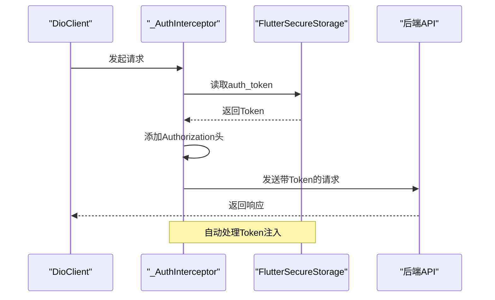

# 前端集成与代码生成

<cite>
**本文档引用的文件**
- [auth.routes.ts](file://backend/src/routes/auth.routes.ts)
- [auth.controller.ts](file://backend/src/controllers/auth.controller.ts)
- [user_model.dart](file://flutter_app/lib/data/models/user_model.dart)
- [dio_client.dart](file://flutter_app/lib/core/network/dio_client.dart)
- [api_constants.dart](file://flutter_app/lib/config/api_constants.dart)
- [pubspec.yaml](file://flutter_app/pubspec.yaml)
- [api.ts](file://home/user/nian/admin-web/src/services/api.ts)
</cite>

## 目录
1. [简介](#简介)
2. [Flutter端集成方案](#flutter端集成方案)
3. [React管理后台集成方案](#react管理后台集成方案)
4. [CI/CD自动化脚本示例](#cicd自动化脚本示例)
5. [认证流程与Token处理](#认证流程与token处理)
6. [最佳实践与注意事项](#最佳实践与注意事项)

## 简介
本文档详细阐述了如何将后端生成的OpenAPI规范集成至Flutter移动应用和React管理后台中。通过自动化代码生成技术，确保前后端数据结构的一致性，并提供完整的认证流程实现方案。文档涵盖代码生成命令、服务集成方法、CI脚本片段以及关键的Token自动注入机制。

## Flutter端集成方案

在Flutter项目中，使用`openapi-generator-cli`工具根据OpenAPI规范自动生成Dart模型类和服务接口。该方案与现有的`dio_client`网络层无缝集成，确保类型安全和代码一致性。

### 代码生成命令
```bash
openapi-generator-cli generate \
  -i http://localhost:3000/api-docs/json \
  -g dart-dio \
  -o ./flutter_app/lib/generated \
  --additional-properties=pubName=api_client
```

### 模型类集成
生成的Dart模型类（如`UserModel`）与现有代码库的实体模式保持一致，通过`fromJson`和`toJson`方法实现JSON序列化。

**Section sources**
- [user_model.dart](file://flutter_app/lib/data/models/user_model.dart#L1-L44)
- [pubspec.yaml](file://flutter_app/pubspec.yaml#L25-L26)

## React管理后台集成方案

对于React管理后台，使用OpenAPI Generator生成TypeScript接口定义，并将其集成到现有的API服务模块中。

### TypeScript代码生成
```bash
openapi-generator-cli generate \
  -i http://localhost:3000/api-docs/json \
  -g typescript-axios \
  -o ./admin-web/src/generated \
  --additional-properties=typescriptThreePlus=true
```

### API服务集成
生成的API客户端被导入到`api.ts`服务模块中，作为统一的API访问入口。

**Section sources**
- [api.ts](file://home/user/nian/admin-web/src/services/api.ts)

## CI/CD自动化脚本示例

以下CI脚本片段展示了如何在持续集成流程中自动化OpenAPI代码生成过程：

```yaml
generate-api-client:
  stage: generate
  image: openapitools/openapi-generator-cli
  script:
    - openapi-generator-cli generate -i http://backend:3000/api-docs/json -g dart-dio -o ./flutter_app/lib/generated
    - openapi-generator-cli generate -i http://backend:3000/api-docs/json -g typescript-axios -o ./admin-web/src/generated
  only:
    - main
```

**Section sources**
- [quick-start.bat](file://quick-start.bat#L108-L150)

## 认证流程与Token处理

### 登录响应结构映射
分析`auth.routes.ts`中的POST /login路由，其响应结构包含token和用户信息，这些字段被映射到Dart模型类中：

```json
{
  "success": true,
  "message": "Login successful",
  "data": {
    "token": "jwt-token-here",
    "user": {
      "id": 1,
      "email": "user@example.com",
      "nickname": "用户名",
      "avatar_url": "avatar.jpg",
      "created_at": "2023-01-01T00:00:00Z"
    }
  }
}
```

### Token自动注入机制
通过`DioClient`中的`_AuthInterceptor`拦截器，实现Token自动注入到请求头的逻辑：



**Diagram sources**
- [dio_client.dart](file://flutter_app/lib/core/network/dio_client.dart#L62-L97)
- [auth.routes.ts](file://backend/src/routes/auth.routes.ts#L11-L12)

**Section sources**
- [dio_client.dart](file://flutter_app/lib/core/network/dio_client.dart#L62-L97)
- [auth.routes.ts](file://backend/src/routes/auth.routes.ts#L11-L12)
- [auth.controller.ts](file://backend/src/controllers/auth.controller.ts#L71-L125)

## 最佳实践与注意事项

1. **环境配置**：通过`api_constants.dart`中的环境变量配置不同环境的API基础URL
2. **错误处理**：利用Dio拦截器统一处理认证失败、网络超时等异常情况
3. **安全性**：使用`flutter_secure_storage`安全存储JWT令牌
4. **版本同步**：确保前后端API版本同步，避免数据结构不一致
5. **缓存策略**：合理配置Dio的连接、接收和发送超时时间

**Section sources**
- [api_constants.dart](file://flutter_app/lib/config/api_constants.dart#L1-L73)
- [dio_client.dart](file://flutter_app/lib/core/network/dio_client.dart#L25-L39)