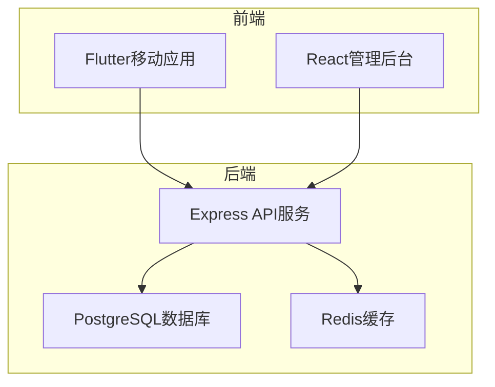
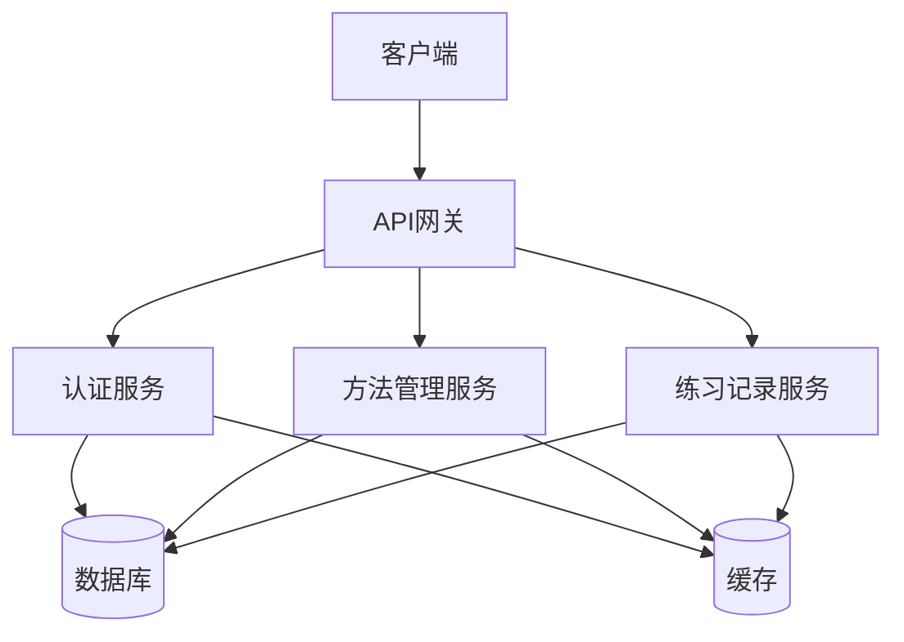
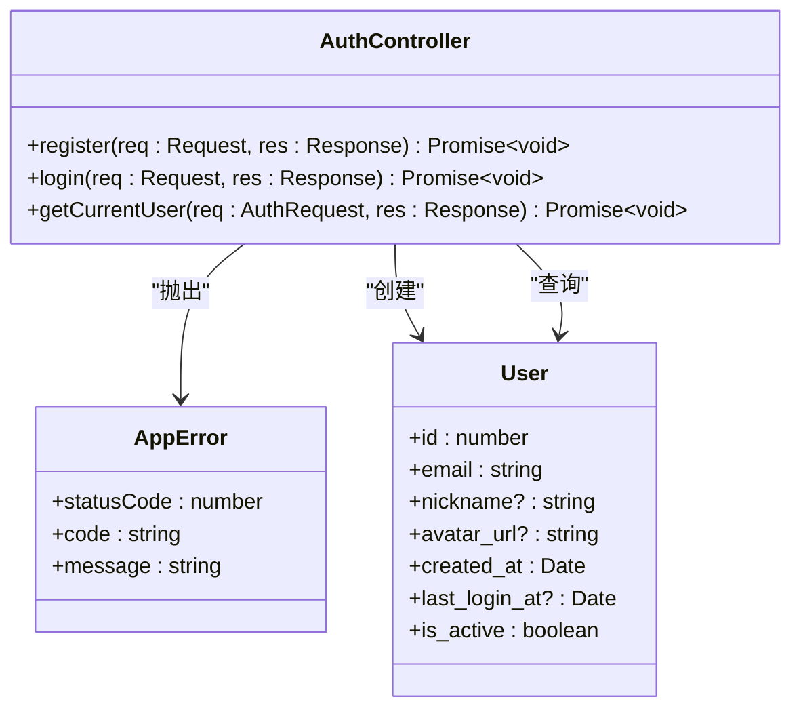
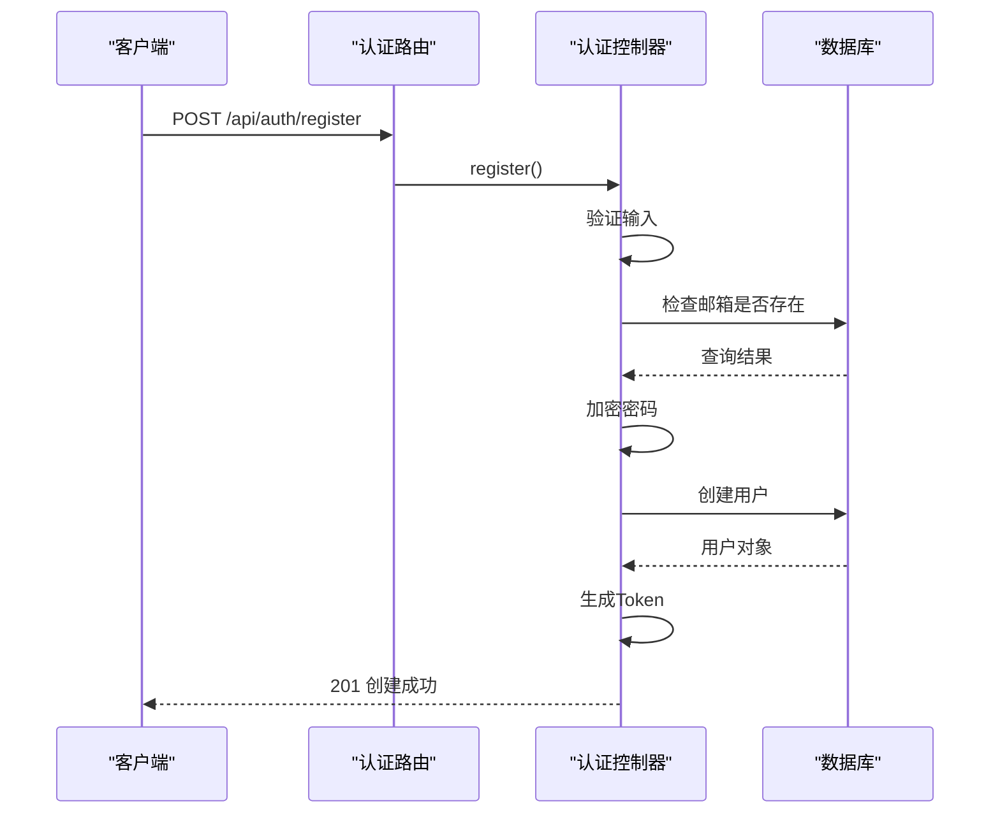
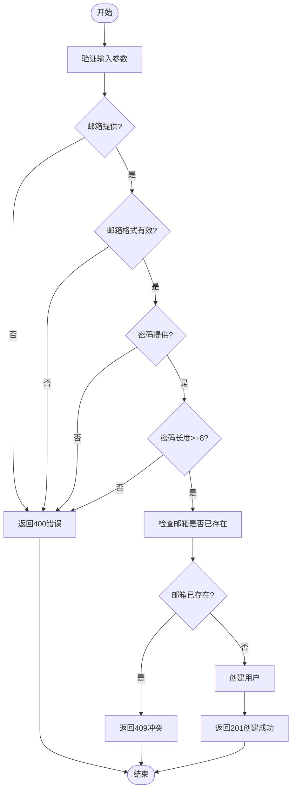
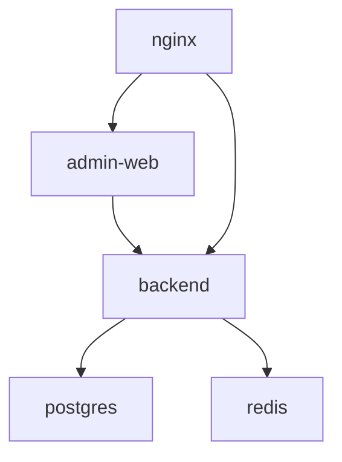

# 接口契约校验

<cite>
**本文档引用文件**  
- [auth.controller.ts](file://backend/src/controllers/auth.controller.ts)
- [auth.routes.ts](file://backend/src/routes/auth.routes.ts)
- [api.test.ts](file://backend/src/__tests__/api.test.ts)
- [TEST_GUIDE.md](file://backend/TEST_GUIDE.md)
- [docker-compose.yml](file://docker-compose.yml)
- [package.json](file://backend/package.json)
- [jest.config.js](file://backend/jest.config.js)
</cite>

## 目录
1. [引言](#引言)
2. [项目结构](#项目结构)
3. [核心组件](#核心组件)
4. [架构概述](#架构概述)
5. [详细组件分析](#详细组件分析)
6. [依赖分析](#依赖分析)
7. [性能考虑](#性能考虑)
8. [故障排除指南](#故障排除指南)
9. [结论](#结论)

## 引言
本文档旨在设计CI/CD流水线中的API契约一致性校验机制。通过使用生成的OpenAPI文档作为契约，在单元测试或集成测试阶段利用Supertest等工具验证`auth.controller.ts`中实现的接口是否符合规范定义，包括路径、方法、请求参数、响应状态码及数据结构。文档将编写示例测试用例，验证`/register`接口的400错误处理与文档描述一致，并结合`docker-compose.yml`中的服务编排，说明如何在独立环境中运行校验任务，防止不兼容变更合并到主干。

## 项目结构
本项目采用分层架构，主要分为前端、后端和数据库三个部分。后端服务基于Node.js和Express框架构建，使用TypeScript编写，包含控制器、路由、中间件、类型定义和工具函数。前端包括Flutter移动应用和React管理后台。数据库使用PostgreSQL，缓存使用Redis。CI/CD流程通过Docker Compose进行服务编排。

**图示来源**  
- [docker-compose.yml](file://docker-compose.yml#L3-L241)

**本节来源**  
- [docker-compose.yml](file://docker-compose.yml#L3-L241)
- [backend/package.json](file://backend/package.json#L1-L55)

## 核心组件
核心组件包括认证控制器（`auth.controller.ts`）、认证路由（`auth.routes.ts`）和API测试文件（`api.test.ts`）。这些组件共同实现了用户注册、登录和身份验证功能，并通过测试确保接口行为符合预期。

**本节来源**  
- [auth.controller.ts](file://backend/src/controllers/auth.controller.ts#L1-L150)
- [auth.routes.ts](file://backend/src/routes/auth.routes.ts#L1-L17)
- [api.test.ts](file://backend/src/__tests__/api.test.ts)

## 架构概述
系统采用微服务架构，通过Docker Compose进行服务编排。后端服务暴露RESTful API，前端应用通过HTTP请求与后端交互。数据库和缓存服务独立部署，确保数据持久性和高性能访问。

**图示来源**  
- [docker-compose.yml](file://docker-compose.yml#L3-L241)
- [backend/src/index.ts](file://backend/src/index.ts#L1-L85)

## 详细组件分析

### 认证控制器分析
认证控制器实现了用户注册、登录和获取当前用户信息的功能。注册接口对输入进行严格验证，包括邮箱格式、密码强度和邮箱唯一性检查。

#### 类图

**图示来源**  
- [auth.controller.ts](file://backend/src/controllers/auth.controller.ts#L1-L150)
- [types/index.ts](file://backend/src/types/index.ts#L1-L126)

### 认证路由分析
认证路由定义了三个端点：`/register`、`/login`和`/me`。这些路由通过Express的Router中间件进行注册，并与相应的控制器方法绑定。

#### 序列图

**图示来源**  
- [auth.routes.ts](file://backend/src/routes/auth.routes.ts#L1-L17)
- [auth.controller.ts](file://backend/src/controllers/auth.controller.ts#L1-L150)

### 测试用例分析
测试用例验证了注册接口的错误处理逻辑，确保当提供无效输入时返回正确的错误响应。

#### 流程图

**图示来源**  
- [auth.controller.ts](file://backend/src/controllers/auth.controller.ts#L1-L150)
- [api.test.ts](file://backend/src/__tests__/api.test.ts)

**本节来源**  
- [auth.controller.ts](file://backend/src/controllers/auth.controller.ts#L1-L150)
- [auth.routes.ts](file://backend/src/routes/auth.routes.ts#L1-L17)
- [api.test.ts](file://backend/src/__tests__/api.test.ts)

## 依赖分析
项目依赖关系清晰，后端服务依赖数据库和缓存服务，前端应用依赖后端API服务。Docker Compose文件明确定义了服务间的依赖关系，确保服务按正确顺序启动。

**图示来源**  
- [docker-compose.yml](file://docker-compose.yml#L3-L241)

**本节来源**  
- [docker-compose.yml](file://docker-compose.yml#L3-L241)
- [backend/package.json](file://backend/package.json#L1-L55)

## 性能考虑
在独立环境中运行校验任务时，应考虑以下性能因素：
- 使用专用的测试数据库，避免影响开发或生产数据
- 配置适当的超时时间，防止测试因网络延迟而失败
- 并行运行测试用例，提高CI/CD流水线效率
- 监控资源使用情况，确保测试环境有足够的CPU和内存

## 故障排除指南
当API契约校验失败时，可参考以下步骤进行排查：
1. 检查OpenAPI文档是否最新
2. 验证测试环境配置是否正确
3. 确认数据库连接正常
4. 检查端口是否被占用
5. 查看日志文件获取详细错误信息

**本节来源**  
- [TEST_GUIDE.md](file://backend/TEST_GUIDE.md#L1-L283)
- [errorHandler.ts](file://backend/src/middleware/errorHandler.ts#L1-L97)

## 结论
通过在CI/CD流水线中集成API契约一致性校验机制，可以有效防止不兼容的API变更合并到主干。使用Supertest等工具在独立环境中运行测试，确保接口行为符合OpenAPI文档定义。Docker Compose提供了可靠的服务编排，使测试环境与生产环境保持一致。建议将此机制作为代码合并的必要条件，以保证API的稳定性和可靠性。