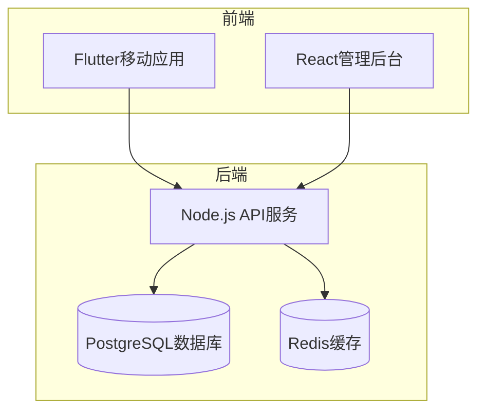
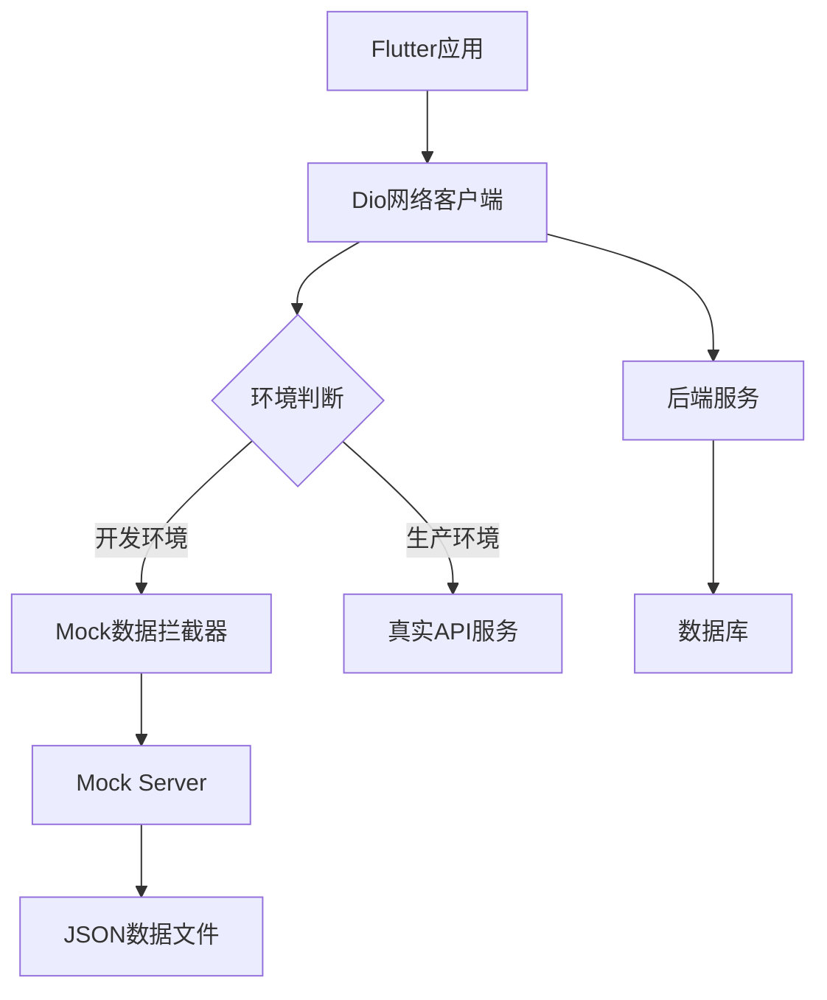
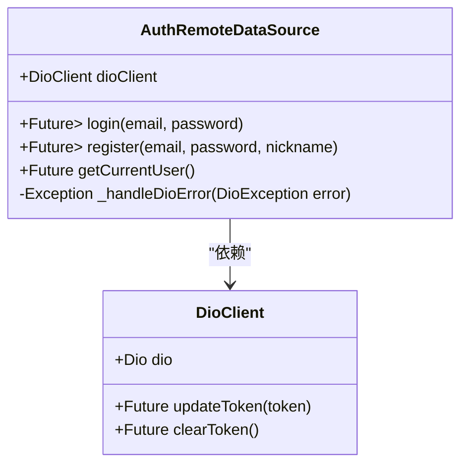
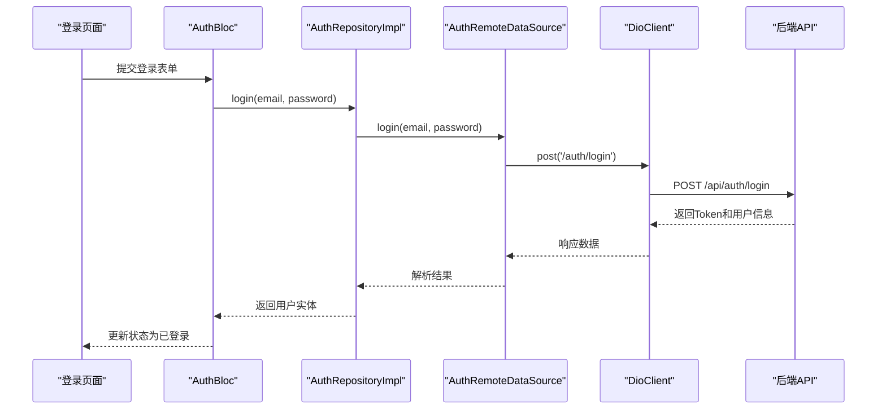
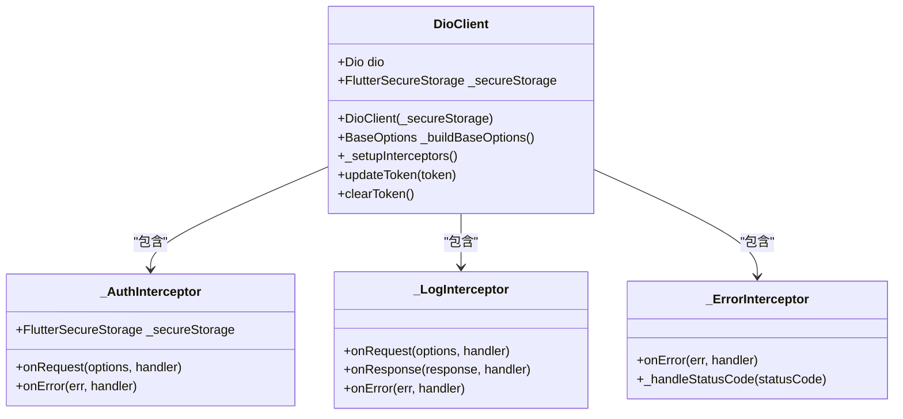
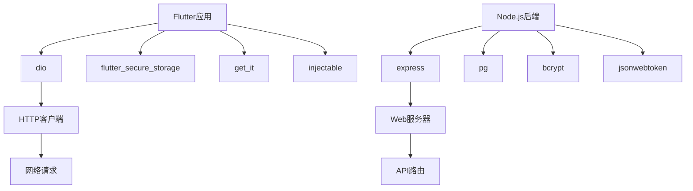

# Mock数据策略

<cite>
**本文档引用的文件**
- [api_client.dart](file://flutter_app/lib/data/api/api_client.dart)
- [dio_client.dart](file://flutter_app/lib/core/network/dio_client.dart)
- [api_constants.dart](file://flutter_app/lib/config/api_constants.dart)
- [auth_remote_data_source.dart](file://flutter_app/lib/data/datasources/remote/auth_remote_data_source.dart)
- [auth.routes.ts](file://backend/src/routes/auth.routes.ts)
- [auth.controller.ts](file://backend/src/controllers/auth.controller.ts)
- [pubspec.yaml](file://flutter_app/pubspec.yaml)
- [package.json](file://backend/package.json)
</cite>

## 目录
1. [引言](#引言)
2. [项目结构](#项目结构)
3. [核心组件](#核心组件)
4. [架构概述](#架构概述)
5. [详细组件分析](#详细组件分析)
6. [依赖分析](#依赖分析)
7. [性能考虑](#性能考虑)
8. [故障排除指南](#故障排除指南)
9. [结论](#结论)

## 引言
本文档详细介绍了在前后端并行开发过程中实施的Mock数据策略。通过分析Flutter客户端和Node.js后端代码库，我们将展示如何利用Dio拦截器在前端模拟API响应，以及如何搭建本地Mock Server供多端共用。文档涵盖了从认证流程到数据交互的完整Mock方案，确保开发团队能够在没有后端服务的情况下高效进行UI开发和功能测试。

## 项目结构
本项目采用前后端分离的架构设计，包含Flutter移动应用、Node.js后端服务和React管理后台三个主要部分。这种结构支持并行开发，前端团队可以独立于后端进度进行开发和测试。

**图表来源**
- [项目结构](file://README.md)

**章节来源**
- [项目结构](file://README.md)

## 核心组件
系统的核心组件包括Flutter应用中的网络层实现和后端Express路由定义。Flutter端通过Dio库处理HTTP请求，并利用拦截器机制实现请求/响应的拦截和模拟。后端使用Express框架定义RESTful API路由，为前端提供真实的数据接口。

**章节来源**
- [dio_client.dart](file://flutter_app/lib/core/network/dio_client.dart#L1-L262)
- [auth.routes.ts](file://backend/src/routes/auth.routes.ts#L1-L17)

## 架构概述
系统的整体架构采用分层设计模式，前端应用通过清晰的层次结构分离关注点，后端服务通过模块化路由和控制器组织业务逻辑。这种架构支持Mock数据的无缝切换，开发人员可以通过配置轻松在真实API和模拟数据之间转换。

**图表来源**
- [dio_client.dart](file://flutter_app/lib/core/network/dio_client.dart#L1-L262)
- [auth.routes.ts](file://backend/src/routes/auth.routes.ts#L1-L17)

**章节来源**
- [dio_client.dart](file://flutter_app/lib/core/network/dio_client.dart#L1-L262)
- [auth.routes.ts](file://backend/src/routes/auth.routes.ts#L1-L17)

## 详细组件分析

### 认证远程数据源分析
认证远程数据源组件负责处理用户登录、注册和获取用户信息等核心认证功能。该组件通过Dio客户端发送HTTP请求到后端API，并对响应进行处理和错误管理。

#### 类图

**图表来源**
- [auth_remote_data_source.dart](file://flutter_app/lib/data/datasources/remote/auth_remote_data_source.dart#L1-L77)
- [dio_client.dart](file://flutter_app/lib/core/network/dio_client.dart#L1-L262)

#### 认证流程序列图

**图表来源**
- [auth_remote_data_source.dart](file://flutter_app/lib/data/datasources/remote/auth_remote_data_source.dart#L1-L77)
- [auth.controller.ts](file://backend/src/controllers/auth.controller.ts#L1-L150)
- [auth.routes.ts](file://backend/src/routes/auth.routes.ts#L1-L17)

**章节来源**
- [auth_remote_data_source.dart](file://flutter_app/lib/data/datasources/remote/auth_remote_data_source.dart#L1-L77)
- [auth.controller.ts](file://backend/src/controllers/auth.controller.ts#L1-L150)

### API客户端分析
API客户端组件是Flutter应用中网络通信的核心，它封装了Dio库的配置和拦截器，提供了统一的HTTP请求接口。

#### Dio客户端类图

**图表来源**
- [dio_client.dart](file://flutter_app/lib/core/network/dio_client.dart#L1-L262)

**章节来源**
- [dio_client.dart](file://flutter_app/lib/core/network/dio_client.dart#L1-L262)

## 依赖分析
项目依赖关系清晰地展示了前后端之间的交互模式和数据流。Flutter应用依赖Dio库进行HTTP通信，而后端服务依赖Express框架处理路由请求。通过分析package.json和pubspec.yaml文件，我们可以看到项目的技术栈选择。

**图表来源**
- [pubspec.yaml](file://flutter_app/pubspec.yaml#L1-L111)
- [package.json](file://backend/package.json#L1-L55)

**章节来源**
- [pubspec.yaml](file://flutter_app/pubspec.yaml#L1-L111)
- [package.json](file://backend/package.json#L1-L55)

## 性能考虑
在实施Mock数据策略时，需要考虑性能影响。使用拦截器进行本地数据模拟可以显著提高开发效率，避免网络延迟。然而，过度使用复杂的Mock逻辑可能会影响应用性能。建议在开发环境中使用简单的静态数据模拟，而在集成测试时切换到更真实的模拟服务器。

## 故障排除指南
当Mock数据功能出现问题时，可以按照以下步骤进行排查：

1. 检查API常量配置中的base URL是否正确指向Mock服务器或真实API
2. 验证Dio拦截器是否正确注册并生效
3. 确认安全存储中是否有有效的认证令牌
4. 检查网络权限配置是否允许HTTP请求
5. 查看日志输出以确定请求是否被正确拦截和处理

**章节来源**
- [api_constants.dart](file://flutter_app/lib/config/api_constants.dart#L1-L73)
- [dio_client.dart](file://flutter_app/lib/core/network/dio_client.dart#L1-L262)

## 结论
本文档详细介绍了前后端并行开发中的Mock数据策略。通过分析代码库，我们展示了如何在Flutter应用中利用Dio拦截器模拟API响应，以及如何基于后端路由定义搭建共享的Mock服务器。这种策略不仅支持离线开发和UI调试，还通过统一的接口定义确保了前后端的一致性。建议开发团队采用环境变量配置来管理Mock与真实API的切换，避免联调过程中的混淆。