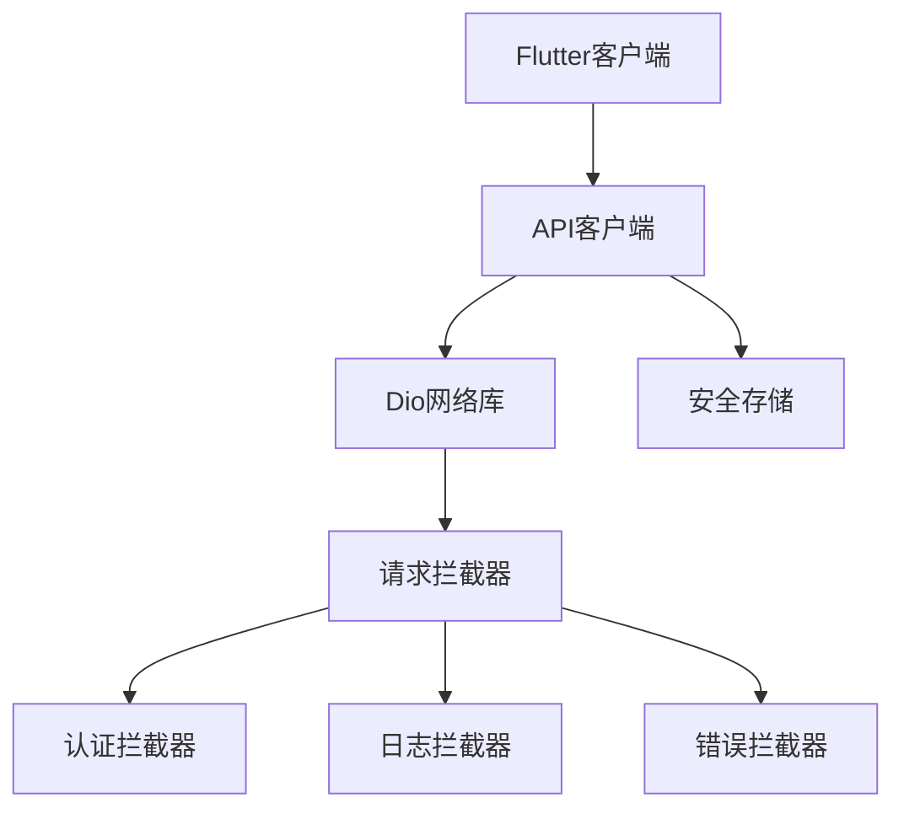
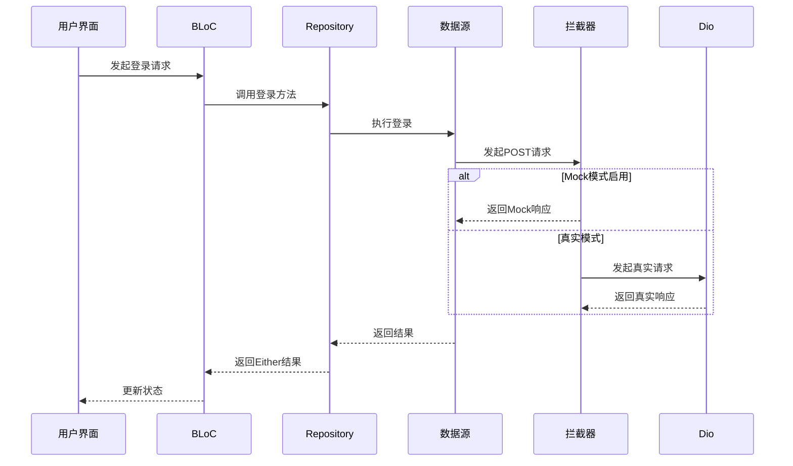
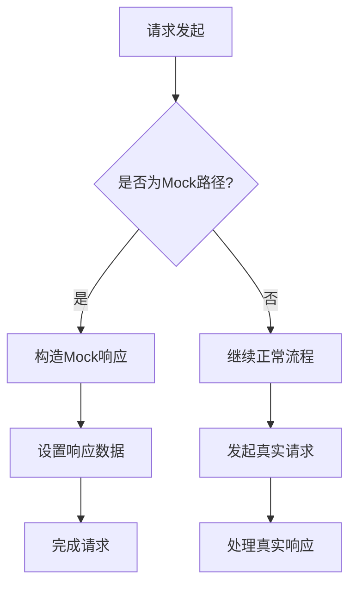
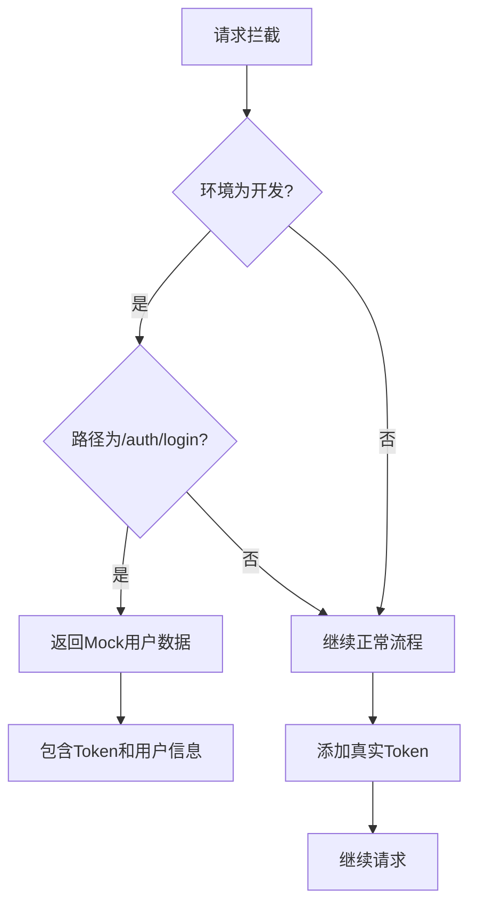
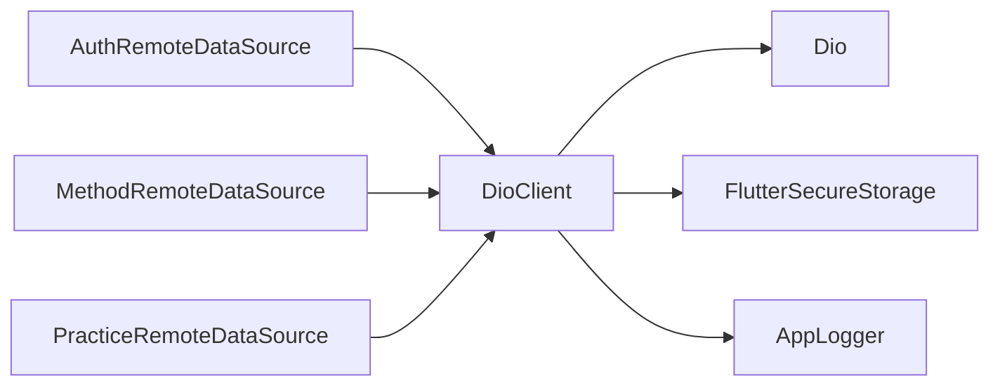

# 客户端拦截Mock

<cite>
**本文档引用的文件**  
- [api_client.dart](file://flutter_app/lib/data/api/api_client.dart)
- [dio_client.dart](file://flutter_app/lib/core/network/dio_client.dart)
- [api_constants.dart](file://flutter_app/lib/config/api_constants.dart)
- [auth_remote_data_source.dart](file://flutter_app/lib/data/datasources/remote/auth_remote_data_source.dart)
- [secure_storage.dart](file://flutter_app/lib/data/storage/secure_storage.dart)
- [injection.dart](file://flutter_app/lib/core/di/injection.dart)
</cite>

## 目录
1. [简介](#简介)
2. [项目结构](#项目结构)
3. [核心组件](#核心组件)
4. [架构概述](#架构概述)
5. [详细组件分析](#详细组件分析)
6. [依赖分析](#依赖分析)
7. [性能考虑](#性能考虑)
8. [故障排除指南](#故障排除指南)
9. [结论](#结论)

## 简介
本文档详细说明如何在Flutter客户端通过Dio拦截器实现API响应的Mock。基于`api_client.dart`中的拦截器机制，展示如何在请求发出前拦截特定接口（如/auth/login），并使用Mock数据替代真实网络请求。提供具体实现方案，支持离线开发与UI调试。

## 项目结构
Flutter应用采用分层架构设计，网络层通过Dio库实现HTTP通信，拦截器机制位于核心网络模块中。API客户端封装了统一的请求配置和拦截逻辑，支持灵活的Mock功能集成。

**图示来源**  
- [dio_client.dart](file://flutter_app/lib/core/network/dio_client.dart#L12-L60)
- [api_client.dart](file://flutter_app/lib/data/api/api_client.dart#L5-L43)

**本节来源**  
- [dio_client.dart](file://flutter_app/lib/core/network/dio_client.dart#L1-L262)
- [api_client.dart](file://flutter_app/lib/data/api/api_client.dart#L1-L207)

## 核心组件
核心网络组件包括Dio客户端封装、拦截器链、API客户端和安全存储。DioClient类通过依赖注入管理网络实例，提供统一的HTTP配置和拦截器注册机制。拦截器链包含认证、日志和错误处理三个核心拦截器，支持在请求生命周期的不同阶段进行干预。

**本节来源**  
- [dio_client.dart](file://flutter_app/lib/core/network/dio_client.dart#L12-L60)
- [api_client.dart](file://flutter_app/lib/data/api/api_client.dart#L5-L43)

## 架构概述
系统采用分层架构，网络层通过Dio库实现RESTful API通信。拦截器机制作为中间件，在请求发出前和响应返回后进行处理。Mock功能通过在请求拦截阶段判断特定条件，直接返回预设数据而非发起真实网络请求来实现。

**图示来源**  
- [dio_client.dart](file://flutter_app/lib/core/network/dio_client.dart#L44-L48)
- [auth_remote_data_source.dart](file://flutter_app/lib/data/datasources/remote/auth_remote_data_source.dart#L13-L20)

## 详细组件分析
### API客户端分析
API客户端封装了Dio实例，通过拦截器实现请求预处理和响应后处理。在请求拦截器中，可以检查请求路径是否匹配需要Mock的接口，如/auth/login，然后直接构造响应对象返回，避免真实网络调用。

#### 对于API/服务组件：

**图示来源**  
- [api_client.dart](file://flutter_app/lib/data/api/api_client.dart#L23-L41)
- [dio_client.dart](file://flutter_app/lib/core/network/dio_client.dart#L44-L48)

**本节来源**  
- [api_client.dart](file://flutter_app/lib/data/api/api_client.dart#L1-L207)
- [dio_client.dart](file://flutter_app/lib/core/network/dio_client.dart#L1-L262)

### 认证拦截器分析
认证拦截器负责在请求头中添加JWT令牌，同时可以集成Mock功能。通过环境变量或配置开关控制Mock模式，在开发环境下拦截特定API请求并返回预设的用户数据和Token，支持离线调试。

#### 对于复杂逻辑组件：

**图示来源**  
- [dio_client.dart](file://flutter_app/lib/core/network/dio_client.dart#L65-L84)
- [secure_storage.dart](file://flutter_app/lib/data/storage/secure_storage.dart#L12-L19)

**本节来源**  
- [dio_client.dart](file://flutter_app/lib/core/network/dio_client.dart#L65-L98)
- [secure_storage.dart](file://flutter_app/lib/data/storage/secure_storage.dart#L1-L46)

## 依赖分析
项目依赖关系清晰，核心网络功能依赖Dio库和flutter_secure_storage。通过injectable实现依赖注入，DioClient作为单例被多个数据源共享。环境配置通过条件编译和运行时参数控制，确保Mock模式仅在开发环境中启用。

**图示来源**  
- [dio_client.dart](file://flutter_app/lib/core/network/dio_client.dart#L2-L3)
- [pubspec.yaml](file://flutter_app/pubspec.yaml#L25-L27)

**本节来源**  
- [dio_client.dart](file://flutter_app/lib/core/network/dio_client.dart#L1-L262)
- [pubspec.yaml](file://flutter_app/pubspec.yaml#L1-L111)

## 性能考虑
拦截器机制对性能影响较小，Mock模式下避免了网络延迟，提升了开发调试效率。通过合理配置拦截器顺序，确保认证和日志功能不会显著增加请求处理时间。安全存储操作采用异步方式，避免阻塞主线程。

## 故障排除指南
当Mock功能未按预期工作时，应检查环境配置是否正确，确认拦截器是否已正确注册。查看日志输出，验证请求路径匹配逻辑。确保Mock数据格式与真实API响应一致，避免JSON解析错误。

**本节来源**  
- [dio_client.dart](file://flutter_app/lib/core/network/dio_client.dart#L103-L155)
- [api_client.dart](file://flutter_app/lib/data/api/api_client.dart#L23-L41)

## 结论
通过Dio拦截器实现API响应Mock是一种高效、灵活的开发调试方案。结合环境配置和条件判断，可以在不修改业务逻辑的情况下切换真实和Mock模式，支持离线开发和UI调试。该方案易于维护和扩展，为不同场景下的异常处理测试提供了便利。