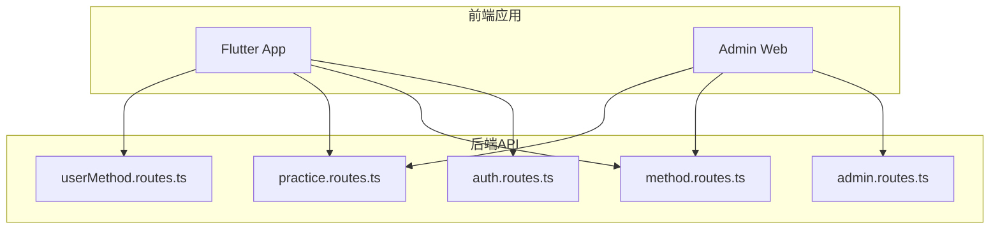
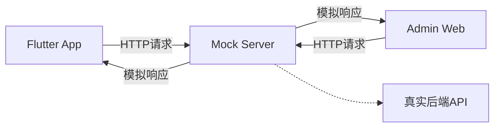
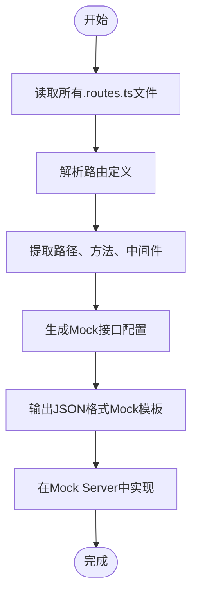
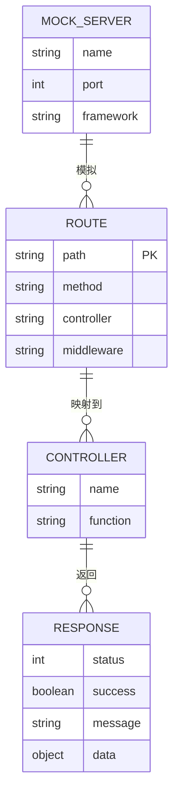

# 独立Mock服务

<cite>
**本文档引用文件**  
- [auth.routes.ts](file://backend/src/routes/auth.routes.ts)
- [admin.routes.ts](file://backend/src/routes/admin.routes.ts)
- [method.routes.ts](file://backend/src/routes/method.routes.ts)
- [practice.routes.ts](file://backend/src/routes/practice.routes.ts)
- [userMethod.routes.ts](file://backend/src/routes/userMethod.routes.ts)
- [auth.controller.ts](file://backend/src/controllers/auth.controller.ts)
- [admin.controller.ts](file://backend/src/controllers/admin.controller.ts)
- [api_constants.dart](file://flutter_app/lib/config/api_constants.dart)
- [routes.dart](file://flutter_app/lib/config/routes.dart)
- [package.json](file://backend/package.json)
</cite>

## 目录

1. [简介](#简介)
2. [项目结构与路由分析](#项目结构与路由分析)
3. [核心组件分析](#核心组件分析)
4. [架构概览](#架构概览)
5. [详细组件分析](#详细组件分析)
6. [依赖关系分析](#依赖关系分析)
7. [性能考虑](#性能考虑)
8. [故障排除指南](#故障排除指南)
9. [结论](#结论)

## 简介
本项目是一个全平台心理自助应用系统，支持移动端（Flutter）和管理后台（React），通过统一的后端API服务进行数据交互。为提升前后端并行开发效率，本文档介绍如何基于现有路由定义文件搭建独立的Mock Server，模拟真实API行为，实现接口规范一致性。

## 项目结构与路由分析
项目包含后端API、Flutter应用和管理后台三大模块。后端使用Node.js + TypeScript + Express构建RESTful API，定义了清晰的路由结构，涵盖用户认证、方法管理、练习记录等核心功能。



**图示来源**  
- [auth.routes.ts](file://backend/src/routes/auth.routes.ts#L1-L17)
- [admin.routes.ts](file://backend/src/routes/admin.routes.ts#L1-L98)
- [method.routes.ts](file://backend/src/routes/method.routes.ts#L1-L20)
- [practice.routes.ts](file://backend/src/routes/practice.routes.ts#L1-L20)
- [userMethod.routes.ts](file://backend/src/routes/userMethod.routes.ts#L1-L23)

**本节来源**  
- [backend/src/routes](file://backend/src/routes)

## 核心组件分析
后端路由文件定义了完整的API接口规范，包括路径、HTTP方法、中间件和控制器映射。这些文件是生成Mock服务的关键输入源。

例如，`auth.routes.ts` 定义了用户注册、登录和获取当前用户信息的接口：
- POST /register
- POST /login
- GET /me（需认证）

`admin.routes.ts` 包含管理员登录、方法管理、审核、统计、文件上传和用户管理等功能，展示了复杂的CRUD操作和权限控制逻辑。

**本节来源**  
- [auth.routes.ts](file://backend/src/routes/auth.routes.ts#L1-L17)
- [admin.routes.ts](file://backend/src/routes/admin.routes.ts#L1-L98)

## 架构概览
系统采用前后端分离架构，后端提供标准化REST API，前端通过HTTP客户端调用接口。通过建立独立的Mock Server，可在真实后端未就绪时支持前端开发。



**图示来源**  
- [api_constants.dart](file://flutter_app/lib/config/api_constants.dart#L1-L73)
- [routes.dart](file://flutter_app/lib/config/routes.dart#L1-L242)

## 详细组件分析

### Mock服务生成方案
基于现有路由文件，可编写自动化脚本提取所有API定义，并生成对应的Mock数据模板。该方案支持GET、POST等HTTP方法及请求参数解析。

#### 路由解析流程


**图示来源**  
- [auth.routes.ts](file://backend/src/routes/auth.routes.ts#L1-L17)
- [admin.routes.ts](file://backend/src/routes/admin.routes.ts#L1-L98)

#### 自动化脚本示例（TypeScript）
```mermaid
classDiagram
class RouteParser {
+parseFile(filePath : string) : RouteInfo[]
+extractMethod(line : string) : HttpMethod | null
+extractPath(line : string) : string | null
}
class MockGenerator {
+generate(routes : RouteInfo[]) : MockConfig
+writeToFile(config : MockConfig, outputPath : string) : void
}
class RouteInfo {
+path : string
+method : HttpMethod
+controller : string
+middleware : string[]
}
class MockConfig {
+endpoints : MockEndpoint[]
}
class MockEndpoint {
+url : string
+method : string
+response : object
+status : number
}
enum HttpMethod {
GET
POST
PUT
DELETE
}
RouteParser --> RouteInfo : "生成"
MockGenerator --> MockConfig : "生成"
MockConfig --> MockEndpoint : "包含"
```

**图示来源**  
- [auth.routes.ts](file://backend/src/routes/auth.routes.ts#L1-L17)
- [admin.routes.ts](file://backend/src/routes/admin.routes.ts#L1-L98)

**本节来源**  
- [auth.routes.ts](file://backend/src/routes/auth.routes.ts#L1-L17)
- [admin.routes.ts](file://backend/src/routes/admin.routes.ts#L1-L98)
- [package.json](file://backend/package.json#L1-L55)

### 接口规范一致性实现
通过分析`auth.controller.ts`中的响应结构，可确保Mock服务返回与真实API一致的数据格式：

```json
{
  "success": true,
  "message": "Login successful",
  "data": {
    "token": "jwt-token-string",
    "user": {
      "id": 1,
      "email": "user@example.com",
      "nickname": "用户名",
      "avatar_url": null,
      "created_at": "2023-01-01T00:00:00.000Z"
    }
  }
}
```

此结构可用于生成标准化的Mock响应模板，保证前后端数据契约一致。

**本节来源**  
- [auth.controller.ts](file://backend/src/controllers/auth.controller.ts#L70-L125)

## 依赖关系分析
Mock服务的实现依赖于后端路由定义和控制器逻辑。通过静态分析路由文件，可建立完整的API接口映射关系。



**图示来源**  
- [auth.routes.ts](file://backend/src/routes/auth.routes.ts#L1-L17)
- [auth.controller.ts](file://backend/src/controllers/auth.controller.ts#L70-L125)

**本节来源**  
- [backend/src/routes](file://backend/src/routes)
- [backend/src/controllers](file://backend/src/controllers)

## 性能考虑
独立Mock服务可显著提升开发效率，避免前后端等待。通过预生成所有接口的Mock数据，可实现毫秒级响应，支持高并发测试场景。

建议使用json-server作为Mock Server框架，因其轻量、易配置且支持REST规范。结合自动化脚本，可实现路由变更后的自动更新。

## 故障排除指南
当Mock服务与真实API行为不一致时，应检查以下方面：
1. 路由路径是否完全匹配（包括参数占位符）
2. HTTP方法是否正确对应
3. 响应状态码是否一致
4. 数据结构是否符合最新定义
5. 认证中间件处理逻辑是否模拟准确

**本节来源**  
- [auth.routes.ts](file://backend/src/routes/auth.routes.ts#L1-L17)
- [admin.routes.ts](file://backend/src/routes/admin.routes.ts#L1-L98)
- [auth.controller.ts](file://backend/src/controllers/auth.controller.ts#L70-L125)

## 结论
通过分析后端路由定义文件，可自动化生成标准化的Mock接口，实现与真实API一致的接口规范。该方案支持移动端和管理后台共用同一套Mock服务，大幅提升前后端并行开发效率。建议将Mock生成脚本集成到CI/CD流程中，确保API变更时Mock服务自动同步更新。