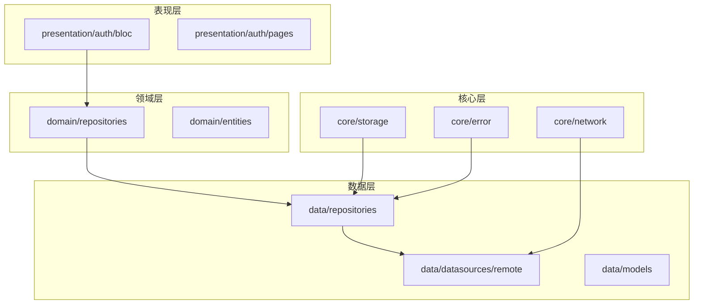
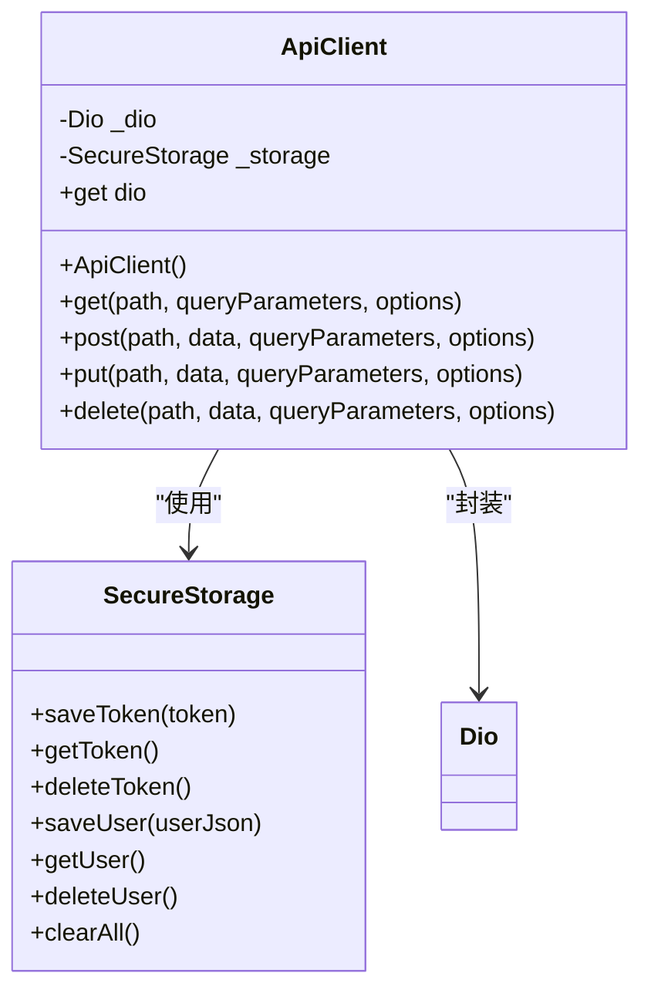
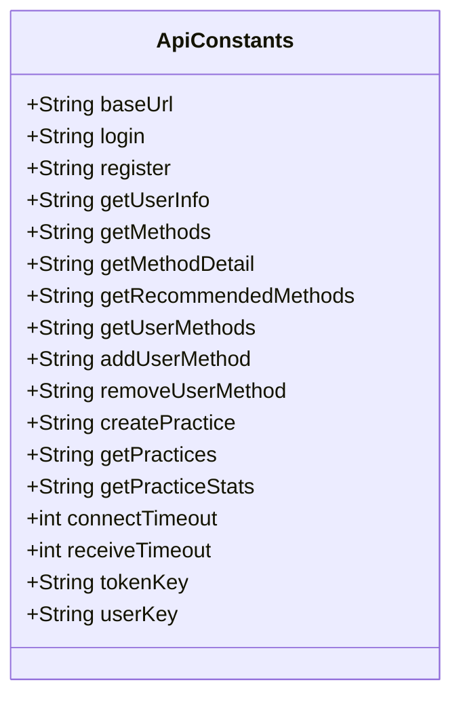
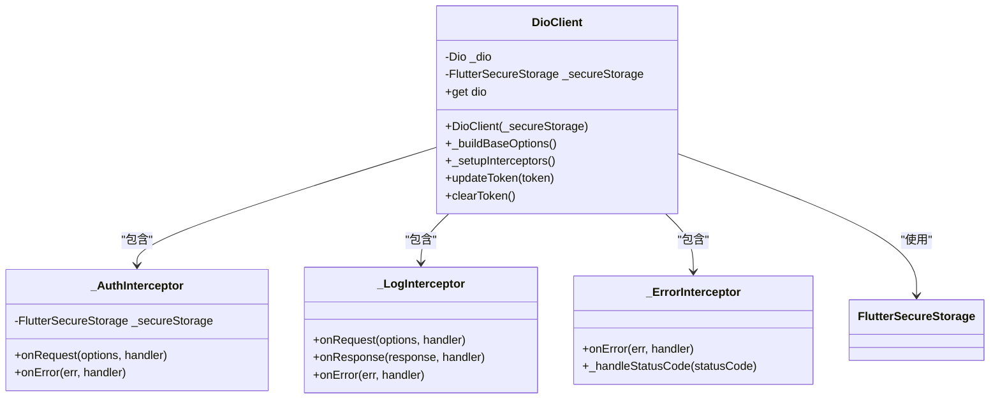
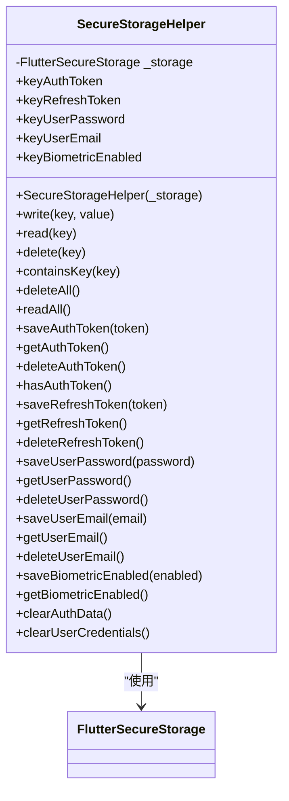
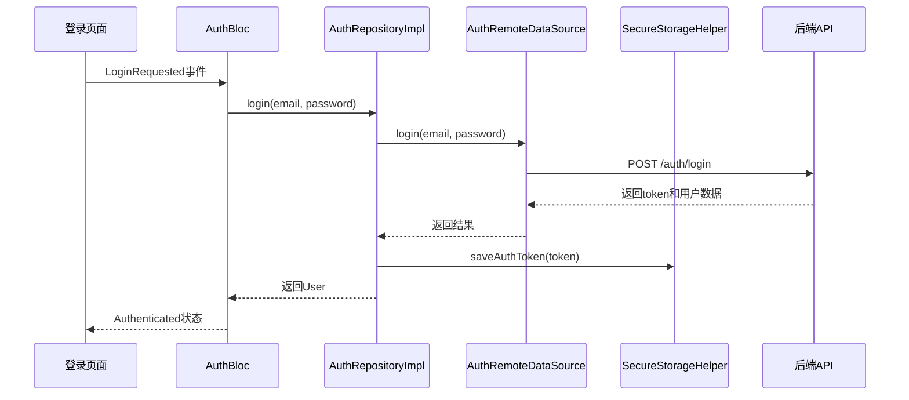
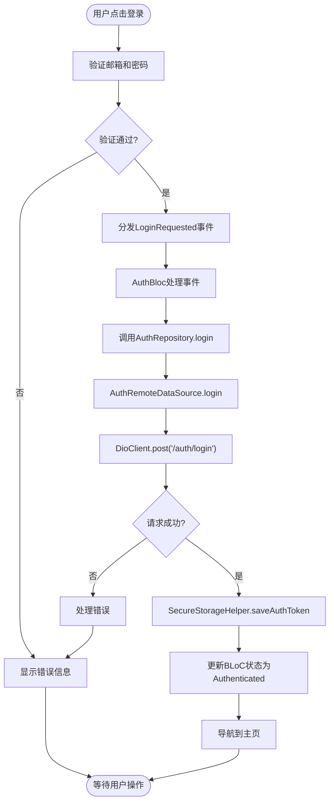
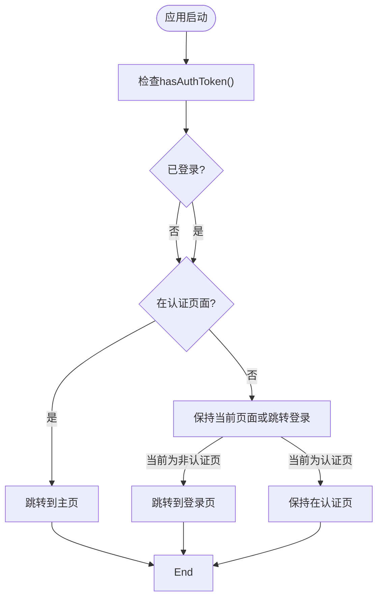
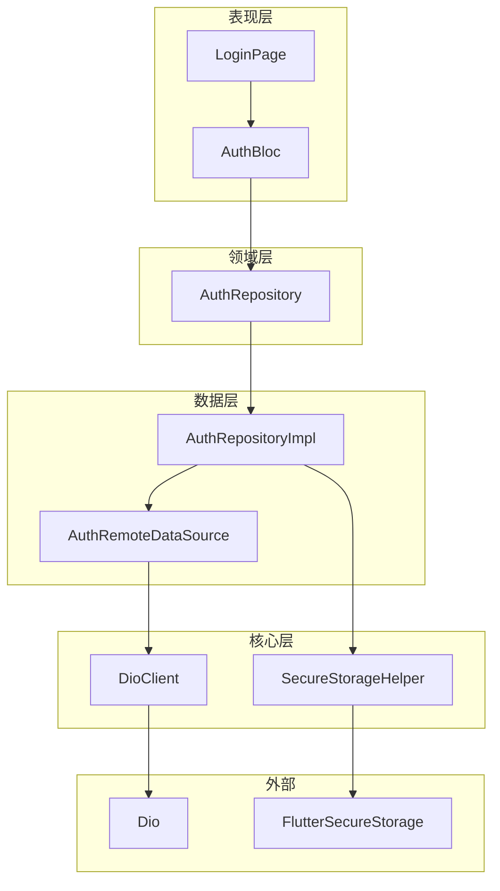

# Flutter移动端集成

<cite>
**本文档引用文件**   
- [api_client.dart](file://flutter_app/lib/data/api/api_client.dart)
- [api_constants.dart](file://flutter_app/lib/config/api_constants.dart)
- [dio_client.dart](file://flutter_app/lib/core/network/dio_client.dart)
- [secure_storage_helper.dart](file://flutter_app/lib/core/storage/secure_storage_helper.dart)
- [secure_storage.dart](file://flutter_app/lib/data/storage/secure_storage.dart)
- [auth_remote_data_source.dart](file://flutter_app/lib/data/datasources/remote/auth_remote_data_source.dart)
- [auth_repository_impl.dart](file://flutter_app/lib/data/repositories/auth_repository_impl.dart)
- [auth_repository.dart](file://flutter_app/lib/domain/repositories/auth_repository.dart)
- [auth_bloc.dart](file://flutter_app/lib/presentation/auth/bloc/auth_bloc.dart)
- [routes.dart](file://flutter_app/lib/config/routes.dart)
- [pubspec.yaml](file://flutter_app/pubspec.yaml)
- [FLUTTER_SETUP_GUIDE.md](file://FLUTTER_SETUP_GUIDE.md)
</cite>

## 目录
1. [项目结构](#项目结构)
2. [API客户端封装](#api客户端封装)
3. [端点定义与环境配置](#端点定义与环境配置)
4. [Dio客户端配置](#dio客户端配置)
5. [安全存储机制](#安全存储机制)
6. [认证数据流](#认证数据流)
7. [API调用示例](#api调用示例)
8. [路由守卫与导航](#路由守卫与导航)
9. [依赖关系图](#依赖关系图)

## 项目结构

Flutter应用采用分层架构设计，将代码组织为清晰的目录结构，遵循关注点分离原则。核心目录包括`lib/config`（配置）、`lib/core`（核心功能）、`lib/data`（数据层）、`lib/domain`（领域层）和`lib/presentation`（表现层）。

**图示来源**
- [项目结构](file://flutter_app)

**本节来源**
- [项目结构](file://flutter_app)

## API客户端封装

`api_client.dart`文件实现了基于Dio的API客户端封装，提供统一的HTTP请求接口和自动认证头注入功能。该类通过`SecureStorage`获取JWT令牌，并在每个请求中自动添加Authorization头。

**图示来源**
- [api_client.dart](file://flutter_app/lib/data/api/api_client.dart#L5-L103)
- [secure_storage.dart](file://flutter_app/lib/data/storage/secure_storage.dart#L4-L45)

**本节来源**
- [api_client.dart](file://flutter_app/lib/data/api/api_client.dart#L5-L103)
- [secure_storage.dart](file://flutter_app/lib/data/storage/secure_storage.dart#L4-L45)

## 端点定义与环境配置

`api_constants.dart`文件集中定义了所有API端点和配置常量，包括基础URL、超时设置和存储键。基础URL通过`String.fromEnvironment`从构建环境注入，支持不同环境下的不同后端地址。

**图示来源**
- [api_constants.dart](file://flutter_app/lib/config/api_constants.dart#L1-L36)

**本节来源**
- [api_constants.dart](file://flutter_app/lib/config/api_constants.dart#L1-L36)

## Dio客户端配置

`dio_client.dart`文件提供了更高级的Dio客户端封装，包含多个拦截器用于日志记录、错误处理和认证。该实现使用依赖注入（`@lazySingleton`），确保在整个应用中共享同一个实例。

**图示来源**
- [dio_client.dart](file://flutter_app/lib/core/network/dio_client.dart#L12-L262)

**本节来源**
- [dio_client.dart](file://flutter_app/lib/core/network/dio_client.dart#L12-L262)

## 安全存储机制

`secure_storage_helper.dart`文件封装了`flutter_secure_storage`插件，提供安全的数据存储功能。该类实现了单例模式，用于存储敏感信息如认证令牌、用户密码和生物识别状态。

**图示来源**
- [secure_storage_helper.dart](file://flutter_app/lib/core/storage/secure_storage_helper.dart#L10-L194)

**本节来源**
- [secure_storage_helper.dart](file://flutter_app/lib/core/storage/secure_storage_helper.dart#L10-L194)

## 认证数据流

认证功能通过BLoC模式实现，从UI事件触发到API调用形成完整数据流。当用户提交登录表单时，事件被发送到`AuthBloc`，由`AuthRepository`协调远程数据源和本地存储。

**图示来源**
- [auth_bloc.dart](file://flutter_app/lib/presentation/auth/bloc/auth_bloc.dart#L7-L82)
- [auth_repository_impl.dart](file://flutter_app/lib/data/repositories/auth_repository_impl.dart#L11-L114)
- [auth_remote_data_source.dart](file://flutter_app/lib/data/datasources/remote/auth_remote_data_source.dart#L7-L77)

**本节来源**
- [auth_bloc.dart](file://flutter_app/lib/presentation/auth/bloc/auth_bloc.dart#L7-L82)
- [auth_repository_impl.dart](file://flutter_app/lib/data/repositories/auth_repository_impl.dart#L11-L114)
- [auth_remote_data_source.dart](file://flutter_app/lib/data/datasources/remote/auth_remote_data_source.dart#L7-L77)

## API调用示例

以下展示了从BLoC触发到Repository调用API的完整流程。以登录功能为例，`AuthBloc`接收`LoginRequested`事件，调用`AuthRepository`的`login`方法，该方法通过`AuthRemoteDataSource`发起网络请求。

**图示来源**
- [auth_bloc.dart](file://flutter_app/lib/presentation/auth/bloc/auth_bloc.dart#L36-L52)
- [auth_repository_impl.dart](file://flutter_app/lib/data/repositories/auth_repository_impl.dart#L21-L36)
- [auth_remote_data_source.dart](file://flutter_app/lib/data/datasources/remote/auth_remote_data_source.dart#L13-L22)

**本节来源**
- [auth_bloc.dart](file://flutter_app/lib/presentation/auth/bloc/auth_bloc.dart#L36-L52)
- [auth_repository_impl.dart](file://flutter_app/lib/data/repositories/auth_repository_impl.dart#L21-L36)
- [auth_remote_data_source.dart](file://flutter_app/lib/data/datasources/remote/auth_remote_data_source.dart#L13-L22)

## 路由守卫与导航

`routes.dart`文件实现了基于GoRouter的路由系统，包含路由守卫功能。通过`_handleRedirect`方法检查用户认证状态，实现自动重定向：未登录用户访问受保护页面时跳转到登录页，已登录用户访问登录页时跳转到主页。

**图示来源**
- [routes.dart](file://flutter_app/lib/config/routes.dart#L34-L155)

**本节来源**
- [routes.dart](file://flutter_app/lib/config/routes.dart#L34-L155)

## 依赖关系图

整个API集成系统的组件依赖关系如下图所示，展示了从表现层到数据层的完整依赖链。

**图示来源**
- [auth_bloc.dart](file://flutter_app/lib/presentation/auth/bloc/auth_bloc.dart)
- [auth_repository.dart](file://flutter_app/lib/domain/repositories/auth_repository.dart)
- [auth_repository_impl.dart](file://flutter_app/lib/data/repositories/auth_repository_impl.dart)
- [auth_remote_data_source.dart](file://flutter_app/lib/data/datasources/remote/auth_remote_data_source.dart)
- [dio_client.dart](file://flutter_app/lib/core/network/dio_client.dart)
- [secure_storage_helper.dart](file://flutter_app/lib/core/storage/secure_storage_helper.dart)

**本节来源**
- [auth_bloc.dart](file://flutter_app/lib/presentation/auth/bloc/auth_bloc.dart)
- [auth_repository.dart](file://flutter_app/lib/domain/repositories/auth_repository.dart)
- [auth_repository_impl.dart](file://flutter_app/lib/data/repositories/auth_repository_impl.dart)
- [auth_remote_data_source.dart](file://flutter_app/lib/data/datasources/remote/auth_remote_data_source.dart)
- [dio_client.dart](file://flutter_app/lib/core/network/dio_client.dart)
- [secure_storage_helper.dart](file://flutter_app/lib/core/storage/secure_storage_helper.dart)