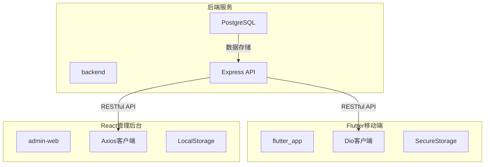
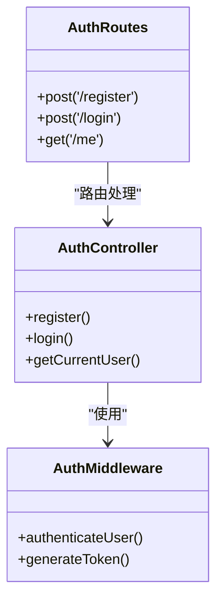
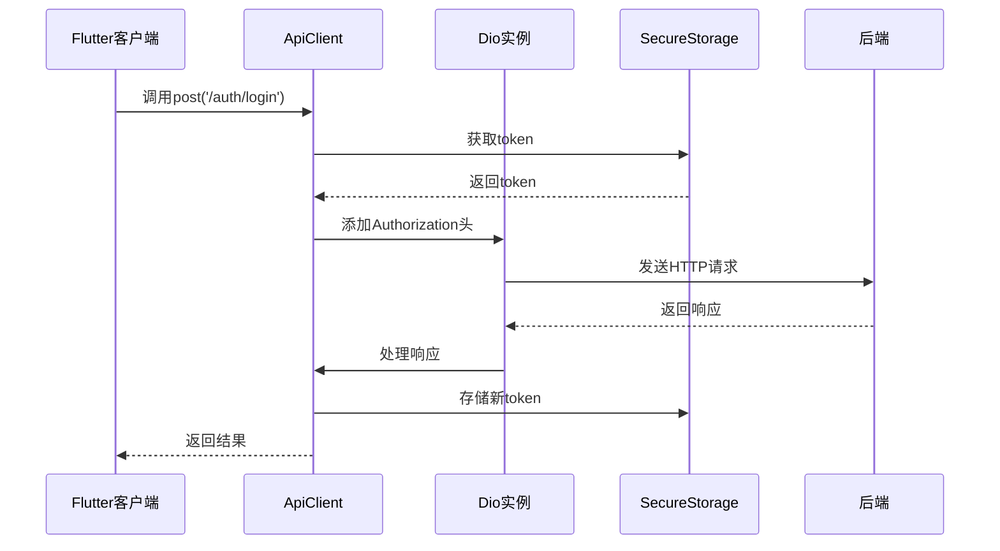
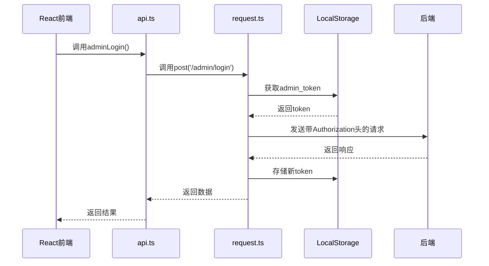
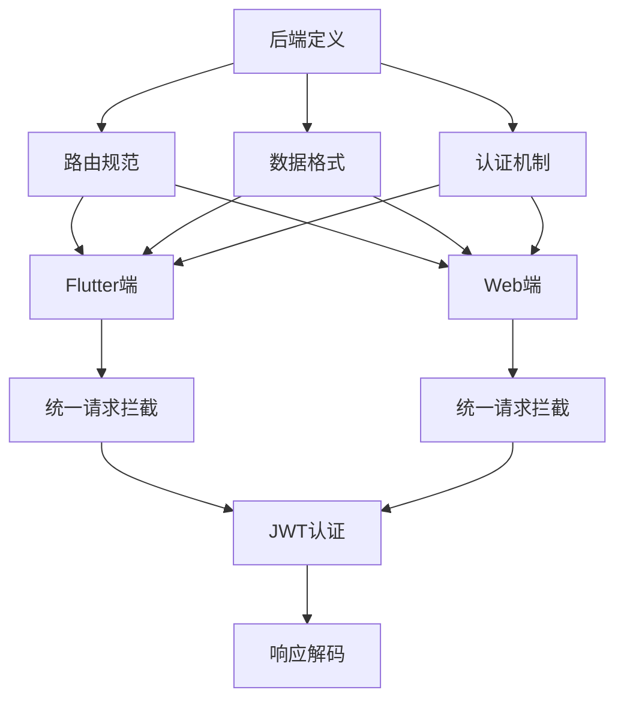
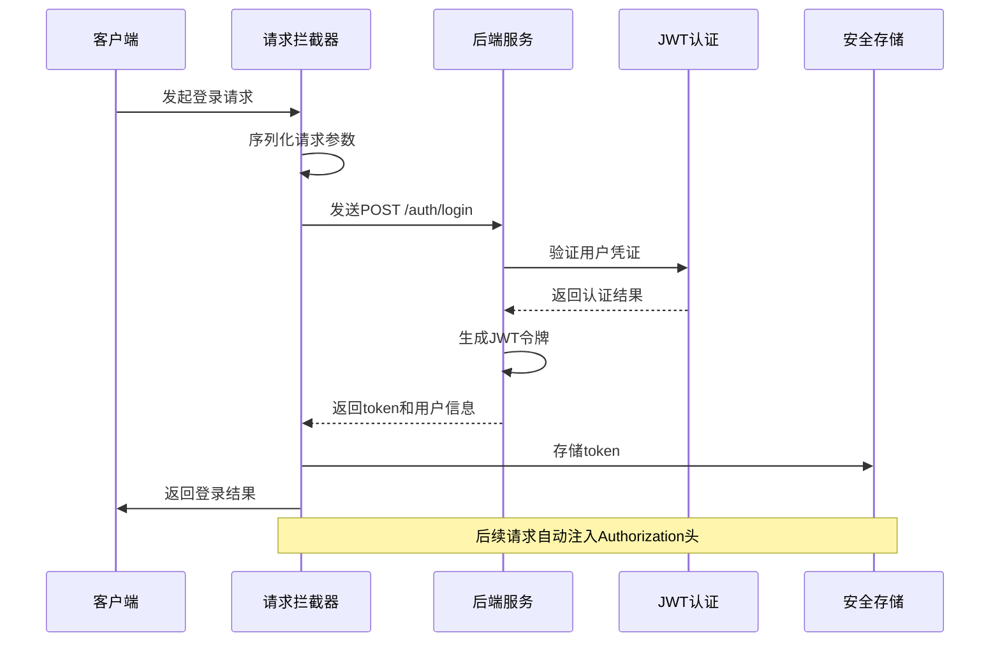
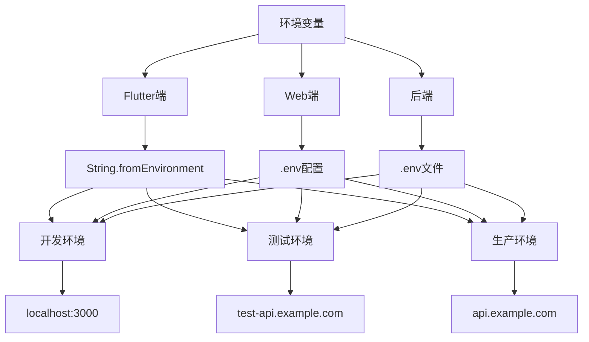

# 多端接口集成

<cite>
**本文档引用文件**  
- [auth.routes.ts](file://backend/src/routes/auth.routes.ts)
- [auth.controller.ts](file://backend/src/controllers/auth.controller.ts)
- [api_client.dart](file://flutter_app/lib/data/api/api_client.dart)
- [dio_client.dart](file://flutter_app/lib/core/network/dio_client.dart)
- [api_constants.dart](file://flutter_app/lib/config/api_constants.dart)
- [secure_storage.dart](file://flutter_app/lib/data/storage/secure_storage.dart)
- [auth.ts](file://backend/src/middleware/auth.ts)
- [api.ts](file://home/user/nian/admin-web/src/services/api.ts)
- [request.ts](file://home/user/nian/admin-web/src/utils/request.ts)
- [Login.tsx](file://home/user/nian/admin-web/src/pages/Login.tsx)
</cite>

## 目录
1. [项目结构](#项目结构)
2. [后端API路由规范](#后端api路由规范)
3. [Flutter端API集成](#flutter端api集成)
4. [Web管理后台API集成](#web管理后台api集成)
5. [三端一致性分析](#三端一致性分析)
6. [登录接口调用流程](#登录接口调用流程)
7. [环境隔离策略](#环境隔离策略)

## 项目结构

本项目采用多端分离架构，包含后端服务、Flutter移动端和React管理后台三个主要部分。各端通过RESTful API进行通信，确保数据一致性和功能完整性。

**图示来源**  
- [backend](file://backend)
- [flutter_app](file://flutter_app)
- [admin-web](file://home/user/nian/admin-web)

## 后端API路由规范

后端采用Express框架定义RESTful API路由，其中认证相关路由在`auth.routes.ts`中定义，遵循标准的HTTP方法和URL设计规范。

**图示来源**  
- [auth.routes.ts](file://backend/src/routes/auth.routes.ts#L7-L14)
- [auth.controller.ts](file://backend/src/controllers/auth.controller.ts#L8-L127)
- [auth.ts](file://backend/src/middleware/auth.ts#L8-L86)

**本节来源**  
- [auth.routes.ts](file://backend/src/routes/auth.routes.ts#L1-L17)
- [auth.controller.ts](file://backend/src/controllers/auth.controller.ts#L1-L150)

## Flutter端API集成

Flutter移动端通过Dio客户端封装API请求，实现了统一的请求拦截、错误处理和响应解码机制。`api_client.dart`文件定义了基础的HTTP方法封装。

**图示来源**  
- [api_client.dart](file://flutter_app/lib/data/api/api_client.dart#L5-L206)
- [secure_storage.dart](file://flutter_app/lib/data/storage/secure_storage.dart#L1-L45)

**本节来源**  
- [api_client.dart](file://flutter_app/lib/data/api/api_client.dart#L1-L207)
- [dio_client.dart](file://flutter_app/lib/core/network/dio_client.dart#L1-L262)
- [api_constants.dart](file://flutter_app/lib/config/api_constants.dart#L1-L73)

## Web管理后台API集成

React管理后台使用Axios封装API请求，通过`request.ts`配置基础客户端，`api.ts`定义具体的服务接口。与Flutter端类似，也实现了请求拦截和错误处理。

**图示来源**  
- [api.ts](file://home/user/nian/admin-web/src/services/api.ts#L1-L61)
- [request.ts](file://home/user/nian/admin-web/src/utils/request.ts#L1-L81)

**本节来源**  
- [api.ts](file://home/user/nian/admin-web/src/services/api.ts#L1-L61)
- [request.ts](file://home/user/nian/admin-web/src/utils/request.ts#L1-L81)
- [Login.tsx](file://home/user/nian/admin-web/src/pages/Login.tsx#L1-L127)

## 三端一致性分析

为确保后端、Flutter移动端和Web管理后台对同一接口的URL、HTTP方法、请求头、认证机制和数据格式保持一致，各端遵循统一的设计规范。

**图示来源**  
- [auth.routes.ts](file://backend/src/routes/auth.routes.ts)
- [api_client.dart](file://flutter_app/lib/data/api/api_client.dart)
- [api.ts](file://home/user/nian/admin-web/src/services/api.ts)

**本节来源**  
- [auth.routes.ts](file://backend/src/routes/auth.routes.ts#L1-L17)
- [api_client.dart](file://flutter_app/lib/data/api/api_client.dart#L1-L207)
- [api.ts](file://home/user/nian/admin-web/src/services/api.ts#L1-L61)

## 登录接口调用流程

登录接口是三端集成的核心，其调用流程体现了统一的认证机制和数据处理模式。从请求参数序列化到Authorization头注入，再到令牌刷新机制，各端实现保持一致。

**图示来源**  
- [auth.controller.ts](file://backend/src/controllers/auth.controller.ts#L70-L125)
- [api_client.dart](file://flutter_app/lib/data/api/api_client.dart#L59-L72)
- [api.ts](file://home/user/nian/admin-web/src/services/api.ts#L19-L21)

**本节来源**  
- [auth.controller.ts](file://backend/src/controllers/auth.controller.ts#L70-L125)
- [api_client.dart](file://flutter_app/lib/data/api/api_client.dart#L59-L72)
- [api.ts](file://home/user/nian/admin-web/src/services/api.ts#L19-L21)

## 环境隔离策略

为支持开发、测试和生产不同环境的隔离，各端采用了相应的配置策略，确保在不同部署环境下能够正确连接对应的后端服务。

**图示来源**  
- [api_constants.dart](file://flutter_app/lib/config/api_constants.dart#L3-L6)
- [request.ts](file://home/user/nian/admin-web/src/utils/request.ts#L4)
- [.env.example](file://.env.example)

**本节来源**  
- [api_constants.dart](file://flutter_app/lib/config/api_constants.dart#L1-L73)
- [request.ts](file://home/user/nian/admin-web/src/utils/request.ts#L1-L81)
- [auth.ts](file://backend/src/middleware/auth.ts#L6)