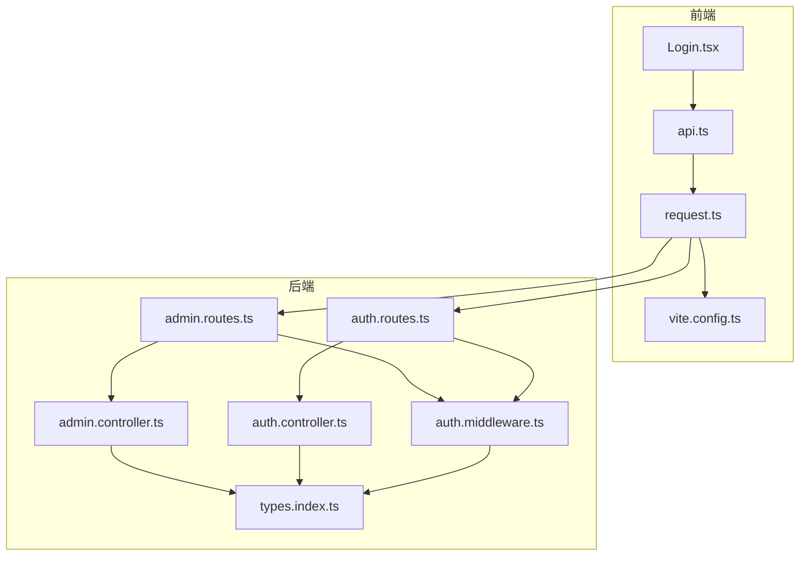
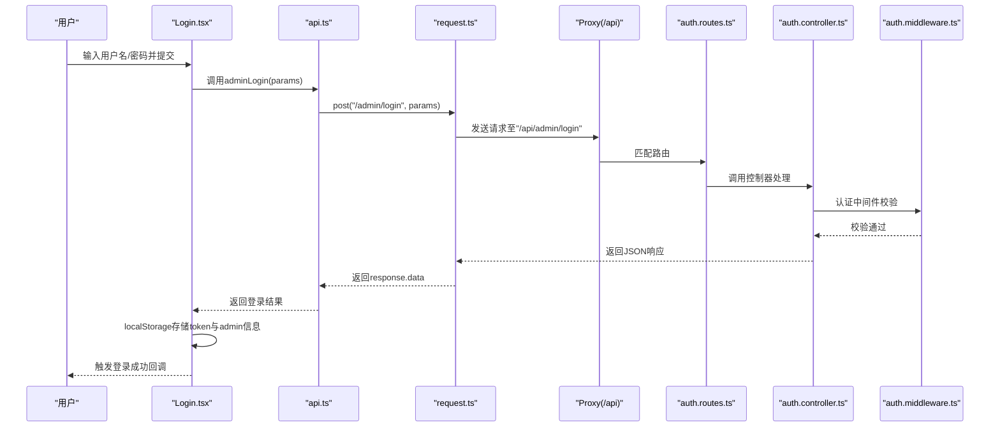
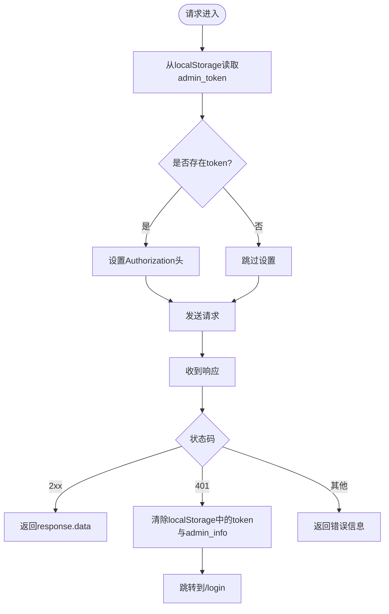
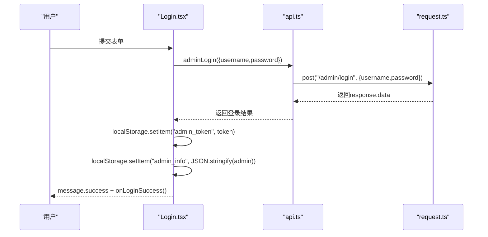
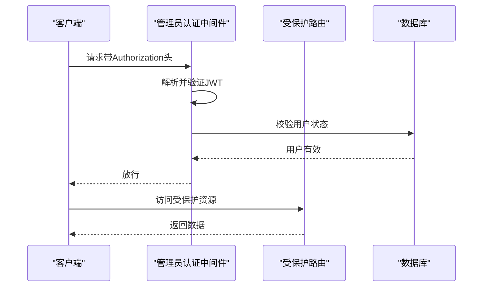
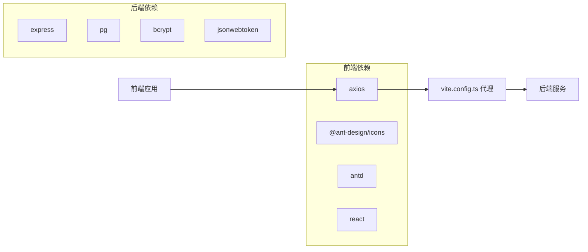

# 管理后台Web集成

<cite>
**本文引用的文件**
- [api.ts](file://home/user/nian/admin-web/src/services/api.ts)
- [request.ts](file://home/user/nian/admin-web/src/utils/request.ts)
- [Login.tsx](file://home/user/nian/admin-web/src/pages/Login.tsx)
- [vite.config.ts](file://home/user/nian/admin-web/vite.config.ts)
- [auth.routes.ts](file://backend/src/routes/auth.routes.ts)
- [admin.routes.ts](file://backend/src/routes/admin.routes.ts)
- [auth.controller.ts](file://backend/src/controllers/auth.controller.ts)
- [admin.controller.ts](file://backend/src/controllers/admin.controller.ts)
- [auth.middleware.ts](file://backend/src/middleware/auth.ts)
- [types.index.ts](file://backend/src/types/index.ts)
- [package.json（前端）](file://home/user/nian/admin-web/package.json)
- [package.json（后端）](file://backend/package.json)
</cite>

## 目录
1. [引言](#引言)
2. [项目结构](#项目结构)
3. [核心组件](#核心组件)
4. [架构总览](#架构总览)
5. [详细组件分析](#详细组件分析)
6. [依赖关系分析](#依赖关系分析)
7. [性能考虑](#性能考虑)
8. [故障排查指南](#故障排查指南)
9. [结论](#结论)
10. [附录](#附录)

## 引言
本文件面向管理后台Web端，系统性解析前端如何通过api.ts与request.ts集成后端API，重点覆盖：
- request.ts对axios的封装：基础URL、超时、请求/响应拦截器、统一错误处理与JWT认证头自动附加
- Login.tsx中的登录流程：Token存储与后续请求认证传递
- 与后端auth.routes.ts与admin.routes.ts的路由一致性：HTTP方法、路径参数、请求体格式
- Vite环境隔离与代理配置（开发/预发布/生产）
- 类型安全与接口定义

## 项目结构
前端采用Vite + React + Ant Design + Axios，核心文件组织如下：
- services/api.ts：业务API函数集合，统一对外暴露REST调用
- utils/request.ts：axios客户端封装与拦截器
- pages/Login.tsx：登录页面，负责发起登录并存储Token
- vite.config.ts：开发服务器与代理配置
- backend/src：后端Express路由与控制器，提供管理后台API

图表来源
- [api.ts](file://home/user/nian/admin-web/src/services/api.ts#L1-L61)
- [request.ts](file://home/user/nian/admin-web/src/utils/request.ts#L1-L81)
- [Login.tsx](file://home/user/nian/admin-web/src/pages/Login.tsx#L1-L127)
- [vite.config.ts](file://home/user/nian/admin-web/vite.config.ts#L1-L43)
- [auth.routes.ts](file://backend/src/routes/auth.routes.ts#L1-L17)
- [admin.routes.ts](file://backend/src/routes/admin.routes.ts#L1-L98)
- [auth.controller.ts](file://backend/src/controllers/auth.controller.ts#L1-L150)
- [admin.controller.ts](file://backend/src/controllers/admin.controller.ts#L1-L200)
- [auth.middleware.ts](file://backend/src/middleware/auth.ts#L1-L87)
- [types.index.ts](file://backend/src/types/index.ts#L1-L126)

章节来源
- [api.ts](file://home/user/nian/admin-web/src/services/api.ts#L1-L61)
- [request.ts](file://home/user/nian/admin-web/src/utils/request.ts#L1-L81)
- [Login.tsx](file://home/user/nian/admin-web/src/pages/Login.tsx#L1-L127)
- [vite.config.ts](file://home/user/nian/admin-web/vite.config.ts#L1-L43)

## 核心组件
- axios客户端封装与拦截器
  - 基础URL为“/api”，统一超时与Content-Type
  - 请求拦截器：从localStorage读取admin_token并注入Authorization头
  - 响应拦截器：统一返回response.data；401时清理本地Token并跳转登录
- 业务API层
  - adminLogin等方法直接调用apiClient，形成清晰的业务接口
- 登录流程
  - 调用adminLogin，成功后将token与admin信息写入localStorage，并触发onLoginSuccess

章节来源
- [request.ts](file://home/user/nian/admin-web/src/utils/request.ts#L1-L81)
- [api.ts](file://home/user/nian/admin-web/src/services/api.ts#L1-L61)
- [Login.tsx](file://home/user/nian/admin-web/src/pages/Login.tsx#L1-L127)

## 架构总览
前端通过axios封装向后端发送请求，Vite开发服务器通过代理将/api前缀转发到后端服务。后端路由按模块划分，管理后台相关接口集中在admin.routes.ts，认证相关接口在auth.routes.ts。

图表来源
- [Login.tsx](file://home/user/nian/admin-web/src/pages/Login.tsx#L1-L127)
- [api.ts](file://home/user/nian/admin-web/src/services/api.ts#L1-L61)
- [request.ts](file://home/user/nian/admin-web/src/utils/request.ts#L1-L81)
- [vite.config.ts](file://home/user/nian/admin-web/vite.config.ts#L1-L43)
- [auth.routes.ts](file://backend/src/routes/auth.routes.ts#L1-L17)
- [auth.controller.ts](file://backend/src/controllers/auth.controller.ts#L1-L150)
- [auth.middleware.ts](file://backend/src/middleware/auth.ts#L1-L87)

## 详细组件分析

### request.ts：axios封装与拦截器
- 基础配置
  - baseURL="/api"
  - timeout=10000
  - Content-Type=application/json
- 请求拦截器
  - 从localStorage读取admin_token
  - 若存在则在请求头添加Authorization: Bearer {token}
- 响应拦截器
  - 成功：返回response.data
  - 失败：若状态码为401，则移除admin_token与admin_info并跳转到/login
  - 其他错误：返回后端data或错误消息

图表来源
- [request.ts](file://home/user/nian/admin-web/src/utils/request.ts#L1-L81)

章节来源
- [request.ts](file://home/user/nian/admin-web/src/utils/request.ts#L1-L81)

### api.ts：业务API函数
- 登录
  - adminLogin：POST /admin/login
- 统计
  - getAdminStats：GET /admin/stats
- 方法管理
  - getMethods：GET /admin/methods（支持查询参数）
  - getMethodById：GET /admin/methods/{id}
  - createMethod：POST /admin/methods
  - updateMethod：PUT /admin/methods/{id}
  - deleteMethod：DELETE /admin/methods/{id}
- 审核
  - getPendingMethods：GET /admin/methods/pending（支持查询参数）
  - approveMethod：POST /admin/methods/{id}/approve
  - rejectMethod：POST /admin/methods/{id}/reject

章节来源
- [api.ts](file://home/user/nian/admin-web/src/services/api.ts#L1-L61)

### Login.tsx：登录流程与Token存储
- 表单提交后调用adminLogin
- 成功后将token与admin信息写入localStorage
- 显示成功提示并触发onLoginSuccess回调
- 失败时显示错误提示

图表来源
- [Login.tsx](file://home/user/nian/admin-web/src/pages/Login.tsx#L1-L127)
- [api.ts](file://home/user/nian/admin-web/src/services/api.ts#L1-L61)
- [request.ts](file://home/user/nian/admin-web/src/utils/request.ts#L1-L81)

章节来源
- [Login.tsx](file://home/user/nian/admin-web/src/pages/Login.tsx#L1-L127)

### 与后端路由的一致性校验
- 前端调用路径与后端路由需严格对应
  - /admin/login 对应后端 admin.routes.ts 的 POST /login
  - /admin/methods 对应后端 admin.routes.ts 的 GET/POST/PUT/DELETE /methods
  - /admin/methods/{id}/approve 与 /admin/methods/{id}/reject 对应后端 POST /methods/:id/approve 与 /methods/:id/reject
- HTTP方法与请求体
  - 登录：POST，请求体包含username/password
  - 创建方法：POST，请求体包含标题、分类、难度、时长、内容等字段
  - 更新方法：PUT，路径参数{id}，请求体包含可选字段
  - 删除方法：DELETE，路径参数{id}

章节来源
- [api.ts](file://home/user/nian/admin-web/src/services/api.ts#L1-L61)
- [admin.routes.ts](file://backend/src/routes/admin.routes.ts#L1-L98)
- [admin.controller.ts](file://backend/src/controllers/admin.controller.ts#L1-L200)

### 认证与JWT
- 前端
  - 请求拦截器自动附加Authorization头
  - 401时清理本地Token并跳转登录
- 后端
  - 管理员认证中间件authenticateAdmin验证Bearer Token
  - 生成Token时包含id、username、role、isAdmin等声明
  - 登录成功返回token与admin信息

图表来源
- [request.ts](file://home/user/nian/admin-web/src/utils/request.ts#L1-L81)
- [auth.middleware.ts](file://backend/src/middleware/auth.ts#L1-L87)
- [admin.controller.ts](file://backend/src/controllers/admin.controller.ts#L1-L200)

章节来源
- [request.ts](file://home/user/nian/admin-web/src/utils/request.ts#L1-L81)
- [auth.middleware.ts](file://backend/src/middleware/auth.ts#L1-L87)
- [admin.controller.ts](file://backend/src/controllers/admin.controller.ts#L1-L200)

### 类型安全与接口定义
- 前端
  - api.ts中定义了LoginParams、MethodParams等接口，约束请求参数
  - 与后端控制器的字段保持一致，减少运行期错误
- 后端
  - types/index.ts定义了User、Admin、Method、ApiResponse、PaginatedResponse等类型
  - 控制器返回值遵循统一的ApiResponse结构

章节来源
- [api.ts](file://home/user/nian/admin-web/src/services/api.ts#L1-L61)
- [types.index.ts](file://backend/src/types/index.ts#L1-L126)
- [auth.controller.ts](file://backend/src/controllers/auth.controller.ts#L1-L150)
- [admin.controller.ts](file://backend/src/controllers/admin.controller.ts#L1-L200)

## 依赖关系分析
- 前端依赖
  - axios用于HTTP请求
  - antd用于UI组件
  - vite用于开发与构建
- 后端依赖
  - express、jsonwebtoken、bcrypt、pg等
- 前后端交互
  - 前端通过/api前缀访问后端
  - Vite开发服务器代理到后端服务

图表来源
- [package.json（前端）](file://home/user/nian/admin-web/package.json#L1-L65)
- [package.json（后端）](file://backend/package.json#L1-L55)
- [vite.config.ts](file://home/user/nian/admin-web/vite.config.ts#L1-L43)

章节来源
- [package.json（前端）](file://home/user/nian/admin-web/package.json#L1-L65)
- [package.json（后端）](file://backend/package.json#L1-L55)
- [vite.config.ts](file://home/user/nian/admin-web/vite.config.ts#L1-L43)

## 性能考虑
- 请求超时设置为10秒，避免长时间阻塞
- 使用代理在开发环境减少跨域问题，提升调试效率
- 统一返回response.data，减少前端重复解析
- 建议在高频接口上增加缓存策略与分页查询，降低后端压力

## 故障排查指南
- 登录后无法访问受保护接口
  - 检查localStorage中是否存在admin_token与admin_info
  - 确认请求拦截器已附加Authorization头
  - 若出现401，确认后端JWT是否过期或被篡改
- 开发环境无法访问后端
  - 检查vite.config.ts中代理配置是否指向正确的后端地址
  - 确认后端服务已启动且端口开放
- 接口参数不匹配
  - 对照admin.routes.ts与api.ts的路径与方法
  - 确认请求体字段与后端控制器期望一致

章节来源
- [request.ts](file://home/user/nian/admin-web/src/utils/request.ts#L1-L81)
- [vite.config.ts](file://home/user/nian/admin-web/vite.config.ts#L1-L43)
- [admin.routes.ts](file://backend/src/routes/admin.routes.ts#L1-L98)
- [api.ts](file://home/user/nian/admin-web/src/services/api.ts#L1-L61)

## 结论
该管理后台Web端通过axios封装实现了统一的请求/响应处理与JWT认证，前端API函数与后端路由保持强一致，配合Vite代理与类型定义，形成了清晰、可维护的前后端协作模式。建议在生产环境中进一步完善错误日志、Token刷新与权限细化，以提升安全性与用户体验。

## 附录
- 环境隔离与代理
  - 开发：Vite代理将/api转发到后端服务，便于联调
  - 预发布/生产：可通过构建产物与反向代理配置调整基础URL与静态资源部署
- 建议
  - 在request.ts中增加重试与降级策略
  - 在api.ts中补充更严格的参数校验与错误提示
  - 在后端引入Swagger文档与接口测试，保障契约稳定