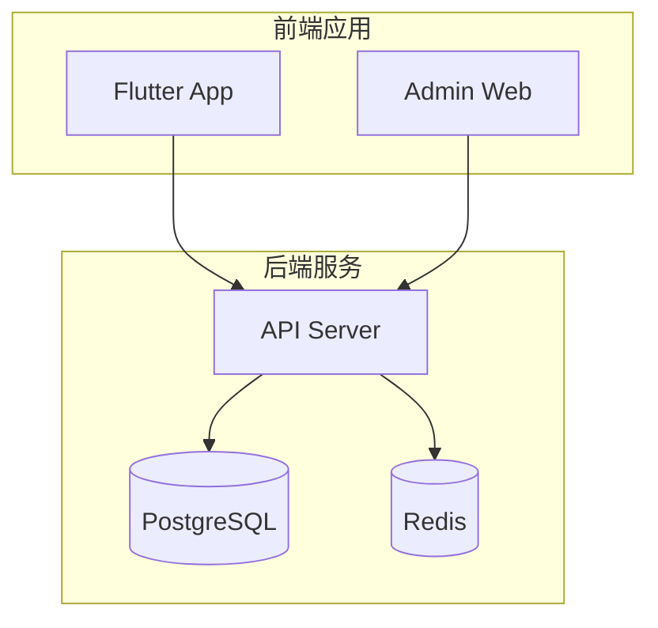
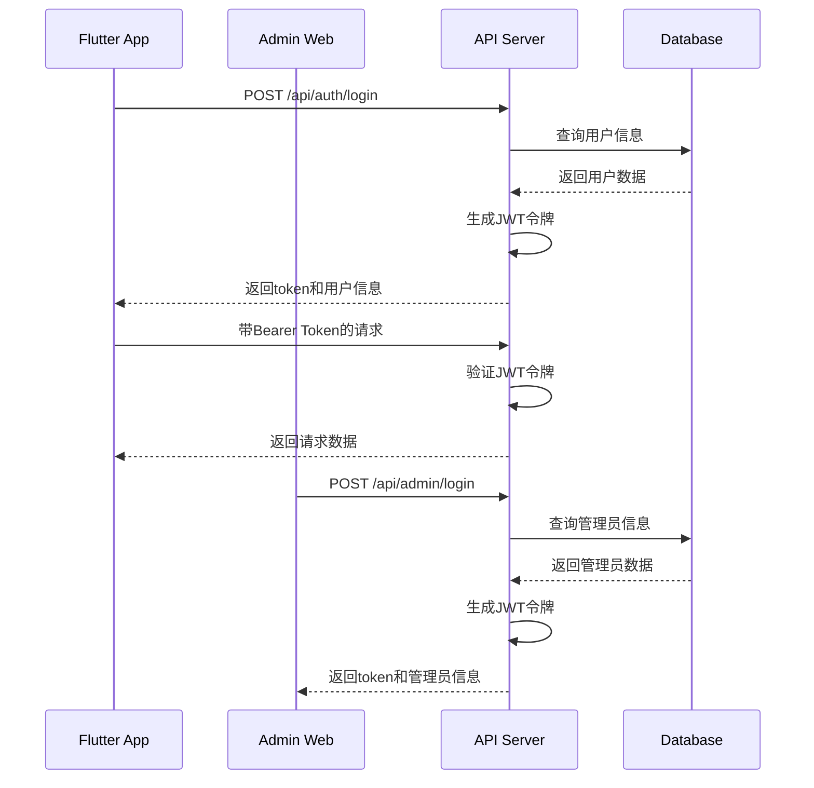
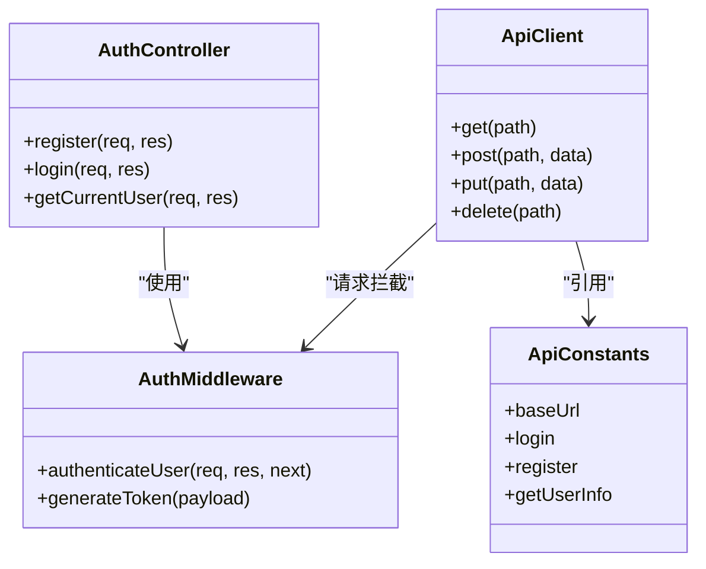
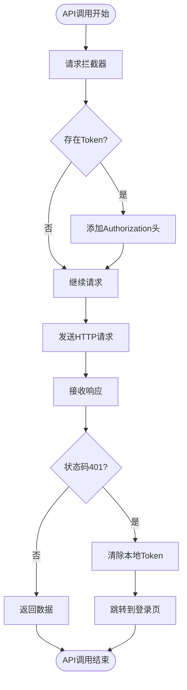
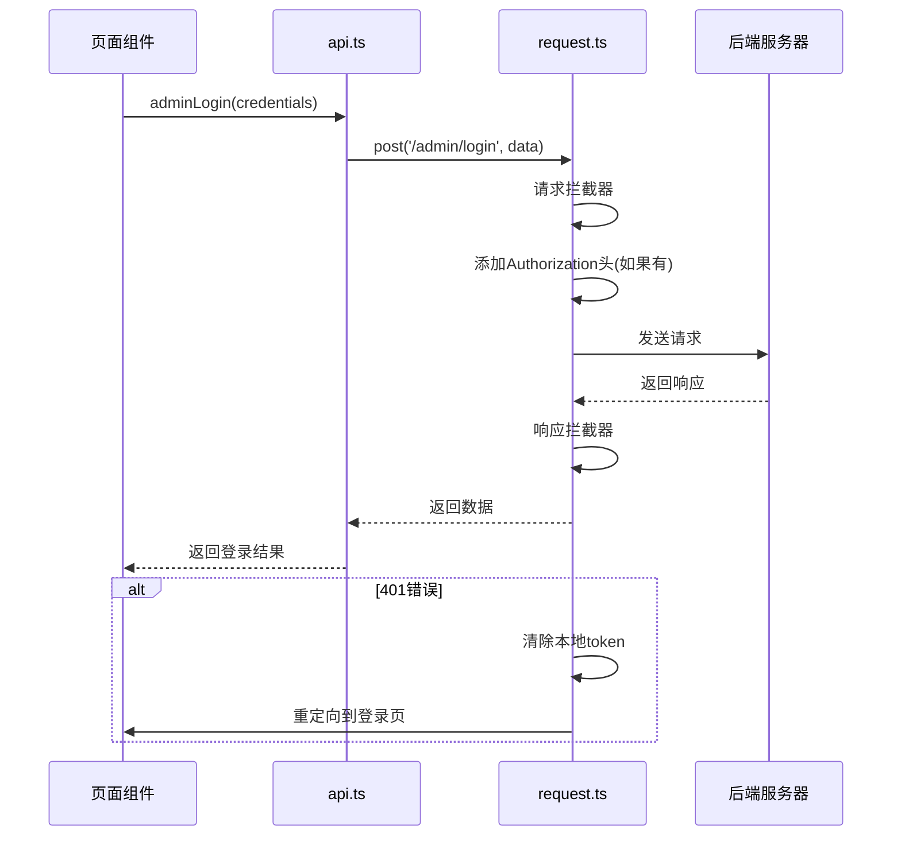
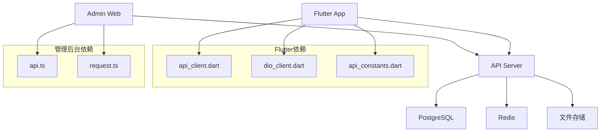

# 接口联调

<cite>
**本文档引用的文件**
- [auth.routes.ts](file://backend/src/routes/auth.routes.ts)
- [api_client.dart](file://flutter_app/lib/data/api/api_client.dart)
- [dio_client.dart](file://flutter_app/lib/core/network/dio_client.dart)
- [api_constants.dart](file://flutter_app/lib/config/api_constants.dart)
- [auth.controller.ts](file://backend/src/controllers/auth.controller.ts)
- [auth.ts](file://backend/src/middleware/auth.ts)
- [types/index.ts](file://backend/src/types/index.ts)
- [api.ts](file://home/user/nian/admin-web/src/services/api.ts)
- [request.ts](file://home/user/nian/admin-web/src/utils/request.ts)
- [index.ts](file://backend/src/index.ts)
</cite>

## 目录
1. [项目结构](#项目结构)
2. [核心组件](#核心组件)
3. [架构概述](#架构概述)
4. [详细组件分析](#详细组件分析)
5. [依赖分析](#依赖分析)
6. [性能考虑](#性能考虑)
7. [故障排除指南](#故障排除指南)
8. [结论](#结论)

## 项目结构

本项目采用多端分离的架构设计，包含后端API服务、Flutter移动端应用和管理后台三个主要部分。后端使用Node.js + Express框架，提供RESTful API接口；Flutter应用作为用户端，实现跨平台移动体验；管理后台基于React技术栈，提供内容管理和数据分析功能。



**图表来源**
- [index.ts](file://backend/src/index.ts#L1-L85)
- [api_client.dart](file://flutter_app/lib/data/api/api_client.dart#L1-L207)
- [request.ts](file://home/user/nian/admin-web/src/utils/request.ts#L1-L81)

**本节来源**
- [index.ts](file://backend/src/index.ts#L1-L85)
- [project_structure](file://#L1-L500)

## 核心组件

系统的核心组件包括认证系统、API客户端封装、数据模型定义和请求拦截机制。后端通过Express路由定义RESTful端点，结合JWT实现用户认证；Flutter端使用Dio库进行HTTP请求封装，实现请求拦截和响应解码；管理后台使用Axios进行服务调用。三端共享统一的API接口规范，确保开发一致性。

**本节来源**
- [auth.routes.ts](file://backend/src/routes/auth.routes.ts#L1-L17)
- [api_client.dart](file://flutter_app/lib/data/api/api_client.dart#L1-L207)
- [api.ts](file://home/user/nian/admin-web/src/services/api.ts#L1-L61)

## 架构概述

系统采用分层架构设计，前后端通过RESTful API进行通信。后端提供标准化的JSON响应格式，包含success、data、message等字段。认证采用JWT令牌机制，通过HTTP Authorization头传递。所有API请求均以/api为前缀，不同模块通过子路径区分。



**图表来源**
- [auth.routes.ts](file://backend/src/routes/auth.routes.ts#L1-L17)
- [auth.controller.ts](file://backend/src/controllers/auth.controller.ts#L1-L150)
- [auth.ts](file://backend/src/middleware/auth.ts#L1-L87)

## 详细组件分析

### 认证系统分析

系统实现了一套完整的用户认证机制，包含注册、登录和获取用户信息等接口。后端使用bcrypt加密存储密码，JWT生成认证令牌，前端自动处理令牌的存储和注入。

#### 认证类图


**图表来源**
- [auth.controller.ts](file://backend/src/controllers/auth.controller.ts#L1-L150)
- [auth.ts](file://backend/src/middleware/auth.ts#L1-L87)
- [api_constants.dart](file://flutter_app/lib/config/api_constants.dart#L1-L73)

### API客户端封装分析

Flutter端通过Dio库实现HTTP请求封装，提供统一的API调用接口。封装了请求拦截器，自动处理认证令牌的添加和错误处理。

#### Dio客户端流程图


**图表来源**
- [dio_client.dart](file://flutter_app/lib/core/network/dio_client.dart#L1-L262)
- [api_client.dart](file://flutter_app/lib/data/api/api_client.dart#L1-L207)

### 管理后台服务调用分析

管理后台使用Axios封装API调用，实现与后端的通信。通过请求拦截器自动添加认证令牌，响应拦截器统一处理错误和重定向。

#### 管理后台API调用序列图


**图表来源**
- [api.ts](file://home/user/nian/admin-web/src/services/api.ts#L1-L61)
- [request.ts](file://home/user/nian/admin-web/src/utils/request.ts#L1-L81)

**本节来源**
- [auth.routes.ts](file://backend/src/routes/auth.routes.ts#L1-L17)
- [api_client.dart](file://flutter_app/lib/data/api/api_client.dart#L1-L207)
- [dio_client.dart](file://flutter_app/lib/core/network/dio_client.dart#L1-L262)
- [api.ts](file://home/user/nian/admin-web/src/services/api.ts#L1-L61)
- [request.ts](file://home/user/nian/admin-web/src/utils/request.ts#L1-L81)

## 依赖分析

系统各组件之间存在明确的依赖关系。后端服务依赖数据库和缓存系统，提供API接口；前端应用依赖后端API服务，实现用户界面；管理后台同样依赖后端API，提供管理功能。



**图表来源**
- [package.json](file://backend/package.json#L1-L55)
- [pubspec.yaml](file://flutter_app/pubspec.yaml)
- [index.ts](file://backend/src/index.ts#L1-L85)

**本节来源**
- [package.json](file://backend/package.json#L1-L55)
- [pubspec.yaml](file://flutter_app/pubspec.yaml)
- [index.ts](file://backend/src/index.ts#L1-L85)

## 性能考虑

系统在性能方面进行了多项优化。后端使用Redis缓存频繁访问的数据，减少数据库压力；API设置了合理的超时时间，避免请求长时间挂起；前端实现了请求拦截和错误处理，提升用户体验。建议在生产环境中配置CDN加速静态资源访问，使用连接池优化数据库访问性能。

## 故障排除指南

### CORS配置问题
当出现跨域问题时，检查后端CORS配置：
```typescript
app.use(cors({
  origin: process.env.CORS_ORIGIN?.split(',') || '*',
  credentials: true,
}));
```

### JWT过期处理
前端已实现自动处理JWT过期：
- Flutter端：`_AuthInterceptor`在401错误时清除本地token
- 管理后台：响应拦截器在401时清除token并重定向到登录页

### 参数序列化错误
确保请求头正确设置：
```dart
headers: {
  'Content-Type': 'application/json',
  'Accept': 'application/json',
}
```

**本节来源**
- [index.ts](file://backend/src/index.ts#L21-L25)
- [dio_client.dart](file://flutter_app/lib/core/network/dio_client.dart#L31-L34)
- [request.ts](file://home/user/nian/admin-web/src/utils/request.ts#L6-L8)

## 结论

本系统实现了前后端与管理后台的统一接口规范，通过标准化的RESTful API设计和JWT认证机制，确保了三端对同一API接口的理解一致。Flutter端通过Dio库实现了完善的HTTP请求封装，包括请求拦截、认证头自动注入和响应解码。管理后台使用Axios进行服务调用，同样实现了认证令牌的自动处理。建议通过自动化脚本从后端路由生成OpenAPI规范，并集成到前端开发环境，确保API文档的同步更新。