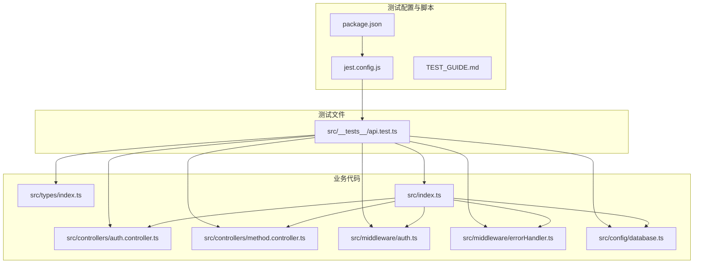
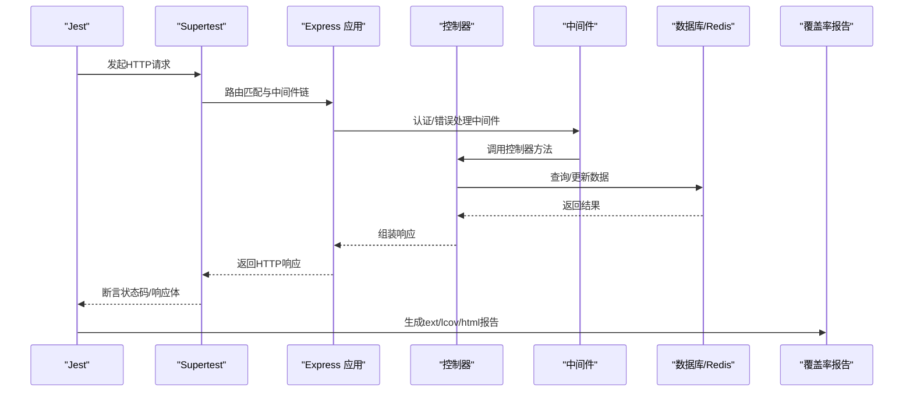
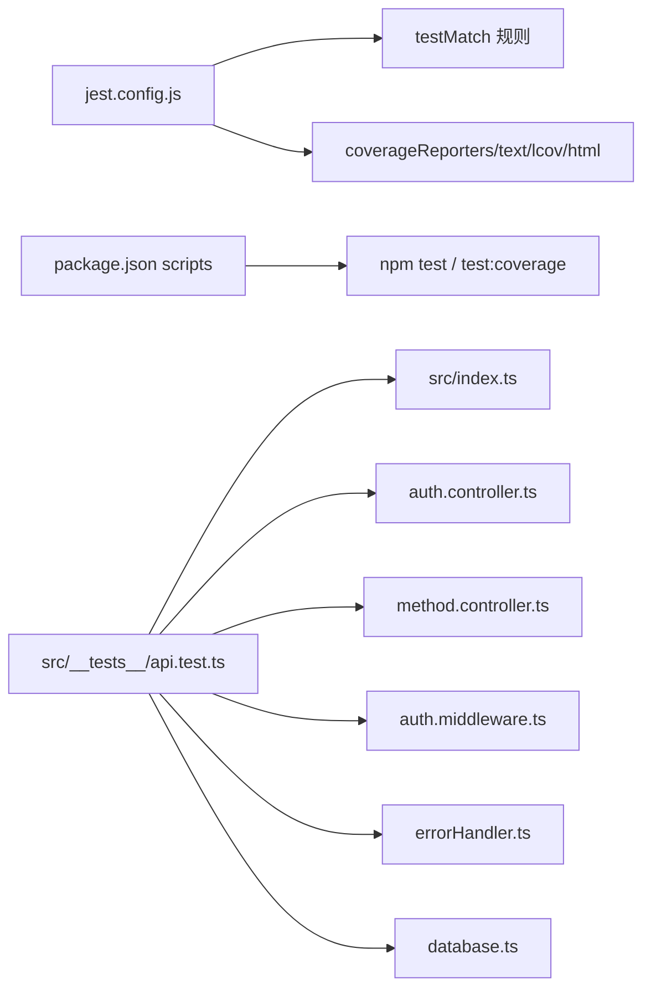

# 后端测试

<cite>
**本文引用的文件**
- [jest.config.js](file://backend/jest.config.js)
- [TEST_GUIDE.md](file://backend/TEST_GUIDE.md)
- [package.json](file://backend/package.json)
- [api.test.ts](file://backend/src/__tests__/api.test.ts)
- [auth.controller.ts](file://backend/src/controllers/auth.controller.ts)
- [method.controller.ts](file://backend/src/controllers/method.controller.ts)
- [auth.middleware.ts](file://backend/src/middleware/auth.ts)
- [errorHandler.ts](file://backend/src/middleware/errorHandler.ts)
- [types.index.ts](file://backend/src/types/index.ts)
- [index.ts](file://backend/src/index.ts)
- [database.ts](file://backend/src/config/database.ts)
</cite>

## 目录
1. [简介](#简介)
2. [项目结构](#项目结构)
3. [核心组件](#核心组件)
4. [架构总览](#架构总览)
5. [详细组件分析](#详细组件分析)
6. [依赖关系分析](#依赖关系分析)
7. [性能考量](#性能考量)
8. [故障排查指南](#故障排查指南)
9. [结论](#结论)
10. [附录](#附录)

## 简介
本文件围绕后端测试策略展开，基于 jest.config.js 的配置与 TEST_GUIDE.md 的指导，系统阐述如何使用 Jest + ts-jest + Supertest 对 Express 应用进行单元与集成测试。重点覆盖：
- Jest 配置项的含义与作用（模块解析、TypeScript 支持、测试环境、覆盖率收集器、测试文件匹配规则）
- 如何为控制器（如 auth.controller.ts、method.controller.ts）编写测试用例（请求模拟、响应断言、状态码验证、JWT 中间件 Mock 处理、数据库依赖隔离）
- 典型测试场景示例（用户注册成功、登录失败验证、方法列表分页查询等）
- 测试运行命令、覆盖率报告生成与 CI/CD 集成
- 常见问题与解决方案（异步测试超时、数据库连接未关闭、Mock 失效）

## 项目结构
后端测试相关的关键位置与职责如下：
- 配置与脚本
  - jest.config.js：Jest 测试框架配置，定义根目录、匹配规则、转换器、覆盖率收集器等
  - package.json：定义测试脚本（如 npm test、test:coverage、test:watch）
  - TEST_GUIDE.md：测试指南，包含测试目标、覆盖率目标、运行方式、最佳实践与 CI/CD 集成建议
- 测试文件
  - src/__tests__/api.test.ts：集成测试入口，覆盖认证、方法管理、管理员管理与健康检查
- 控制器与中间件
  - src/controllers/auth.controller.ts：用户注册、登录、获取当前用户
  - src/controllers/method.controller.ts：方法列表、详情、推荐、分类
  - src/middleware/auth.ts：JWT 认证中间件与 token 生成
  - src/middleware/errorHandler.ts：统一错误处理
  - src/types/index.ts：类型定义（如 AuthRequest、ApiResponse、PaginatedResponse）
- 应用入口与数据库
  - src/index.ts：Express 应用启动、路由挂载、错误处理、优雅关闭
  - src/config/database.ts：PostgreSQL 连接池与 Redis 客户端初始化、优雅关闭

图表来源
- [jest.config.js](file://backend/jest.config.js#L1-L37)
- [package.json](file://backend/package.json#L1-L55)
- [api.test.ts](file://backend/src/__tests__/api.test.ts#L1-L647)
- [auth.controller.ts](file://backend/src/controllers/auth.controller.ts#L1-L150)
- [method.controller.ts](file://backend/src/controllers/method.controller.ts#L1-L153)
- [auth.middleware.ts](file://backend/src/middleware/auth.ts#L1-L87)
- [errorHandler.ts](file://backend/src/middleware/errorHandler.ts#L1-L97)
- [types.index.ts](file://backend/src/types/index.ts#L1-L126)
- [index.ts](file://backend/src/index.ts#L1-L85)
- [database.ts](file://backend/src/config/database.ts#L1-L47)

章节来源
- [jest.config.js](file://backend/jest.config.js#L1-L37)
- [package.json](file://backend/package.json#L1-L55)
- [TEST_GUIDE.md](file://backend/TEST_GUIDE.md#L1-L283)

## 核心组件
- Jest 配置（jest.config.js）
  - preset: 使用 ts-jest 预设以启用 TypeScript 转换
  - testEnvironment: 使用 Node 环境
  - roots: 指定测试根目录为 src
  - testMatch: 匹配规则支持 __tests__/**.ts 与 ?(*.)+(spec|test).ts
  - transform: 将 .ts 文件交给 ts-jest 转换
  - collectCoverageFrom: 收集 src/**/*.ts 的覆盖率，排除 .d.ts 与 __tests__ 目录
  - coverageDirectory: 输出目录 coverage
  - coverageReporters: 生成 text、lcov、html 报告
  - moduleFileExtensions: 解析顺序 ts/js/json
  - verbose: 输出详细日志
- 测试脚本（package.json）
  - test: jest --coverage
  - 提供 test:watch 与 test:coverage 的脚本（参考 TEST_GUIDE.md）
- 测试指南（TEST_GUIDE.md）
  - 测试目标、覆盖率目标、运行方式、最佳实践、CI/CD 集成、故障排查

章节来源
- [jest.config.js](file://backend/jest.config.js#L1-L37)
- [package.json](file://backend/package.json#L1-L55)
- [TEST_GUIDE.md](file://backend/TEST_GUIDE.md#L1-L283)

## 架构总览
下图展示测试执行流程与关键交互：Jest 读取配置，加载 Supertest 与 Express 应用，调用控制器逻辑，经由中间件与错误处理，最终返回响应并断言结果；同时收集覆盖率并生成报告。

图表来源
- [api.test.ts](file://backend/src/__tests__/api.test.ts#L1-L647)
- [auth.controller.ts](file://backend/src/controllers/auth.controller.ts#L1-L150)
- [method.controller.ts](file://backend/src/controllers/method.controller.ts#L1-L153)
- [auth.middleware.ts](file://backend/src/middleware/auth.ts#L1-L87)
- [errorHandler.ts](file://backend/src/middleware/errorHandler.ts#L1-L97)
- [index.ts](file://backend/src/index.ts#L1-L85)
- [database.ts](file://backend/src/config/database.ts#L1-L47)
- [jest.config.js](file://backend/jest.config.js#L1-L37)

## 详细组件分析

### Jest 配置详解（jest.config.js）
- 模块解析与根目录
  - roots 指向 src，确保测试从源码根目录开始查找
  - moduleFileExtensions 指定 ts/js/json 的解析顺序，便于 import 时省略扩展名
- TypeScript 支持（ts-jest）
  - preset: ts-jest 启用 TS 转换
  - transform: 将 .ts 文件交由 ts-jest 处理
- 测试环境与匹配规则
  - testEnvironment: node
  - testMatch: 支持 __tests__/**.ts 与 ?(*.)+(spec|test).ts，便于按约定组织测试文件
- 覆盖率收集器
  - collectCoverageFrom: 收集 src/**/*.ts，排除声明文件与 __tests__ 目录
  - coverageDirectory: coverage
  - coverageReporters: text、lcov、html，便于命令行与浏览器查看
- 其他
  - verbose: 输出详细日志，便于调试

章节来源
- [jest.config.js](file://backend/jest.config.js#L1-L37)

### Express 应用与路由（src/index.ts）
- 中间件：helmet、cors、express.json、静态文件（/uploads、/exports）
- 健康检查：GET /health
- 路由挂载：/api/auth、/api/methods、/api/user/methods、/api/user/practice、/api/admin
- 错误处理：统一错误处理器
- 优雅关闭：监听 SIGTERM/SIGINT，关闭数据库连接

章节来源
- [index.ts](file://backend/src/index.ts#L1-L85)

### 认证控制器（auth.controller.ts）
- 注册：校验邮箱格式、密码长度、去重；加密密码；插入用户；生成 token 并返回 201
- 登录：校验必填字段；查询用户；校验账号状态；比较密码；更新最后登录时间；生成 token 并返回 200
- 获取当前用户：从请求上下文读取用户信息并返回

章节来源
- [auth.controller.ts](file://backend/src/controllers/auth.controller.ts#L1-L150)

### 方法控制器（method.controller.ts）
- 获取方法列表：支持分类、难度、关键词过滤；分页查询；返回分页响应
- 获取方法详情：按 ID 查询并增加浏览计数；不存在则返回 404
- 推荐方法：基于用户已选方法的分类与热门度进行推荐
- 获取分类列表：统计各分类数量并排序

章节来源
- [method.controller.ts](file://backend/src/controllers/method.controller.ts#L1-L153)

### JWT 认证中间件（auth.middleware.ts）
- authenticateUser：从 Authorization 头提取 Bearer Token，校验 JWT，注入 req.user
- authenticateAdmin：校验管理员权限，注入 req.admin
- generateToken：根据配置生成 token，默认使用 JWT_SECRET

章节来源
- [auth.middleware.ts](file://backend/src/middleware/auth.ts#L1-L87)

### 错误处理（errorHandler.ts）
- AppError：自定义错误类，携带 statusCode、code、message
- errorHandler：统一处理 AppError 与未知错误，输出标准响应结构

章节来源
- [errorHandler.ts](file://backend/src/middleware/errorHandler.ts#L1-L97)

### 类型定义（types.index.ts）
- 用户、方法、用户方法、练习记录、管理员等实体类型
- AuthRequest：扩展 Express Request，包含 user/admin 字段
- ApiResponse、PaginatedResponse：统一响应结构与分页结构

章节来源
- [types.index.ts](file://backend/src/types/index.ts#L1-L126)

### 数据库配置（database.ts）
- PostgreSQL 连接池：host/port/database/user/password/max/idleTimeout/connectionTimeout
- Redis 客户端：socket.host/socket.port
- initializeDatabase：测试时可复用该初始化逻辑
- closeDatabaseConnections：优雅关闭连接

章节来源
- [database.ts](file://backend/src/config/database.ts#L1-L47)

### 测试文件（api.test.ts）
- 结构：按功能分组 describe，使用 beforeAll/afterAll 管理测试数据与连接
- 请求模拟：Supertest 发起 GET/POST 请求，断言状态码与响应体字段
- 认证场景：注册后保存 token，后续接口设置 Authorization: Bearer ${token}
- 数据库清理：afterAll 删除测试用户并关闭连接
- 覆盖率：Jest 自动收集，生成 text/lcov/html 报告

章节来源
- [api.test.ts](file://backend/src/__tests__/api.test.ts#L1-L647)

### 测试策略与最佳实践（TEST_GUIDE.md）
- 测试目标与覆盖率目标（语句/分支/函数/行覆盖率）
- 运行方式：npm test、test:coverage、test:watch
- 测试数据清理：afterAll 删除测试用户、关闭数据库连接
- 编写新测试：结构模板、唯一测试数据、测试隔离、有意义描述、边界条件
- CI/CD：示例工作流在 GitHub Actions 中运行测试

章节来源
- [TEST_GUIDE.md](file://backend/TEST_GUIDE.md#L1-L283)

## 依赖关系分析
- 测试对应用的依赖
  - api.test.ts 依赖 src/index.ts 导出的 app 实例
  - 控制器依赖中间件与数据库配置
  - 中间件依赖 JWT 密钥与 AppError
- 配置对测试的影响
  - jest.config.js 决定测试文件发现、转换与覆盖率输出
  - package.json 的 scripts 决定测试命令
  - TEST_GUIDE.md 决定测试规范与运行方式

图表来源
- [jest.config.js](file://backend/jest.config.js#L1-L37)
- [package.json](file://backend/package.json#L1-L55)
- [api.test.ts](file://backend/src/__tests__/api.test.ts#L1-L647)
- [index.ts](file://backend/src/index.ts#L1-L85)
- [auth.controller.ts](file://backend/src/controllers/auth.controller.ts#L1-L150)
- [method.controller.ts](file://backend/src/controllers/method.controller.ts#L1-L153)
- [auth.middleware.ts](file://backend/src/middleware/auth.ts#L1-L87)
- [errorHandler.ts](file://backend/src/middleware/errorHandler.ts#L1-L97)
- [database.ts](file://backend/src/config/database.ts#L1-L47)

## 性能考量
- 测试并发与数据库连接
  - 使用连接池（pool）减少连接开销
  - 在 afterAll 中关闭连接，避免资源泄漏
- 覆盖率生成成本
  - text/lcov/html 报告生成会增加时间，可在 CI 中开启，本地开发使用 test:watch 快速迭代
- 测试超时
  - 对数据库初始化等待可设置合理超时，避免长时间阻塞

[本节为通用建议，无需列出具体文件来源]

## 故障排查指南
- 异步测试超时
  - 可通过 jest.setTimeout 增加超时时间（参考 TEST_GUIDE.md）
- 数据库连接问题
  - 确保测试数据库运行且配置正确（DB_HOST/DB_PORT/DB_NAME/DB_USER/DB_PASSWORD）
  - 在 afterAll 中关闭连接，避免端口占用
- 端口占用
  - 更改测试使用的端口或停止占用服务
- Mock 失效
  - 确认测试文件中对依赖的 Mock 正确导入与恢复
- 覆盖率不足
  - 检查 collectCoverageFrom 是否覆盖到目标文件，排除 __tests__ 与 .d.ts

章节来源
- [TEST_GUIDE.md](file://backend/TEST_GUIDE.md#L236-L283)

## 结论
本测试策略以 Jest + ts-jest + Supertest 为核心，结合明确的配置与指南，实现了对认证、方法管理、管理员管理与健康检查的全面覆盖。通过合理的测试文件组织、JWT 中间件处理、数据库依赖隔离与覆盖率收集，能够稳定支撑持续集成与质量保障。建议在 CI 中启用覆盖率阈值与报告生成，并持续补充边界与异常场景测试。

[本节为总结性内容，无需列出具体文件来源]

## 附录

### 典型测试用例示例（路径指引）
- 用户注册成功
  - 路径：[api.test.ts](file://backend/src/__tests__/api.test.ts#L22-L41)
- 无效邮箱格式
  - 路径：[api.test.ts](file://backend/src/__tests__/api.test.ts#L42-L53)
- 密码过短
  - 路径：[api.test.ts](file://backend/src/__tests__/api.test.ts#L55-L66)
- 重复邮箱
  - 路径：[api.test.ts](file://backend/src/__tests__/api.test.ts#L68-L91)
- 登录成功
  - 路径：[api.test.ts](file://backend/src/__tests__/api.test.ts#L109-L119)
- 错误密码
  - 路径：[api.test.ts](file://backend/src/__tests__/api.test.ts#L123-L133)
- 用户不存在
  - 路径：[api.test.ts](file://backend/src/__tests__/api.test.ts#L135-L145)
- 获取当前用户信息
  - 路径：[api.test.ts](file://backend/src/__tests__/api.test.ts#L158-L167)
- 无 token 访问
  - 路径：[api.test.ts](file://backend/src/__tests__/api.test.ts#L169-L175)
- 无效 token
  - 路径：[api.test.ts](file://backend/src/__tests__/api.test.ts#L176-L182)
- 获取方法列表（分页）
  - 路径：[api.test.ts](file://backend/src/__tests__/api.test.ts#L188-L216)
- 分类筛选
  - 路径：[api.test.ts](file://backend/src/__tests__/api.test.ts#L200-L208)
- 方法详情
  - 路径：[api.test.ts](file://backend/src/__tests__/api.test.ts#L220-L236)
- 方法不存在
  - 路径：[api.test.ts](file://backend/src/__tests__/api.test.ts#L230-L235)
- 管理员登录
  - 路径：[api.test.ts](file://backend/src/__tests__/api.test.ts#L257-L269)
- 错误凭据
  - 路径：[api.test.ts](file://backend/src/__tests__/api.test.ts#L270-L280)
- 获取用户列表
  - 路径：[api.test.ts](file://backend/src/__tests__/api.test.ts#L283-L293)
- 无权限访问
  - 路径：[api.test.ts](file://backend/src/__tests__/api.test.ts#L294-L300)
- 获取媒体文件列表
  - 路径：[api.test.ts](file://backend/src/__tests__/api.test.ts#L302-L312)
- 健康检查
  - 路径：[api.test.ts](file://backend/src/__tests__/api.test.ts#L315-L323)

### 测试运行与覆盖率
- 运行命令
  - npm test：运行所有测试并生成覆盖率
  - npm run test:coverage：生成覆盖率报告
  - npm run test:watch：监视模式
- 覆盖率报告
  - 生成目录：coverage
  - 报告类型：text、lcov、html
  - 浏览器打开：coverage/lcov-report/index.html

章节来源
- [package.json](file://backend/package.json#L1-L55)
- [TEST_GUIDE.md](file://backend/TEST_GUIDE.md#L44-L171)
- [jest.config.js](file://backend/jest.config.js#L1-L37)

### CI/CD 集成示例
- GitHub Actions 工作流示例（参考 TEST_GUIDE.md）
  - 步骤：检出代码、设置 Node、安装依赖、运行测试

章节来源
- [TEST_GUIDE.md](file://backend/TEST_GUIDE.md#L236-L253)