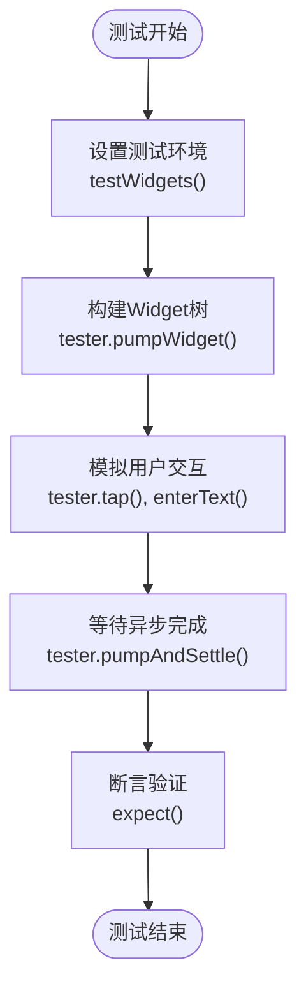
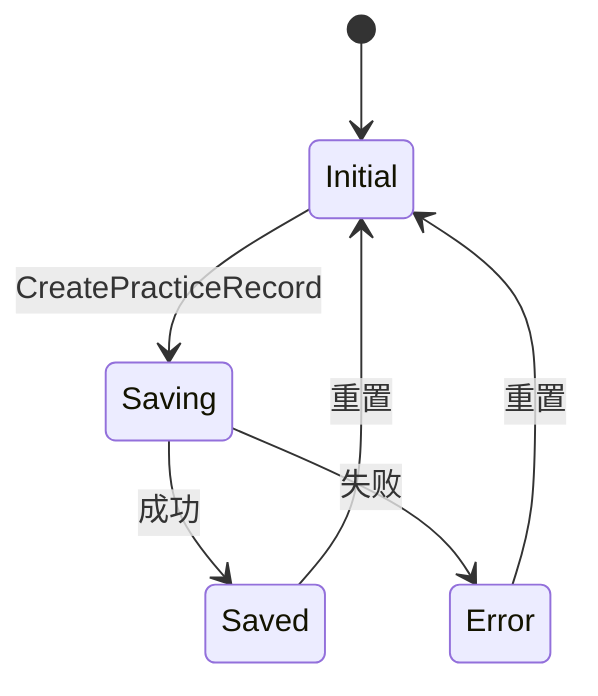
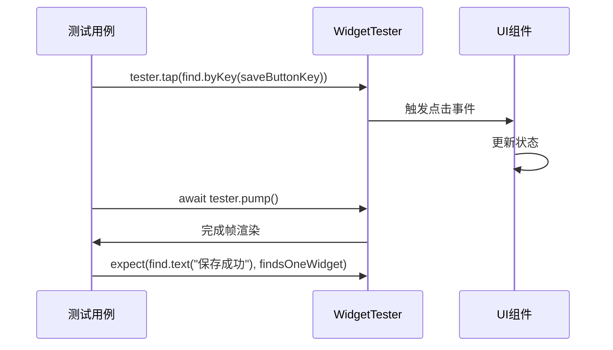

# 移动端测试

<cite>
**本文档引用的文件**  
- [widget_test.dart](file://flutter_app/test/widget_test.dart)
- [practice_record_bloc.dart](file://flutter_app/lib/presentation/practice/bloc/practice_record_bloc.dart)
- [practice_record_state.dart](file://flutter_app/lib/presentation/practice/bloc/practice_record_state.dart)
- [practice_record_event.dart](file://flutter_app/lib/presentation/practice/bloc/practice_record_event.dart)
- [practice_record_create_page.dart](file://flutter_app/lib/presentation/practice/pages/practice_record_create_page.dart)
- [injection.dart](file://flutter_app/lib/core/di/injection.dart)
- [pubspec.yaml](file://flutter_app/pubspec.yaml)
</cite>

## 目录
1. [引言](#引言)
2. [测试环境搭建](#测试环境搭建)
3. [测试用例结构](#测试用例结构)
4. [BLoC状态流验证](#bloc状态流验证)
5. [UI元素查找与断言](#ui元素查找与断言)
6. [用户交互模拟](#用户交互模拟)
7. [复杂BLoC逻辑测试](#复杂bloc逻辑测试)
8. [异步操作测试](#异步操作测试)
9. [测试数据构造与依赖注入](#测试数据构造与依赖注入)
10. [测试运行与覆盖率](#测试运行与覆盖率)
11. [CI集成](#ci集成)

## 引言
本文档全面解析Flutter移动端应用的组件级测试策略，以`widget_test.dart`为基础，深入探讨如何使用`flutter_test`包进行UI和业务逻辑的完整验证。重点涵盖BLoC状态管理、用户交互模拟、异步处理和依赖注入等核心测试场景。

## 测试环境搭建
Flutter测试环境通过`flutter_test`包提供支持，已在`pubspec.yaml`中作为开发依赖正确配置。项目使用`GetIt`和`injectable`实现依赖注入，通过`configureDependencies`函数支持不同环境（生产、开发、测试）的配置切换，确保测试时可以注入模拟依赖。

**Section sources**
- [pubspec.yaml](file://flutter_app/pubspec.yaml#L60-L67)
- [injection.dart](file://flutter_app/lib/core/di/injection.dart#L23-L24)

## 测试用例结构
测试用例使用`testWidgets`函数定义，支持异步操作。通过`group`可对相关测试进行逻辑分组，提高组织性。每个测试用例以`WidgetTester`作为核心工具，用于构建UI、触发交互和验证状态。

**Diagram sources**
- [widget_test.dart](file://flutter_app/test/widget_test.dart#L13-L30)

## BLoC状态流验证
BLoC模式通过事件-状态流管理UI逻辑。测试时需验证在触发特定事件后，BLoC是否正确转换到预期状态。例如`PracticeRecordBloc`在接收到`CreatePracticeRecord`事件后，应依次发出`PracticeRecordSaving`和`PracticeRecordSaved`状态。

**Diagram sources**
- [practice_record_bloc.dart](file://flutter_app/lib/presentation/practice/bloc/practice_record_bloc.dart#L7-L36)
- [practice_record_state.dart](file://flutter_app/lib/presentation/practice/bloc/practice_record_state.dart#L5-L41)

## UI元素查找与断言
`flutter_test`提供`find`工具类进行UI元素查找，支持通过文本、图标、类型等多种方式定位。`expect`函数用于断言验证，确保UI状态符合预期。例如验证文本是否存在或Widget数量是否正确。

**Section sources**
- [widget_test.dart](file://flutter_app/test/widget_test.dart#L19-L20)

## 用户交互模拟
`WidgetTester`支持模拟各种用户交互，如点击(`tap`)、输入文本(`enterText`)、滚动等。这些操作通常需要配合`pump`或`pumpAndSettle`来触发框架重绘，确保UI状态更新被正确处理。

**Diagram sources**
- [widget_test.dart](file://flutter_app/test/widget_test.dart#L22-L24)

## 复杂BLoC逻辑测试
对于复杂的BLoC逻辑，如`PracticeRecordBloc`提交记录的完整流程，测试需覆盖：初始状态、加载状态、成功状态和错误状态。通过监听状态变化，验证状态转换的完整性和正确性。

**Section sources**
- [practice_record_bloc.dart](file://flutter_app/lib/presentation/practice/bloc/practice_record_bloc.dart#L16-L35)
- [practice_record_create_page.dart](file://flutter_app/lib/presentation/practice/pages/practice_record_create_page.dart#L82-L93)

## 异步操作测试
异步操作测试需使用`await`关键字和`pumpAndSettle()`等待动画和异步任务完成。超时可通过`timeout`参数配置。`pumpAndSettle`会持续触发帧直到UI队列清空，确保所有异步操作完成。

**Section sources**
- [widget_test.dart](file://flutter_app/test/widget_test.dart#L24)

## 测试数据构造与依赖注入
通过构造模拟数据（如Mock的`UserModel`、`MethodModel`）并注入到Repository层，实现隔离测试。利用`GetIt`的依赖注入机制，在测试环境中替换真实服务为模拟实现，确保测试的独立性和可重复性。

**Section sources**
- [injection.dart](file://flutter_app/lib/core/di/injection.dart#L27-L30)
- [practice_record_create_page.dart](file://flutter_app/lib/presentation/practice/pages/practice_record_create_page.dart#L26-L37)

## 测试运行与覆盖率
运行测试使用命令`flutter test`。生成覆盖率报告需安装`coverage`包，使用`flutter test --coverage`命令生成`lcov.info`文件，可通过`genhtml`等工具转换为HTML报告。

**Section sources**
- [pubspec.yaml](file://flutter_app/pubspec.yaml#L60-L67)

## CI集成
测试可集成到CI/CD流程中，在每次提交时自动运行。通过配置CI脚本执行`flutter test`并收集覆盖率数据，确保代码质量持续受控。失败的测试将阻止部署，保障生产环境稳定性。

**Section sources**
- [pubspec.yaml](file://flutter_app/pubspec.yaml#L60-L67)