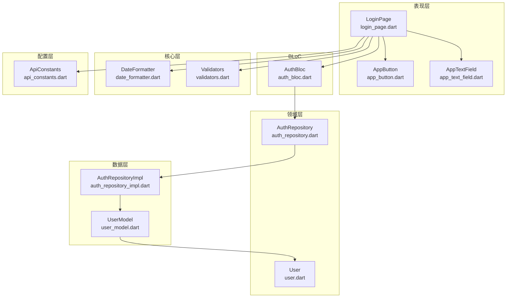
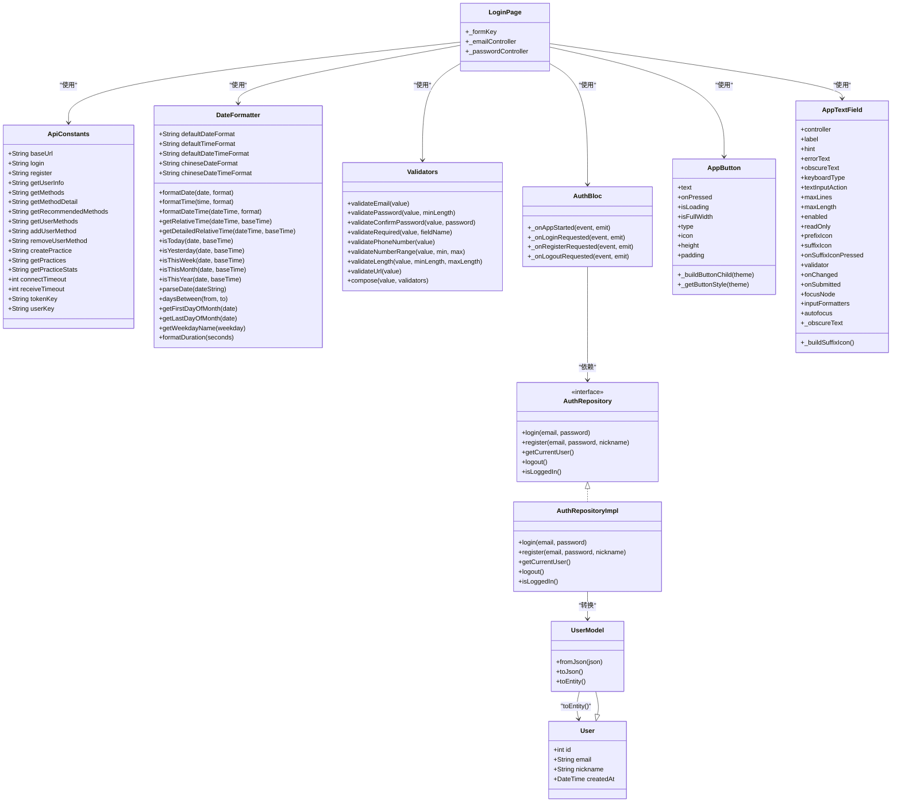
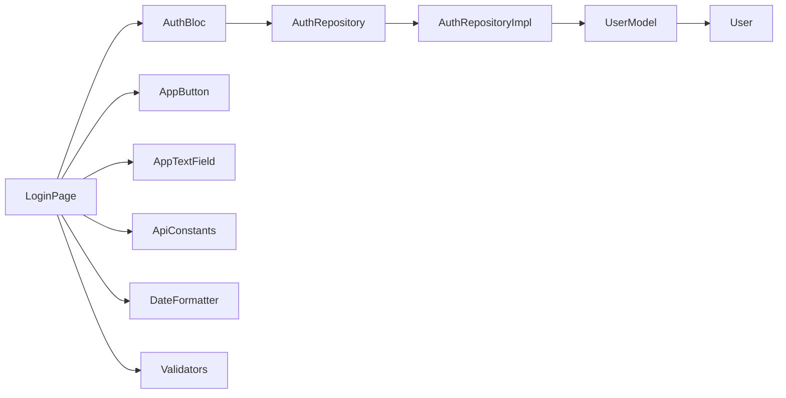

# 命名规范

<cite>
**本文引用的文件**
- [FLUTTER_DEVELOPMENT_GUIDE.md](file://FLUTTER_DEVELOPMENT_GUIDE.md)
- [main.dart](file://flutter_app/lib/main.dart)
- [user_model.dart](file://flutter_app/lib/data/models/user_model.dart)
- [user.dart](file://flutter_app/lib/domain/entities/user.dart)
- [app_button.dart](file://flutter_app/lib/presentation/widgets/app_button.dart)
- [login_page.dart](file://flutter_app/lib/presentation/auth/pages/login_page.dart)
- [auth_repository_impl.dart](file://flutter_app/lib/data/repositories/auth_repository_impl.dart)
- [api_constants.dart](file://flutter_app/lib/config/api_constants.dart)
- [date_formatter.dart](file://flutter_app/lib/core/utils/date_formatter.dart)
- [validators.dart](file://flutter_app/lib/core/utils/validators.dart)
- [auth_bloc.dart](file://flutter_app/lib/presentation/auth/bloc/auth_bloc.dart)
- [auth_repository.dart](file://flutter_app/lib/domain/repositories/auth_repository.dart)
- [app_text_field.dart](file://flutter_app/lib/presentation/widgets/app_text_field.dart)
</cite>

## 目录
1. [简介](#简介)
2. [项目结构](#项目结构)
3. [核心组件](#核心组件)
4. [架构总览](#架构总览)
5. [详细组件分析](#详细组件分析)
6. [依赖关系分析](#依赖关系分析)
7. [性能考量](#性能考量)
8. [故障排查指南](#故障排查指南)
9. [结论](#结论)
10. [附录](#附录)

## 简介
本文件系统性梳理并说明本项目中Dart代码的命名约定，依据项目提供的《Flutter开发规范》中的“命名规范”表格，明确各类标识符的命名方式与示例，并结合实际代码文件进行验证与对比。同时，强调命名一致性在提升代码可读性、降低维护成本、促进团队协作方面的重要意义。

## 项目结构
围绕命名规范，项目采用清晰的分层组织：
- 配置层：存放常量与主题等配置文件，如 api_constants.dart、routes.dart、theme.dart
- 核心层：网络、存储、错误、工具等基础能力，如 dio_client.dart、secure_storage_helper.dart、date_formatter.dart、validators.dart
- 数据层：模型、数据源、仓储实现，如 user_model.dart、auth_remote_data_source.dart、auth_repository_impl.dart
- 领域层：实体与仓储接口，如 user.dart、auth_repository.dart
- 表现层：页面、组件、BLoC，如 login_page.dart、app_button.dart、auth_bloc.dart

图表来源
- [login_page.dart](file://flutter_app/lib/presentation/auth/pages/login_page.dart#L1-L136)
- [auth_bloc.dart](file://flutter_app/lib/presentation/auth/bloc/auth_bloc.dart#L1-L82)
- [auth_repository.dart](file://flutter_app/lib/domain/repositories/auth_repository.dart#L1-L46)
- [auth_repository_impl.dart](file://flutter_app/lib/data/repositories/auth_repository_impl.dart#L1-L114)
- [user_model.dart](file://flutter_app/lib/data/models/user_model.dart#L1-L44)
- [user.dart](file://flutter_app/lib/domain/entities/user.dart#L1-L32)
- [app_button.dart](file://flutter_app/lib/presentation/widgets/app_button.dart#L1-L200)
- [app_text_field.dart](file://flutter_app/lib/presentation/widgets/app_text_field.dart#L1-L231)
- [date_formatter.dart](file://flutter_app/lib/core/utils/date_formatter.dart#L1-L300)
- [validators.dart](file://flutter_app/lib/core/utils/validators.dart#L1-L165)
- [api_constants.dart](file://flutter_app/lib/config/api_constants.dart#L1-L73)

章节来源
- [main.dart](file://flutter_app/lib/main.dart#L1-L105)

## 核心组件
本节聚焦命名规范的具体落地，依据《Flutter开发规范》中的“命名规范”表格，结合项目实际文件逐一验证。

- 文件命名：使用 snake_case（例如 user_model.dart、api_constants.dart、date_formatter.dart）
- 类与Widget命名：使用 PascalCase（例如 UserModel、User、AppButton、AppTextField、AuthBloc、LoginPage）
- 变量与方法命名：使用 camelCase（例如 loginPage、authBloc、isLoggedIn、formatDate、validateEmail）
- 常量命名：推荐使用 lowerCamelCase 或 UPPER_CASE（例如 ApiConstants、connectTimeout、receiveTimeout、tokenKey、userKey）
- 私有成员：以下划线_开头（例如 _LoginPageState、_AppTextFieldState、_obscureText、_getButtonStyle）

章节来源
- [FLUTTER_DEVELOPMENT_GUIDE.md](file://FLUTTER_DEVELOPMENT_GUIDE.md#L5-L12)
- [user_model.dart](file://flutter_app/lib/data/models/user_model.dart#L1-L44)
- [user.dart](file://flutter_app/lib/domain/entities/user.dart#L1-L32)
- [app_button.dart](file://flutter_app/lib/presentation/widgets/app_button.dart#L1-L200)
- [app_text_field.dart](file://flutter_app/lib/presentation/widgets/app_text_field.dart#L1-L231)
- [login_page.dart](file://flutter_app/lib/presentation/auth/pages/login_page.dart#L1-L136)
- [auth_bloc.dart](file://flutter_app/lib/presentation/auth/bloc/auth_bloc.dart#L1-L82)
- [auth_repository_impl.dart](file://flutter_app/lib/data/repositories/auth_repository_impl.dart#L1-L114)
- [api_constants.dart](file://flutter_app/lib/config/api_constants.dart#L1-L73)
- [date_formatter.dart](file://flutter_app/lib/core/utils/date_formatter.dart#L1-L300)
- [validators.dart](file://flutter_app/lib/core/utils/validators.dart#L1-L165)

## 架构总览
命名规范贯穿于各层，形成一致的代码风格：
- 配置层：常量类 ApiConstants，字段使用 UPPER_CASE；超时常量使用 lowerCamelCase
- 核心层：工具类 DateFormatter、Validators，方法使用 camelCase；静态常量使用 UPPER_CASE
- 数据层：模型类 UserModel、实体类 User，类使用 PascalCase；工厂方法与转换方法使用 camelCase
- 领域层：接口 AuthRepository、实体 User，类使用 PascalCase；方法使用 camelCase
- 表现层：页面 LoginPage、组件 AppButton/AppTextField、BLoC AuthBloc，类使用 PascalCase；内部状态与方法使用 camelCase；私有状态类以下划线开头

图表来源
- [api_constants.dart](file://flutter_app/lib/config/api_constants.dart#L1-L73)
- [date_formatter.dart](file://flutter_app/lib/core/utils/date_formatter.dart#L1-L300)
- [validators.dart](file://flutter_app/lib/core/utils/validators.dart#L1-L165)
- [user_model.dart](file://flutter_app/lib/data/models/user_model.dart#L1-L44)
- [user.dart](file://flutter_app/lib/domain/entities/user.dart#L1-L32)
- [auth_repository.dart](file://flutter_app/lib/domain/repositories/auth_repository.dart#L1-L46)
- [auth_repository_impl.dart](file://flutter_app/lib/data/repositories/auth_repository_impl.dart#L1-L114)
- [login_page.dart](file://flutter_app/lib/presentation/auth/pages/login_page.dart#L1-L136)
- [auth_bloc.dart](file://flutter_app/lib/presentation/auth/bloc/auth_bloc.dart#L1-L82)
- [app_button.dart](file://flutter_app/lib/presentation/widgets/app_button.dart#L1-L200)
- [app_text_field.dart](file://flutter_app/lib/presentation/widgets/app_text_field.dart#L1-L231)

## 详细组件分析

### 文件命名：snake_case
- 正例：user_model.dart、api_constants.dart、date_formatter.dart、validators.dart
- 反例：若出现 user-model.dart、ApiConstants.dart、DateFormatter.dart，则违反 snake_case 与 PascalCase 的文件命名规则

章节来源
- [FLUTTER_DEVELOPMENT_GUIDE.md](file://FLUTTER_DEVELOPMENT_GUIDE.md#L7-L7)
- [user_model.dart](file://flutter_app/lib/data/models/user_model.dart#L1-L44)
- [api_constants.dart](file://flutter_app/lib/config/api_constants.dart#L1-L73)
- [date_formatter.dart](file://flutter_app/lib/core/utils/date_formatter.dart#L1-L300)
- [validators.dart](file://flutter_app/lib/core/utils/validators.dart#L1-L165)

### 类与Widget命名：PascalCase
- 正例：UserModel、User、AppButton、AppTextField、AuthBloc、LoginPage、AuthRepository、AuthRepositoryImpl
- 反例：若出现 userModel、userModel、app_button、appTextField、authBloc、loginPage，则违反 PascalCase 规则

章节来源
- [FLUTTER_DEVELOPMENT_GUIDE.md](file://FLUTTER_DEVELOPMENT_GUIDE.md#L8-L8)
- [user_model.dart](file://flutter_app/lib/data/models/user_model.dart#L1-L44)
- [user.dart](file://flutter_app/lib/domain/entities/user.dart#L1-L32)
- [app_button.dart](file://flutter_app/lib/presentation/widgets/app_button.dart#L1-L200)
- [app_text_field.dart](file://flutter_app/lib/presentation/widgets/app_text_field.dart#L1-L231)
- [auth_bloc.dart](file://flutter_app/lib/presentation/auth/bloc/auth_bloc.dart#L1-L82)
- [login_page.dart](file://flutter_app/lib/presentation/auth/pages/login_page.dart#L1-L136)
- [auth_repository.dart](file://flutter_app/lib/domain/repositories/auth_repository.dart#L1-L46)
- [auth_repository_impl.dart](file://flutter_app/lib/data/repositories/auth_repository_impl.dart#L1-L114)

### 变量与方法命名：camelCase
- 正例：loginPage、authBloc、isLoggedIn、formatDate、validateEmail、parseDate、daysBetween、formatDuration
- 反例：若出现 login_page、auth_bloC、is_logged_in、format_date、validate_email，则违反 camelCase 规则

章节来源
- [FLUTTER_DEVELOPMENT_GUIDE.md](file://FLUTTER_DEVELOPMENT_GUIDE.md#L9-L9)
- [login_page.dart](file://flutter_app/lib/presentation/auth/pages/login_page.dart#L1-L136)
- [auth_bloc.dart](file://flutter_app/lib/presentation/auth/bloc/auth_bloc.dart#L1-L82)
- [auth_repository_impl.dart](file://flutter_app/lib/data/repositories/auth_repository_impl.dart#L1-L114)
- [date_formatter.dart](file://flutter_app/lib/core/utils/date_formatter.dart#L1-L300)
- [validators.dart](file://flutter_app/lib/core/utils/validators.dart#L1-L165)

### 常量命名：lowerCamelCase 或 UPPER_CASE
- 正例：ApiConstants（类名 PascalCase，类内常量使用 UPPER_CASE）、connectTimeout、receiveTimeout、tokenKey、userKey
- 反例：若出现 API_CONSTANTS、ConnectTimeout、ReceiveTimeout、TokenKey、UserKey，则违反常量命名建议

章节来源
- [FLUTTER_DEVELOPMENT_GUIDE.md](file://FLUTTER_DEVELOPMENT_GUIDE.md#L10-L10)
- [api_constants.dart](file://flutter_app/lib/config/api_constants.dart#L1-L73)

### 私有成员：以下划线_开头
- 正例：_LoginPageState、_AppTextFieldState、_obscureText、_buildButtonChild、_getButtonStyle、_buildSuffixIcon
- 反例：若出现 LoginPageState、AppTextFieldState、obscureText、buildButtonChild、getButtonStyle、buildSuffixIcon，则违反私有成员命名规则

章节来源
- [FLUTTER_DEVELOPMENT_GUIDE.md](file://FLUTTER_DEVELOPMENT_GUIDE.md#L11-L11)
- [login_page.dart](file://flutter_app/lib/presentation/auth/pages/login_page.dart#L1-L136)
- [app_text_field.dart](file://flutter_app/lib/presentation/widgets/app_text_field.dart#L1-L231)
- [app_button.dart](file://flutter_app/lib/presentation/widgets/app_button.dart#L1-L200)

### 页面与组件命名：PascalCase + 私有状态类
- LoginPage 使用了私有状态类 _LoginPageState，符合“类使用 PascalCase，私有状态类以下划线开头”的规范
- AppTextField 内部状态类 _AppTextFieldState 同样遵循该规范

章节来源
- [login_page.dart](file://flutter_app/lib/presentation/auth/pages/login_page.dart#L1-L136)
- [app_text_field.dart](file://flutter_app/lib/presentation/widgets/app_text_field.dart#L1-L231)

### BLoC命名：PascalCase + 私有处理方法
- AuthBloc 使用 PascalCase 命名，内部事件处理方法以 _onXxx 形式命名，体现私有处理逻辑

章节来源
- [auth_bloc.dart](file://flutter_app/lib/presentation/auth/bloc/auth_bloc.dart#L1-L82)

### 模型与实体：PascalCase + 工厂与转换方法 camelCase
- UserModel、User 使用 PascalCase；fromJson、toJson、toEntity 使用 camelCase，符合规范

章节来源
- [user_model.dart](file://flutter_app/lib/data/models/user_model.dart#L1-L44)
- [user.dart](file://flutter_app/lib/domain/entities/user.dart#L1-L32)

### 仓储接口与实现：PascalCase + camelCase 方法
- AuthRepository（接口）与 AuthRepositoryImpl（实现）均使用 PascalCase；方法使用 camelCase

章节来源
- [auth_repository.dart](file://flutter_app/lib/domain/repositories/auth_repository.dart#L1-L46)
- [auth_repository_impl.dart](file://flutter_app/lib/data/repositories/auth_repository_impl.dart#L1-L114)

## 依赖关系分析
命名规范在模块间形成稳定契约：
- 表现层 LoginPage 依赖 BLoC AuthBloc 与组件 AppButton/AppTextField
- BLoC 依赖领域层 AuthRepository 接口
- 仓储实现 AuthRepositoryImpl 依赖数据层 UserModel 并转换为领域实体 User
- 配置层 ApiConstants 为网络与存储提供常量键值
- 核心层 DateFormatter/Validators 为页面提供工具能力

图表来源
- [login_page.dart](file://flutter_app/lib/presentation/auth/pages/login_page.dart#L1-L136)
- [auth_bloc.dart](file://flutter_app/lib/presentation/auth/bloc/auth_bloc.dart#L1-L82)
- [auth_repository.dart](file://flutter_app/lib/domain/repositories/auth_repository.dart#L1-L46)
- [auth_repository_impl.dart](file://flutter_app/lib/data/repositories/auth_repository_impl.dart#L1-L114)
- [user_model.dart](file://flutter_app/lib/data/models/user_model.dart#L1-L44)
- [user.dart](file://flutter_app/lib/domain/entities/user.dart#L1-L32)
- [app_button.dart](file://flutter_app/lib/presentation/widgets/app_button.dart#L1-L200)
- [app_text_field.dart](file://flutter_app/lib/presentation/widgets/app_text_field.dart#L1-L231)
- [api_constants.dart](file://flutter_app/lib/config/api_constants.dart#L1-L73)
- [date_formatter.dart](file://flutter_app/lib/core/utils/date_formatter.dart#L1-L300)
- [validators.dart](file://flutter_app/lib/core/utils/validators.dart#L1-L165)

## 性能考量
- 命名一致性本身不直接影响性能，但有助于：
  - 快速定位与理解代码职责，减少调试与重构成本
  - 在大型团队中降低沟通成本，避免因命名差异导致的误解
  - 提升自动化工具（如IDE跳转、重构、静态检查）的可用性

## 故障排查指南
- 命名不一致导致的问题：
  - 文件名与类名不匹配：可能导致导入路径错误或IDE无法识别
  - 私有成员未加下划线：可能暴露内部实现细节，影响封装性
  - 常量命名不规范：可能混淆配置项与普通变量
- 建议的检查清单：
  - 核对文件名是否为 snake_case
  - 核对类与Widget是否为 PascalCase
  - 核对变量与方法是否为 camelCase
  - 核对常量是否为 UPPER_CASE 或 lowerCamelCase
  - 核对私有成员是否以下划线开头

## 结论
本项目严格遵循《Flutter开发规范》中的命名约定，形成了从配置、核心、数据、领域到表现层的一致命名体系。通过文件名 snake_case、类与Widget PascalCase、变量与方法 camelCase、常量 UPPER_CASE/lowerCamelCase、私有成员下划线前缀等规范，显著提升了代码的可读性与可维护性，为团队协作与长期演进奠定了良好基础。

## 附录
- 命名规范对照表（来自《Flutter开发规范》）
  - 文件：snake_case（如 user_model.dart）
  - 类与Widget：PascalCase（如 UserModel）
  - 变量与方法：camelCase（如 getUserById）
  - 常量：lowerCamelCase 或 UPPER_CASE（如 apiBaseUrl）
  - 私有成员：以下划线_开头（如 _privateMethod）

章节来源
- [FLUTTER_DEVELOPMENT_GUIDE.md](file://FLUTTER_DEVELOPMENT_GUIDE.md#L5-L12)