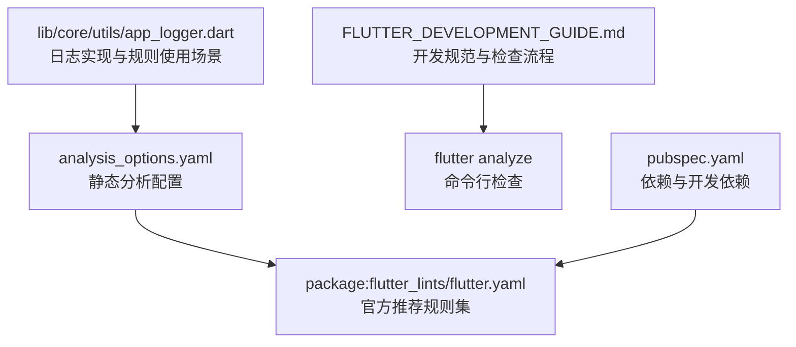
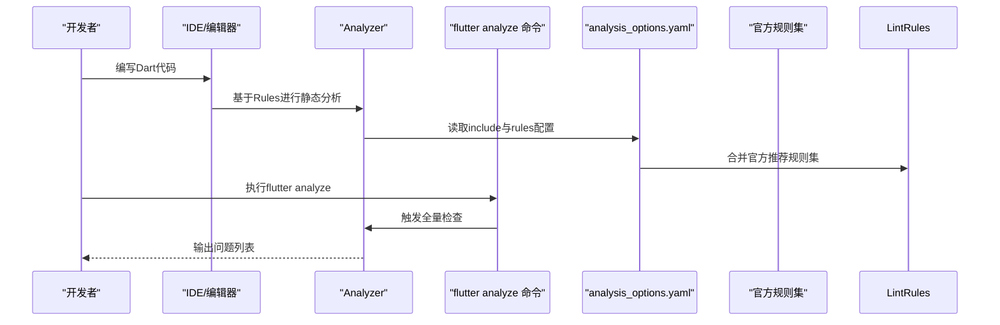
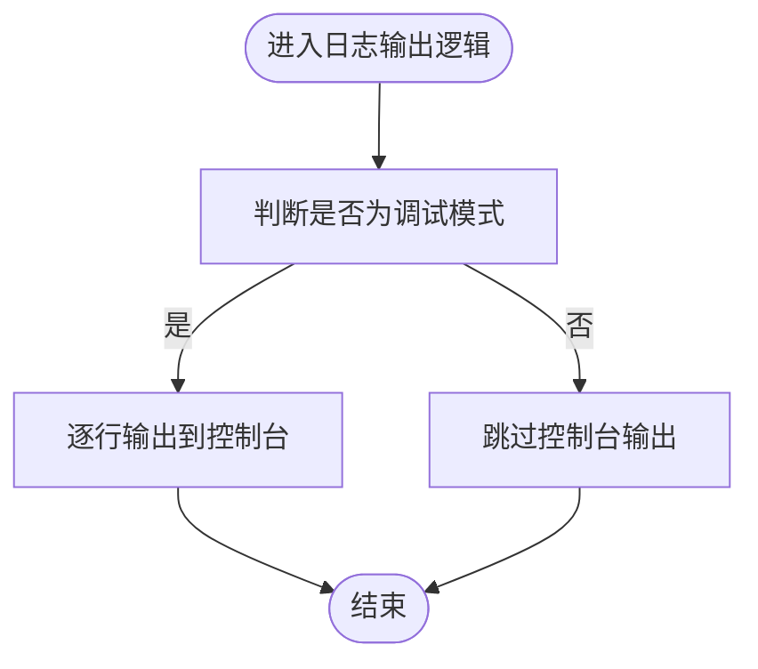
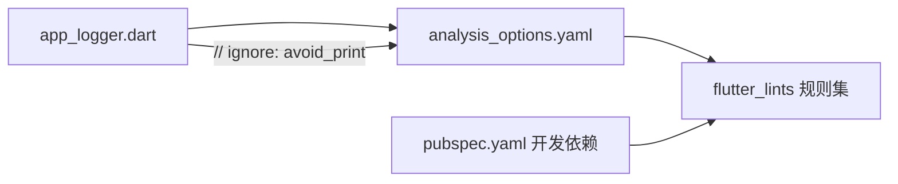

# 静态分析与Lint规则

<cite>
**本文引用的文件**
- [analysis_options.yaml](file://flutter_app/analysis_options.yaml)
- [FLUTTER_DEVELOPMENT_GUIDE.md](file://FLUTTER_DEVELOPMENT_GUIDE.md)
- [pubspec.yaml](file://flutter_app/pubspec.yaml)
- [app_logger.dart](file://flutter_app/lib/core/utils/app_logger.dart)
</cite>

## 目录
1. [引言](#引言)
2. [项目结构](#项目结构)
3. [核心组件](#核心组件)
4. [架构总览](#架构总览)
5. [详细组件分析](#详细组件分析)
6. [依赖关系分析](#依赖关系分析)
7. [性能考量](#性能考量)
8. [故障排查指南](#故障排查指南)
9. [结论](#结论)
10. [附录](#附录)

## 引言
本文件围绕Flutter应用的静态分析与Lint规则展开，重点解析analysis_options.yaml中通过include引入的官方推荐规则集，并结合FLUTTER_DEVELOPMENT_GUIDE.md中的“代码检查”章节，说明如何使用flutter analyze进行检查，以及如何在单行或文件级别临时忽略特定规则。同时，针对avoid_print、prefer_const_constructors、prefer_final_locals等关键规则，从代码质量、性能与可维护性三个维度阐述其价值，并给出项目中的实际配置上下文与最佳实践建议。

## 项目结构
Flutter应用位于flutter_app目录，静态分析配置集中在analysis_options.yaml；开发规范与检查流程由FLUTTER_DEVELOPMENT_GUIDE.md提供；项目依赖中包含flutter_lints以启用官方推荐规则集。

图表来源
- [analysis_options.yaml](file://flutter_app/analysis_options.yaml#L1-L29)
- [FLUTTER_DEVELOPMENT_GUIDE.md](file://FLUTTER_DEVELOPMENT_GUIDE.md#L208-L238)
- [pubspec.yaml](file://flutter_app/pubspec.yaml#L60-L77)
- [app_logger.dart](file://flutter_app/lib/core/utils/app_logger.dart#L255-L270)

章节来源
- [analysis_options.yaml](file://flutter_app/analysis_options.yaml#L1-L29)
- [FLUTTER_DEVELOPMENT_GUIDE.md](file://FLUTTER_DEVELOPMENT_GUIDE.md#L208-L238)
- [pubspec.yaml](file://flutter_app/pubspec.yaml#L60-L77)

## 核心组件
- 官方推荐规则集：通过include引入，覆盖Flutter应用、包与插件的通用良好实践，降低重复配置成本，提升团队一致性。
- 自定义规则区段：可在rules下按需禁用或启用额外规则，便于在项目特定场景下微调。
- 规则抑制语法：支持单行与文件级的临时忽略，确保在必要时保留灵活性。

章节来源
- [analysis_options.yaml](file://flutter_app/analysis_options.yaml#L8-L26)

## 架构总览
静态分析在开发流程中的位置如下：
- 开发者在IDE中编写代码，IDE基于analysis_options.yaml进行实时分析。
- 团队在CI/CD或本地执行flutter analyze进行统一检查。
- 当需要临时绕过某条规则时，使用// ignore: rule_name或// ignore_for_file: rule_name进行局部抑制。

图表来源
- [analysis_options.yaml](file://flutter_app/analysis_options.yaml#L8-L26)
- [FLUTTER_DEVELOPMENT_GUIDE.md](file://FLUTTER_DEVELOPMENT_GUIDE.md#L229-L238)

## 详细组件分析

### 官方推荐规则集与include机制
- include: package:flutter_lints/flutter.yaml的作用是引入一套经过验证的、面向Flutter生态的推荐规则集合，涵盖命名、结构、性能、可维护性等多个方面，帮助团队快速建立一致的代码质量标准。
- 分析器会将include中的规则与当前项目rules区段合并，后者可覆盖或补充前者的行为。

章节来源
- [analysis_options.yaml](file://flutter_app/analysis_options.yaml#L8-L10)

### 规则抑制语法与使用场景
- 单行抑制：在产生问题的代码行上方添加注释，格式为// ignore: 规则名，适用于极少数必须绕过规则的特殊情况。
- 文件级抑制：在文件顶部添加注释，格式为// ignore_for_file: 规则名，适用于整文件范围内需要暂时放宽规则的情形。
- 抑制应谨慎使用，建议配合注释说明原因，并设定短期窗口进行后续修复。

章节来源
- [analysis_options.yaml](file://flutter_app/analysis_options.yaml#L18-L22)

### 关键规则：avoid_print
- 规则目标：避免在生产环境中使用print输出，防止无控制的日志输出影响性能与用户体验。
- 项目中的实际使用场景：在日志输出器中，当处于调试模式时会向控制台输出日志；该行为被标记为// ignore: avoid_print，体现“仅在调试环境允许”的策略。
- 质量与可维护性收益：通过集中化的日志工具封装，统一日志格式与级别，减少散落的print调用，便于后续替换为远程上报或更完善的日志系统。
- 性能影响：避免在Release模式输出大量控制台日志，降低I/O开销与潜在的UI阻塞风险。

图表来源
- [app_logger.dart](file://flutter_app/lib/core/utils/app_logger.dart#L255-L270)

章节来源
- [app_logger.dart](file://flutter_app/lib/core/utils/app_logger.dart#L255-L270)
- [analysis_options.yaml](file://flutter_app/analysis_options.yaml#L18-L22)

### 关键规则：prefer_const_constructors
- 规则目标：优先使用const构造函数创建不可变对象，减少不必要的对象分配与重建。
- 项目中的实际使用场景：开发规范中明确推荐使用const优化，例如在Widget树中使用const构造函数，有助于减少重建范围与内存占用。
- 质量与可维护性收益：const对象具有更好的可预测性与可缓存性，便于重构与单元测试。
- 性能影响：减少对象分配与重建，降低GC压力，提升渲染与布局性能。

章节来源
- [FLUTTER_DEVELOPMENT_GUIDE.md](file://FLUTTER_DEVELOPMENT_GUIDE.md#L159-L164)

### 关键规则：prefer_final_locals
- 规则目标：局部变量优先声明为final，除非确实需要修改，从而增强代码的可读性与安全性。
- 项目中的实际使用场景：在日志工具类中，多处使用final修饰变量，体现了对不可变性的偏好，有助于避免无意的二次赋值。
- 质量与可维护性收益：减少副作用与状态突变，降低逻辑复杂度，便于理解与维护。
- 性能影响：虽然局部变量的final化对性能提升有限，但能带来更清晰的语义与更少的潜在bug。

章节来源
- [app_logger.dart](file://flutter_app/lib/core/utils/app_logger.dart#L1-L120)

### 代码检查流程与命令
- 使用flutter analyze在本地或CI中执行静态分析，确保所有提交符合规则集要求。
- 若需要临时绕过规则，采用单行或文件级抑制，并在短期内完成修复。

章节来源
- [FLUTTER_DEVELOPMENT_GUIDE.md](file://FLUTTER_DEVELOPMENT_GUIDE.md#L229-L238)

## 依赖关系分析
- analysis_options.yaml依赖于flutter_lints提供的官方规则集，而flutter_lints作为开发依赖存在于pubspec.yaml中，保证了规则集的可用性与版本可控。
- app_logger.dart作为日志实现，直接体现了avoid_print规则在调试模式下的使用策略，并通过// ignore: avoid_print进行抑制。

图表来源
- [analysis_options.yaml](file://flutter_app/analysis_options.yaml#L8-L10)
- [pubspec.yaml](file://flutter_app/pubspec.yaml#L60-L77)
- [app_logger.dart](file://flutter_app/lib/core/utils/app_logger.dart#L255-L270)

章节来源
- [pubspec.yaml](file://flutter_app/pubspec.yaml#L60-L77)
- [analysis_options.yaml](file://flutter_app/analysis_options.yaml#L8-L10)
- [app_logger.dart](file://flutter_app/lib/core/utils/app_logger.dart#L255-L270)

## 性能考量
- const构造函数：减少对象分配与重建，降低GC压力，提升渲染与布局性能。
- 避免无控制的print输出：在Release模式下避免控制台I/O，减少潜在的UI阻塞与资源消耗。
- 局部变量final化：减少状态突变带来的隐式副作用，间接提升代码稳定性与可维护性。

## 故障排查指南
- 规则冲突与抑制：若出现规则冲突，优先通过调整代码以满足规则；仅在确有必要时使用单行或文件级抑制，并在短期内完成修复。
- 规则未生效：确认analysis_options.yaml已正确include官方规则集，且项目依赖中存在flutter_lints开发依赖。
- 检查命令：使用flutter analyze进行全量检查，定位问题后逐项修复。

章节来源
- [analysis_options.yaml](file://flutter_app/analysis_options.yaml#L8-L26)
- [FLUTTER_DEVELOPMENT_GUIDE.md](file://FLUTTER_DEVELOPMENT_GUIDE.md#L229-L238)
- [pubspec.yaml](file://flutter_app/pubspec.yaml#L60-L77)

## 结论
通过include官方推荐规则集，项目在不增加额外配置负担的前提下，获得了高质量的代码基线。avoid_print、prefer_const_constructors、prefer_final_locals等规则分别从日志输出、对象构造与变量语义三个角度提升了代码质量、性能与可维护性。结合FLUTTER_DEVELOPMENT_GUIDE.md中的检查流程与抑制策略，团队可以在保证一致性的同时保持必要的灵活性。

## 附录
- 最佳实践建议
  - 优先满足规则，避免滥用抑制；当必须抑制时，务必附带简要说明并在短期内修复。
  - 在调试阶段允许必要的日志输出，但在发布前清理或替换为集中化日志方案。
  - 在Widget树与不可变数据结构中广泛使用const构造函数，减少重建与内存占用。
  - 局部变量默认声明为final，仅在确需修改时使用var，提升代码可读性与安全性。