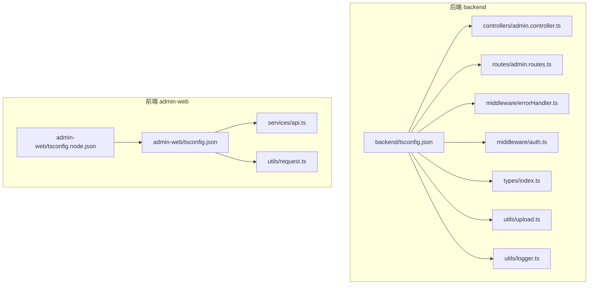
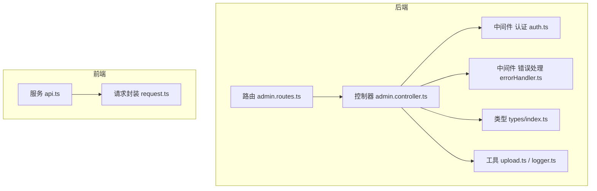
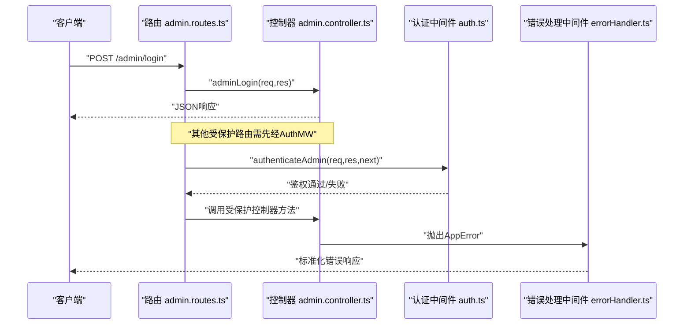
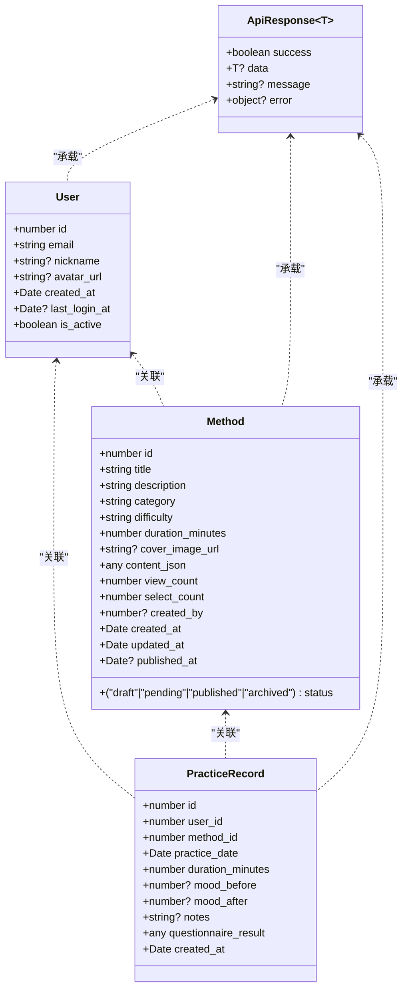
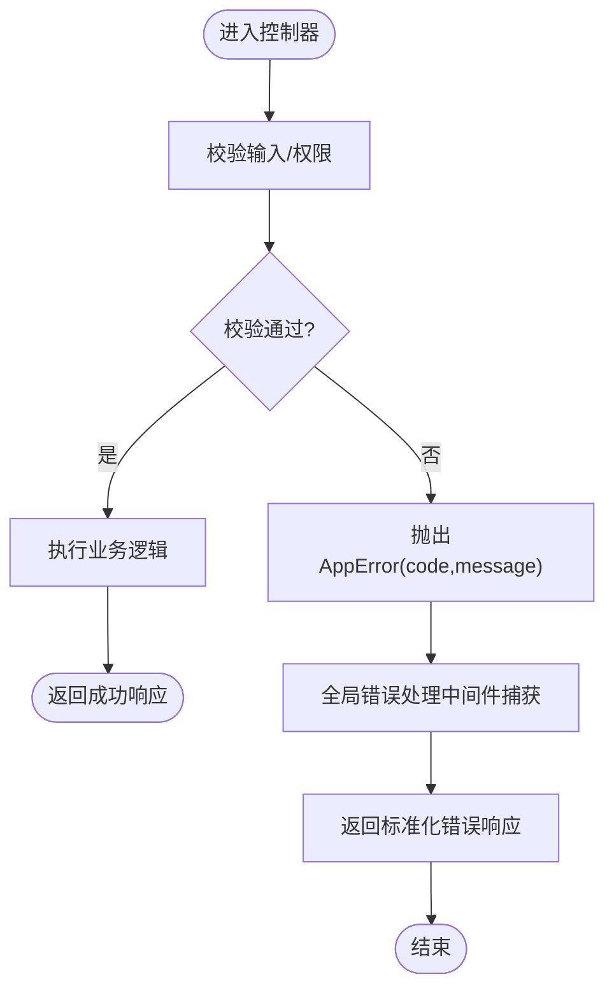
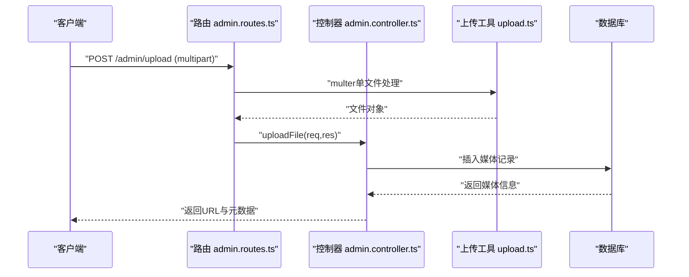
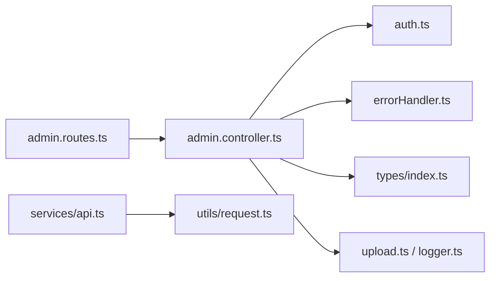

# TypeScript编码规范

<cite>
**本文引用的文件**
- [backend/tsconfig.json](file://backend/tsconfig.json)
- [admin-web/tsconfig.json](file://home/user/nian/admin-web/tsconfig.json)
- [admin-web/tsconfig.node.json](file://home/user/nian/admin-web/tsconfig.node.json)
- [backend/src/controllers/admin.controller.ts](file://backend/src/controllers/admin.controller.ts)
- [backend/src/routes/admin.routes.ts](file://backend/src/routes/admin.routes.ts)
- [backend/src/middleware/errorHandler.ts](file://backend/src/middleware/errorHandler.ts)
- [backend/src/middleware/auth.ts](file://backend/src/middleware/auth.ts)
- [backend/src/types/index.ts](file://backend/src/types/index.ts)
- [backend/src/utils/upload.ts](file://backend/src/utils/upload.ts)
- [backend/src/utils/logger.ts](file://backend/src/utils/logger.ts)
- [admin-web/src/services/api.ts](file://home/user/nian/admin-web/src/services/api.ts)
- [admin-web/src/utils/request.ts](file://home/user/nian/admin-web/src/utils/request.ts)
</cite>

## 目录
1. [引言](#引言)
2. [项目结构](#项目结构)
3. [核心组件](#核心组件)
4. [架构总览](#架构总览)
5. [详细组件分析](#详细组件分析)
6. [依赖关系分析](#依赖关系分析)
7. [性能考量](#性能考量)
8. [故障排查指南](#故障排查指南)
9. [结论](#结论)
10. [附录](#附录)

## 引言
本规范旨在统一后端（backend）与前端（admin-web）两套TypeScript工程的编码风格与质量标准，确保类型安全、模块化清晰、错误处理一致、接口定义规范。本文基于两处tsconfig.json的实际配置，解释关键编译选项的取舍原因，并结合项目现有控制器、路由、中间件、类型定义与工具模块，给出模块导入导出策略、命名规范、文件组织方式以及接口与类型的最佳实践；同时强调在错误处理中自定义Error类的设计规范。

## 项目结构
- 后端采用CommonJS模块与严格类型检查，目标环境为Node.js，强调严格的类型推断与未使用变量/参数的清理。
- 前端采用ESNext模块与打包器模式，目标环境为浏览器，强调严格类型检查与无副作用构建（noEmit）。

图表来源
- [backend/tsconfig.json](file://backend/tsconfig.json#L1-L28)
- [admin-web/tsconfig.json](file://home/user/nian/admin-web/tsconfig.json#L1-L50)
- [admin-web/tsconfig.node.json](file://home/user/nian/admin-web/tsconfig.node.json#L1-L21)
- [backend/src/controllers/admin.controller.ts](file://backend/src/controllers/admin.controller.ts#L1-L120)
- [backend/src/routes/admin.routes.ts](file://backend/src/routes/admin.routes.ts#L1-L68)
- [backend/src/middleware/errorHandler.ts](file://backend/src/middleware/errorHandler.ts#L1-L48)
- [backend/src/middleware/auth.ts](file://backend/src/middleware/auth.ts#L1-L87)
- [backend/src/types/index.ts](file://backend/src/types/index.ts#L1-L126)
- [backend/src/utils/upload.ts](file://backend/src/utils/upload.ts#L1-L128)
- [backend/src/utils/logger.ts](file://backend/src/utils/logger.ts#L1-L37)
- [admin-web/src/services/api.ts](file://home/user/nian/admin-web/src/services/api.ts#L1-L61)
- [admin-web/src/utils/request.ts](file://home/user/nian/admin-web/src/utils/request.ts#L1-L81)

章节来源
- [backend/tsconfig.json](file://backend/tsconfig.json#L1-L28)
- [admin-web/tsconfig.json](file://home/user/nian/admin-web/tsconfig.json#L1-L50)
- [admin-web/tsconfig.node.json](file://home/user/nian/admin-web/tsconfig.node.json#L1-L21)

## 核心组件
- 类型系统与严格模式
  - 后端启用严格模式与多项严格检查，包括严格空值检查、函数类型严格性、未使用局部变量与参数、switch穷举等，显著降低运行时风险。
  - 前端同样启用严格模式与未使用变量/参数检查，配合打包器模式，确保开发期即暴露潜在问题。
- 模块互操作
  - 后端启用esModuleInterop，便于与CommonJS生态兼容，减少模块导入差异带来的类型与运行时问题。
  - 前端使用ESNext模块与打包器解析，避免CommonJS与ESM混用导致的歧义。
- 目标版本与库
  - 双端均将target设为ES2020，充分利用现代JavaScript特性；后端额外声明lib为ES2020，前端声明包含DOM/DOM.Iterable以满足浏览器环境。
- 输出与构建
  - 后端输出至dist，声明文件与SourceMap开启，便于调试与发布；前端使用打包器模式且noEmit，强调由Vite等工具负责打包。
- 错误处理
  - 自定义AppError类用于业务错误，统一在全局中间件中捕获并返回标准化错误响应，避免泄露内部细节。

章节来源
- [backend/tsconfig.json](file://backend/tsconfig.json#L1-L28)
- [admin-web/tsconfig.json](file://home/user/nian/admin-web/tsconfig.json#L1-L50)
- [admin-web/tsconfig.node.json](file://home/user/nian/admin-web/tsconfig.node.json#L1-L21)
- [backend/src/middleware/errorHandler.ts](file://backend/src/middleware/errorHandler.ts#L1-L48)

## 架构总览
后端采用控制器-路由-中间件-类型-工具的分层结构；前端通过服务层封装API调用，统一请求/响应拦截器处理鉴权与错误。

图表来源
- [backend/src/routes/admin.routes.ts](file://backend/src/routes/admin.routes.ts#L1-L68)
- [backend/src/controllers/admin.controller.ts](file://backend/src/controllers/admin.controller.ts#L1-L120)
- [backend/src/middleware/auth.ts](file://backend/src/middleware/auth.ts#L1-L87)
- [backend/src/middleware/errorHandler.ts](file://backend/src/middleware/errorHandler.ts#L1-L48)
- [backend/src/types/index.ts](file://backend/src/types/index.ts#L1-L126)
- [backend/src/utils/upload.ts](file://backend/src/utils/upload.ts#L1-L128)
- [backend/src/utils/logger.ts](file://backend/src/utils/logger.ts#L1-L37)
- [admin-web/src/services/api.ts](file://home/user/nian/admin-web/src/services/api.ts#L1-L61)
- [admin-web/src/utils/request.ts](file://home/user/nian/admin-web/src/utils/request.ts#L1-L81)

## 详细组件分析

### 编译选项与配置解读
- strict模式
  - 后端：启用严格模式与严格空值检查、严格函数类型、未使用局部变量/参数、switch穷举等，显著提升类型安全与可维护性。
  - 前端：启用严格模式与未使用局部变量/参数、switch穷举，保证开发期发现潜在问题。
- esModuleInterop
  - 后端启用，解决CommonJS与ESM之间的互操作问题，避免默认导入与命名导入的不一致。
- target与lib
  - 双端target均为ES2020，后端lib为ES2020，前端lib包含DOM/DOM.Iterable，满足各自运行时需求。
- module与moduleResolution
  - 后端module为commonjs，moduleResolution为node；前端module为ESNext，moduleResolution为bundler，符合各自构建链路。
- declaration与sourceMap
  - 后端开启声明文件与SourceMap，便于调试与二次分发；前端noEmit，由打包器负责产物生成。
- skipLibCheck与forceConsistentCasingInFileNames
  - 减少第三方库类型检查开销，避免大小写不一致导致的模块解析问题。

章节来源
- [backend/tsconfig.json](file://backend/tsconfig.json#L1-L28)
- [admin-web/tsconfig.json](file://home/user/nian/admin-web/tsconfig.json#L1-L50)
- [admin-web/tsconfig.node.json](file://home/user/nian/admin-web/tsconfig.node.json#L1-L21)

### 模块导入导出策略与命名规范
- 推荐使用ES模块语法（import/export），避免使用namespace或AMD/UMD风格，保持一致性与可读性。
- 文件命名建议：
  - 控制器：以.controller.ts结尾，如admin.controller.ts
  - 路由：以.routes.ts结尾，如admin.routes.ts
  - 中间件：以.middleware.ts结尾，如errorHandler.ts、auth.ts
  - 工具：以.utils.ts结尾，如upload.ts、logger.ts
  - 类型：集中于types/index.ts，按领域划分接口与类型别名
- 导入顺序建议：
  - 第三方库 → 本地模块 → 相对路径模块
  - 同一类别内按字母序排列，便于审查与合并冲突

章节来源
- [backend/src/controllers/admin.controller.ts](file://backend/src/controllers/admin.controller.ts#L1-L120)
- [backend/src/routes/admin.routes.ts](file://backend/src/routes/admin.routes.ts#L1-L68)
- [backend/src/middleware/errorHandler.ts](file://backend/src/middleware/errorHandler.ts#L1-L48)
- [backend/src/middleware/auth.ts](file://backend/src/middleware/auth.ts#L1-L87)
- [backend/src/types/index.ts](file://backend/src/types/index.ts#L1-L126)
- [backend/src/utils/upload.ts](file://backend/src/utils/upload.ts#L1-L128)
- [backend/src/utils/logger.ts](file://backend/src/utils/logger.ts#L1-L37)

### 控制器、路由、中间件的命名与组织
- 控制器职责单一，每个HTTP动作对应一个导出函数，参数使用明确的类型（如AuthRequest、Request、Response）。
- 路由集中注册，先挂载公共路由，再通过中间件统一鉴权，减少重复逻辑。
- 中间件分层：
  - 认证中间件：校验Authorization头与JWT有效性，注入上下文对象（如req.admin）
  - 错误处理中间件：捕获AppError与未知错误，统一返回标准化响应

图表来源
- [backend/src/routes/admin.routes.ts](file://backend/src/routes/admin.routes.ts#L1-L68)
- [backend/src/controllers/admin.controller.ts](file://backend/src/controllers/admin.controller.ts#L1-L120)
- [backend/src/middleware/auth.ts](file://backend/src/middleware/auth.ts#L1-L87)
- [backend/src/middleware/errorHandler.ts](file://backend/src/middleware/errorHandler.ts#L1-L48)

章节来源
- [backend/src/controllers/admin.controller.ts](file://backend/src/controllers/admin.controller.ts#L1-L120)
- [backend/src/routes/admin.routes.ts](file://backend/src/routes/admin.routes.ts#L1-L68)
- [backend/src/middleware/auth.ts](file://backend/src/middleware/auth.ts#L1-L87)
- [backend/src/middleware/errorHandler.ts](file://backend/src/middleware/errorHandler.ts#L1-L48)

### 接口定义、类型别名与枚举的最佳实践
- 接口与类型别名
  - 使用接口描述实体属性（如User、Method、PracticeRecord），尽量使用只读与可选属性表达可选状态。
  - 使用类型别名表达联合类型（如状态枚举、文件类型），并在需要时提供字面量联合类型以增强类型安全。
- 枚举
  - 当状态或分类有限且稳定时，优先使用字面量联合类型（如'published' | 'draft' | 'pending'），避免引入额外的编译产物与运行时开销。
  - 若确需枚举，建议使用字符串枚举或数字枚举，并在边界处进行显式校验。
- 统一响应结构
  - 使用ApiResponse<T>作为统一响应载体，包含success、data、message、error字段，便于前后端一致消费。

图表来源
- [backend/src/types/index.ts](file://backend/src/types/index.ts#L1-L126)

章节来源
- [backend/src/types/index.ts](file://backend/src/types/index.ts#L1-L126)

### 错误处理中自定义Error类的设计规范
- 自定义AppError
  - 包含statusCode、code、message三个关键字段，便于前端与日志系统统一识别与处理。
  - 在控制器中通过throw AppError抛出业务错误，避免直接抛出原生Error。
- 全局错误处理中间件
  - 捕获AppError并返回标准化错误响应；对非AppError统一返回SERVER_ERROR。
  - 记录错误信息（含路径、方法、堆栈）以便排查。
- 前端请求拦截器
  - 对401错误自动清除本地token并跳转登录页，统一错误提示与恢复流程。

图表来源
- [backend/src/controllers/admin.controller.ts](file://backend/src/controllers/admin.controller.ts#L1-L120)
- [backend/src/middleware/errorHandler.ts](file://backend/src/middleware/errorHandler.ts#L1-L48)

章节来源
- [backend/src/middleware/errorHandler.ts](file://backend/src/middleware/errorHandler.ts#L1-L48)
- [admin-web/src/utils/request.ts](file://home/user/nian/admin-web/src/utils/request.ts#L1-L81)

### 文件上传与媒体管理的类型与流程
- 类型定义
  - MediaFile接口描述媒体文件元数据，包含文件名、原始名、类型、MIME、大小、路径、URL等。
- 流程
  - 通过中间件校验与限制文件类型与大小，生成唯一文件名并落盘，入库并返回URL。
  - 支持删除时同步删除物理文件，防止垃圾数据积累。

图表来源
- [backend/src/routes/admin.routes.ts](file://backend/src/routes/admin.routes.ts#L1-L68)
- [backend/src/controllers/admin.controller.ts](file://backend/src/controllers/admin.controller.ts#L470-L513)
- [backend/src/utils/upload.ts](file://backend/src/utils/upload.ts#L1-L128)

章节来源
- [backend/src/utils/upload.ts](file://backend/src/utils/upload.ts#L1-L128)
- [backend/src/controllers/admin.controller.ts](file://backend/src/controllers/admin.controller.ts#L470-L513)

### 前端服务与请求封装
- 服务层
  - api.ts集中导出各业务API方法，参数与返回值使用明确的接口类型，便于调用方约束。
- 请求封装
  - request.ts通过axios创建客户端，统一添加Authorization头、处理401跳转、透传data字段，减少重复逻辑。

章节来源
- [admin-web/src/services/api.ts](file://home/user/nian/admin-web/src/services/api.ts#L1-L61)
- [admin-web/src/utils/request.ts](file://home/user/nian/admin-web/src/utils/request.ts#L1-L81)

## 依赖关系分析
- 后端
  - 路由依赖控制器；控制器依赖中间件（认证/错误）、类型定义与工具模块；工具模块依赖日志与第三方库。
- 前端
  - 服务层依赖请求封装；请求封装依赖axios与环境变量。

图表来源
- [backend/src/routes/admin.routes.ts](file://backend/src/routes/admin.routes.ts#L1-L68)
- [backend/src/controllers/admin.controller.ts](file://backend/src/controllers/admin.controller.ts#L1-L120)
- [backend/src/middleware/auth.ts](file://backend/src/middleware/auth.ts#L1-L87)
- [backend/src/middleware/errorHandler.ts](file://backend/src/middleware/errorHandler.ts#L1-L48)
- [backend/src/types/index.ts](file://backend/src/types/index.ts#L1-L126)
- [backend/src/utils/upload.ts](file://backend/src/utils/upload.ts#L1-L128)
- [backend/src/utils/logger.ts](file://backend/src/utils/logger.ts#L1-L37)
- [admin-web/src/services/api.ts](file://home/user/nian/admin-web/src/services/api.ts#L1-L61)
- [admin-web/src/utils/request.ts](file://home/user/nian/admin-web/src/utils/request.ts#L1-L81)

章节来源
- [backend/src/routes/admin.routes.ts](file://backend/src/routes/admin.routes.ts#L1-L68)
- [backend/src/controllers/admin.controller.ts](file://backend/src/controllers/admin.controller.ts#L1-L120)
- [admin-web/src/services/api.ts](file://home/user/nian/admin-web/src/services/api.ts#L1-L61)
- [admin-web/src/utils/request.ts](file://home/user/nian/admin-web/src/utils/request.ts#L1-L81)

## 性能考量
- 严格模式与未使用检测
  - 通过严格模式与noUnusedLocals/noUnusedParameters，提前发现冗余代码，降低包体积与运行时负担。
- 目标版本与模块解析
  - ES2020目标版本与打包器解析可获得更优的Tree Shaking效果，减少无效代码进入最终产物。
- 日志与错误处理
  - 使用结构化日志记录错误上下文，有助于快速定位问题，减少排查成本。

[本节为通用指导，无需列出具体文件来源]

## 故障排查指南
- 常见错误类型
  - AppError：业务错误，包含状态码、错误码与消息，前端可据此做UI提示与路由跳转。
  - 服务器错误：未捕获异常统一返回SERVER_ERROR，生产环境隐藏堆栈细节。
- 排查步骤
  - 检查控制器是否正确抛出AppError；确认中间件是否正确注入上下文；查看日志输出定位异常点。
  - 前端401错误：检查本地token是否存在与过期，确认请求拦截器是否移除token并跳转登录页。

章节来源
- [backend/src/middleware/errorHandler.ts](file://backend/src/middleware/errorHandler.ts#L1-L48)
- [admin-web/src/utils/request.ts](file://home/user/nian/admin-web/src/utils/request.ts#L1-L81)

## 结论
本规范以两套tsconfig.json为依据，明确了严格类型检查、模块互操作、目标版本与构建策略的关键取舍，并结合现有控制器、路由、中间件、类型与工具模块，给出了统一的导入导出策略、命名与文件组织方式、接口与类型的最佳实践，以及自定义错误类的设计规范。遵循本规范可显著提升代码质量、可维护性与团队协作效率。

[本节为总结性内容，无需列出具体文件来源]

## 附录
- 关键编译选项速览
  - strict：启用严格类型检查
  - esModuleInterop：CommonJS与ESM互操作
  - target：ES2020
  - module/moduleResolution：后端commonjs/node，前端ESNext/bundler
  - declaration/sourceMap：后端开启，前端noEmit
  - noUnusedLocals/noUnusedParameters/noFallthroughCasesInSwitch：提升整洁度与安全性

章节来源
- [backend/tsconfig.json](file://backend/tsconfig.json#L1-L28)
- [admin-web/tsconfig.json](file://home/user/nian/admin-web/tsconfig.json#L1-L50)
- [admin-web/tsconfig.node.json](file://home/user/nian/admin-web/tsconfig.node.json#L1-L21)