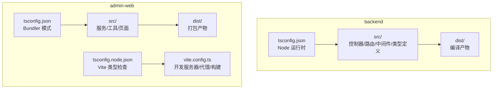
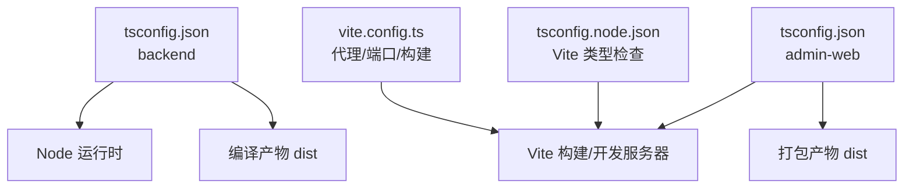
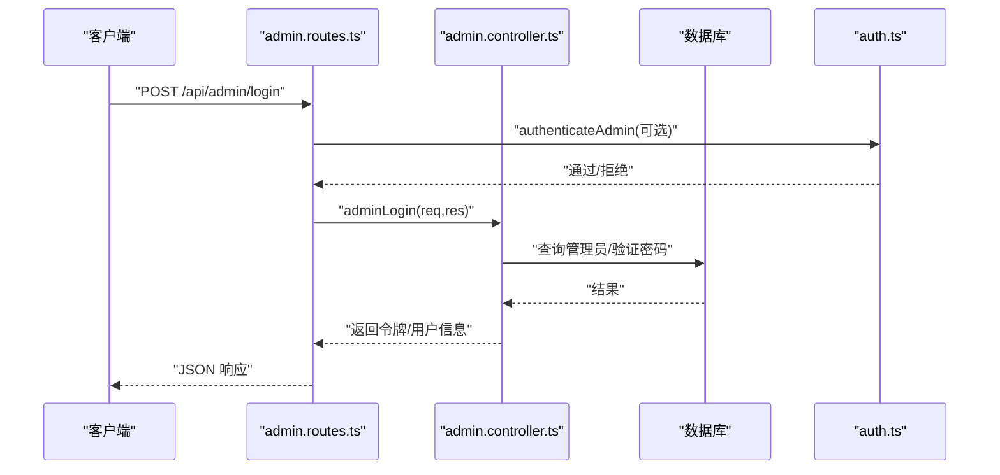
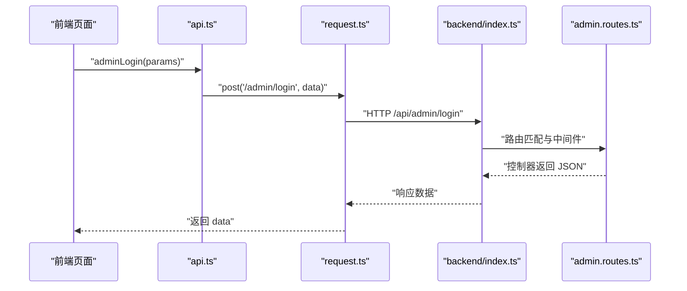
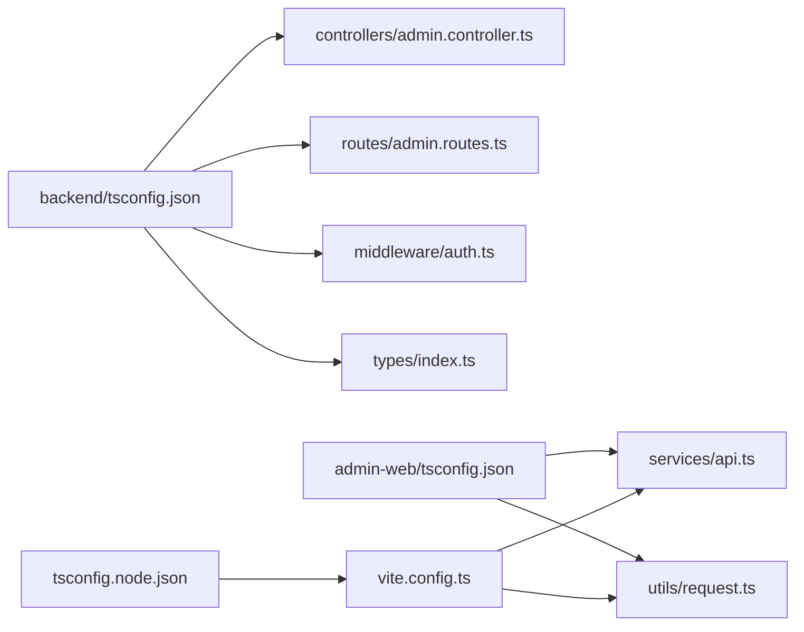

# TypeScript编译配置

<cite>
**本文引用的文件**
- [backend/tsconfig.json](file://backend/tsconfig.json)
- [home/user/nian/admin-web/tsconfig.json](file://home/user/nian/admin-web/tsconfig.json)
- [home/user/nian/admin-web/tsconfig.node.json](file://home/user/nian/admin-web/tsconfig.node.json)
- [home/user/nian/admin-web/vite.config.ts](file://home/user/nian/admin-web/vite.config.ts)
- [backend/src/index.ts](file://backend/src/index.ts)
- [backend/src/routes/admin.routes.ts](file://backend/src/routes/admin.routes.ts)
- [backend/src/controllers/admin.controller.ts](file://backend/src/controllers/admin.controller.ts)
- [backend/src/middleware/auth.ts](file://backend/src/middleware/auth.ts)
- [backend/src/types/index.ts](file://backend/src/types/index.ts)
- [home/user/nian/admin-web/src/services/api.ts](file://home/user/nian/admin-web/src/services/api.ts)
- [home/user/nian/admin-web/src/utils/request.ts](file://home/user/nian/admin-web/src/utils/request.ts)
</cite>

## 目录
1. [引言](#引言)
2. [项目结构](#项目结构)
3. [核心组件](#核心组件)
4. [架构总览](#架构总览)
5. [详细组件分析](#详细组件分析)
6. [依赖关系分析](#依赖关系分析)
7. [性能考量](#性能考量)
8. [故障排查指南](#故障排查指南)
9. [结论](#结论)

## 引言
本文件聚焦于本仓库中 backend 与 admin-web 两个子项目的 TypeScript 编译配置（tsconfig.json），系统性解析其关键编译选项：目标环境 target、严格模式 strict 及其子选项、模块互操作 esModuleInterop、模块解析策略 moduleResolution 的差异与原因，并结合 controller、route、service 层的实际导入导出行为，说明 outDir/rootDir 路径组织策略与 noUnusedLocals/noUnusedParameters 对代码质量的提升作用。文档旨在帮助开发者在不同运行环境中正确理解并应用这些配置，从而获得一致、可靠的构建与开发体验。

## 项目结构
- backend 子项目采用 Node.js 运行时，使用 CommonJS 模块系统，编译输出至 dist 目录，源码位于 src 目录。
- admin-web 子项目采用浏览器前端运行时，使用 ESNext 模块系统，通过 Vite 构建，开发时由 Vite 的 bundler 模式解析模块，tsconfig.node.json 用于 Vite 配置文件的类型检查。

图表来源
- [backend/tsconfig.json](file://backend/tsconfig.json#L1-L28)
- [home/user/nian/admin-web/tsconfig.json](file://home/user/nian/admin-web/tsconfig.json#L1-L51)
- [home/user/nian/admin-web/tsconfig.node.json](file://home/user/nian/admin-web/tsconfig.node.json#L1-L21)
- [home/user/nian/admin-web/vite.config.ts](file://home/user/nian/admin-web/vite.config.ts#L1-L43)

章节来源
- [backend/tsconfig.json](file://backend/tsconfig.json#L1-L28)
- [home/user/nian/admin-web/tsconfig.json](file://home/user/nian/admin-web/tsconfig.json#L1-L51)
- [home/user/nian/admin-web/tsconfig.node.json](file://home/user/nian/admin-web/tsconfig.node.json#L1-L21)
- [home/user/nian/admin-web/vite.config.ts](file://home/user/nian/admin-web/vite.config.ts#L1-L43)

## 核心组件
本节从“目标环境”“严格模式”“模块互操作”“模块解析策略”“路径组织”“未使用项检测”六个维度，逐项解析 backend 与 admin-web 的 tsconfig 差异及影响。

- 目标环境 target 设置为 ES2020
  - backend 使用 CommonJS 模块系统，target 为 ES2020，确保 async/await、Promise、解构赋值等现代特性可用，满足数据库查询、JWT 验证、文件上传等异步流程。
  - admin-web 使用 ESNext 模块系统，target 同样为 ES2020，配合 bundler 模式，保证在现代浏览器与打包器中具备一致的语法支持。
  - 影响范围：controller、route、service 层的异步函数、类型声明与模块导入导出均受益于此。

- 严格模式 strict 与子选项
  - backend 开启 strict，并启用 noImplicitAny、strictNullChecks、strictFunctionTypes、noImplicitReturns、noFallthroughCasesInSwitch 等，显著提升类型安全与健壮性。
  - admin-web 开启 strict，并启用 noUnusedLocals、noUnusedParameters、noFallthroughCasesInSwitch，强调开发期的“零冗余”，减少潜在的逻辑错误与维护成本。
  - 影响范围：类型定义（如 AuthRequest、ApiResponse、Method）、中间件参数校验、控制器返回值与分支覆盖等。

- 模块互操作 esModuleInterop
  - backend 开启 esModuleInterop，使 CommonJS 包（如 bcrypt、jsonwebtoken）在 TS 中以 ES 模块方式导入时无需额外的默认导入别名，简化了 require 与 import 的混用场景。
  - admin-web 未显式设置 esModuleInterop，但通过 allowSyntheticDefaultImports 与 bundler 模式共同保障第三方包的默认导入行为。

- 模块解析策略 moduleResolution
  - backend 使用 node，面向 Node.js 运行时，按 Node 解析规则查找模块，适合 require('express')、require('../utils/export') 等相对路径与包名解析。
  - admin-web 使用 bundler，面向打包器（Vite），允许以 .ts/.tsx/.json 等扩展名直接导入，且与 Vite 的插件生态协同工作。
  - 影响范围：controller 与 route 的相互导入、service 层对工具库的依赖、前端对 API 封装的导入。

- 路径组织 outDir 与 rootDir
  - backend 将 rootDir 设为 src，outDir 设为 dist，编译后保持与 src 相同的目录层级，便于调试与部署。
  - admin-web 通过 Vite 的 build.outDir 控制打包输出，tsconfig 本身不生成 JS，主要负责类型检查与 linting。

- 未使用项检测 noUnusedLocals/noUnusedParameters
  - backend 与 admin-web 均开启该选项，促使开发者清理无用变量与参数，降低代码噪音，提升可读性与可维护性。

章节来源
- [backend/tsconfig.json](file://backend/tsconfig.json#L1-L28)
- [home/user/nian/admin-web/tsconfig.json](file://home/user/nian/admin-web/tsconfig.json#L1-L51)
- [home/user/nian/admin-web/tsconfig.node.json](file://home/user/nian/admin-web/tsconfig.node.json#L1-L21)

## 架构总览
下图展示了 backend 与 admin-web 在编译阶段的关键交互：tsconfig 决定模块解析、目标语法与严格程度；runtime（Node 或浏览器）决定最终执行环境；构建工具（Vite 或 Node）负责打包或运行。

图表来源
- [backend/tsconfig.json](file://backend/tsconfig.json#L1-L28)
- [home/user/nian/admin-web/tsconfig.json](file://home/user/nian/admin-web/tsconfig.json#L1-L51)
- [home/user/nian/admin-web/tsconfig.node.json](file://home/user/nian/admin-web/tsconfig.node.json#L1-L21)
- [home/user/nian/admin-web/vite.config.ts](file://home/user/nian/admin-web/vite.config.ts#L1-L43)

## 详细组件分析

### backend：Node 后端编译配置
- 关键点
  - target: ES2020，lib: ES2020，确保现代语法与 API 可用。
  - module: commonjs，moduleResolution: node，适配 Node 生态与 require 导入。
  - strict: true，配合 noImplicitAny、strictNullChecks、strictFunctionTypes 等，提升类型安全。
  - esModuleInterop: true，简化第三方包导入。
  - outDir: ./dist，rootDir: ./src，保持目录一致性。
  - noUnusedLocals/noUnusedParameters：减少冗余，提升可读性。
  - declaration/declarationMap/sourceMap：便于调试与发布 d.ts。

- 实际影响
  - 控制器（controller）：大量使用 async/await，例如管理员登录、方法审核、数据导出等，均受益于 ES2020 与 strict 检查。
  - 路由（route）：Express 路由注册与中间件调用，严格类型约束避免参数遗漏与返回值不一致。
  - 中间件（middleware）：JWT 校验与错误处理，严格模式确保空值与异常分支被覆盖。

图表来源
- [backend/src/routes/admin.routes.ts](file://backend/src/routes/admin.routes.ts#L1-L69)
- [backend/src/controllers/admin.controller.ts](file://backend/src/controllers/admin.controller.ts#L1-L80)
- [backend/src/middleware/auth.ts](file://backend/src/middleware/auth.ts#L1-L87)

章节来源
- [backend/tsconfig.json](file://backend/tsconfig.json#L1-L28)
- [backend/src/controllers/admin.controller.ts](file://backend/src/controllers/admin.controller.ts#L1-L120)
- [backend/src/routes/admin.routes.ts](file://backend/src/routes/admin.routes.ts#L1-L69)
- [backend/src/middleware/auth.ts](file://backend/src/middleware/auth.ts#L1-L87)
- [backend/src/types/index.ts](file://backend/src/types/index.ts#L1-L126)

### admin-web：前端编译配置
- 关键点
  - target: ES2020，lib: ES2020、DOM、DOM.Iterable，支持 React JSX 与现代浏览器 API。
  - module: ESNext，moduleResolution: bundler，面向打包器（Vite）。
  - allowImportingTsExtensions、resolveJsonModule、isolatedModules、noEmit：与 Vite 协作，实现热更新与类型检查。
  - strict: true，noUnusedLocals/noUnusedParameters：提升开发期质量。
  - tsconfig.node.json：为 vite.config.ts 提供类型检查，moduleResolution: bundler，allowSyntheticDefaultImports: true。

- 实际影响
  - 服务层（api.ts）：对后端接口进行封装，严格参数与返回值类型，便于前端消费。
  - 工具层（request.ts）：Axios 客户端封装，统一请求/响应拦截，严格错误处理分支。
  - Vite 配置：dev server 代理 /api 到 backend，build 输出 dist，与 tsconfig 的 bundler 模式相辅相成。

图表来源
- [home/user/nian/admin-web/src/services/api.ts](file://home/user/nian/admin-web/src/services/api.ts#L1-L61)
- [home/user/nian/admin-web/src/utils/request.ts](file://home/user/nian/admin-web/src/utils/request.ts#L1-L81)
- [backend/src/index.ts](file://backend/src/index.ts#L1-L85)
- [backend/src/routes/admin.routes.ts](file://backend/src/routes/admin.routes.ts#L1-L69)

章节来源
- [home/user/nian/admin-web/tsconfig.json](file://home/user/nian/admin-web/tsconfig.json#L1-L51)
- [home/user/nian/admin-web/tsconfig.node.json](file://home/user/nian/admin-web/tsconfig.node.json#L1-L21)
- [home/user/nian/admin-web/vite.config.ts](file://home/user/nian/admin-web/vite.config.ts#L1-L43)
- [home/user/nian/admin-web/src/services/api.ts](file://home/user/nian/admin-web/src/services/api.ts#L1-L61)
- [home/user/nian/admin-web/src/utils/request.ts](file://home/user/nian/admin-web/src/utils/request.ts#L1-L81)
- [backend/src/index.ts](file://backend/src/index.ts#L1-L85)

### 配置差异与选择理由
- target: ES2020
  - 保证 async/await、Promise、解构赋值、模板字符串等现代特性可用，兼顾 Node 与浏览器环境。
- strict 模式
  - backend：强化类型安全，避免 any 泛滥与空值风险，提升控制器与中间件的健壮性。
  - admin-web：强调“零冗余”，减少未使用变量与参数，提升可读性与可维护性。
- esModuleInterop
  - backend：简化第三方包（如 bcrypt、jsonwebtoken）的导入方式，避免默认导入别名的歧义。
- moduleResolution
  - backend：node，适配 Node 的模块解析与 require 行为。
  - admin-web：bundler，适配 Vite 的模块解析与扩展名导入能力。
- outDir/rootDir
  - backend：rootDir=src、outDir=dist，保持目录结构清晰，便于调试与部署。
  - admin-web：Vite 控制构建输出，tsconfig 主要负责类型检查与 linting。

章节来源
- [backend/tsconfig.json](file://backend/tsconfig.json#L1-L28)
- [home/user/nian/admin-web/tsconfig.json](file://home/user/nian/admin-web/tsconfig.json#L1-L51)
- [home/user/nian/admin-web/tsconfig.node.json](file://home/user/nian/admin-web/tsconfig.node.json#L1-L21)

## 依赖关系分析
- backend
  - tsconfig.json 决定模块解析与目标语法，影响 controller、route、middleware、types 的导入导出与类型推断。
  - index.ts 作为入口，集中注册路由，体现 route 与 controller 的依赖关系。
- admin-web
  - tsconfig.json 与 tsconfig.node.json 共同支撑 Vite 的类型检查与模块解析。
  - vite.config.ts 通过代理将 /api 指向 backend，形成前后端联调链路。
  - api.ts 与 request.ts 依赖后端接口契约，严格类型约束保证前后端一致性。

图表来源
- [backend/tsconfig.json](file://backend/tsconfig.json#L1-L28)
- [backend/src/controllers/admin.controller.ts](file://backend/src/controllers/admin.controller.ts#L1-L120)
- [backend/src/routes/admin.routes.ts](file://backend/src/routes/admin.routes.ts#L1-L69)
- [backend/src/middleware/auth.ts](file://backend/src/middleware/auth.ts#L1-L87)
- [backend/src/types/index.ts](file://backend/src/types/index.ts#L1-L126)
- [home/user/nian/admin-web/tsconfig.json](file://home/user/nian/admin-web/tsconfig.json#L1-L51)
- [home/user/nian/admin-web/tsconfig.node.json](file://home/user/nian/admin-web/tsconfig.node.json#L1-L21)
- [home/user/nian/admin-web/vite.config.ts](file://home/user/nian/admin-web/vite.config.ts#L1-L43)
- [home/user/nian/admin-web/src/services/api.ts](file://home/user/nian/admin-web/src/services/api.ts#L1-L61)
- [home/user/nian/admin-web/src/utils/request.ts](file://home/user/nian/admin-web/src/utils/request.ts#L1-L81)

章节来源
- [backend/src/index.ts](file://backend/src/index.ts#L1-L85)
- [backend/src/routes/admin.routes.ts](file://backend/src/routes/admin.routes.ts#L1-L69)
- [home/user/nian/admin-web/vite.config.ts](file://home/user/nian/admin-web/vite.config.ts#L1-L43)

## 性能考量
- 编译性能
  - backend 使用 commonjs 与 node 解析，构建速度快，适合 Node 服务端。
  - admin-web 使用 bundler 模式，Vite 提供快速热更新与按需打包，适合前端开发。
- 运行性能
  - ES2020 目标确保现代语法在运行时具备良好性能与兼容性。
  - 严格模式减少运行时类型错误，间接提升稳定性与可维护性。
- 资源体积
  - admin-web 通过 Vite 的 tree-shaking 与拆分策略优化产物体积；backend 通过 dist 输出便于按需部署。

## 故障排查指南
- 常见问题与定位
  - “找不到模块”或“模块解析失败”
    - backend：确认 moduleResolution=node，路径是否为相对路径或包名，是否缺少扩展名。
    - admin-web：确认 moduleResolution=bundler，是否使用 allowImportingTsExtensions，Vite 是否正确代理 /api。
  - “any 类型”或“空值未处理”
    - backend：检查 noImplicitAny、strictNullChecks 是否生效，补充类型注解或空值判断。
    - admin-web：检查未使用变量与参数，清理冗余代码。
  - “第三方包导入报错”
    - backend：开启 esModuleInterop，确保第三方包以 import 方式正确导入。
  - “编译产物路径混乱”
    - backend：检查 rootDir 与 outDir，确保与 src 结构一致。
- 推荐步骤
  - 在各自项目根目录执行类型检查与构建命令，观察错误提示。
  - 对照 tsconfig 的关键选项，逐步调整 moduleResolution、module、target 等。
  - 在 admin-web 中，确认 vite.config.ts 的代理与端口配置，确保 /api 能正确转发到 backend。

章节来源
- [backend/tsconfig.json](file://backend/tsconfig.json#L1-L28)
- [home/user/nian/admin-web/tsconfig.json](file://home/user/nian/admin-web/tsconfig.json#L1-L51)
- [home/user/nian/admin-web/vite.config.ts](file://home/user/nian/admin-web/vite.config.ts#L1-L43)

## 结论
backend 与 admin-web 的 tsconfig 在“目标环境”“严格模式”“模块互操作”“模块解析策略”“路径组织”“未使用项检测”等方面各有侧重：backend 强调 Node 运行时的类型安全与模块解析，admin-web 强调前端 bundler 模式的类型检查与开发体验。二者共同确保了 controller、route、service 层在不同运行环境下的稳定导入导出与一致的类型约束，为项目的长期可维护性提供了坚实基础。