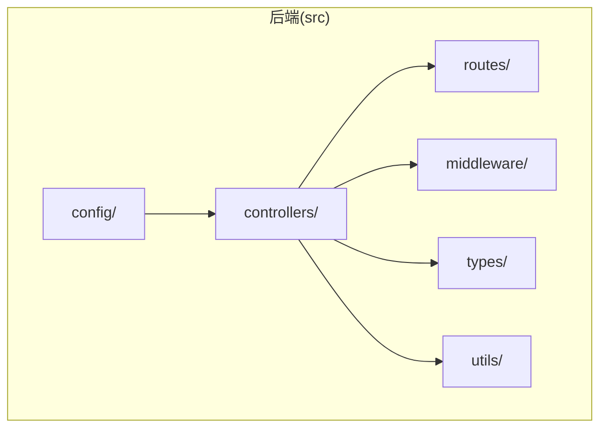
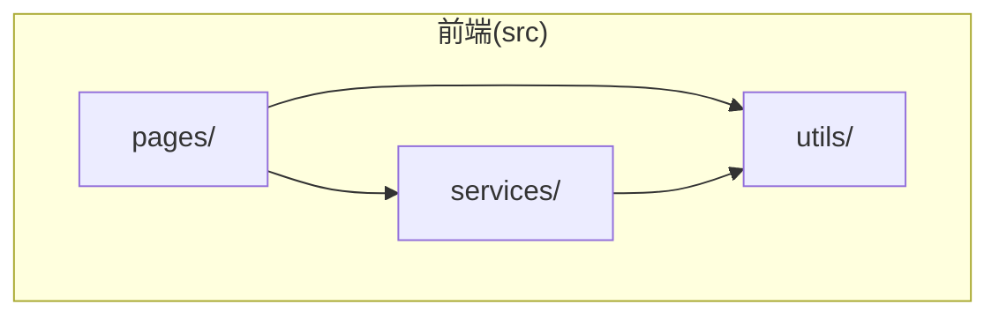
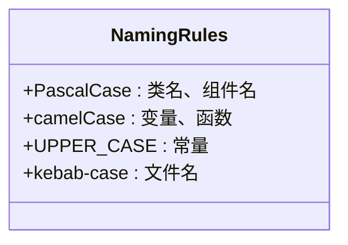
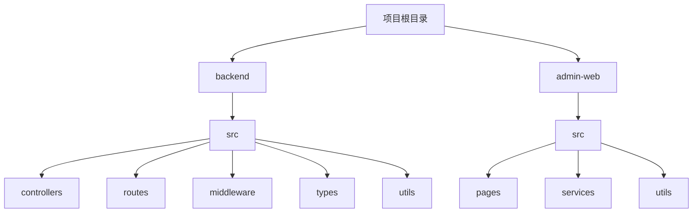

# 命名规范与文件组织

<cite>
**本文档引用的文件**  
- [auth.controller.ts](file://backend/src/controllers/auth.controller.ts)
- [auth.routes.ts](file://backend/src/routes/auth.routes.ts)
- [admin.controller.ts](file://backend/src/controllers/admin.controller.ts)
- [admin.routes.ts](file://backend/src/routes/admin.routes.ts)
- [Login.tsx](file://home/user/nian/admin-web/src/pages/Login.tsx)
- [Dashboard.tsx](file://home/user/nian/admin-web/src/pages/Dashboard.tsx)
- [MethodList.tsx](file://home/user/nian/admin-web/src/pages/MethodList.tsx)
- [api.ts](file://home/user/nian/admin-web/src/services/api.ts)
- [request.ts](file://home/user/nian/admin-web/src/utils/request.ts)
- [types/index.ts](file://backend/src/types/index.ts)
- [middleware/auth.ts](file://backend/src/middleware/auth.ts)
- [utils/upload.ts](file://backend/src/utils/upload.ts)
- [App.tsx](file://home/user/nian/admin-web/src/App.tsx)
</cite>

## 目录
1. [简介](#简介)
2. [后端命名规范与组织结构](#后端命名规范与组织结构)
3. [前端命名规范与组织结构](#前端命名规范与组织结构)
4. [统一组件命名规则](#统一组件命名规则)
5. [目录划分原则](#目录划分原则)
6. [新功能模块创建指南](#新功能模块创建指南)

## 简介
本项目采用TypeScript开发，前后端遵循一致的命名规范和文件组织结构。后端采用功能模块+类型后缀的命名模式，前端页面采用PascalCase命名，服务采用单例模式。本文档详细说明这些规范，为新功能开发提供指导。

## 后端命名规范与组织结构

后端代码位于`backend/src`目录下，采用清晰的功能模块划分和一致的命名约定。

**图源**  
- [auth.controller.ts](file://backend/src/controllers/auth.controller.ts)
- [auth.routes.ts](file://backend/src/routes/auth.routes.ts)
- [middleware/auth.ts](file://backend/src/middleware/auth.ts)
- [types/index.ts](file://backend/src/types/index.ts)

**本节来源**  
- [backend/src/controllers](file://backend/src/controllers)
- [backend/src/routes](file://backend/src/routes)

### 功能模块+类型后缀命名模式
后端采用`功能模块名.类型后缀.ts`的命名模式，如`auth.controller.ts`、`auth.routes.ts`。这种模式将相关功能的控制器和路由文件按模块组织，便于维护。

控制器文件包含业务逻辑处理函数，路由文件定义API端点并关联控制器函数。例如，`auth.controller.ts`中的`register`、`login`函数在`auth.routes.ts`中通过`router.post('/register', register)`进行绑定。

### 控制器与路由分离
控制器（Controller）负责处理请求和响应，包含具体的业务逻辑实现。路由（Route）负责定义API端点和请求方法，将HTTP请求映射到相应的控制器函数。

这种分离模式实现了关注点分离，使代码更易于测试和维护。当需要修改API接口时，只需调整路由文件；当需要修改业务逻辑时，只需调整控制器文件。

**本节来源**  
- [auth.controller.ts](file://backend/src/controllers/auth.controller.ts#L1-L150)
- [auth.routes.ts](file://backend/src/routes/auth.routes.ts#L1-L17)

## 前端命名规范与组织结构

前端代码位于`home/user/nian/admin-web/src`目录下，采用组件化设计和清晰的目录结构。

**图源**  
- [Login.tsx](file://home/user/nian/admin-web/src/pages/Login.tsx)
- [api.ts](file://home/user/nian/admin-web/src/services/api.ts)
- [request.ts](file://home/user/nian/admin-web/src/utils/request.ts)

**本节来源**  
- [home/user/nian/admin-web/src/pages](file://home/user/nian/admin-web/src/pages)
- [home/user/nian/admin-web/src/services](file://home/user/nian/admin-web/src/services)

### 页面组件PascalCase命名
前端页面组件采用PascalCase命名，如`Login.tsx`、`Dashboard.tsx`、`MethodList.tsx`。这种命名方式符合React组件的命名惯例，使组件在JSX中使用时更加直观。

每个页面组件是一个独立的React函数组件，包含自己的状态管理和UI渲染逻辑。例如，`Login.tsx`组件包含登录表单、状态管理和登录逻辑。

### 单例服务模式
服务层采用单例模式，`services/api.ts`文件导出多个API调用函数，如`adminLogin`、`getAdminStats`、`getMethods`等。这些函数封装了对后端API的调用，提供了一致的接口供页面组件使用。

`utils/request.ts`文件创建并配置了axios实例，作为所有API请求的基础。这种分层设计使API调用逻辑集中管理，便于统一处理请求拦截、响应拦截和错误处理。

**本节来源**  
- [Login.tsx](file://home/user/nian/admin-web/src/pages/Login.tsx#L1-L127)
- [api.ts](file://home/user/nian/admin-web/src/services/api.ts#L1-L61)
- [request.ts](file://home/user/nian/admin-web/src/utils/request.ts#L1-L81)

## 统一组件命名规则

项目遵循一致的命名规则，确保代码的可读性和一致性。

**图源**  
- [types/index.ts](file://backend/src/types/index.ts#L1-L126)
- [App.tsx](file://home/user/nian/admin-web/src/App.tsx#L1-L154)

**本节来源**  
- [backend/src/types/index.ts](file://backend/src/types/index.ts)
- [home/user/nian/admin-web/src/App.tsx](file://home/user/nian/admin-web/src/App.tsx)

### 类名与组件名
类名和React组件名使用PascalCase命名，如`User`、`Admin`、`Login`、`Dashboard`。这种命名方式符合JavaScript和TypeScript的惯例，使类和组件在代码中易于识别。

### 变量与函数名
变量和函数名使用camelCase命名，如`register`、`login`、`adminLogin`、`getAdminStats`。这种命名方式符合JavaScript的惯例，使代码更加流畅易读。

### 常量名
常量使用UPPER_CASE命名，如`JWT_SECRET`、`UPLOADS_DIR`。这种命名方式明确标识了常量，使其在代码中易于识别。

**本节来源**  
- [auth.controller.ts](file://backend/src/controllers/auth.controller.ts#L6)
- [middleware/auth.ts](file://backend/src/middleware/auth.ts#L6)
- [utils/upload.ts](file://backend/src/utils/upload.ts#L8)

## 目录划分原则

项目采用功能驱动的目录划分原则，确保前后端保持一致的组织逻辑。

**图源**  
- [backend/src](file://backend/src)
- [home/user/nian/admin-web/src](file://home/user/nian/admin-web/src)

**本节来源**  
- [backend/src](file://backend/src)
- [home/user/nian/admin-web/src](file://home/user/nian/admin-web/src)

### 控制器
控制器目录包含业务逻辑处理函数，每个功能模块有一个对应的控制器文件。控制器函数接收请求、处理业务逻辑并返回响应。

### 中间件
中间件目录包含可重用的请求处理函数，如身份验证、错误处理、日志记录等。中间件可以在多个路由中复用，实现横切关注点的集中管理。

### 服务
服务目录包含API客户端和服务函数，封装了对后端API的调用。服务层为页面组件提供数据访问接口，实现数据获取和提交的逻辑。

### API客户端
API客户端是服务层的具体实现，使用axios等HTTP客户端库与后端API进行通信。API客户端处理请求配置、拦截器、错误处理等细节。

**本节来源**  
- [backend/src/controllers](file://backend/src/controllers)
- [backend/src/middleware](file://backend/src/middleware)
- [home/user/nian/admin-web/src/services](file://home/user/nian/admin-web/src/services)
- [home/user/nian/admin-web/src/utils/request.ts](file://home/user/nian/admin-web/src/utils/request.ts)

## 新功能模块创建指南

创建新功能模块时，应遵循以下步骤和命名规范。

### 后端新功能创建
1. 在`backend/src/controllers`目录下创建`功能名.controller.ts`文件
2. 在`backend/src/routes`目录下创建`功能名.routes.ts`文件
3. 在`backend/src/types/index.ts`中定义相关类型
4. 在`backend/src/middleware`中创建必要的中间件
5. 在`backend/src/utils`中创建必要的工具函数

例如，创建用户管理功能：
- `user.controller.ts`：包含用户相关的业务逻辑
- `user.routes.ts`：定义用户相关的API端点
- `types/index.ts`：定义`User`、`UserWithPassword`等类型

### 前端新功能创建
1. 在`admin-web/src/pages`目录下创建`PascalCase命名.tsx`文件
2. 在`admin-web/src/services/api.ts`中添加API调用函数
3. 在`admin-web/src/utils`中创建必要的工具函数
4. 在`admin-web/src/App.tsx`中添加路由配置

例如，创建用户管理页面：
- `UserManagement.tsx`：用户管理页面组件
- `api.ts`：添加`getUsers`、`getUserDetail`等API函数
- `App.tsx`：添加`/users`路由配置

**本节来源**  
- [admin.controller.ts](file://backend/src/controllers/admin.controller.ts)
- [admin.routes.ts](file://backend/src/routes/admin.routes.ts)
- [App.tsx](file://home/user/nian/admin-web/src/App.tsx)

## 结论
本项目通过一致的命名规范和文件组织结构，实现了前后端代码的清晰性和可维护性。后端采用功能模块+类型后缀的命名模式，前端采用PascalCase命名和单例服务模式。类名使用PascalCase，变量和函数使用camelCase，常量使用UPPER_CASE。控制器、中间件、服务、API客户端等组件有明确的目录划分原则，确保了前后端保持一致的组织逻辑。新功能模块的创建应遵循这些规范，以保持代码库的一致性和可维护性。