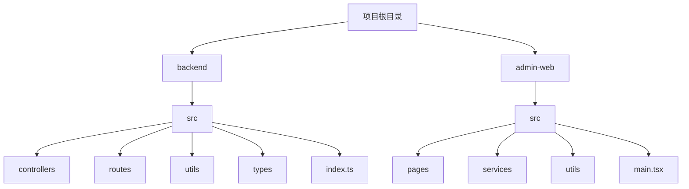
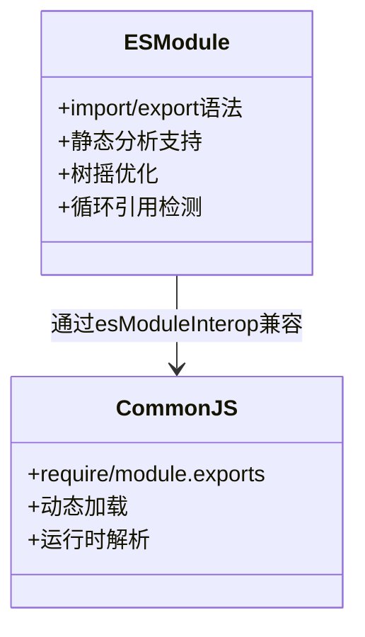
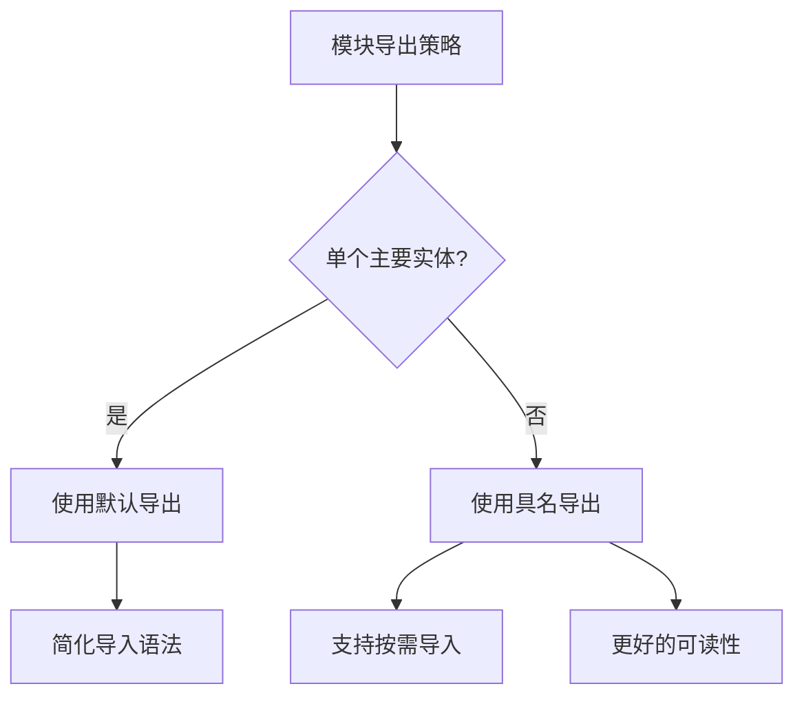

# 模块系统与导入策略

<cite>
**本文档引用的文件**
- [index.ts](file://backend/src/index.ts)
- [main.tsx](file://home/user/nian/admin-web/src/main.tsx)
- [logger.ts](file://backend/src/utils/logger.ts)
- [request.ts](file://home/user/nian/admin-web/src/utils/request.ts)
- [export.ts](file://backend/src/utils/export.ts)
- [types/index.ts](file://backend/src/types/index.ts)
- [admin.controller.ts](file://backend/src/controllers/admin.controller.ts)
- [admin.routes.ts](file://backend/src/routes/admin.routes.ts)
- [tsconfig.json](file://backend/tsconfig.json)
</cite>

## 目录
1. [项目结构分析](#项目结构分析)
2. [模块导入导出规范](#模块导入导出规范)
3. [ES模块语法实践](#es模块语法实践)
4. [默认导出与具名导出](#默认导出与具名导出)
5. [工具类可复用性设计](#工具类可复用性设计)
6. [路径别名与相对路径](#路径别名与相对路径)
7. [Barrel文件聚合策略](#barrel文件聚合策略)
8. [循环引用避免](#循环引用避免)
9. [TypeScript配置分析](#typescript配置分析)

## 项目结构分析

本项目包含两个主要的TypeScript应用：后端API服务（backend）和管理后台前端（admin-web）。两个项目都采用了现代TypeScript模块系统，但存在一些配置差异。



**Diagram sources**
- [backend/src/index.ts](file://backend/src/index.ts#L1-L85)
- [home/user/nian/admin-web/src/main.tsx](file://home/user/nian/admin-web/src/main.tsx#L1-L18)

## 模块导入导出规范

项目严格遵循ES模块语法（import/export），避免使用CommonJS（require/module.exports）和namespace命名空间。这种一致性确保了代码的可维护性和跨平台兼容性。

在后端项目中，尽管`tsconfig.json`配置了`"module": "commonjs"`，但源代码仍然使用ES模块语法，这得益于`"esModuleInterop": true`的配置，实现了ES模块与CommonJS的互操作性。



**Diagram sources**
- [backend/tsconfig.json](file://backend/tsconfig.json#L1-L28)
- [backend/src/index.ts](file://backend/src/index.ts#L1-L85)

## ES模块语法实践

项目中的所有模块都使用ES模块语法进行导入和导出，这在`backend/src/index.ts`中得到了充分体现：

```typescript
import 'dotenv/config';
import 'express-async-errors';
import express from 'express';
import cors from 'cors';
import { errorHandler } from './middleware/errorHandler';
import { logger } from './utils/logger';
```

这种导入方式具有以下优势：
- 静态分析：编译时即可确定依赖关系
- 树摇优化：未使用的导入可以被工具自动移除
- 明确的依赖声明：每个导入都清晰地表明了依赖来源

**Section sources**
- [backend/src/index.ts](file://backend/src/index.ts#L1-L85)

## 默认导出与具名导出

项目中合理使用了默认导出和具名导出，根据使用场景选择合适的导出方式。

### 入口文件的默认导出

在路由文件中，如`backend/src/routes/admin.routes.ts`，使用默认导出：

```typescript
const router = Router();
// ... 路由配置
export default router;
```

这种模式适用于只有一个主要导出的模块，简化了导入语法。

### 工具函数的具名导出

在工具类文件中，如`backend/src/utils/export.ts`，使用具名导出：

```typescript
export const exportUsersToCSV = async (users: any[]): Promise<string> => { ... };
export const exportMethodsToCSV = async (methods: any[]): Promise<string> => { ... };
export const exportPracticesToExcel = async (practices: any[]): Promise<string> => { ... };
```

具名导出适用于导出多个相关功能的模块，提供了更好的可读性和按需导入能力。



**Diagram sources**
- [backend/src/routes/admin.routes.ts](file://backend/src/routes/admin.routes.ts#L1-L98)
- [backend/src/utils/export.ts](file://backend/src/utils/export.ts#L1-L130)

## 工具类可复用性设计

工具类的设计充分考虑了可复用性，通过合理的模块划分和导出策略，确保功能可以在不同上下文中复用。

### 日志工具

`backend/src/utils/logger.ts`导出了一个配置好的winston实例：

```typescript
export const logger = winston.createLogger({ ... });
```

这种设计允许在整个应用中使用统一的日志配置，确保日志格式和输出的一致性。

### 请求工具

`home/user/nian/admin-web/src/utils/request.ts`导出了一个配置好的axios实例：

```typescript
export default apiClient;
```

该实例包含了基础URL、超时设置、请求/响应拦截器等配置，实现了：
- 统一的API基础路径
- 自动的JWT令牌注入
- 统一的错误处理
- 401状态的自动重定向

**Section sources**
- [backend/src/utils/logger.ts](file://backend/src/utils/logger.ts#L1-L37)
- [home/user/nian/admin-web/src/utils/request.ts](file://home/user/nian/admin-web/src/utils/request.ts#L1-L81)

## 路径别名与相对路径

项目中主要使用相对路径进行模块导入，保持了路径的清晰性和可预测性。

### 相对路径实践

在`backend/src/controllers/admin.controller.ts`中，可以看到典型的相对路径导入：

```typescript
import { pool } from '../config/database';
import { generateToken } from '../middleware/auth';
import { AppError } from '../middleware/errorHandler';
import { AuthRequest, Method, PaginatedResponse } from '../types';
```

这种导入方式的优点：
- 路径清晰：可以直接看出模块间的相对位置
- 无需额外配置：不依赖IDE或构建工具的路径解析
- 移动友好：模块移动时，只需更新相邻模块的导入路径

### 路径深度管理

对于深层嵌套的模块，建议使用barrel文件来简化路径，避免过长的相对路径如`../../../../utils/logger`。

**Section sources**
- [backend/src/controllers/admin.controller.ts](file://backend/src/controllers/admin.controller.ts#L1-L800)

## Barrel文件聚合策略

虽然当前项目没有广泛使用barrel文件（index.ts），但这是一个值得推荐的实践，特别是在类型定义和工具函数的聚合方面。

### 类型聚合

`backend/src/types/index.ts`就是一个典型的barrel文件，它聚合了所有类型定义：

```typescript
export interface User { ... }
export interface Method { ... }
export interface UserMethod { ... }
export interface PracticeRecord { ... }
export interface Admin { ... }
export interface ApiResponse<T = any> { ... }
export interface PaginatedResponse<T> { ... }
```

这种模式的优势：
- 统一导入点：其他模块可以通过`import { User, Method } from '../types'`一次性导入所需类型
- 易于维护：类型定义的增删改只需在index.ts中进行
- API清晰：index.ts文件本身就是模块的公共API文档

### 推荐的Barrel文件结构

```mermaid
tree
src/
├── utils/
│ ├── logger.ts
│ ├── export.ts
│ └── upload.ts
│ └── index.ts
├── types/
│ ├── user.ts
│ ├── method.ts
│ └── index.ts
└── index.ts
```

其中`src/utils/index.ts`可以导出所有工具函数：
```typescript
export * from './logger';
export * from './export';
export * from './upload';
```

**Section sources**
- [backend/src/types/index.ts](file://backend/src/types/index.ts#L1-L126)

## 循环引用避免

项目通过合理的模块划分和依赖管理，有效避免了循环引用问题。

### 依赖方向规范

建立清晰的依赖层级：
```
controllers → services → repositories → database
          ↘ types
          ↘ utils
```

### 循环引用检测

TypeScript的静态分析能够检测大多数循环引用，建议在开发过程中：
- 使用`--traceResolution`编译选项来跟踪模块解析
- 定期检查编译警告
- 使用lint规则禁止高风险的导入模式

### 解决循环引用的策略

当出现循环引用时，可以采用以下策略：
1. **提取公共依赖**：将共享代码提取到独立的模块
2. **使用依赖注入**：通过参数传递依赖，而不是直接导入
3. **重构模块**：重新组织代码，打破循环依赖

**Section sources**
- [backend/src/controllers/admin.controller.ts](file://backend/src/controllers/admin.controller.ts#L1-L800)
- [backend/src/routes/admin.routes.ts](file://backend/src/routes/admin.routes.ts#L1-L98)

## TypeScript配置分析

`backend/tsconfig.json`的配置体现了项目对模块系统的支持：

```json
{
  "compilerOptions": {
    "target": "ES2020",
    "module": "commonjs",
    "esModuleInterop": true,
    "moduleResolution": "node"
  }
}
```

关键配置说明：
- `"module": "commonjs"`：编译输出使用CommonJS模块系统，兼容Node.js环境
- `"esModuleInterop": true"`：允许ES模块和CommonJS模块的互操作，支持`import express from 'express'`语法
- `"moduleResolution": "node"`：使用Node.js的模块解析策略

这种配置使得开发时可以使用现代ES模块语法，而运行时生成兼容Node.js的CommonJS代码。

**Section sources**
- [backend/tsconfig.json](file://backend/tsconfig.json#L1-L28)