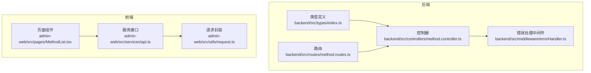
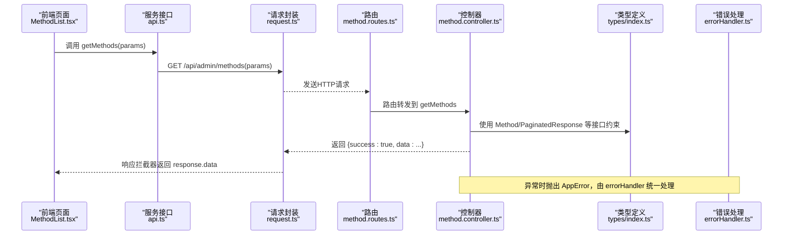
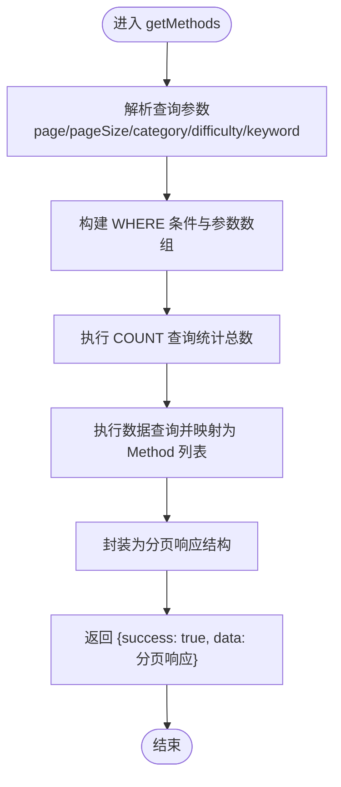
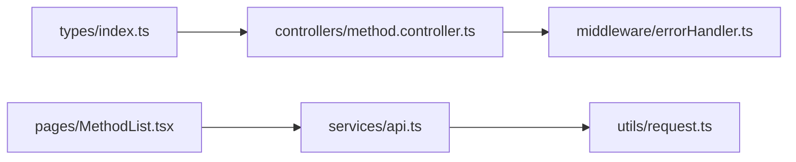

# 类型设计与最佳实践

<cite>
**本文引用的文件**
- [backend/src/types/index.ts](file://backend/src/types/index.ts)
- [backend/src/controllers/method.controller.ts](file://backend/src/controllers/method.controller.ts)
- [backend/src/middleware/errorHandler.ts](file://backend/src/middleware/errorHandler.ts)
- [backend/src/routes/method.routes.ts](file://backend/src/routes/method.routes.ts)
- [home/user/nian/admin-web/src/pages/MethodList.tsx](file://home/user/nian/admin-web/src/pages/MethodList.tsx)
- [home/user/nian/admin-web/src/services/api.ts](file://home/user/nian/admin-web/src/services/api.ts)
- [home/user/nian/admin-web/src/utils/request.ts](file://home/user/nian/admin-web/src/utils/request.ts)
</cite>

## 目录
1. [引言](#引言)
2. [项目结构](#项目结构)
3. [核心组件](#核心组件)
4. [架构总览](#架构总览)
5. [详细组件分析](#详细组件分析)
6. [依赖关系分析](#依赖关系分析)
7. [性能考量](#性能考量)
8. [故障排查指南](#故障排查指南)
9. [结论](#结论)
10. [附录](#附录)

## 引言
本文件围绕本项目的TypeScript类型系统设计规范与最佳实践展开，重点基于后端全局类型定义、控制器中的请求参数与响应约束、前端页面Props定义、枚举与状态码规范、以及错误处理中自定义Error类的结构设计建议。目标是帮助团队在数据模型、接口契约、前后端交互与错误处理等方面形成一致、可维护且类型安全的开发流程。

## 项目结构
本项目在后端采用“类型集中定义 + 控制器约束 + 中间件统一错误”的结构；在前端采用“页面组件 + 服务层接口 + 请求封装”的分层方式。类型系统贯穿于API请求参数、响应数据、错误对象与UI Props等关键环节。

图表来源
- [backend/src/types/index.ts](file://backend/src/types/index.ts#L1-L126)
- [backend/src/controllers/method.controller.ts](file://backend/src/controllers/method.controller.ts#L1-L153)
- [backend/src/middleware/errorHandler.ts](file://backend/src/middleware/errorHandler.ts#L1-L97)
- [backend/src/routes/method.routes.ts](file://backend/src/routes/method.routes.ts#L1-L20)
- [home/user/nian/admin-web/src/pages/MethodList.tsx](file://home/user/nian/admin-web/src/pages/MethodList.tsx#L1-L339)
- [home/user/nian/admin-web/src/services/api.ts](file://home/user/nian/admin-web/src/services/api.ts#L1-L61)
- [home/user/nian/admin-web/src/utils/request.ts](file://home/user/nian/admin-web/src/utils/request.ts#L1-L81)

章节来源
- [backend/src/types/index.ts](file://backend/src/types/index.ts#L1-L126)
- [backend/src/controllers/method.controller.ts](file://backend/src/controllers/method.controller.ts#L1-L153)
- [backend/src/middleware/errorHandler.ts](file://backend/src/middleware/errorHandler.ts#L1-L97)
- [backend/src/routes/method.routes.ts](file://backend/src/routes/method.routes.ts#L1-L20)
- [home/user/nian/admin-web/src/pages/MethodList.tsx](file://home/user/nian/admin-web/src/pages/MethodList.tsx#L1-L339)
- [home/user/nian/admin-web/src/services/api.ts](file://home/user/nian/admin-web/src/services/api.ts#L1-L61)
- [home/user/nian/admin-web/src/utils/request.ts](file://home/user/nian/admin-web/src/utils/request.ts#L1-L81)

## 核心组件
- 全局类型定义：集中定义用户、方法、练习记录、管理员、媒体文件、分页与通用响应等接口，便于跨模块复用与约束。
- 控制器类型约束：通过接口对请求参数、响应数据进行强类型约束，确保API契约清晰。
- 错误处理：自定义AppError类，配合中间件统一返回格式，提升错误可诊断性。
- 前端类型：页面组件Props与服务层参数接口，结合Axios响应拦截器，保证前后端数据一致性。

章节来源
- [backend/src/types/index.ts](file://backend/src/types/index.ts#L1-L126)
- [backend/src/controllers/method.controller.ts](file://backend/src/controllers/method.controller.ts#L1-L153)
- [backend/src/middleware/errorHandler.ts](file://backend/src/middleware/errorHandler.ts#L1-L97)
- [home/user/nian/admin-web/src/pages/MethodList.tsx](file://home/user/nian/admin-web/src/pages/MethodList.tsx#L1-L339)
- [home/user/nian/admin-web/src/services/api.ts](file://home/user/nian/admin-web/src/services/api.ts#L1-L61)

## 架构总览
后端通过类型定义统一数据模型，控制器在入参与出参处使用接口进行约束；前端通过服务层接口与请求封装对接后端API，响应拦截器统一提取data，减少重复样板代码。

图表来源
- [backend/src/controllers/method.controller.ts](file://backend/src/controllers/method.controller.ts#L1-L153)
- [backend/src/middleware/errorHandler.ts](file://backend/src/middleware/errorHandler.ts#L1-L97)
- [backend/src/routes/method.routes.ts](file://backend/src/routes/method.routes.ts#L1-L20)
- [backend/src/types/index.ts](file://backend/src/types/index.ts#L1-L126)
- [home/user/nian/admin-web/src/pages/MethodList.tsx](file://home/user/nian/admin-web/src/pages/MethodList.tsx#L1-L339)
- [home/user/nian/admin-web/src/services/api.ts](file://home/user/nian/admin-web/src/services/api.ts#L1-L61)
- [home/user/nian/admin-web/src/utils/request.ts](file://home/user/nian/admin-web/src/utils/request.ts#L1-L81)

## 详细组件分析

### 后端类型系统设计规范
- 接口（interface）与类型别名（type）的选择
  - 数据模型优先使用接口（如用户、方法、练习记录、管理员、媒体文件），便于后续扩展与合并声明。
  - 通用响应与分页等结构使用接口，保持跨模块一致性。
- 枚举与字面量联合类型
  - 对固定取值字段（如状态、角色、文件类型）使用字面量联合类型，避免魔法字符串，增强可读性与安全性。
- 避免 any/unknown 的策略
  - 当前存在部分字段使用 any（如内容JSON、问卷结果），建议逐步替换为更精确的类型或 unknown 并在使用前进行安全断言与校验。
- 可选属性与必填属性
  - 明确区分可选与必填字段，减少运行时错误。

章节来源
- [backend/src/types/index.ts](file://backend/src/types/index.ts#L1-L126)

### 控制器中的请求参数与响应类型约束
- 请求参数约束
  - 控制器从请求对象中解构查询参数，使用接口约束响应数据结构，确保返回字段与类型一致。
- 响应数据约束
  - 使用分页响应接口包裹列表数据，统一返回结构，便于前端消费。
- 认证上下文
  - 通过扩展的请求接口携带用户或管理员信息，便于在受保护接口中进行权限判断。

章节来源
- [backend/src/controllers/method.controller.ts](file://backend/src/controllers/method.controller.ts#L1-L153)
- [backend/src/types/index.ts](file://backend/src/types/index.ts#L1-L126)

### 前端页面Props定义示例
- 页面组件Props
  - 在页面组件中，Props通常由外部传入或通过状态管理派生，建议明确Props接口，避免使用any。
- 服务层参数接口
  - 服务层参数接口用于约束请求体与查询参数，提升调用侧的类型安全。
- 响应数据处理
  - 响应拦截器统一返回data，前端组件在渲染前进行必要的类型校验与转换。

章节来源
- [home/user/nian/admin-web/src/pages/MethodList.tsx](file://home/user/nian/admin-web/src/pages/MethodList.tsx#L1-L339)
- [home/user/nian/admin-web/src/services/api.ts](file://home/user/nian/admin-web/src/services/api.ts#L1-L61)
- [home/user/nian/admin-web/src/utils/request.ts](file://home/user/nian/admin-web/src/utils/request.ts#L1-L81)

### 枚举与状态码规范
- 字面量联合类型
  - 对状态码、角色、文件类型等使用字面量联合类型，避免使用字符串字面量导致的拼写错误与不一致。
- 状态映射
  - 前端可维护状态到显示文本与颜色的映射表，确保UI一致性与可维护性。

章节来源
- [backend/src/types/index.ts](file://backend/src/types/index.ts#L1-L126)
- [home/user/nian/admin-web/src/pages/MethodList.tsx](file://home/user/nian/admin-web/src/pages/MethodList.tsx#L1-L339)

### 错误处理中自定义Error类的结构设计
- 自定义错误类
  - 提供包含状态码、业务错误码与消息的自定义错误类，便于在中间件中识别与统一返回。
- 中间件处理
  - 中间件根据错误类型返回标准化的错误响应，生产环境隐藏内部堆栈细节，提升安全性与一致性。

章节来源
- [backend/src/middleware/errorHandler.ts](file://backend/src/middleware/errorHandler.ts#L1-L97)

### 关键流程图：控制器方法列表获取

图表来源
- [backend/src/controllers/method.controller.ts](file://backend/src/controllers/method.controller.ts#L1-L153)
- [backend/src/types/index.ts](file://backend/src/types/index.ts#L1-L126)

## 依赖关系分析
- 后端
  - 类型定义被控制器与中间件广泛引用，路由仅负责转发。
- 前端
  - 页面组件依赖服务层接口，服务层依赖请求封装，请求封装统一处理鉴权与错误。

图表来源
- [backend/src/types/index.ts](file://backend/src/types/index.ts#L1-L126)
- [backend/src/controllers/method.controller.ts](file://backend/src/controllers/method.controller.ts#L1-L153)
- [backend/src/middleware/errorHandler.ts](file://backend/src/middleware/errorHandler.ts#L1-L97)
- [home/user/nian/admin-web/src/pages/MethodList.tsx](file://home/user/nian/admin-web/src/pages/MethodList.tsx#L1-L339)
- [home/user/nian/admin-web/src/services/api.ts](file://home/user/nian/admin-web/src/services/api.ts#L1-L61)
- [home/user/nian/admin-web/src/utils/request.ts](file://home/user/nian/admin-web/src/utils/request.ts#L1-L81)

章节来源
- [backend/src/types/index.ts](file://backend/src/types/index.ts#L1-L126)
- [backend/src/controllers/method.controller.ts](file://backend/src/controllers/method.controller.ts#L1-L153)
- [backend/src/middleware/errorHandler.ts](file://backend/src/middleware/errorHandler.ts#L1-L97)
- [home/user/nian/admin-web/src/pages/MethodList.tsx](file://home/user/nian/admin-web/src/pages/MethodList.tsx#L1-L339)
- [home/user/nian/admin-web/src/services/api.ts](file://home/user/nian/admin-web/src/services/api.ts#L1-L61)
- [home/user/nian/admin-web/src/utils/request.ts](file://home/user/nian/admin-web/src/utils/request.ts#L1-L81)

## 性能考量
- 类型检查前置：在编译阶段尽早发现类型问题，减少运行时错误带来的调试成本。
- 响应拦截器：前端统一处理响应，减少重复逻辑，提高稳定性。
- 分页与查询优化：后端在控制器中对查询条件与分页参数进行合理约束，避免全表扫描与超大结果集。

## 故障排查指南
- 常见问题
  - 类型不匹配：检查控制器返回结构是否符合分页接口定义。
  - 参数缺失：确认查询参数是否按接口约束传递。
  - 错误未被捕获：确认是否抛出了自定义错误类并在中间件中处理。
- 排查步骤
  - 后端：定位控制器函数与类型定义，核对返回结构。
  - 前端：检查服务层参数接口与响应拦截器返回的数据结构。
  - 错误：确认错误类实例化与中间件捕获逻辑。

章节来源
- [backend/src/controllers/method.controller.ts](file://backend/src/controllers/method.controller.ts#L1-L153)
- [backend/src/middleware/errorHandler.ts](file://backend/src/middleware/errorHandler.ts#L1-L97)
- [home/user/nian/admin-web/src/services/api.ts](file://home/user/nian/admin-web/src/services/api.ts#L1-L61)
- [home/user/nian/admin-web/src/utils/request.ts](file://home/user/nian/admin-web/src/utils/request.ts#L1-L81)

## 结论
本项目在类型系统方面已形成较为完善的规范：后端集中定义类型、控制器严格约束、中间件统一错误处理；前端通过服务层接口与请求封装实现类型安全的数据交互。建议进一步规范化类型定义（如替换any/unknown）、完善枚举与状态码的字面量联合类型，并在前后端加强类型契约的一致性与可维护性。

## 附录
- 最佳实践清单
  - 数据模型优先使用接口，便于扩展与合并声明。
  - 对固定取值字段使用字面量联合类型，避免魔法字符串。
  - 避免使用any，必要时使用unknown并进行安全断言。
  - 统一错误处理：自定义错误类 + 中间件统一返回。
  - 前端Props与服务层参数接口明确，响应拦截器统一返回data。