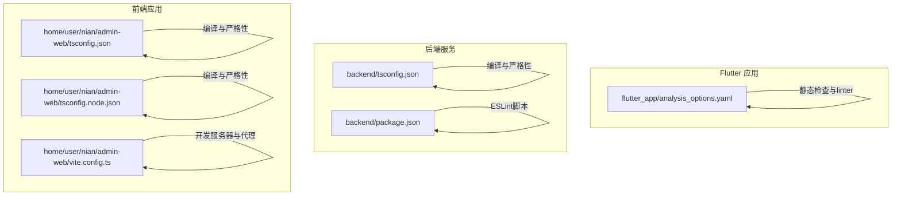
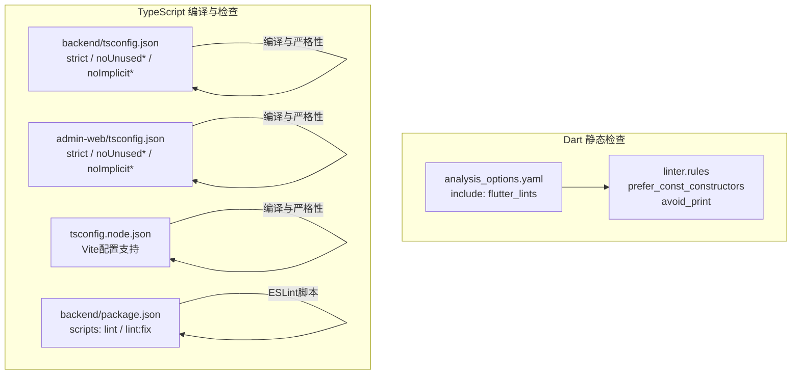
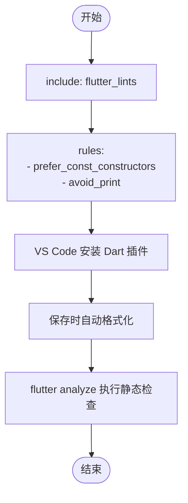
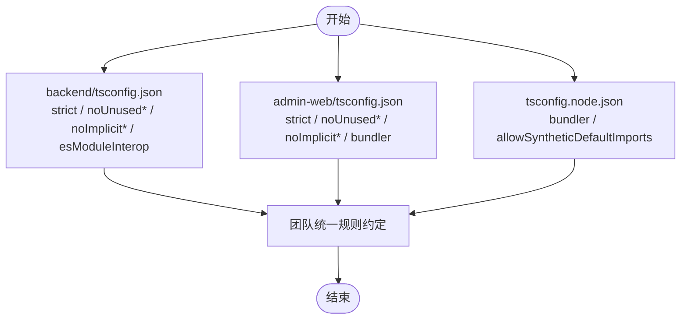
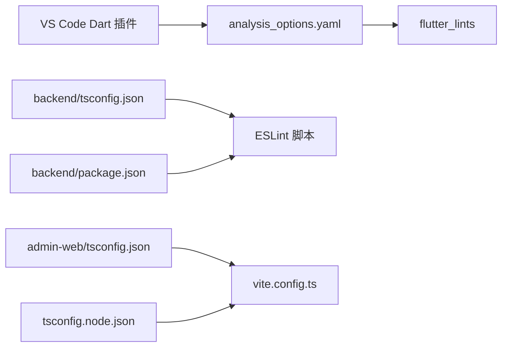

# 代码格式化配置

<cite>
**本文引用的文件**
- [flutter_app/analysis_options.yaml](file://flutter_app/analysis_options.yaml)
- [FLUTTER_DEVELOPMENT_GUIDE.md](file://FLUTTER_DEVELOPMENT_GUIDE.md)
- [backend/tsconfig.json](file://backend/tsconfig.json)
- [home/user/nian/admin-web/tsconfig.json](file://home/user/nian/admin-web/tsconfig.json)
- [home/user/nian/admin-web/tsconfig.node.json](file://home/user/nian/admin-web/tsconfig.node.json)
- [backend/package.json](file://backend/package.json)
- [home/user/nian/admin-web/vite.config.ts](file://home/user/nian/admin-web/vite.config.ts)
</cite>

## 目录
1. [引言](#引言)
2. [项目结构](#项目结构)
3. [核心组件](#核心组件)
4. [架构总览](#架构总览)
5. [详细组件分析](#详细组件分析)
6. [依赖关系分析](#依赖关系分析)
7. [性能考虑](#性能考虑)
8. [故障排查指南](#故障排查指南)
9. [结论](#结论)
10. [附录](#附录)

## 引言
本文件面向团队协作中的代码风格统一，聚焦于Dart与TypeScript两类语言的格式化与静态检查配置。对于Dart，重点说明flutter_app/analysis_options.yaml中通过flutter_lints集成的linter规则，以及如何在VS Code中配合Dart插件实现自动格式化与检查；对于TypeScript，解析后端与前端两套tsconfig.json的编译与严格性配置，明确前后端风格一致性策略，并结合FLUTTER_DEVELOPMENT_GUIDE.md中的建议给出VS Code自动化配置方法，确保不同编辑器下的格式化行为一致。

## 项目结构
本仓库包含Flutter移动端应用、Node.js后端服务与React前端应用三部分，分别对应不同的语言与工具链：
- Flutter应用位于 flutter_app/，采用analysis_options.yaml进行静态检查与linter规则控制
- Node.js后端位于 backend/，使用TypeScript编译配置与ESLint脚本
- React前端位于 home/user/nian/admin-web/，使用Vite+TS+React的tsconfig配置

图表来源
- [flutter_app/analysis_options.yaml](file://flutter_app/analysis_options.yaml#L1-L29)
- [backend/tsconfig.json](file://backend/tsconfig.json#L1-L28)
- [home/user/nian/admin-web/tsconfig.json](file://home/user/nian/admin-web/tsconfig.json#L1-L51)
- [home/user/nian/admin-web/tsconfig.node.json](file://home/user/nian/admin-web/tsconfig.node.json#L1-L21)
- [backend/package.json](file://backend/package.json#L1-L55)
- [home/user/nian/admin-web/vite.config.ts](file://home/user/nian/admin-web/vite.config.ts#L1-L43)

章节来源
- [flutter_app/analysis_options.yaml](file://flutter_app/analysis_options.yaml#L1-L29)
- [backend/tsconfig.json](file://backend/tsconfig.json#L1-L28)
- [home/user/nian/admin-web/tsconfig.json](file://home/user/nian/admin-web/tsconfig.json#L1-L51)
- [home/user/nian/admin-web/tsconfig.node.json](file://home/user/nian/admin-web/tsconfig.node.json#L1-L21)
- [backend/package.json](file://backend/package.json#L1-L55)
- [home/user/nian/admin-web/vite.config.ts](file://home/user/nian/admin-web/vite.config.ts#L1-L43)

## 核心组件
- Dart静态检查与linter规则
  - 通过include引入flutter_lints，集中管理推荐规则；rules段落可按需覆盖或新增规则
  - 开发指南中明确建议启用prefer_const_constructors与avoid_print等规则
- TypeScript编译与严格性
  - 后端tsconfig.json启用严格模式与多项no-unused/no-implicit等规则
  - 前端tsconfig.json采用ESNext模块与bundler模式，同时开启严格性与未使用变量/参数检查
  - 前端tsconfig.node.json用于Vite配置文件的编译支持
- 后端ESLint脚本
  - package.json中提供lint与lint:fix脚本，便于统一执行代码质量检查
- 前端Vite配置
  - vite.config.ts提供开发服务器端口、代理与构建输出目录等配置

章节来源
- [flutter_app/analysis_options.yaml](file://flutter_app/analysis_options.yaml#L8-L29)
- [FLUTTER_DEVELOPMENT_GUIDE.md](file://FLUTTER_DEVELOPMENT_GUIDE.md#L208-L218)
- [backend/tsconfig.json](file://backend/tsconfig.json#L8-L23)
- [home/user/nian/admin-web/tsconfig.json](file://home/user/nian/admin-web/tsconfig.json#L1-L51)
- [home/user/nian/admin-web/tsconfig.node.json](file://home/user/nian/admin-web/tsconfig.node.json#L1-L21)
- [backend/package.json](file://backend/package.json#L6-L13)
- [home/user/nian/admin-web/vite.config.ts](file://home/user/nian/admin-web/vite.config.ts#L1-L43)

## 架构总览
下图展示Dart与TypeScript在本项目中的静态检查与编译配置关系，以及它们如何共同保障代码风格的一致性与质量。

图表来源
- [flutter_app/analysis_options.yaml](file://flutter_app/analysis_options.yaml#L8-L29)
- [FLUTTER_DEVELOPMENT_GUIDE.md](file://FLUTTER_DEVELOPMENT_GUIDE.md#L208-L218)
- [backend/tsconfig.json](file://backend/tsconfig.json#L8-L23)
- [home/user/nian/admin-web/tsconfig.json](file://home/user/nian/admin-web/tsconfig.json#L1-L51)
- [home/user/nian/admin-web/tsconfig.node.json](file://home/user/nian/admin-web/tsconfig.node.json#L1-L21)
- [backend/package.json](file://backend/package.json#L6-L13)

## 详细组件分析

### Dart：analysis_options.yaml与flutter_lints集成
- 规则来源与覆盖
  - include指向flutter_lints，作为推荐规则集的统一入口
  - rules段落允许对规则进行覆盖或新增，例如启用prefer_const_constructors、avoid_print等
- VS Code自动格式化与检查
  - 安装Dart插件后，可在保存时自动触发格式化与静态检查
  - 建议在工作区settings中设置格式化器为Dart内置格式化器，并开启“保存时格式化”
  - 若需要更严格的规则，可在rules中添加相应规则并按需忽略特定文件或行
- 与开发指南的对应
  - 开发指南明确建议启用prefer_const_constructors与avoid_print，以提升性能与可读性

图表来源
- [flutter_app/analysis_options.yaml](file://flutter_app/analysis_options.yaml#L8-L29)
- [FLUTTER_DEVELOPMENT_GUIDE.md](file://FLUTTER_DEVELOPMENT_GUIDE.md#L208-L218)

章节来源
- [flutter_app/analysis_options.yaml](file://flutter_app/analysis_options.yaml#L8-L29)
- [FLUTTER_DEVELOPMENT_GUIDE.md](file://FLUTTER_DEVELOPMENT_GUIDE.md#L208-L218)

### TypeScript：后端与前端tsconfig.json对比与一致性
- 后端backend/tsconfig.json
  - 严格模式与多项no-unused/no-implicit规则，确保类型安全与无冗余代码
  - esModuleInterop开启，兼容CommonJS与ES模块交互
  - moduleResolution为node，符合Node运行时环境
- 前端admin-web/tsconfig.json
  - 严格模式与未使用变量/参数检查，与后端保持一致
  - module为ESNext，moduleResolution为bundler，适配Vite生态
  - isolatedModules与noEmit等配置，确保开发时的类型安全与构建流程稳定
- 前端tsconfig.node.json
  - 为Vite配置文件提供编译支持，moduleResolution为bundler，allowSyntheticDefaultImports启用
- 统一风格建议
  - 前后端均启用strict、noUnusedLocals、noUnusedParameters、noFallthroughCasesInSwitch等规则
  - 在团队内约定统一的target/lib/module/moduleResolution等基础配置，避免因工具链差异导致的格式化与类型问题

图表来源
- [backend/tsconfig.json](file://backend/tsconfig.json#L8-L23)
- [home/user/nian/admin-web/tsconfig.json](file://home/user/nian/admin-web/tsconfig.json#L1-L51)
- [home/user/nian/admin-web/tsconfig.node.json](file://home/user/nian/admin-web/tsconfig.node.json#L1-L21)

章节来源
- [backend/tsconfig.json](file://backend/tsconfig.json#L1-L28)
- [home/user/nian/admin-web/tsconfig.json](file://home/user/nian/admin-web/tsconfig.json#L1-L51)
- [home/user/nian/admin-web/tsconfig.node.json](file://home/user/nian/admin-web/tsconfig.node.json#L1-L21)

### VS Code自动格式化与检查配置（基于FLUTTER_DEVELOPMENT_GUIDE.md）
- Dart侧
  - 安装Dart插件，设置保存时格式化
  - 使用flutter analyze进行静态检查
- TypeScript侧
  - 后端：使用ESLint脚本统一执行lint与修复
  - 前端：Vite开发服务器已配置，可结合ESLint与Prettier（见附录）实现保存时格式化
- 团队协作建议
  - 在VS Code工作区settings中固定格式化器与检查器，避免不同成员编辑器差异
  - 对于跨语言项目，建议在根目录提供统一的editorconfig或prettier配置，以补充Dart/Prettier的不足

章节来源
- [FLUTTER_DEVELOPMENT_GUIDE.md](file://FLUTTER_DEVELOPMENT_GUIDE.md#L208-L238)
- [backend/package.json](file://backend/package.json#L6-L13)
- [home/user/nian/admin-web/vite.config.ts](file://home/user/nian/admin-web/vite.config.ts#L1-L43)

## 依赖关系分析
- Dart
  - analysis_options.yaml依赖flutter_lints提供的规则集
  - VS Code Dart插件负责格式化与检查的执行
- TypeScript
  - 后端tsconfig.json与package.json中的ESLint脚本共同构成静态检查与修复流程
  - 前端tsconfig.json与tsconfig.node.json分别服务于应用与Vite配置文件的编译需求
  - Vite配置提供开发服务器与代理，间接影响开发体验与格式化后的调试效果

图表来源
- [flutter_app/analysis_options.yaml](file://flutter_app/analysis_options.yaml#L8-L29)
- [backend/tsconfig.json](file://backend/tsconfig.json#L1-L28)
- [backend/package.json](file://backend/package.json#L6-L13)
- [home/user/nian/admin-web/tsconfig.json](file://home/user/nian/admin-web/tsconfig.json#L1-L51)
- [home/user/nian/admin-web/tsconfig.node.json](file://home/user/nian/admin-web/tsconfig.node.json#L1-L21)
- [home/user/nian/admin-web/vite.config.ts](file://home/user/nian/admin-web/vite.config.ts#L1-L43)

章节来源
- [flutter_app/analysis_options.yaml](file://flutter_app/analysis_options.yaml#L8-L29)
- [backend/tsconfig.json](file://backend/tsconfig.json#L1-L28)
- [backend/package.json](file://backend/package.json#L6-L13)
- [home/user/nian/admin-web/tsconfig.json](file://home/user/nian/admin-web/tsconfig.json#L1-L51)
- [home/user/nian/admin-web/tsconfig.node.json](file://home/user/nian/admin-web/tsconfig.node.json#L1-L21)
- [home/user/nian/admin-web/vite.config.ts](file://home/user/nian/admin-web/vite.config.ts#L1-L43)

## 性能考虑
- Dart
  - prefer_const_constructors启用可提升UI渲染性能，减少不必要的重建
  - 避免频繁打印日志（avoid_print），降低I/O开销
- TypeScript
  - strict与noUnused*等规则有助于早期发现潜在性能与内存问题
  - esModuleInterop提升模块间互操作性，减少运行时转换成本
- 前端
  - Vite开发服务器默认启用热更新与代理，建议在生产构建中关闭sourcemap以减小体积

章节来源
- [FLUTTER_DEVELOPMENT_GUIDE.md](file://FLUTTER_DEVELOPMENT_GUIDE.md#L159-L164)
- [backend/tsconfig.json](file://backend/tsconfig.json#L8-L23)
- [home/user/nian/admin-web/vite.config.ts](file://home/user/nian/admin-web/vite.config.ts#L18-L21)

## 故障排查指南
- Dart格式化无效
  - 确认Dart插件已安装且启用保存时格式化
  - 运行flutter analyze检查是否存在规则冲突
- TypeScript检查失败
  - 后端：执行npm run lint或npm run lint:fix修复常见问题
  - 前端：确认tsconfig.json与tsconfig.node.json配置一致，避免模块解析冲突
- Vite代理与构建问题
  - 检查vite.config.ts中的proxy与build配置，确保端口与路径正确
  - 生产构建时注意sourcemap设置与输出目录

章节来源
- [FLUTTER_DEVELOPMENT_GUIDE.md](file://FLUTTER_DEVELOPMENT_GUIDE.md#L229-L238)
- [backend/package.json](file://backend/package.json#L6-L13)
- [home/user/nian/admin-web/vite.config.ts](file://home/user/nian/admin-web/vite.config.ts#L6-L21)

## 结论
通过在Dart端采用flutter_lints统一规则并在VS Code中启用自动格式化，在TypeScript端前后端分别启用严格模式与ESLint脚本，可以有效保证团队在不同语言与工具链下的代码风格一致性。建议进一步在项目根目录补充统一的格式化工具配置（如Prettier），以覆盖Dart与TypeScript之外的其他文件类型，形成完整的格式化体系。

## 附录
- VS Code推荐插件与设置（基于开发指南）
  - Dart插件：用于Dart格式化与静态检查
  - 后端TypeScript：建议安装ESLint与Prettier插件，统一保存时格式化
  - 前端TypeScript：建议安装ESLint与Prettier插件，结合Vite开发服务器使用
- 团队协作建议
  - 在工作区settings中固定格式化器与检查器，避免编辑器差异
  - 对于跨语言项目，可在根目录提供统一的editorconfig或prettier配置，补充Dart/Prettier的不足

章节来源
- [FLUTTER_DEVELOPMENT_GUIDE.md](file://FLUTTER_DEVELOPMENT_GUIDE.md#L208-L238)