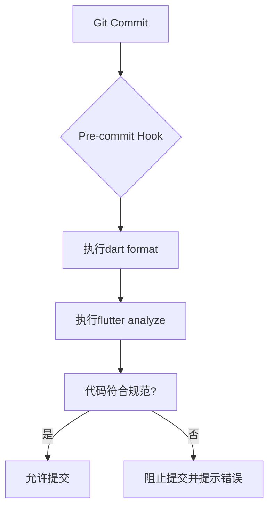
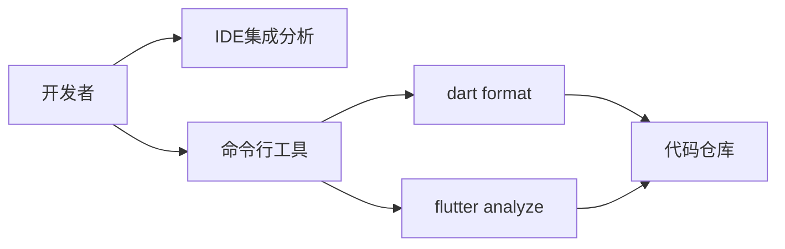
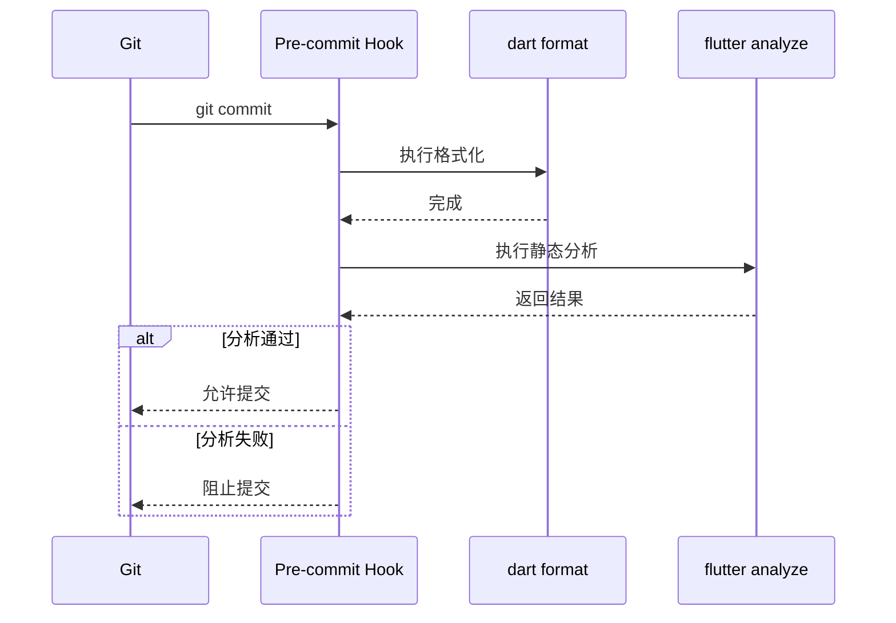

# 提交前钩子配置

<cite>
**本文档引用的文件**  
- [FLUTTER_DEVELOPMENT_GUIDE.md](file://FLUTTER_DEVELOPMENT_GUIDE.md)
- [flutter_app/pubspec.yaml](file://flutter_app/pubspec.yaml)
- [flutter_app/analysis_options.yaml](file://flutter_app/analysis_options.yaml)
</cite>

## 目录
1. [简介](#简介)
2. [项目结构与pre-commit钩子配置](#项目结构与pre-commit钩子配置)
3. [核心组件分析](#核心组件分析)
4. [架构概述](#架构概述)
5. [详细组件分析](#详细组件分析)
6. [依赖分析](#依赖分析)
7. [性能考虑](#性能考虑)
8. [故障排除指南](#故障排除指南)
9. [结论](#结论)

## 简介
本文档旨在说明如何在Flutter项目中配置Git提交前钩子（pre-commit hook），以确保代码质量的一致性。通过结合`FLUTTER_DEVELOPMENT_GUIDE.md`中的开发流程建议，详细描述了如何使用Husky或其他工具设置提交钩子，在代码提交前自动执行`dart format`格式化和`flutter analyze`静态检查，防止不符合规范的代码进入版本库。同时涵盖不同操作系统下的配置注意事项、临时绕过钩子的方法以及最佳实践。

## 项目结构与pre-commit钩子配置
根据项目结构，Flutter应用位于`flutter_app`目录下，其核心配置文件包括`pubspec.yaml`和`analysis_options.yaml`。虽然当前项目未直接使用Husky等工具配置pre-commit钩子，但可通过这些文件推断出应实施的代码质量保障机制。



**Diagram sources**
- [FLUTTER_DEVELOPMENT_GUIDE.md](file://FLUTTER_DEVELOPMENT_GUIDE.md#L220-L238)
- [flutter_app/analysis_options.yaml](file://flutter_app/analysis_options.yaml#L10)

**Section sources**
- [FLUTTER_DEVELOPMENT_GUIDE.md](file://FLUTTER_DEVELOPMENT_GUIDE.md#L220-L238)
- [flutter_app/pubspec.yaml](file://flutter_app/pubspec.yaml#L76)
- [flutter_app/analysis_options.yaml](file://flutter_app/analysis_options.yaml#L10)

## 核心组件分析
`pubspec.yaml`文件中定义了`flutter_lints`作为开发依赖项，这表明项目遵循官方推荐的Dart代码风格指南。此外，`analysis_options.yaml`文件包含了静态分析配置，用于在开发过程中识别潜在问题。

**Section sources**
- [flutter_app/pubspec.yaml](file://flutter_app/pubspec.yaml#L76)
- [flutter_app/analysis_options.yaml](file://flutter_app/analysis_options.yaml#L10)

## 架构概述
本项目的代码质量保障体系基于Flutter生态系统提供的工具链构建。通过集成`flutter analyze`命令和代码格式化工具，可以在本地开发阶段捕获大多数编码错误和风格违规。



**Diagram sources**
- [FLUTTER_DEVELOPMENT_GUIDE.md](file://FLUTTER_DEVELOPMENT_GUIDE.md#L220-L238)
- [flutter_app/analysis_options.yaml](file://flutter_app/analysis_options.yaml#L10)

## 详细组件分析
### 提交钩子实现逻辑
根据`FLUTTER_DEVELOPMENT_GUIDE.md`中列出的常用命令，理想的pre-commit钩子应按照以下顺序执行：
1. 使用`dart format`统一代码格式
2. 运行`flutter analyze`进行静态分析
3. 执行单元测试（如有）

此流程确保每次提交的代码都经过标准化处理和质量验证。

#### 对于API/服务组件：


**Diagram sources**
- [FLUTTER_DEVELOPMENT_GUIDE.md](file://FLUTTER_DEVELOPMENT_GUIDE.md#L220-L238)

### 跨平台配置注意事项
不同操作系统下配置pre-commit钩子时需注意：
- **Windows**: 确保PowerShell或Git Bash环境变量正确
- **macOS/Linux**: 注意脚本权限（需可执行）
- 所有平台均需保证Flutter SDK已正确安装并加入PATH

**Section sources**
- [FLUTTER_DEVELOPMENT_GUIDE.md](file://FLUTTER_DEVELOPMENT_GUIDE.md#L220-L238)

## 依赖分析
项目依赖关系清晰地分为运行时依赖和开发依赖。其中，`flutter_lints`属于开发依赖，专门用于提升代码质量和一致性。

```mermaid
dependencyDiagram
flutter_app --> flutter_lints : devDependency
flutter_app --> analysis_options.yaml : 配置
analysis_options.yaml --> flutter_lints : include
```

**Diagram sources**
- [flutter_app/pubspec.yaml](file://flutter_app/pubspec.yaml#L76)
- [flutter_app/analysis_options.yaml](file://flutter_app/analysis_options.yaml#L10)

**Section sources**
- [flutter_app/pubspec.yaml](file://flutter_app/pubspec.yaml#L60-L77)
- [flutter_app/analysis_options.yaml](file://flutter_app/analysis_options.yaml#L1-L29)

## 性能考虑
虽然pre-commit钩子会增加每次提交的时间成本，但这种前期投入能够显著减少后期代码审查的工作量，并避免将低质量代码引入主分支。建议团队成员在日常开发中养成良好的编码习惯，减少因格式问题导致的提交失败。

## 故障排除指南
当遇到pre-commit钩子相关问题时，可参考以下步骤：
1. 检查Flutter SDK是否正确安装
2. 确认`pubspec.yaml`和`analysis_options.yaml`配置无误
3. 验证脚本文件权限（Linux/macOS）
4. 查看具体错误信息并针对性修复

**Section sources**
- [FLUTTER_DEVELOPMENT_GUIDE.md](file://FLUTTER_DEVELOPMENT_GUIDE.md#L220-L238)
- [flutter_app/analysis_options.yaml](file://flutter_app/analysis_options.yaml#L10)

## 结论
通过合理配置pre-commit钩子，可以有效提升团队代码质量的一致性。尽管当前项目尚未显式配置Husky等工具，但已具备实施此类自动化检查的基础条件。建议团队尽快引入适当的钩子机制，结合`FLUTTER_DEVELOPMENT_GUIDE.md`中的最佳实践，建立标准化的代码提交流程。