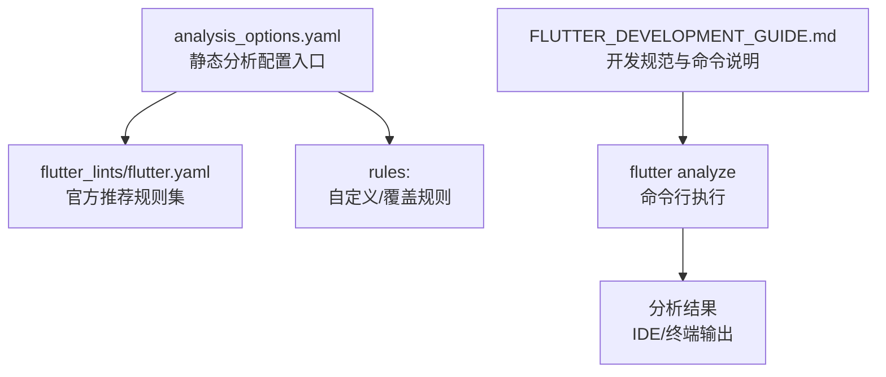
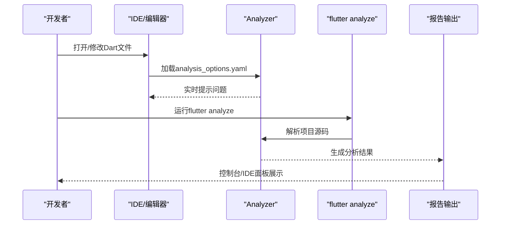
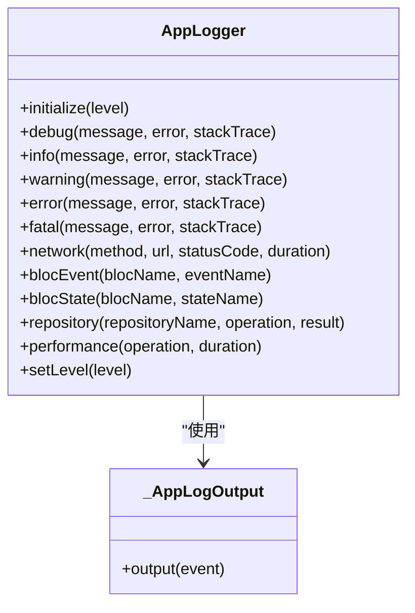
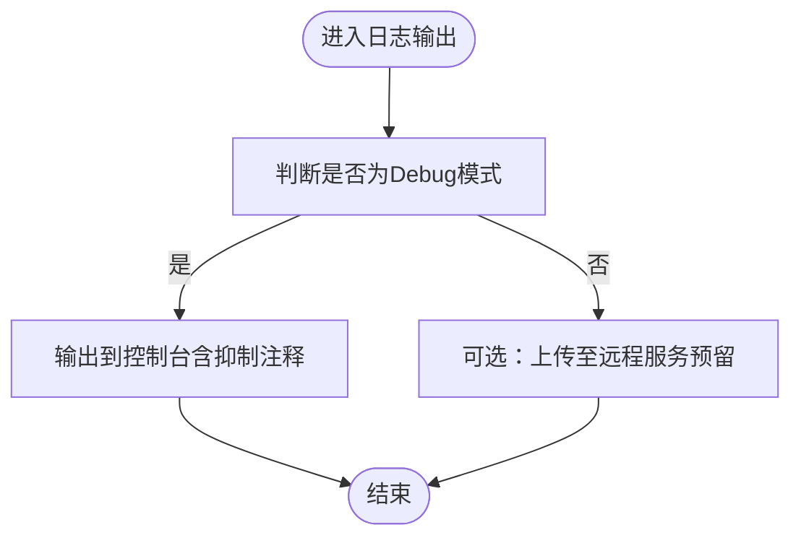
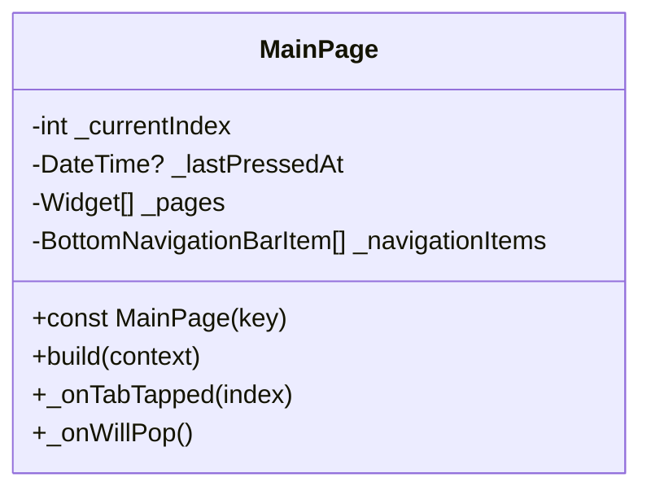
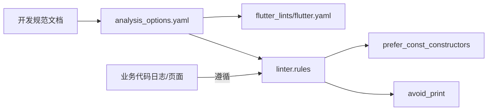

# 静态分析设置

<cite>
**本文引用的文件**
- [flutter_app/analysis_options.yaml](file://flutter_app/analysis_options.yaml)
- [FLUTTER_DEVELOPMENT_GUIDE.md](file://FLUTTER_DEVELOPMENT_GUIDE.md)
- [flutter_app/lib/core/utils/app_logger.dart](file://flutter_app/lib/core/utils/app_logger.dart)
- [flutter_app/lib/presentation/home/main_page.dart](file://flutter_app/lib/presentation/home/main_page.dart)
</cite>

## 目录
1. [简介](#简介)
2. [项目结构](#项目结构)
3. [核心组件](#核心组件)
4. [架构总览](#架构总览)
5. [详细组件分析](#详细组件分析)
6. [依赖关系分析](#依赖关系分析)
7. [性能考量](#性能考量)
8. [故障排查指南](#故障排查指南)
9. [结论](#结论)
10. [附录](#附录)

## 简介
本文件围绕 flutter_app/analysis_options.yaml 的静态代码分析配置展开，系统阐述其如何通过集成 flutter_lints 官方推荐规则，约束关键编码实践（如避免使用 print、优先使用 const 构造函数），并通过 FLUTTER_DEVELOPMENT_GUIDE.md 中的“代码检查”章节指导如何运行 flutter analyze 并解读结果。同时，结合项目实际代码示例，说明这些规则在提升代码质量、可维护性和性能方面的具体价值。

## 项目结构
flutter_app 目录下的 analysis_options.yaml 是整个 Flutter 应用的静态分析配置中心，采用 include 方式引入官方推荐规则集，并允许在 rules 节点下进行微调或补充。该文件位于应用根目录，便于 IDE 和 CI 环节统一执行分析。

图表来源
- [flutter_app/analysis_options.yaml](file://flutter_app/analysis_options.yaml#L1-L29)
- [FLUTTER_DEVELOPMENT_GUIDE.md](file://FLUTTER_DEVELOPMENT_GUIDE.md#L208-L238)

章节来源
- [flutter_app/analysis_options.yaml](file://flutter_app/analysis_options.yaml#L1-L29)
- [FLUTTER_DEVELOPMENT_GUIDE.md](file://FLUTTER_DEVELOPMENT_GUIDE.md#L208-L238)

## 核心组件
- 官方推荐规则集集成：通过 include 引入 package:flutter_lints/flutter.yaml，确保遵循 Flutter 社区最佳实践。
- 自定义规则节点：在 linter.rules 下可启用/禁用规则，支持逐文件或逐行抑制（注释方式）。
- 开发规范与命令：FLUTTER_DEVELOPMENT_GUIDE.md 明确了代码检查命令 flutter analyze 的使用位置与流程。

章节来源
- [flutter_app/analysis_options.yaml](file://flutter_app/analysis_options.yaml#L8-L26)
- [FLUTTER_DEVELOPMENT_GUIDE.md](file://FLUTTER_DEVELOPMENT_GUIDE.md#L208-L238)

## 架构总览
静态分析在项目中的工作流如下：
- 开发阶段：IDE 启动时读取 analysis_options.yaml，实时提示问题；保存/编辑触发增量分析。
- 命令行阶段：执行 flutter analyze，输出所有问题；CI 阶段可作为质量门禁。
- 规则落地：通过 avoid_print、prefer_const_constructors 等规则，从源头约束不当写法。

图表来源
- [flutter_app/analysis_options.yaml](file://flutter_app/analysis_options.yaml#L1-L29)
- [FLUTTER_DEVELOPMENT_GUIDE.md](file://FLUTTER_DEVELOPMENT_GUIDE.md#L208-L238)

## 详细组件分析

### 组件A：analysis_options.yaml 的规则组织与实践
- 规则来源与继承
  - include: 引入官方推荐规则集，确保团队遵循一致的编码风格与安全实践。
  - linter.rules: 支持启用/禁用规则，便于在项目特定场景下做微调。
- 规则抑制机制
  - 支持逐行或整文件抑制，避免误报或特殊场景下的必要例外。
- 与开发规范的协同
  - FLUTTER_DEVELOPMENT_GUIDE.md 在“代码检查”章节明确将 analysis_options.yaml 与 flutter analyze 命令关联，形成闭环。

章节来源
- [flutter_app/analysis_options.yaml](file://flutter_app/analysis_options.yaml#L8-L26)
- [FLUTTER_DEVELOPMENT_GUIDE.md](file://FLUTTER_DEVELOPMENT_GUIDE.md#L208-L238)

#### 类图：日志输出与规则抑制的关系

图表来源
- [flutter_app/lib/core/utils/app_logger.dart](file://flutter_app/lib/core/utils/app_logger.dart#L255-L270)

章节来源
- [flutter_app/lib/core/utils/app_logger.dart](file://flutter_app/lib/core/utils/app_logger.dart#L255-L270)

### 组件B：避免使用 print 的规则与实践
- 规则目标
  - 避免在生产环境输出冗余日志，降低性能损耗与噪声。
- 实践路径
  - 使用 AppLogger 封装统一日志接口，替代直接 print。
  - 在 debug 模式下输出到控制台，在 release 模式下可接入远程上报（预留扩展点）。
- 项目中的抑制示例
  - 在 app_logger.dart 的 _AppLogOutput.output 中，为 debug 模式下的 print 行添加了抑制注释，表明这是受控的例外场景。

章节来源
- [flutter_app/lib/core/utils/app_logger.dart](file://flutter_app/lib/core/utils/app_logger.dart#L255-L270)
- [flutter_app/analysis_options.yaml](file://flutter_app/analysis_options.yaml#L18-L22)

#### 流程图：日志输出与规则抑制

图表来源
- [flutter_app/lib/core/utils/app_logger.dart](file://flutter_app/lib/core/utils/app_logger.dart#L255-L270)

### 组件C：优先使用 const 构造函数的规则与实践
- 规则目标
  - 减少不必要的重建与内存分配，提升渲染性能与内存效率。
- 实践路径
  - 对无状态小部件、主题配置、常量集合等使用 const 构造。
  - 在页面中大量使用 const SizedBox、Text、Icon 等无状态小部件。
- 项目中的典型用法
  - 在主页面中，页面数组与底部导航项均使用 const 初始化，体现规则落地。
  - 多处使用 const SizedBox(height: ...)、const Text(...) 等无状态小部件。

章节来源
- [flutter_app/lib/presentation/home/main_page.dart](file://flutter_app/lib/presentation/home/main_page.dart#L20-L45)
- [FLUTTER_DEVELOPMENT_GUIDE.md](file://FLUTTER_DEVELOPMENT_GUIDE.md#L159-L164)

#### 类图：const 构造函数在页面中的应用

图表来源
- [flutter_app/lib/presentation/home/main_page.dart](file://flutter_app/lib/presentation/home/main_page.dart#L1-L104)

### 组件D：运行与解读 flutter analyze
- 运行方式
  - 在项目根目录执行 flutter analyze 命令，IDE 与 CI 均可使用。
- 结果解读
  - 分析器会输出错误、警告与建议；建议优先修复错误与高风险警告。
  - 对于规则抑制（如 avoid_print），需评估是否仍有必要保留，或改用更合适的日志方案。

章节来源
- [FLUTTER_DEVELOPMENT_GUIDE.md](file://FLUTTER_DEVELOPMENT_GUIDE.md#L229-L238)

## 依赖关系分析
- analysis_options.yaml 依赖 flutter_lints 提供的规则集。
- 业务代码（如 AppLogger、页面）通过遵循规则实现质量保障。
- 开发规范文档为静态分析提供上下文与约束依据。

图表来源
- [flutter_app/analysis_options.yaml](file://flutter_app/analysis_options.yaml#L8-L26)
- [FLUTTER_DEVELOPMENT_GUIDE.md](file://FLUTTER_DEVELOPMENT_GUIDE.md#L208-L238)

章节来源
- [flutter_app/analysis_options.yaml](file://flutter_app/analysis_options.yaml#L8-L26)
- [FLUTTER_DEVELOPMENT_GUIDE.md](file://FLUTTER_DEVELOPMENT_GUIDE.md#L208-L238)

## 性能考量
- const 构造函数可显著减少重建次数与内存分配，尤其在频繁刷新的界面中收益明显。
- 避免 print 可降低 I/O 开销与控制台噪声，有助于提升调试效率与运行性能。
- 将日志统一收敛到 AppLogger，便于在不同运行模式下控制输出策略。

章节来源
- [flutter_app/lib/core/utils/app_logger.dart](file://flutter_app/lib/core/utils/app_logger.dart#L255-L270)
- [flutter_app/lib/presentation/home/main_page.dart](file://flutter_app/lib/presentation/home/main_page.dart#L20-L45)
- [FLUTTER_DEVELOPMENT_GUIDE.md](file://FLUTTER_DEVELOPMENT_GUIDE.md#L159-L164)

## 故障排查指南
- 常见问题
  - 规则冲突：当 include 的官方规则与自定义规则冲突时，以 linter.rules 的显式配置为准。
  - 抑制滥用：过度使用抑制注释会掩盖真实问题，应定期清理与复审。
  - 忽略分析：未运行 flutter analyze 导致问题流入主干，应在 CI 中强制执行。
- 修复建议
  - 将直接 print 替换为 AppLogger 的对应级别方法。
  - 将可 const 的对象改为 const 构造，减少不必要的重建。
  - 对抑制注释进行评审，确认必要性并给出短期与长期计划。

章节来源
- [flutter_app/analysis_options.yaml](file://flutter_app/analysis_options.yaml#L18-L22)
- [FLUTTER_DEVELOPMENT_GUIDE.md](file://FLUTTER_DEVELOPMENT_GUIDE.md#L229-L238)

## 结论
通过 analysis_options.yaml 集成 flutter_lints 并配合 FLUTTER_DEVELOPMENT_GUIDE.md 的“代码检查”流程，项目实现了从规则制定、落地执行到持续改进的闭环。避免 print 与优先使用 const 构造函数等规则，有效提升了代码质量、可维护性与运行性能。建议在日常开发中坚持运行 flutter analyze，并将静态分析纳入 CI，确保规则得到持续遵守。

## 附录
- 关键参考路径
  - 静态分析配置入口：[analysis_options.yaml](file://flutter_app/analysis_options.yaml#L1-L29)
  - 代码检查命令说明：[FLUTTER_DEVELOPMENT_GUIDE.md](file://FLUTTER_DEVELOPMENT_GUIDE.md#L229-L238)
  - 日志输出与抑制示例：[app_logger.dart](file://flutter_app/lib/core/utils/app_logger.dart#L255-L270)
  - const 构造函数实践示例：[main_page.dart](file://flutter_app/lib/presentation/home/main_page.dart#L20-L45)