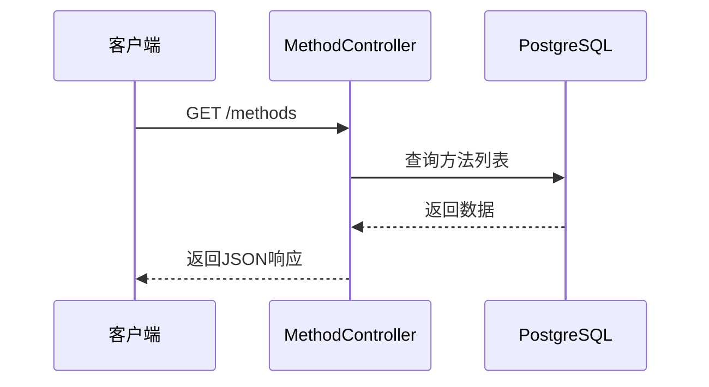
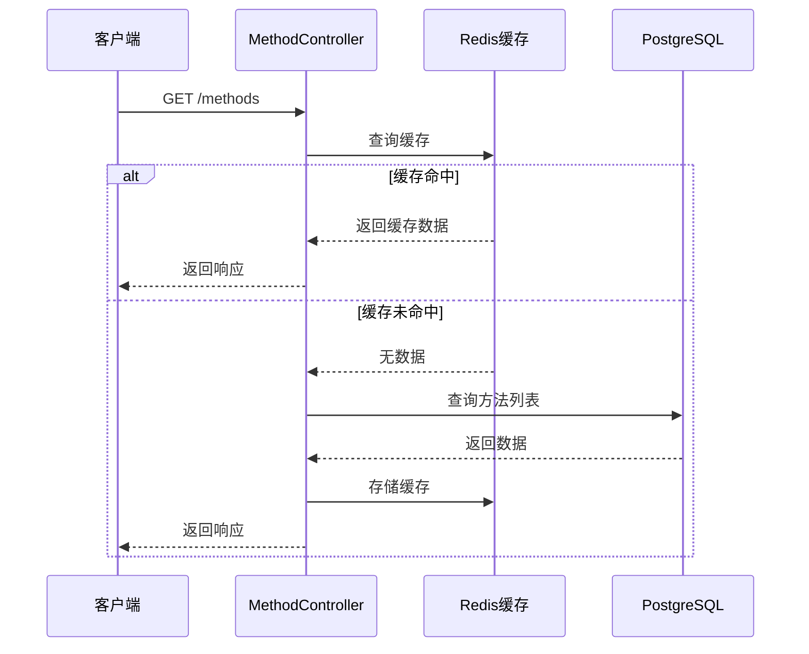
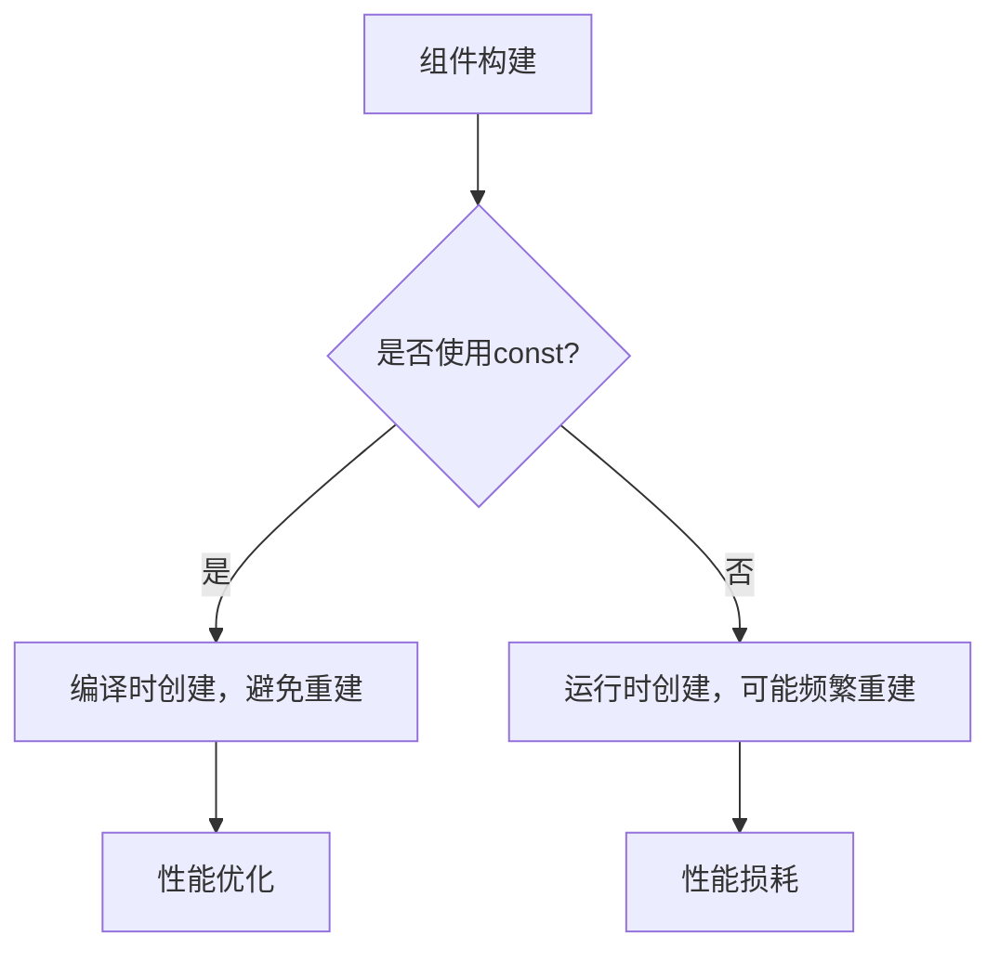
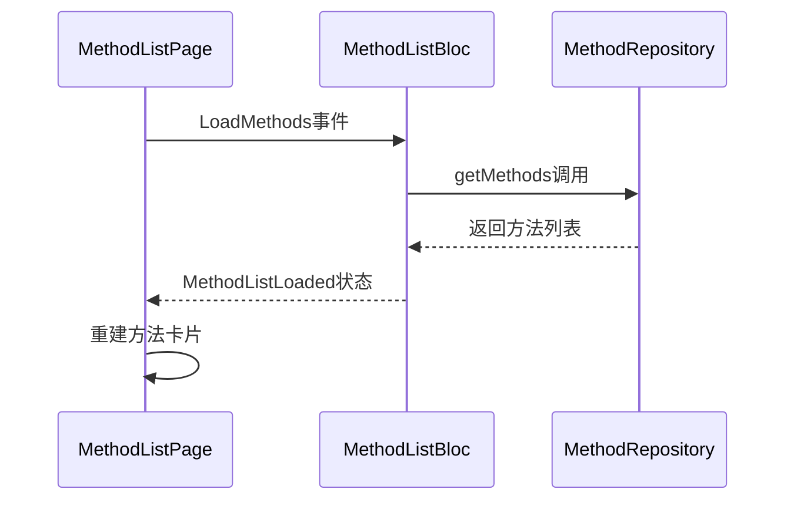
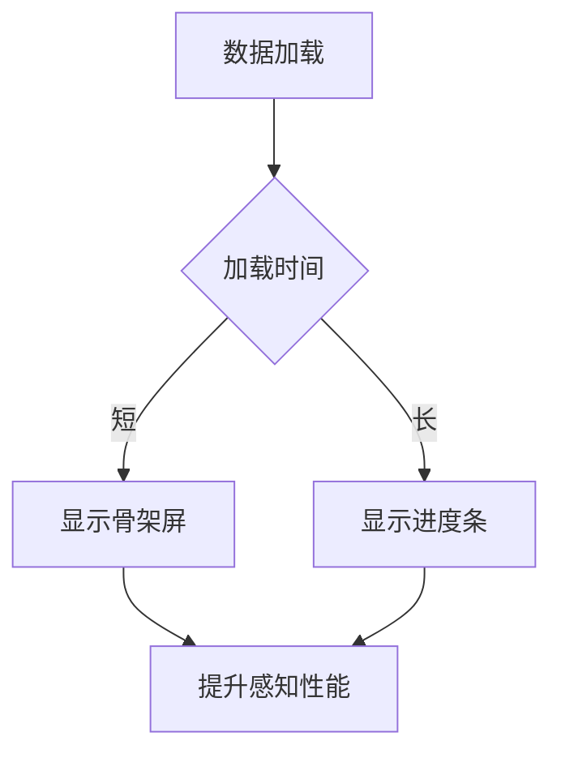
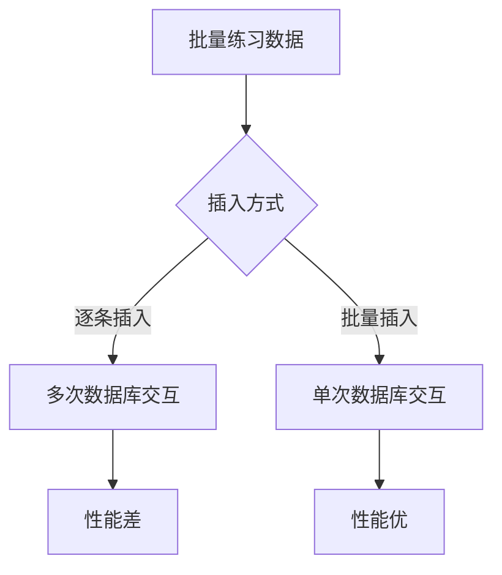
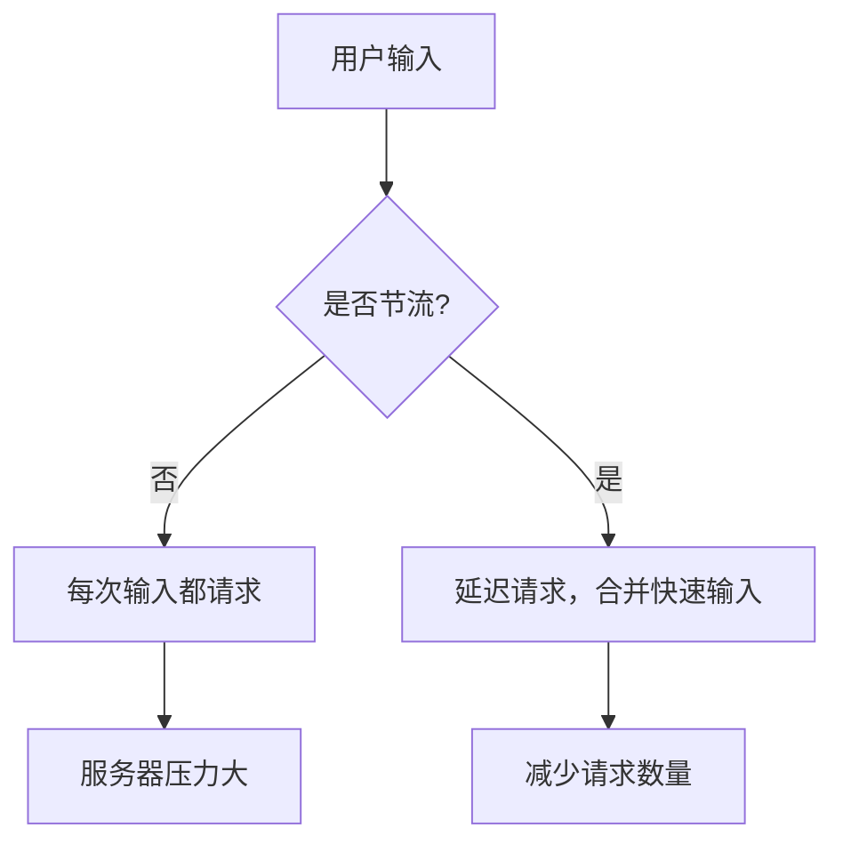

# 性能优化策略

<cite>
**本文档引用的文件**  
- [method.controller.ts](file://backend/src/controllers/method.controller.ts)
- [practice.controller.ts](file://backend/src/controllers/practice.controller.ts)
- [database.ts](file://backend/src/config/database.ts)
- [method_repository_impl.dart](file://flutter_app/lib/data/repositories/method_repository_impl.dart)
- [practice_repository_impl.dart](file://flutter_app/lib/data/repositories/practice_repository_impl.dart)
- [method_list_bloc.dart](file://flutter_app/lib/presentation/methods/bloc/method_list_bloc.dart)
- [method_search_bloc.dart](file://flutter_app/lib/presentation/methods/bloc/method_search_bloc.dart)
- [method_remote_data_source.dart](file://flutter_app/lib/data/datasources/remote/method_remote_data_source.dart)
- [practice_remote_data_source.dart](file://flutter_app/lib/data/datasources/remote/practice_remote_data_source.dart)
- [dio_client.dart](file://flutter_app/lib/core/network/dio_client.dart)
- [database_helper.dart](file://flutter_app/lib/core/storage/database_helper.dart)
- [cache_manager.dart](file://flutter_app/lib/core/utils/cache_manager.dart)
- [method_card.dart](file://flutter_app/lib/presentation/widgets/method_card.dart)
- [loading_indicator.dart](file://flutter_app/lib/presentation/widgets/loading_indicator.dart)
- [init.sql](file://database/init.sql)
</cite>

## 目录
1. [引言](#引言)
2. [后端API性能优化](#后端api性能优化)
3. [移动端性能优化](#移动端性能优化)
4. [数据层性能优化](#数据层性能优化)
5. [典型性能陷阱与优化示例](#典型性能陷阱与优化示例)
6. [结论](#结论)

## 引言
本文档提供端到端性能优化指南，针对后端API响应瓶颈、移动端渲染效率和数据层操作进行深入分析。通过缓存策略、数据库索引优化、组件重建控制和批量操作等技术手段，提升系统整体性能。文档结合代码库实际实现，列举典型性能陷阱并提供优化建议。

## 后端API性能优化

### API响应瓶颈分析
后端API存在多个潜在性能瓶颈，主要体现在数据库查询效率和重复请求处理上。`method.controller.ts`中的`getMethods`函数在处理方法列表查询时，每次请求都会直接查询数据库，缺乏缓存机制。



**图示来源**  
- [method.controller.ts](file://backend/src/controllers/method.controller.ts#L6-L73)

### Redis缓存策略
通过Redis缓存减少数据库查询是关键优化手段。`database.ts`文件已配置Redis客户端，但未在控制器中使用。建议在`getMethods`和`getCategories`等高频接口中实现缓存。



**图示来源**  
- [database.ts](file://backend/src/config/database.ts#L16-L22)
- [method.controller.ts](file://backend/src/controllers/method.controller.ts#L6-L73)

### PostgreSQL索引优化
数据库初始化脚本`init.sql`中已为`methods`表的`category`字段创建索引，这是正确的做法。但查询计划需要通过`EXPLAIN ANALYZE`评估以确保索引被有效使用。

```sql
-- 评估方法列表查询的执行计划
EXPLAIN ANALYZE 
SELECT * FROM methods 
WHERE status = 'published' 
  AND category = '放松技巧'
ORDER BY published_at DESC;
```

**图示来源**  
- [init.sql](file://database/init.sql#L39)

**本节来源**  
- [method.controller.ts](file://backend/src/controllers/method.controller.ts#L6-L73)
- [init.sql](file://database/init.sql#L19-L42)
- [database.ts](file://backend/src/config/database.ts#L1-L47)

## 移动端性能优化

### 避免组件过度重建
Flutter应用中，`method_card.dart`组件的实现可能导致不必要的重建。通过使用`const`构造器和`memoization`技术可以优化。



**图示来源**  
- [method_card.dart](file://flutter_app/lib/presentation/widgets/method_card.dart#L5-L119)

### 使用DevTools进行性能剖析
通过`Widget rebuild stats`工具可以监控组件重建情况。`method_list_bloc.dart`中的BLoC模式有助于状态管理，但需确保事件处理不会导致不必要的重建。



**图示来源**  
- [method_list_bloc.dart](file://flutter_app/lib/presentation/methods/bloc/method_list_bloc.dart#L7-L132)
- [method_repository_impl.dart](file://flutter_app/lib/data/repositories/method_repository_impl.dart#L8-L73)

### 加载指示器优化
`loading_indicator.dart`文件提供了多种加载组件，合理使用可以提升用户体验。建议在数据加载时使用骨架屏而非简单旋转器。



**图示来源**  
- [loading_indicator.dart](file://flutter_app/lib/presentation/widgets/loading_indicator.dart#L6-L195)

**本节来源**  
- [method_card.dart](file://flutter_app/lib/presentation/widgets/method_card.dart#L5-L119)
- [method_list_bloc.dart](file://flutter_app/lib/presentation/methods/bloc/method_list_bloc.dart#L7-L132)
- [loading_indicator.dart](file://flutter_app/lib/presentation/widgets/loading_indicator.dart#L6-L195)

## 数据层性能优化

### 批量插入练习记录
`practice.controller.ts`中的`createPracticeRecord`函数使用事务处理单条记录插入，但对于批量操作需要优化。建议提供批量插入接口。



**图示来源**  
- [practice.controller.ts](file://backend/src/controllers/practice.controller.ts#L7-L98)

### 连接池配置
`database.ts`文件中PostgreSQL连接池配置合理，最大连接数为20，空闲超时30秒。这是良好的实践。

```typescript
export const pool = new Pool({
  max: 20,
  idleTimeoutMillis: 30000,
  connectionTimeoutMillis: 2000,
});
```

**图示来源**  
- [database.ts](file://backend/src/config/database.ts#L5-L14)

### 本地数据库优化
`database_helper.dart`文件为SQLite数据库创建了适当的索引，如`idx_methods_category`，这有助于提高查询性能。

```sql
CREATE INDEX idx_methods_category ON methods(category);
CREATE INDEX idx_practice_records_user_id ON practice_records(user_id);
```

**图示来源**  
- [database_helper.dart](file://flutter_app/lib/core/storage/database_helper.dart#L87-L152)

**本节来源**  
- [practice.controller.ts](file://backend/src/controllers/practice.controller.ts#L7-L98)
- [database.ts](file://backend/src/config/database.ts#L5-L14)
- [database_helper.dart](file://flutter_app/lib/core/storage/database_helper.dart#L48-L155)

## 典型性能陷阱与优化示例

### 未节流的搜索请求
`method_search_bloc.dart`中的搜索功能可能产生过多请求。建议实现节流或防抖。



**图示来源**  
- [method_search_bloc.dart](file://flutter_app/lib/presentation/methods/bloc/method_search_bloc.dart#L22-L60)

### 大列表未懒加载
`method_discover_page.dart`中的方法列表使用`SliverList`，但未明确实现懒加载。建议使用分页或无限滚动。

```dart
SliverChildBuilderDelegate(
  (context, index) {
    if (index >= methods.length) {
      return state is MethodListLoadingMore
          ? const Padding(
              padding: EdgeInsets.all(16),
              child: Center(child: LoadingIndicator()),
            )
          : const SizedBox.shrink();
    }
    return _buildMethodCard(methods[index]);
  },
  childCount: methods.length + (state is MethodListLoadingMore ? 1 : 0),
)
```

**图示来源**  
- [method_discover_page.dart](file://flutter_app/lib/presentation/methods/pages/method_discover_page.dart#L228-L241)

### 频繁setState调用
在Flutter中，频繁调用`setState`会导致组件重建。BLoC模式通过状态管理减少了这种问题，但仍需注意。

**本节来源**  
- [method_search_bloc.dart](file://flutter_app/lib/presentation/methods/bloc/method_search_bloc.dart#L22-L60)
- [method_discover_page.dart](file://flutter_app/lib/presentation/methods/pages/method_discover_page.dart#L219-L253)

## 结论
通过实施Redis缓存、优化PostgreSQL索引、避免Flutter组件过度重建、使用批量插入和合理连接池配置，可以显著提升系统性能。建议定期使用`EXPLAIN ANALYZE`评估查询计划，并通过DevTools监控移动端性能。避免未节流的搜索请求、大列表未懒加载和频繁`setState`调用等常见性能陷阱。