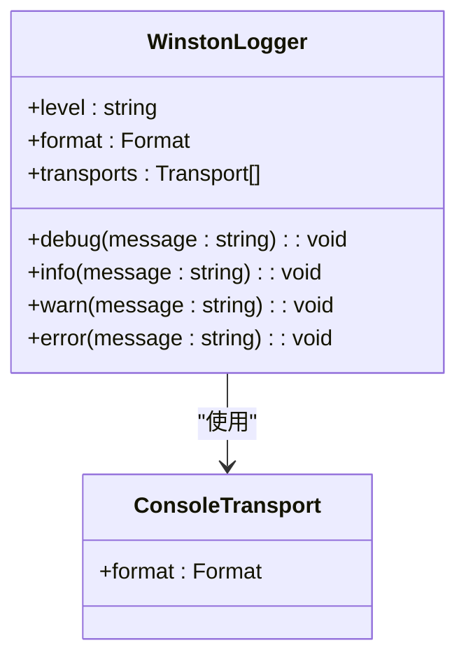
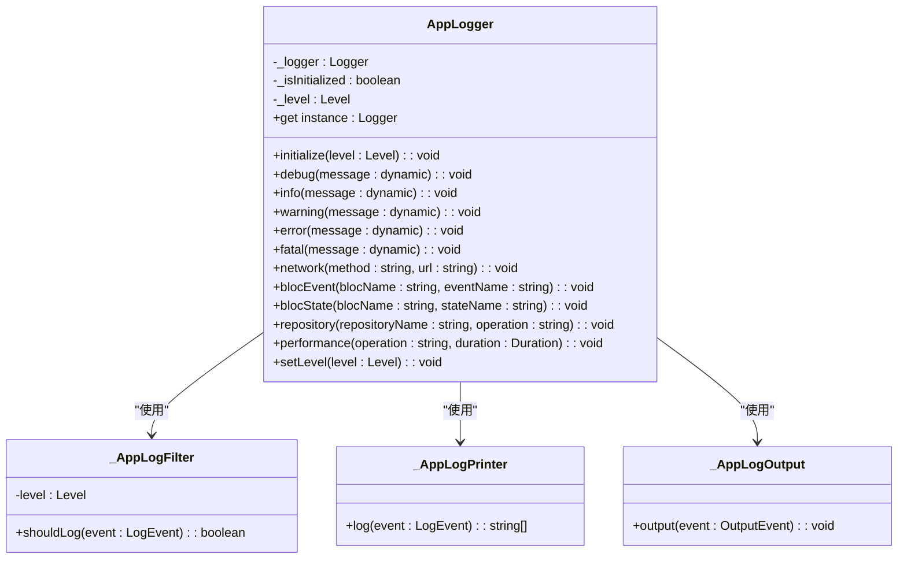
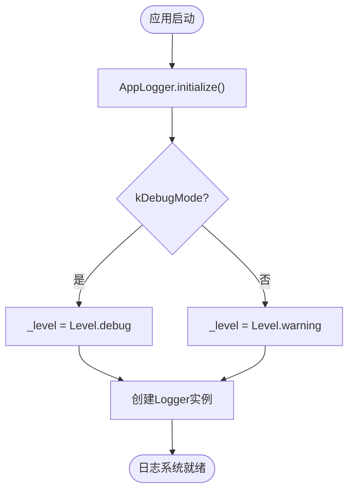
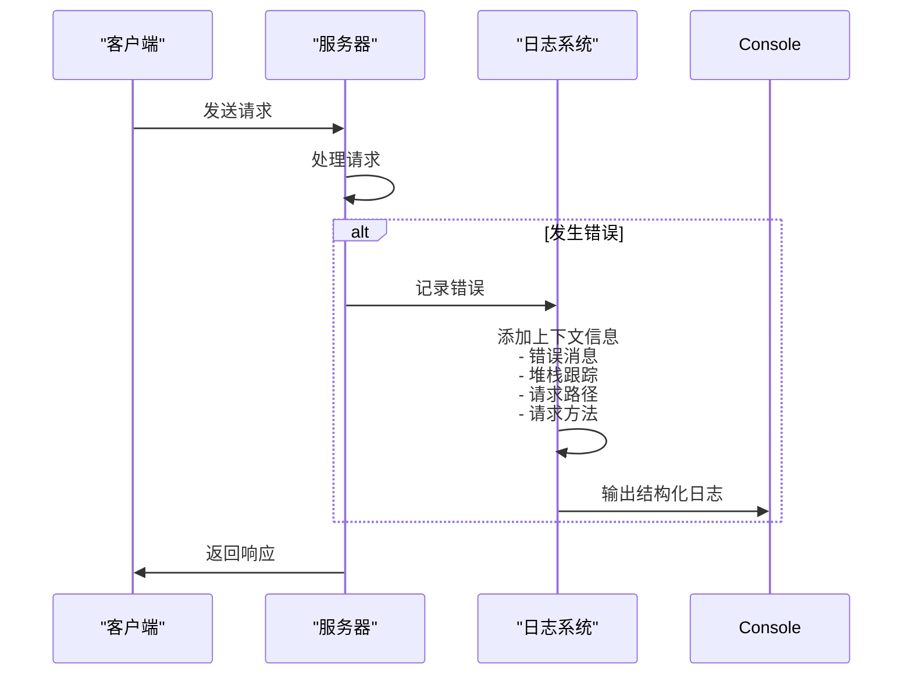
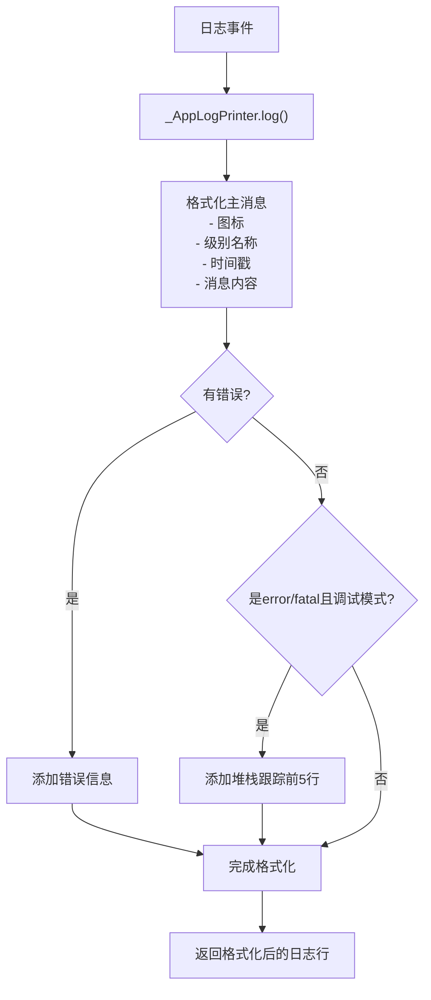
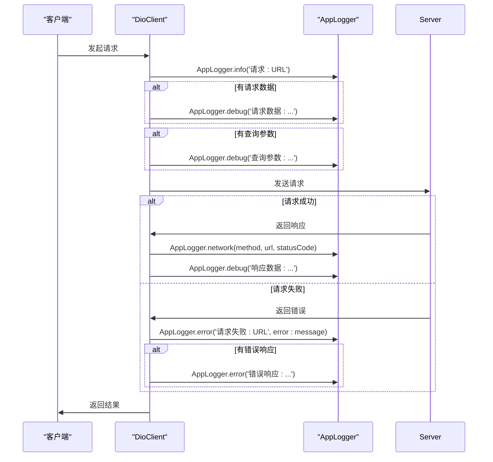
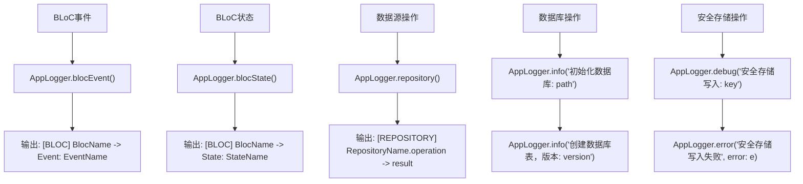
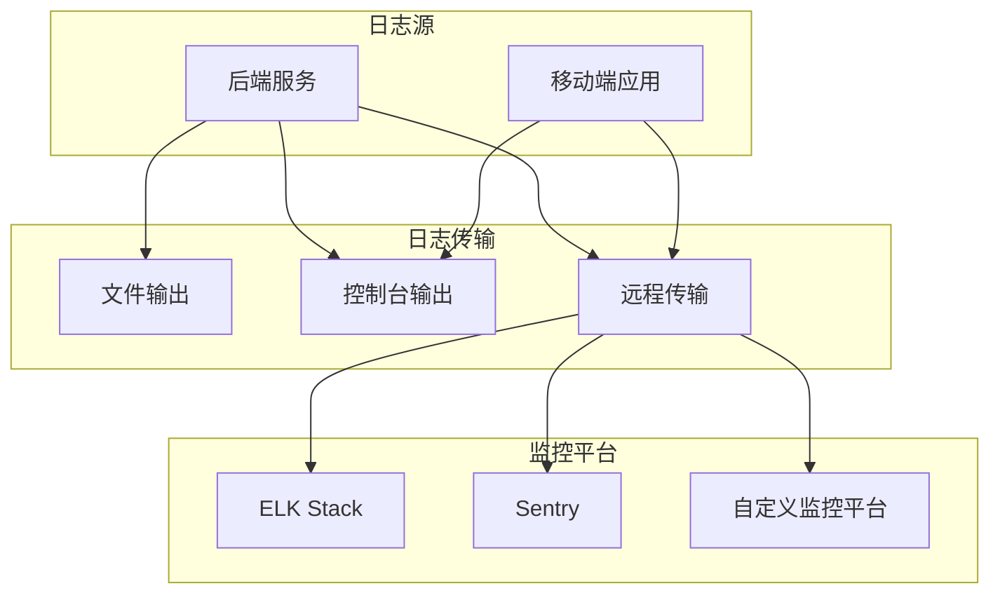

# 日志配置与结构化输出

<cite>
**本文档引用的文件**  
- [logger.ts](file://backend/src/utils/logger.ts)
- [app_logger.dart](file://flutter_app/lib/core/utils/app_logger.dart)
- [index.ts](file://backend/src/index.ts)
- [errorHandler.ts](file://backend/src/middleware/errorHandler.ts)
- [dio_client.dart](file://flutter_app/lib/core/network/dio_client.dart)
- [database_helper.dart](file://flutter_app/lib/core/storage/database_helper.dart)
- [secure_storage_helper.dart](file://flutter_app/lib/core/storage/secure_storage_helper.dart)
- [main.dart](file://flutter_app/lib/main.dart)
</cite>

## 目录
1. [简介](#简介)
2. [后端日志系统配置](#后端日志系统配置)
3. [移动端日志系统配置](#移动端日志系统配置)
4. [日志级别与分级机制](#日志级别与分级机制)
5. [上下文信息与全链路追踪](#上下文信息与全链路追踪)
6. [日志输出格式与环境配置](#日志输出格式与环境配置)
7. [实际使用示例](#实际使用示例)
8. [日志集成与监控平台](#日志集成与监控平台)
9. [常见错误与最佳实践](#常见错误与最佳实践)

## 简介
本文档详细说明了在后端（TypeScript）和移动端（Flutter/Dart）中如何配置结构化日志系统。文档分析了基于Winston的后端日志实现和基于logger包的移动端日志封装，展示了日志分级、上下文信息添加、全链路追踪等关键功能的实现机制。同时提供了在不同组件（控制器、BLoC、数据源）中正确使用日志的实际示例，并指导如何将日志集成到文件输出、控制台或第三方监控平台。

## 后端日志系统配置

后端日志系统基于Winston库实现，提供了结构化的日志记录功能。日志配置位于`backend/src/utils/logger.ts`文件中，通过环境变量控制日志级别，支持JSON格式输出和错误堆栈跟踪。



**图表来源**  
- [logger.ts](file://backend/src/utils/logger.ts#L3-L18)

**本节来源**  
- [logger.ts](file://backend/src/utils/logger.ts#L1-L37)

## 移动端日志系统配置

移动端日志系统基于logger包进行封装，提供了统一的日志记录接口。`app_logger.dart`文件中的`AppLogger`类是日志系统的核心，实现了单例模式、日志级别控制、自定义过滤器、打印器和输出器。



**图表来源**  
- [app_logger.dart](file://flutter_app/lib/core/utils/app_logger.dart#L6-L294)

**本节来源**  
- [app_logger.dart](file://flutter_app/lib/core/utils/app_logger.dart#L1-L294)

## 日志级别与分级机制

### 后端日志级别
后端使用Winston的标准日志级别：debug、info、warn、error。日志级别由环境变量`LOG_LEVEL`控制，默认为'info'。在`logger.ts`文件中，通过`winston.createLogger`配置了日志级别和格式。

**本节来源**  
- [logger.ts](file://backend/src/utils/logger.ts#L4-L5)

### 移动端日志级别
移动端定义了更精细的日志级别：trace、debug、info、warning、error、fatal。日志级别根据运行模式自动设置：调试模式下为Level.debug，发布模式下为Level.warning。`AppLogger`类提供了静态方法来记录不同级别的日志。



**图表来源**  
- [app_logger.dart](file://flutter_app/lib/core/utils/app_logger.dart#L11-L32)

**本节来源**  
- [app_logger.dart](file://flutter_app/lib/core/utils/app_logger.dart#L11-L32)

## 上下文信息与全链路追踪

### 后端上下文信息
后端通过Winston的`format.combine`和`format.json`实现结构化日志输出，自动包含时间戳和错误堆栈。在`errorHandler.ts`中，错误处理中间件记录了详细的错误上下文，包括错误消息、堆栈跟踪、请求路径和方法。



**图表来源**  
- [errorHandler.ts](file://backend/src/middleware/errorHandler.ts#L20-L26)
- [logger.ts](file://backend/src/utils/logger.ts#L6-L8)

**本节来源**  
- [errorHandler.ts](file://backend/src/middleware/errorHandler.ts#L20-L26)

### 移动端上下文信息
移动端通过自定义的`_AppLogPrinter`类实现丰富的上下文信息输出，包括日志级别图标、时间戳、日志消息、错误信息和堆栈跟踪。在调试模式下且为error/fatal级别时，会显示堆栈跟踪的前5行。



**图表来源**  
- [app_logger.dart](file://flutter_app/lib/core/utils/app_logger.dart#L220-L252)

**本节来源**  
- [app_logger.dart](file://flutter_app/lib/core/utils/app_logger.dart#L220-L252)

## 日志输出格式与环境配置

### 后端输出格式
后端日志配置为JSON格式输出，便于日志收集和分析。在`logger.ts`中，通过`winston.format.json()`实现JSON格式化，同时保留控制台的彩色输出用于开发调试。

**本节来源**  
- [logger.ts](file://backend/src/utils/logger.ts#L8-L15)

### 移动端输出格式
移动端实现了自定义的输出格式，包含emoji图标、级别名称、时间戳和消息内容。在调试模式下输出到控制台，在发布模式下可以扩展为发送到远程服务器。

```mermaid
classDiagram
class _AppLogPrinter {
+levelEmojis : Map~Level, string~
+levelNames : Map~Level, string~
+log(event : LogEvent) : string[]
}
_AppLogPrinter : levelEmojis = {<br/> Level.debug : '🐛',<br/> Level.info : 'ℹ️',<br/> Level.warning : '⚠️',<br/> Level.error : '❌',<br/> Level.fatal : '💀'<br/>}
_AppLogPrinter : levelNames = {<br/> Level.debug : 'DEBUG',<br/> Level.info : 'INFO',<br/> Level.warning : 'WARN',<br/> Level.error : 'ERROR',<br/> Level.fatal : 'FATAL'<br/>}
```

**图表来源**  
- [app_logger.dart](file://flutter_app/lib/core/utils/app_logger.dart#L203-L217)

**本节来源**  
- [app_logger.dart](file://flutter_app/lib/core/utils/app_logger.dart#L203-L217)

## 实际使用示例

### 后端使用示例
在后端代码中，日志被广泛用于记录服务器启动、请求处理和错误信息。在`index.ts`中，服务器启动时记录了运行端口和环境信息；在`errorHandler.ts`中，记录了详细的错误上下文。

**本节来源**  
- [index.ts](file://backend/src/index.ts#L60-L61)
- [errorHandler.ts](file://backend/src/middleware/errorHandler.ts#L20-L26)

### 移动端使用示例
移动端提供了多种专用的日志方法，用于记录不同类型的事件。在`dio_client.dart`中，使用了网络日志、调试日志和错误日志来记录HTTP请求的完整生命周期。



**图表来源**  
- [dio_client.dart](file://flutter_app/lib/core/network/dio_client.dart#L108-L154)

**本节来源**  
- [dio_client.dart](file://flutter_app/lib/core/network/dio_client.dart#L108-L154)

### BLoC和数据源中的使用
在BLoC模式中，`AppLogger`提供了专用的方法来记录BLoC事件和状态变化。在数据源中，使用日志记录数据库操作和安全存储操作。



**图表来源**  
- [app_logger.dart](file://flutter_app/lib/core/utils/app_logger.dart#L137-L164)
- [database_helper.dart](file://flutter_app/lib/core/storage/database_helper.dart#L29-L48)
- [secure_storage_helper.dart](file://flutter_app/lib/core/storage/secure_storage_helper.dart#L40-L42)

**本节来源**  
- [app_logger.dart](file://flutter_app/lib/core/utils/app_logger.dart#L137-L164)
- [database_helper.dart](file://flutter_app/lib/core/storage/database_helper.dart#L29-L48)
- [secure_storage_helper.dart](file://flutter_app/lib/core/storage/secure_storage_helper.dart#L40-L42)

## 日志集成与监控平台

### 控制台和文件输出
后端日志默认输出到控制台，可以通过添加文件传输器（File Transport）实现文件输出。移动端在调试模式下输出到控制台，在发布模式下可以扩展为写入文件。

**本节来源**  
- [logger.ts](file://backend/src/utils/logger.ts#L11-L16)

### 第三方监控平台集成
日志系统设计为可扩展的，可以集成到ELK、Sentry等第三方监控平台。移动端的`_AppLogOutput`类中的TODO注释指明了远程日志收集的实现方向。



**图表来源**  
- [app_logger.dart](file://flutter_app/lib/core/utils/app_logger.dart#L267-L269)

**本节来源**  
- [app_logger.dart](file://flutter_app/lib/core/utils/app_logger.dart#L267-L269)

## 常见错误与最佳实践

### 常见错误
1. **敏感信息泄露**：避免在日志中记录密码、令牌等敏感信息
2. **日志冗余**：避免在循环中记录大量重复日志
3. **日志级别不当**：避免将调试日志用于生产环境
4. **缺少上下文**：确保日志包含足够的上下文信息以便排查问题

### 最佳实践
1. **使用结构化日志**：采用JSON格式输出，便于日志收集和分析
2. **合理使用日志级别**：根据信息的重要性选择合适的日志级别
3. **添加上下文信息**：在日志中包含请求ID、用户ID等信息以支持全链路追踪
4. **环境差异化配置**：在开发和生产环境中使用不同的日志级别和输出方式
5. **定期审查日志**：定期检查日志内容，确保没有敏感信息泄露

**本节来源**  
- [app_logger.dart](file://flutter_app/lib/core/utils/app_logger.dart#L267-L269)
- [logger.ts](file://backend/src/utils/logger.ts#L4-L5)