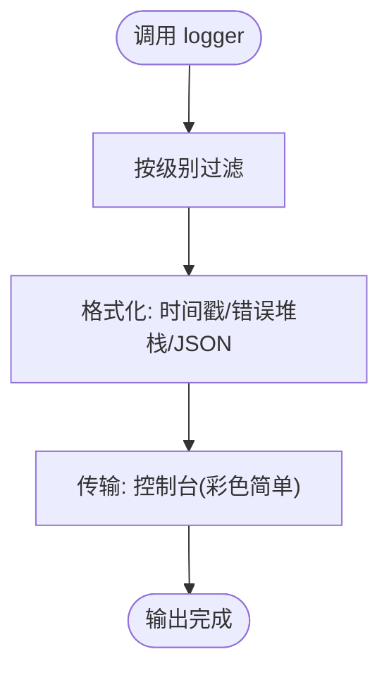

# 调试与性能优化

<cite>
**本文引用的文件**
- [backend/src/utils/logger.ts](file://backend/src/utils/logger.ts)
- [backend/src/middleware/errorHandler.ts](file://backend/src/middleware/errorHandler.ts)
- [backend/src/index.ts](file://backend/src/index.ts)
- [backend/src/config/database.ts](file://backend/src/config/database.ts)
- [backend/src/controllers/practice.controller.ts](file://backend/src/controllers/practice.controller.ts)
- [flutter_app/lib/core/utils/app_logger.dart](file://flutter_app/lib/core/utils/app_logger.dart)
- [flutter_app/lib/main.dart](file://flutter_app/lib/main.dart)
- [flutter_app/lib/core/storage/database_helper.dart](file://flutter_app/lib/core/storage/database_helper.dart)
- [flutter_app/lib/core/utils/cache_manager.dart](file://flutter_app/lib/core/utils/cache_manager.dart)
- [backend/package.json](file://backend/package.json)
- [flutter_app/pubspec.yaml](file://flutter_app/pubspec.yaml)
- [FLUTTER_DEVELOPMENT_GUIDE.md](file://FLUTTER_DEVELOPMENT_GUIDE.md)
- [docs/QUALITY_REPORT.md](file://docs/QUALITY_REPORT.md)
</cite>

## 目录
1. [引言](#引言)
2. [项目结构](#项目结构)
3. [核心组件](#核心组件)
4. [架构总览](#架构总览)
5. [详细组件分析](#详细组件分析)
6. [依赖关系分析](#依赖关系分析)
7. [性能考虑](#性能考虑)
8. [故障排查指南](#故障排查指南)
9. [结论](#结论)
10. [附录](#附录)

## 引言
本指南聚焦于项目级调试与性能优化实践，围绕后端日志系统与错误处理中间件、前端日志封装与性能日志、数据库与缓存配置、以及常见开发陷阱与解决方案展开。目标是帮助开发者快速定位问题、建立结构化日志体系、规范错误处理流程，并通过性能指标与工具链持续优化系统表现。

## 项目结构
本项目采用前后端分离架构：
- 后端基于 Express + TypeScript，使用 Winston 输出结构化日志，全局错误中间件统一处理异常。
- 前端基于 Flutter，使用 logger 包封装统一日志接口，提供多级日志与性能日志能力。
- 数据层包含 PostgreSQL 连接池与 Redis 客户端，本地 SQLite 由 sqflite 管理；另有缓存清理与大小统计工具。

图表来源
- [backend/src/index.ts](file://backend/src/index.ts#L1-L85)
- [backend/src/middleware/errorHandler.ts](file://backend/src/middleware/errorHandler.ts#L1-L97)
- [backend/src/utils/logger.ts](file://backend/src/utils/logger.ts#L1-L37)
- [backend/src/config/database.ts](file://backend/src/config/database.ts#L1-L47)
- [flutter_app/lib/main.dart](file://flutter_app/lib/main.dart#L1-L105)
- [flutter_app/lib/core/utils/app_logger.dart](file://flutter_app/lib/core/utils/app_logger.dart#L1-L294)
- [flutter_app/lib/core/storage/database_helper.dart](file://flutter_app/lib/core/storage/database_helper.dart#L1-L204)
- [flutter_app/lib/core/utils/cache_manager.dart](file://flutter_app/lib/core/utils/cache_manager.dart#L1-L146)

章节来源
- [backend/src/index.ts](file://backend/src/index.ts#L1-L85)
- [flutter_app/lib/main.dart](file://flutter_app/lib/main.dart#L1-L105)

## 核心组件
- 后端日志系统：Winston 结构化日志，支持时间戳、堆栈、JSON 输出，控制台彩色简单格式。
- 后端错误处理中间件：统一捕获异常，区分业务错误与服务器错误，安全地返回响应，记录上下文信息。
- 前端日志封装：基于 logger 包，提供 debug/info/warning/error/fatal 等级别，支持网络、BLoC、仓库、性能等专项日志。
- 数据库与缓存：PostgreSQL 连接池与 Redis 客户端初始化；SQLite 表结构与索引；缓存清理与大小统计工具。
- 性能指标与建议：质量报告中给出 API 响应时间目标与优化建议，容器资源占用良好。

章节来源
- [backend/src/utils/logger.ts](file://backend/src/utils/logger.ts#L1-L37)
- [backend/src/middleware/errorHandler.ts](file://backend/src/middleware/errorHandler.ts#L1-L97)
- [flutter_app/lib/core/utils/app_logger.dart](file://flutter_app/lib/core/utils/app_logger.dart#L1-L294)
- [backend/src/config/database.ts](file://backend/src/config/database.ts#L1-L47)
- [flutter_app/lib/core/storage/database_helper.dart](file://flutter_app/lib/core/storage/database_helper.dart#L1-L204)
- [flutter_app/lib/core/utils/cache_manager.dart](file://flutter_app/lib/core/utils/cache_manager.dart#L1-L146)
- [docs/QUALITY_REPORT.md](file://docs/QUALITY_REPORT.md#L205-L234)

## 架构总览
后端启动时初始化数据库连接与中间件，统一错误处理；前端在入口处完成依赖注入与路由配置，统一使用日志工具记录关键路径。

图表来源
- [backend/src/index.ts](file://backend/src/index.ts#L1-L85)
- [backend/src/middleware/errorHandler.ts](file://backend/src/middleware/errorHandler.ts#L1-L97)
- [backend/src/utils/logger.ts](file://backend/src/utils/logger.ts#L1-L37)

## 详细组件分析

### 后端日志系统（logger.ts）
- 结构化输出：时间戳、错误堆栈、JSON 格式，便于日志聚合与检索。
- 控制台输出：彩色简单格式，便于本地开发查看。
- 级别控制：通过环境变量控制日志级别，生产环境建议提升为 info 或更高。

图表来源
- [backend/src/utils/logger.ts](file://backend/src/utils/logger.ts#L1-L37)

章节来源
- [backend/src/utils/logger.ts](file://backend/src/utils/logger.ts#L1-L37)

### 后端错误处理中间件（errorHandler.ts）
- 业务错误识别：通过自定义 AppError 类型区分业务错误与服务器错误。
- 标准化响应：返回 success=false 与 error.code/message 字段，避免泄露内部细节。
- 上下文记录：记录请求路径、方法与堆栈，便于定位问题。
- 生产环境保护：对错误消息进行脱敏，仅在开发环境暴露详细信息。

图表来源
- [backend/src/middleware/errorHandler.ts](file://backend/src/middleware/errorHandler.ts#L1-L97)

章节来源
- [backend/src/middleware/errorHandler.ts](file://backend/src/middleware/errorHandler.ts#L1-L97)

### 前端日志封装（app_logger.dart）
- 级别体系：debug/info/warning/error/fatal，配合运行模式自动选择级别。
- 专项日志：network/blocEvent/blocState/repository/performance，覆盖网络、状态流、仓储与性能。
- 打印器与输出器：Emoji 与颜色标识，仅在 debug 模式输出堆栈，release 模式可扩展远程上报。
- 级别动态调整：支持运行时修改日志级别并重新初始化 Logger。

图表来源
- [flutter_app/lib/core/utils/app_logger.dart](file://flutter_app/lib/core/utils/app_logger.dart#L1-L294)

章节来源
- [flutter_app/lib/core/utils/app_logger.dart](file://flutter_app/lib/core/utils/app_logger.dart#L1-L294)

### 数据库与缓存配置
- PostgreSQL 连接池：最大连接数、空闲超时、连接超时，确保高并发下的稳定性。
- Redis 客户端：集中式缓存，建议结合业务热点数据进行缓存策略设计。
- 本地 SQLite：sqflite 管理本地数据库，创建索引以优化查询；提供数据库大小统计与关闭逻辑。
- 缓存管理：提供缓存目录遍历、大小格式化与清理能力，辅助排查磁盘占用。

图表来源
- [backend/src/config/database.ts](file://backend/src/config/database.ts#L1-L47)
- [flutter_app/lib/core/storage/database_helper.dart](file://flutter_app/lib/core/storage/database_helper.dart#L1-L204)
- [flutter_app/lib/core/utils/cache_manager.dart](file://flutter_app/lib/core/utils/cache_manager.dart#L1-L146)

章节来源
- [backend/src/config/database.ts](file://backend/src/config/database.ts#L1-L47)
- [flutter_app/lib/core/storage/database_helper.dart](file://flutter_app/lib/core/storage/database_helper.dart#L1-L204)
- [flutter_app/lib/core/utils/cache_manager.dart](file://flutter_app/lib/core/utils/cache_manager.dart#L1-L146)

### 前端入口与依赖注入
- 入口文件负责初始化网络客户端、安全存储、数据源与仓库，并通过 BlocProvider 注入 AuthBloc。
- 路由配置与页面导航清晰，便于在调试时定位页面生命周期与状态变更。

图表来源
- [flutter_app/lib/main.dart](file://flutter_app/lib/main.dart#L1-L105)

章节来源
- [flutter_app/lib/main.dart](file://flutter_app/lib/main.dart#L1-L105)

## 依赖关系分析
- 后端依赖：Express、Winston、PG 连接池、Redis 客户端、Helmet/CORS 等安全与中间件。
- 前端依赖：logger、dio、flutter_bloc、sqflite、shared_preferences、flutter_secure_storage 等。

图表来源
- [backend/package.json](file://backend/package.json#L1-L55)
- [flutter_app/pubspec.yaml](file://flutter_app/pubspec.yaml#L1-L111)

章节来源
- [backend/package.json](file://backend/package.json#L1-L55)
- [flutter_app/pubspec.yaml](file://flutter_app/pubspec.yaml#L1-L111)

## 性能考虑
- API 响应时间目标与优化建议：质量报告中给出了 P50/P95/P99 目标与 Redis 缓存、gzip 压缩、CDN、读写分离等建议。
- 数据库查询优化：在控制器中使用事务与索引，建议对高频查询字段建立索引，避免 N+1 查询，使用连接池复用连接。
- 前端帧率与内存：使用 Flutter DevTools 分析帧率、内存、GC、Build/DidUpdateChild/Scheduler 等指标；遵循开发规范减少重建与不必要的渲染。
- 缓存与磁盘：合理使用本地缓存与图片缓存，定期清理无用缓存，监控缓存大小与增长趋势。

章节来源
- [docs/QUALITY_REPORT.md](file://docs/QUALITY_REPORT.md#L205-L234)
- [backend/src/controllers/practice.controller.ts](file://backend/src/controllers/practice.controller.ts#L34-L66)
- [FLUTTER_DEVELOPMENT_GUIDE.md](file://FLUTTER_DEVELOPMENT_GUIDE.md#L157-L170)

## 故障排查指南
- 后端错误处理
  - 使用 AppError 区分业务错误，确保返回字段一致且不泄露敏感信息。
  - 在 errorHandler 中记录路径、方法与堆栈，便于定位问题来源。
  - 生产环境建议开启脱敏错误消息，开发环境保留详细堆栈。
- 前端日志
  - 使用 AppLogger 的网络、BLoC、仓库、性能日志，覆盖关键路径。
  - 在 debug 模式下启用更详细的日志输出，必要时临时提升日志级别。
- 数据库与缓存
  - 检查连接池配置与连接数上限，避免连接耗尽。
  - 对慢查询建立索引，使用事务包裹相关写操作，确保一致性。
  - 使用缓存管理工具清理缓存并监控缓存大小，排查磁盘占用。
- 常见陷阱与解决方案
  - 异步资源未释放：确保数据库连接、HTTP 客户端、定时器、订阅等在生命周期结束时释放。
  - 循环依赖：模块间解耦，避免相互 import；使用接口抽象与依赖注入。
  - 过度重建：使用 const 构造、提取子组件、使用 BlocSelector 精准监听、懒加载列表项。
  - 线程阻塞：避免在主线程执行 IO 或重计算，使用异步与后台任务。

章节来源
- [backend/src/middleware/errorHandler.ts](file://backend/src/middleware/errorHandler.ts#L1-L97)
- [flutter_app/lib/core/utils/app_logger.dart](file://flutter_app/lib/core/utils/app_logger.dart#L1-L294)
- [flutter_app/lib/core/storage/database_helper.dart](file://flutter_app/lib/core/storage/database_helper.dart#L1-L204)
- [flutter_app/lib/core/utils/cache_manager.dart](file://flutter_app/lib/core/utils/cache_manager.dart#L1-L146)
- [FLUTTER_DEVELOPMENT_GUIDE.md](file://FLUTTER_DEVELOPMENT_GUIDE.md#L157-L170)

## 结论
通过统一的日志体系与错误处理中间件，后端实现了结构化、可追踪的调试能力；前端日志封装提供了面向业务场景的专项日志与性能观测。结合数据库与缓存配置、质量报告中的性能目标与建议，以及开发规范与常见陷阱的规避策略，能够有效提升系统的可观测性与稳定性，并持续优化性能表现。

## 附录
- IDE 调试器连接与断点设置
  - 后端：使用 Node 调试器附加到 ts-node-dev 进程，设置断点于路由处理与控制器逻辑，观察请求上下文与响应。
  - 前端：使用 Flutter DevTools 连接应用，打开 Timeline/Performance/Memory/Inspection 面板，设置断点于关键 BLoC 事件与页面构建函数，分析调用栈与重建范围。
- 性能监控建议
  - 后端：接入 APM 工具或日志聚合平台，采集错误率、响应时间、吞吐量与数据库慢查询。
  - 前端：使用 DevTools 的帧率曲线、内存曲线与 GC 日志，结合 AppLogger.performance 记录关键操作耗时。
- 部署与环境
  - 后端：通过环境变量控制日志级别与安全头，生产环境启用 Helmet/CORS 白名单与速率限制。
  - 前端：发布构建时移除调试日志与冗余输出，启用压缩与缓存策略。