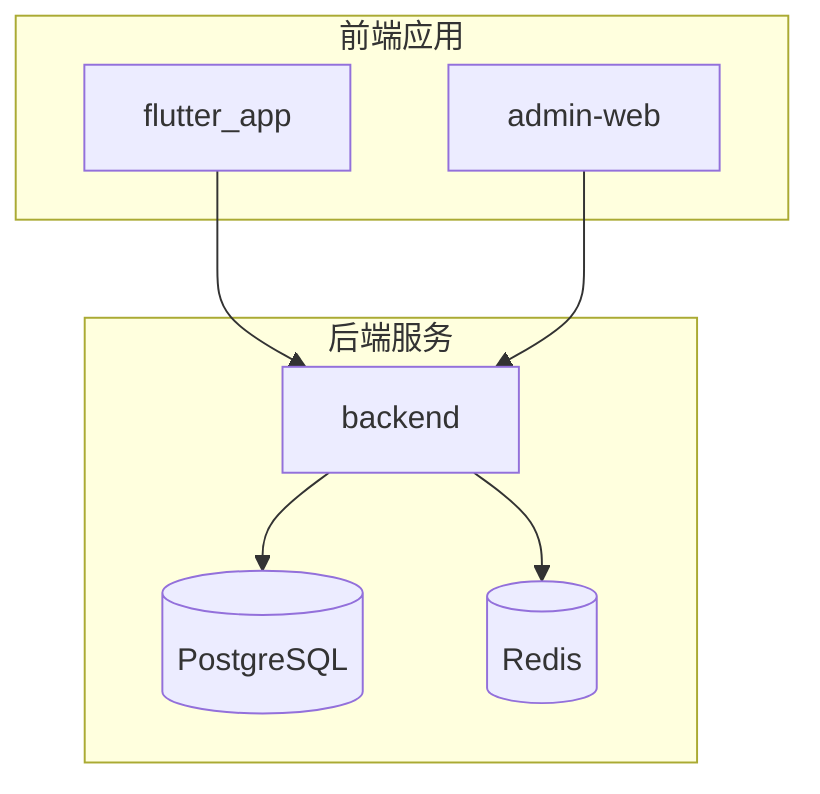
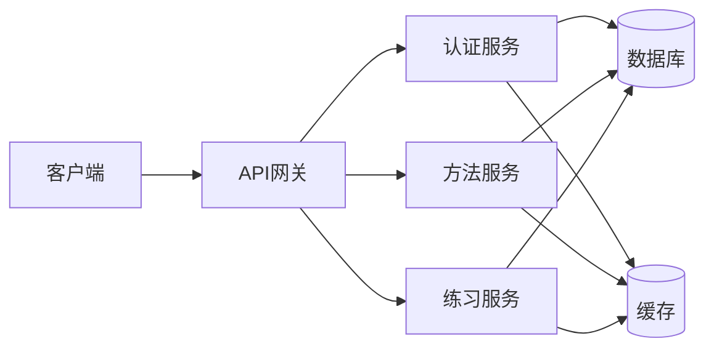
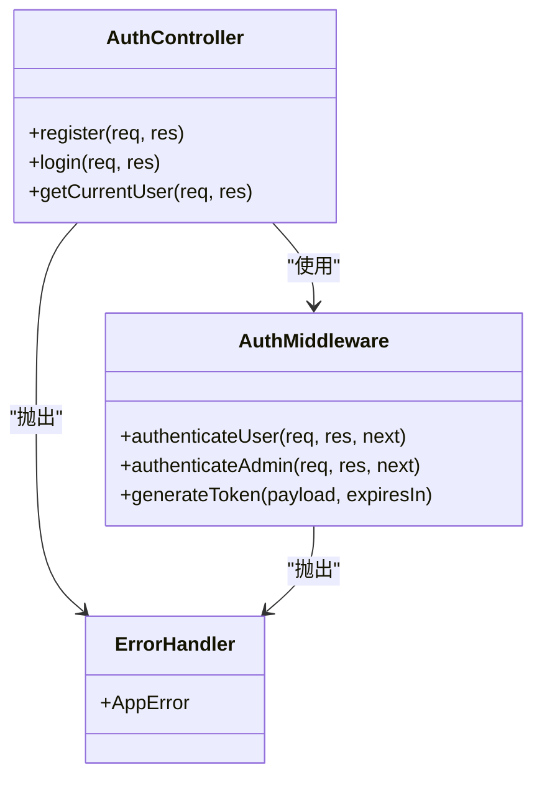
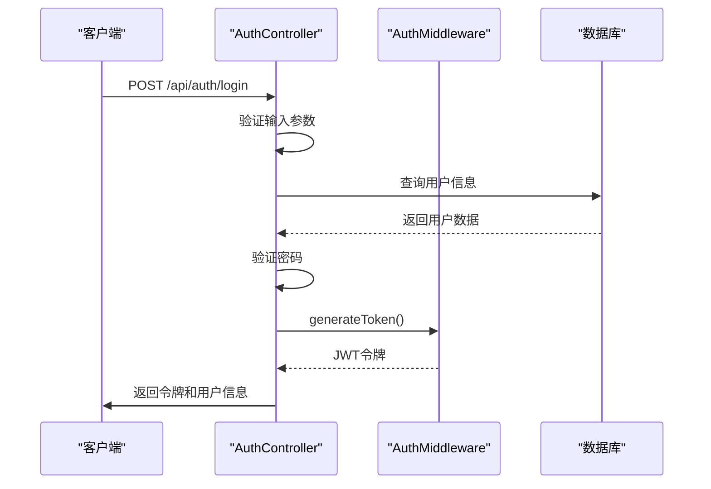
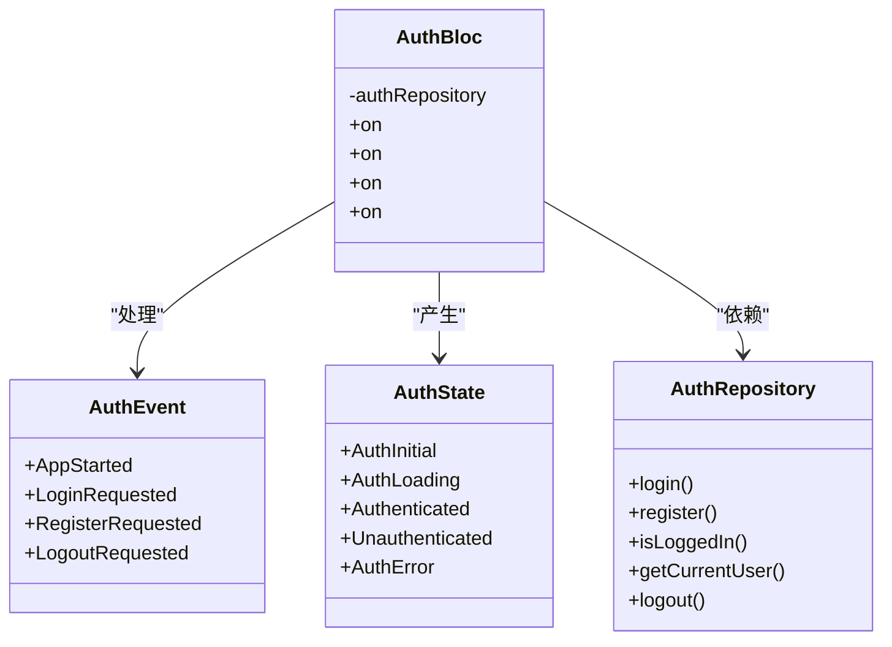
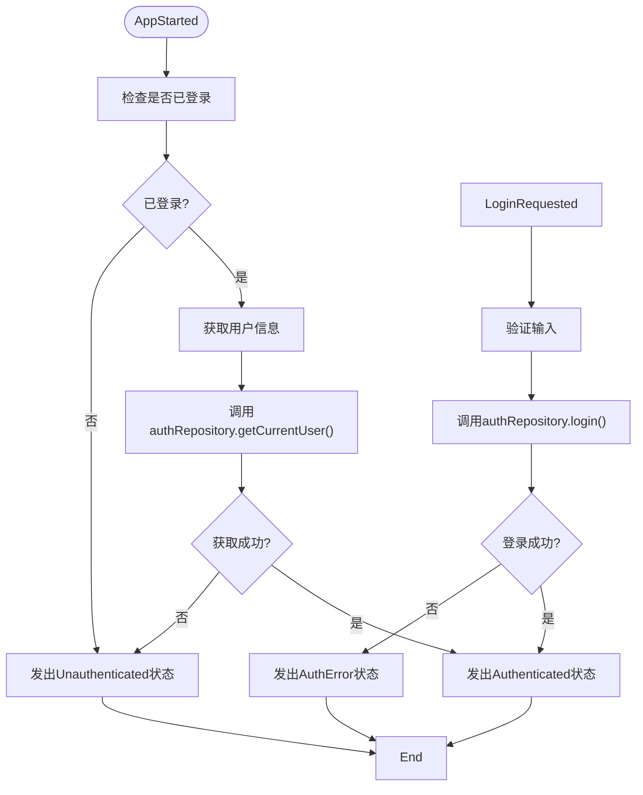
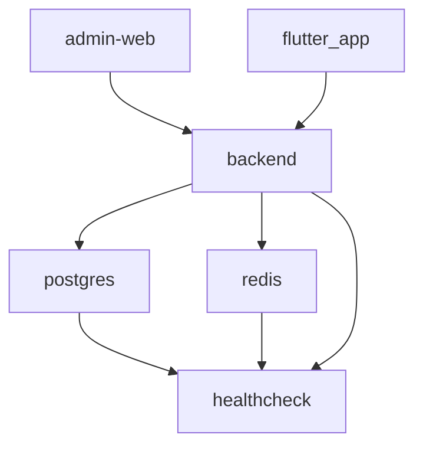

# 调试工具与断点调试

<cite>
**本文档引用的文件**   
- [package.json](file://backend/package.json)
- [pubspec.yaml](file://flutter_app/pubspec.yaml)
- [index.ts](file://backend/src/index.ts)
- [main.dart](file://flutter_app/lib/main.dart)
- [auth.ts](file://backend/src/middleware/auth.ts)
- [auth.controller.ts](file://backend/src/controllers/auth.controller.ts)
- [auth_bloc.dart](file://flutter_app/lib/presentation/auth/bloc/auth_bloc.dart)
- [logger.ts](file://backend/src/utils/logger.ts)
- [docker-compose.yml](file://docker-compose.yml)
- [tsconfig.json](file://backend/tsconfig.json)
- [analysis_options.yaml](file://flutter_app/analysis_options.yaml)
</cite>

## 目录
1. [简介](#简介)
2. [项目结构](#项目结构)
3. [核心组件](#核心组件)
4. [架构概览](#架构概览)
5. [详细组件分析](#详细组件分析)
6. [依赖分析](#依赖分析)
7. [性能考量](#性能考量)
8. [故障排除指南](#故障排除指南)
9. [结论](#结论)

## 简介
本文档旨在指导开发者配置本地调试环境，实现前后端一体化调试。文档详细说明了如何使用VS Code或WebStorm附加Node.js调试器到后端服务，设置启动配置（launch.json），并在controller和middleware中设置断点进行变量监视与调用栈分析。针对Flutter应用，介绍了如何启用Dart DevTools，连接模拟器或真机，利用Timeline查看UI帧率、Memory面板检测内存增长趋势，并通过Debugger在BLoC事件处理中逐步执行。同时提供了常见调试场景的操作步骤，如登录失败追踪、API调用超时分析、状态更新异常排查等。

## 项目结构
本项目采用前后端分离的架构，包含后端API服务、Flutter移动应用和管理后台前端三个主要部分。后端使用TypeScript开发，基于Express框架；前端使用Flutter框架开发，遵循BLoC状态管理模式；管理后台使用React开发。项目通过Docker Compose进行容器化部署，便于本地开发和测试。

**图示来源**
- [docker-compose.yml](file://docker-compose.yml#L1-L241)

**本节来源**
- [docker-compose.yml](file://docker-compose.yml#L1-L241)

## 核心组件
项目的核心组件包括后端API服务、Flutter客户端和管理后台。后端API服务提供RESTful接口，处理用户认证、心理方法管理、练习记录等功能。Flutter客户端实现移动端用户界面，采用BLoC模式进行状态管理。管理后台提供管理员界面，用于内容审核和用户管理。

**本节来源**
- [package.json](file://backend/package.json#L1-L55)
- [pubspec.yaml](file://flutter_app/pubspec.yaml#L1-L111)

## 架构概览
系统采用微服务架构，通过Docker容器化部署。后端服务使用Express框架处理HTTP请求，通过TypeORM与PostgreSQL数据库交互，使用Redis进行缓存。前端应用使用Flutter框架开发，通过Dio库与后端API通信。整个系统通过JWT进行身份验证，使用Winston进行日志记录。

**图示来源**
- [index.ts](file://backend/src/index.ts#L1-L85)
- [main.dart](file://flutter_app/lib/main.dart#L1-L105)

## 详细组件分析

### 后端认证组件分析
后端认证组件包含控制器、中间件和工具函数，实现了用户注册、登录和身份验证功能。控制器处理HTTP请求，中间件负责JWT令牌的验证和生成。

#### 认证控制器

**图示来源**
- [auth.controller.ts](file://backend/src/controllers/auth.controller.ts#L1-L150)
- [auth.ts](file://backend/src/middleware/auth.ts#L1-L87)

#### 认证流程序列图

**图示来源**
- [auth.controller.ts](file://backend/src/controllers/auth.controller.ts#L71-L125)
- [auth.ts](file://backend/src/middleware/auth.ts#L79-L87)

**本节来源**
- [auth.controller.ts](file://backend/src/controllers/auth.controller.ts#L1-L150)
- [auth.ts](file://backend/src/middleware/auth.ts#L1-L87)

### Flutter BLoC组件分析
Flutter应用采用BLoC模式进行状态管理，将业务逻辑与UI分离。认证BLoC负责处理用户登录、注册和状态管理。

#### 认证BLoC类图

**图示来源**
- [auth_bloc.dart](file://flutter_app/lib/presentation/auth/bloc/auth_bloc.dart#L1-L82)

#### BLoC事件处理流程

**图示来源**
- [auth_bloc.dart](file://flutter_app/lib/presentation/auth/bloc/auth_bloc.dart#L1-L82)

**本节来源**
- [auth_bloc.dart](file://flutter_app/lib/presentation/auth/bloc/auth_bloc.dart#L1-L82)
- [main.dart](file://flutter_app/lib/main.dart#L1-L105)

## 依赖分析
项目依赖关系清晰，后端服务依赖数据库和缓存服务，前端应用依赖后端API服务。通过Docker Compose文件定义了服务间的依赖关系，确保服务按正确顺序启动。

**图示来源**
- [docker-compose.yml](file://docker-compose.yml#L1-L241)

**本节来源**
- [docker-compose.yml](file://docker-compose.yml#L1-L241)
- [package.json](file://backend/package.json#L1-L55)
- [pubspec.yaml](file://flutter_app/pubspec.yaml#L1-L111)

## 性能考量
在调试过程中需要注意性能相关的问题。后端服务使用Winston进行日志记录，合理配置日志级别可以避免过多的日志输出影响性能。前端应用使用Dart DevTools的Memory面板可以检测内存增长趋势，及时发现内存泄漏问题。通过Timeline可以分析UI帧率，优化界面渲染性能。

## 故障排除指南
### 登录失败追踪
当用户登录失败时，可以通过以下步骤进行调试：
1. 在`auth.controller.ts`的`login`方法中设置断点
2. 检查请求参数是否正确
3. 验证数据库查询结果
4. 检查密码验证逻辑
5. 查看JWT令牌生成过程

**本节来源**
- [auth.controller.ts](file://backend/src/controllers/auth.controller.ts#L71-L125)
- [auth_bloc.dart](file://flutter_app/lib/presentation/auth/bloc/auth_bloc.dart#L36-L52)

### API调用超时分析
当API调用超时时，可以：
1. 检查网络连接
2. 验证后端服务是否正常运行
3. 查看数据库查询性能
4. 检查Redis缓存状态
5. 使用Dart DevTools的Network面板分析请求

**本节来源**
- [index.ts](file://backend/src/index.ts#L1-L85)
- [dio_client.dart](file://flutter_app/lib/core/network/dio_client.dart)

### 状态更新异常排查
当BLoC状态更新异常时：
1. 在BLoC事件处理器中设置断点
2. 检查事件是否正确发出
3. 验证状态转换逻辑
4. 查看Repository调用结果
5. 检查错误处理流程

**本节来源**
- [auth_bloc.dart](file://flutter_app/lib/presentation/auth/bloc/auth_bloc.dart#L1-L82)
- [auth_repository_impl.dart](file://flutter_app/data/repositories/auth_repository_impl.dart)

## 结论
本文档详细介绍了如何配置本地调试环境，实现前后端一体化调试。通过VS Code或WebStorm可以方便地调试后端Node.js服务，使用Dart DevTools可以全面分析Flutter应用的性能和状态。掌握这些调试技巧对于快速定位和解决问题至关重要，能够显著提高开发效率和代码质量。