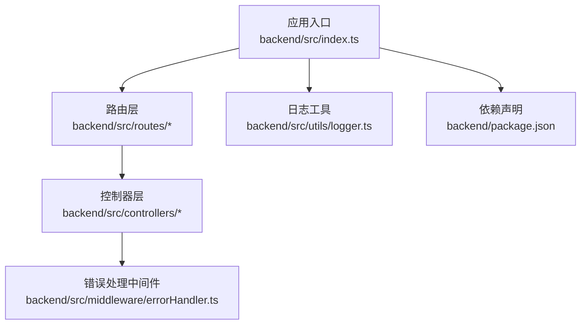
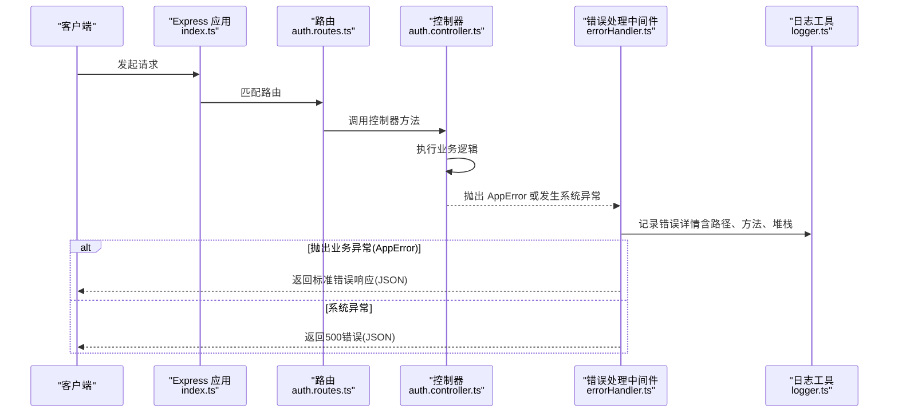
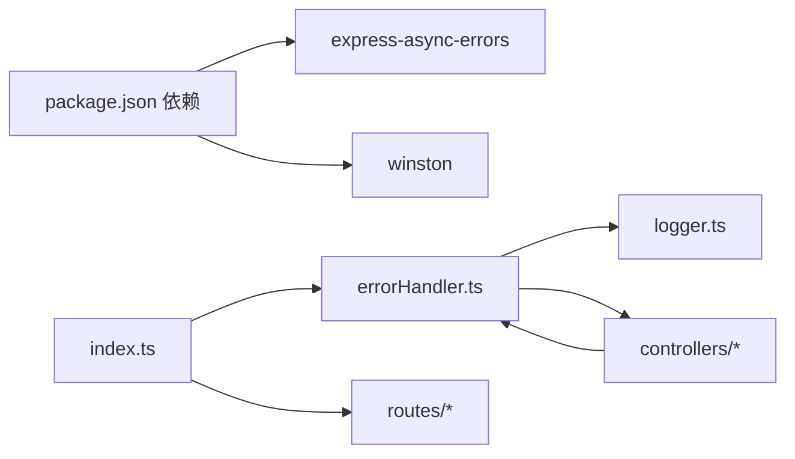

# 错误处理与异常捕获

<cite>
**本文引用的文件**
- [backend/src/middleware/errorHandler.ts](file://backend/src/middleware/errorHandler.ts)
- [backend/src/index.ts](file://backend/src/index.ts)
- [backend/src/utils/logger.ts](file://backend/src/utils/logger.ts)
- [backend/src/controllers/auth.controller.ts](file://backend/src/controllers/auth.controller.ts)
- [backend/src/controllers/admin.controller.ts](file://backend/src/controllers/admin.controller.ts)
- [backend/src/controllers/practice.controller.ts](file://backend/src/controllers/practice.controller.ts)
- [backend/src/controllers/userMethod.controller.ts](file://backend/src/controllers/userMethod.controller.ts)
- [backend/src/controllers/method.controller.ts](file://backend/src/controllers/method.controller.ts)
- [backend/src/routes/auth.routes.ts](file://backend/src/routes/auth.routes.ts)
- [backend/package.json](file://backend/package.json)
</cite>

## 目录
1. [简介](#简介)
2. [项目结构](#项目结构)
3. [核心组件](#核心组件)
4. [架构总览](#架构总览)
5. [详细组件分析](#详细组件分析)
6. [依赖分析](#依赖分析)
7. [性能考虑](#性能考虑)
8. [故障排查指南](#故障排查指南)
9. [结论](#结论)

## 简介
本文件深入解析后端错误处理中间件 errorHandler.ts 的工作流程，阐明其在 Express 请求管道中的位置、如何捕获同步与异步异常、如何区分业务异常与系统错误；文档化错误响应的标准 JSON 格式设计（success、error.code、error.message 字段），并解释生产环境下的堆栈安全策略；提供自定义异常类 AppError 的创建与抛出方式，展示在控制器中如何协同使用；结合常见请求场景（如 404 未找到、500 服务器错误）给出调试路径与修复建议。

## 项目结构
后端采用 Express + TypeScript 架构，错误处理中间件位于 middleware 层，统一拦截控制器抛出的业务异常与系统异常，并输出标准化错误响应。路由层负责挂载各模块接口，应用入口负责初始化中间件、路由与错误处理中间件。

图表来源
- [backend/src/index.ts](file://backend/src/index.ts#L1-L85)
- [backend/src/middleware/errorHandler.ts](file://backend/src/middleware/errorHandler.ts#L1-L97)
- [backend/src/utils/logger.ts](file://backend/src/utils/logger.ts#L1-L37)
- [backend/package.json](file://backend/package.json#L1-L55)

章节来源
- [backend/src/index.ts](file://backend/src/index.ts#L1-L85)
- [backend/src/middleware/errorHandler.ts](file://backend/src/middleware/errorHandler.ts#L1-L97)
- [backend/src/utils/logger.ts](file://backend/src/utils/logger.ts#L1-L37)
- [backend/package.json](file://backend/package.json#L1-L55)

## 核心组件
- 错误处理中间件 errorHandler.ts
  - 自定义异常类 AppError：用于承载业务异常的 HTTP 状态码、业务错误码与消息。
  - 统一错误处理器 errorHandler：识别 AppError 并返回标准错误响应；对非 AppError 的系统异常按 500 返回“服务器错误”，生产环境隐藏具体堆栈细节。
  - 日志记录：使用 logger 输出错误信息、请求路径与方法，便于审计与定位问题。
- 控制器层：在业务逻辑中抛出 AppError，实现“业务异常即错误响应”的一致行为。
- 应用入口 index.ts：挂载 404 未找到处理与全局错误处理中间件，确保所有未捕获异常最终由 errorHandler 统一处理。

章节来源
- [backend/src/middleware/errorHandler.ts](file://backend/src/middleware/errorHandler.ts#L1-L97)
- [backend/src/index.ts](file://backend/src/index.ts#L1-L85)

## 架构总览
下图展示了从客户端请求到错误响应的关键路径，强调 errorHandler 在 Express 请求管道中的位置与职责。

图表来源
- [backend/src/index.ts](file://backend/src/index.ts#L1-L85)
- [backend/src/routes/auth.routes.ts](file://backend/src/routes/auth.routes.ts#L1-L17)
- [backend/src/controllers/auth.controller.ts](file://backend/src/controllers/auth.controller.ts#L1-L150)
- [backend/src/middleware/errorHandler.ts](file://backend/src/middleware/errorHandler.ts#L1-L97)
- [backend/src/utils/logger.ts](file://backend/src/utils/logger.ts#L1-L37)

## 详细组件分析

### 错误处理中间件 errorHandler.ts 工作流
- Express 请求管道中的位置
  - 在路由挂载之后、404 未找到处理之前注册 errorHandler，确保所有同步与异步异常均被拦截。
  - 通过引入依赖包“express-async-errors”使异步错误也能进入 errorHandler 流程。
- 捕获与区分异常
  - 识别 AppError 实例：根据构造参数中的 statusCode、code、message 返回对应业务错误响应。
  - 非 AppError：默认返回 500，生产环境 message 为通用提示，避免泄露内部堆栈。
- 标准错误响应 JSON 设计
  - 结构：包含 success（布尔）、error（对象）。
  - error.code：业务错误码，如 VALIDATION_ERROR、AUTH_FAILED、NOT_FOUND、SERVER_ERROR 等。
  - error.message：错误描述，开发环境可显示具体原因，生产环境显示通用提示。
  - 可扩展：可在 error 对象中加入 details 字段用于补充错误上下文（例如字段校验失败的详细信息），但当前代码未实现该字段。
- 生产环境堆栈安全策略
  - logger 记录完整堆栈，便于本地/测试环境排查。
  - errorHandler 在生产环境不直接返回堆栈字符串，仅返回通用错误消息，降低敏感信息泄露风险。

章节来源
- [backend/src/middleware/errorHandler.ts](file://backend/src/middleware/errorHandler.ts#L1-L97)
- [backend/src/index.ts](file://backend/src/index.ts#L1-L85)
- [backend/package.json](file://backend/package.json#L1-L55)

### 自定义异常类 AppError 的创建与使用
- AppError 类
  - 构造函数接收 statusCode、code、message，继承 Error 并设置 name。
  - 用于承载业务异常，便于 errorHandler 识别并按业务码返回。
- 控制器中的抛出方式
  - 在控制器方法中进行输入校验、权限检查、资源存在性检查等，若不满足条件则抛出 AppError。
  - 示例场景：
    - 注册/登录时缺少必要字段或格式不合法：抛出 VALIDATION_ERROR。
    - 认证失败或权限不足：抛出 AUTH_FAILED 或 PERMISSION_DENIED。
    - 资源不存在：抛出 NOT_FOUND。
    - 重复提交或冲突：抛出 DUPLICATE_ENTRY。
  - 以上示例在多个控制器中均有体现，如 auth、admin、practice、userMethod、method 等。

章节来源
- [backend/src/middleware/errorHandler.ts](file://backend/src/middleware/errorHandler.ts#L1-L97)
- [backend/src/controllers/auth.controller.ts](file://backend/src/controllers/auth.controller.ts#L1-L150)
- [backend/src/controllers/admin.controller.ts](file://backend/src/controllers/admin.controller.ts#L1-L800)
- [backend/src/controllers/practice.controller.ts](file://backend/src/controllers/practice.controller.ts#L1-L261)
- [backend/src/controllers/userMethod.controller.ts](file://backend/src/controllers/userMethod.controller.ts#L1-L162)
- [backend/src/controllers/method.controller.ts](file://backend/src/controllers/method.controller.ts#L1-L153)

### Express 异步异常捕获机制
- 通过安装“express-async-errors”包，使 async 控制器方法中的未捕获异常能够进入 errorHandler 流程，避免进程崩溃。
- 在控制器中使用 try/catch 或抛出 AppError 是推荐做法；对于数据库事务等复杂流程，应确保异常能正确冒泡至 errorHandler。

章节来源
- [backend/src/index.ts](file://backend/src/index.ts#L1-L85)
- [backend/package.json](file://backend/package.json#L1-L55)

### 错误响应 JSON 格式设计
- 成功响应与错误响应共用同一结构：success 字段标识成功与否；错误时 error 对象包含 code 与 message。
- 当前代码未实现 details 字段；如需增强，可在 error 对象中新增 details 字段用于携带更详细的错误上下文（例如字段校验失败列表）。

章节来源
- [backend/src/middleware/errorHandler.ts](file://backend/src/middleware/errorHandler.ts#L1-L97)

### 404 未找到与 500 服务器错误场景
- 404 未找到
  - 应用入口中对未匹配路由统一返回 404，error.code 为 NOT_FOUND。
  - 控制器内对资源不存在也应抛出 AppError(404, 'NOT_FOUND', ...)，保持一致性。
- 500 服务器错误
  - 非 AppError 的系统异常默认返回 500，生产环境 message 为通用提示。
  - 建议在控制器中尽量将业务异常显式抛出为 AppError，减少未捕获异常导致的 500。

章节来源
- [backend/src/index.ts](file://backend/src/index.ts#L1-L85)
- [backend/src/middleware/errorHandler.ts](file://backend/src/middleware/errorHandler.ts#L1-L97)

## 依赖分析
- 错误处理中间件依赖
  - logger：记录错误详情，包含错误消息、堆栈、请求路径与方法。
  - express-async-errors：使异步错误进入 errorHandler。
- 控制器依赖
  - AppError：用于抛出业务异常。
  - 数据库连接池：用于查询与更新，异常时交由 errorHandler 统一处理。
- 应用入口依赖
  - 路由模块：挂载各模块接口。
  - errorHandler：全局错误处理。
  - 404 未找到处理：兜底路由。

图表来源
- [backend/package.json](file://backend/package.json#L1-L55)
- [backend/src/middleware/errorHandler.ts](file://backend/src/middleware/errorHandler.ts#L1-L97)
- [backend/src/utils/logger.ts](file://backend/src/utils/logger.ts#L1-L37)
- [backend/src/index.ts](file://backend/src/index.ts#L1-L85)

章节来源
- [backend/package.json](file://backend/package.json#L1-L55)
- [backend/src/middleware/errorHandler.ts](file://backend/src/middleware/errorHandler.ts#L1-L97)
- [backend/src/utils/logger.ts](file://backend/src/utils/logger.ts#L1-L37)
- [backend/src/index.ts](file://backend/src/index.ts#L1-L85)

## 性能考虑
- 错误处理中间件本身开销极低，主要成本在于日志输出与 JSON 序列化。
- 生产环境建议：
  - 使用结构化日志（winston 已支持 JSON 格式），便于集中收集与检索。
  - 控制器中尽量将业务异常显式抛出，减少未捕获异常导致的 500，提升可观测性与稳定性。
  - 对高频错误（如 400/401/403）进行限流与告警配置，避免雪崩效应。

## 故障排查指南
- 如何定位错误来源
  - 查看日志：logger 记录了错误消息、堆栈、请求路径与方法，有助于快速定位问题。
  - 确认是否为 AppError：若是，则根据 error.code 与 message 快速判断业务问题类型。
  - 若为 500：检查控制器中是否有未捕获的系统异常，优先改为抛出 AppError。
- 常见修复建议
  - 输入校验失败：在控制器中尽早校验并抛出 VALIDATION_ERROR。
  - 权限不足：在鉴权中间件或控制器中抛出 AUTH_FAILED/PERMISSION_DENIED。
  - 资源不存在：抛出 NOT_FOUND，并确保前端友好提示。
  - 数据库异常：在事务中捕获并回滚，随后抛出 AppError，避免泄漏底层错误。
- 生产环境安全
  - 不要直接在响应中返回堆栈字符串；当前 errorHandler 已在生产环境屏蔽堆栈细节。
  - 如需更细粒度的安全控制，可在部署层限制日志输出级别或脱敏敏感字段。

章节来源
- [backend/src/middleware/errorHandler.ts](file://backend/src/middleware/errorHandler.ts#L1-L97)
- [backend/src/utils/logger.ts](file://backend/src/utils/logger.ts#L1-L37)

## 结论
errorHandler.ts 将业务异常与系统异常统一纳入标准化处理流程，配合 AppError 与控制器中的显式异常抛出，实现了清晰、一致且安全的错误响应机制。通过在应用入口中正确挂载 404 与 errorHandler，以及在生产环境对堆栈进行安全过滤，整体系统具备良好的可观测性与安全性。建议后续在 error 对象中增加 details 字段以进一步提升错误信息的可读性与可诊断性。