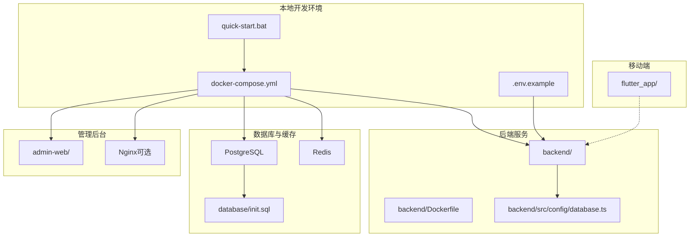
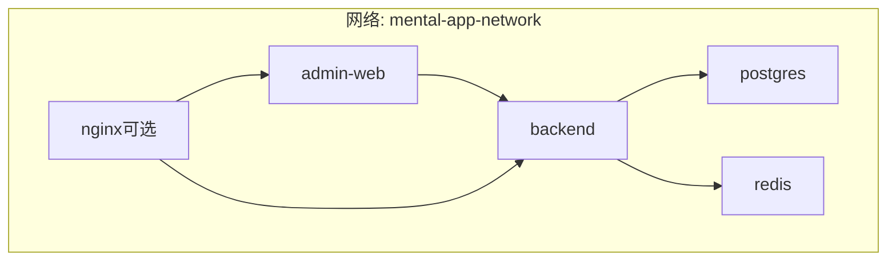
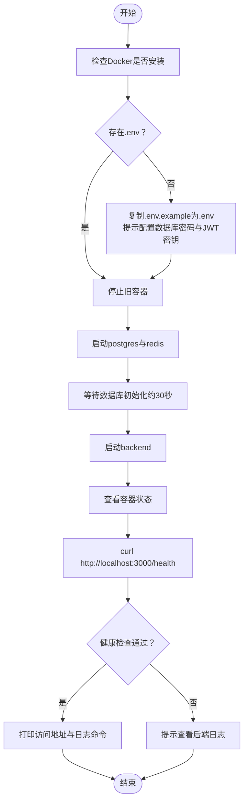
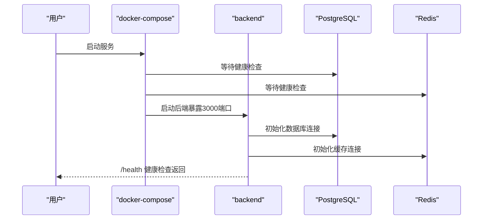
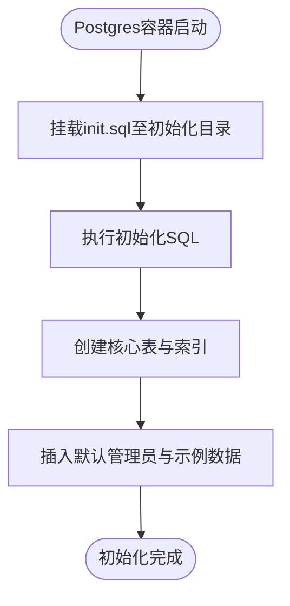
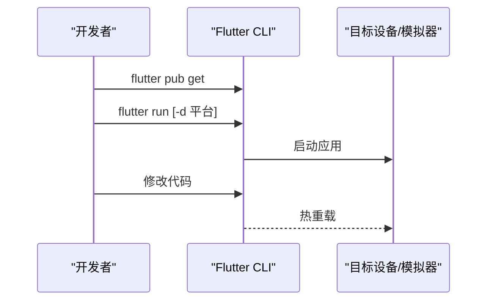
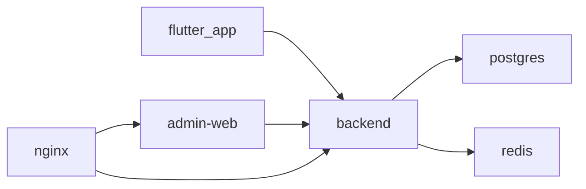

# 快速入门

<cite>
**本文引用的文件**
- [docker-compose.yml](file://docker-compose.yml)
- [.env.example](file://.env.example)
- [quick-start.bat](file://quick-start.bat)
- [README.md](file://README.md)
- [backend/Dockerfile](file://backend/Dockerfile)
- [database/init.sql](file://database/init.sql)
- [backend/src/config/database.ts](file://backend/src/config/database.ts)
- [flutter_app/pubspec.yaml](file://flutter_app/pubspec.yaml)
- [FLUTTER_SETUP_GUIDE.md](file://FLUTTER_SETUP_GUIDE.md)
- [FLUTTER_DEVELOPMENT_GUIDE.md](file://FLUTTER_DEVELOPMENT_GUIDE.md)
- [flutter_app/lib/main.dart](file://flutter_app/lib/main.dart)
</cite>

## 目录
1. [简介](#简介)
2. [项目结构](#项目结构)
3. [核心组件](#核心组件)
4. [架构总览](#架构总览)
5. [详细组件分析](#详细组件分析)
6. [依赖关系分析](#依赖关系分析)
7. [性能注意事项](#性能注意事项)
8. [故障排查指南](#故障排查指南)
9. [结论](#结论)
10. [附录](#附录)

## 简介
本指南面向新手开发者，带你从零开始在本地部署并运行 nian 项目。你将学会：
- 通过 docker-compose.yml 一键启动后端服务、数据库与管理后台
- 正确配置 .env.example 中的环境变量
- 理解 Windows 批处理脚本 quick-start.bat 的工作原理与执行流程
- 分步骤构建与调试 Flutter 移动端应用（含设备连接、依赖安装与热重载）
- 排查常见初始化问题（端口冲突、数据库连接失败、JWT 密钥缺失等）

## 项目结构
nian 采用多模块架构，包含后端 API、数据库初始化脚本、管理后台前端、Flutter 移动端以及 Docker 编排文件。核心目录如下：
- backend：Node.js + TypeScript 后端 API
- database：PostgreSQL 初始化 SQL
- admin-web：管理后台前端（React/Vite）
- flutter_app：Flutter 移动端
- docker-compose.yml：统一编排数据库、缓存、后端与管理后台
- .env.example：环境变量模板
- quick-start.bat：Windows 一键启动脚本

图表来源
- [docker-compose.yml](file://docker-compose.yml#L1-L120)
- [backend/Dockerfile](file://backend/Dockerfile#L1-L45)
- [backend/src/config/database.ts](file://backend/src/config/database.ts#L1-L47)
- [database/init.sql](file://database/init.sql#L1-L120)
- [quick-start.bat](file://quick-start.bat#L1-L151)
- [flutter_app/lib/main.dart](file://flutter_app/lib/main.dart#L1-L105)

章节来源
- [README.md](file://README.md#L58-L108)

## 核心组件
- 后端 API（Node.js + TypeScript）：提供用户认证、方法管理、练习记录等接口；通过健康检查端点对外暴露状态
- 数据库（PostgreSQL 15）：初始化脚本创建用户、方法、练习记录等核心表，并内置默认管理员与示例数据
- 缓存（Redis 7）：用于会话、限流、临时数据等
- 管理后台（React + Vite）：提供方法管理、审核、导出、媒体库与用户管理等页面
- Flutter 移动端：基于 BLoC 的跨平台应用，支持 Windows、Android、iOS、Web 等平台
- Docker 编排：一键拉起数据库、Redis、后端、管理后台，可选 Nginx 反代

章节来源
- [docker-compose.yml](file://docker-compose.yml#L1-L120)
- [backend/Dockerfile](file://backend/Dockerfile#L1-L45)
- [database/init.sql](file://database/init.sql#L1-L120)
- [FLUTTER_SETUP_GUIDE.md](file://FLUTTER_SETUP_GUIDE.md#L159-L179)

## 架构总览
下图展示容器间依赖与网络拓扑，以及后端对数据库与缓存的访问链路。

图表来源
- [docker-compose.yml](file://docker-compose.yml#L1-L120)

## 详细组件分析

### 1) 一键启动与健康检查（Windows 批处理脚本）
- 功能概述
  - 自动检查 Docker 是否安装
  - 若缺少 .env，自动复制 .env.example 并提示配置关键项（数据库密码、JWT 密钥）
  - 分阶段启动：先启动数据库与 Redis，等待初始化；再启动后端；最后检查健康检查
  - 输出访问地址与日志查看方式，便于快速验证

- 执行流程（简化版）
  1) 检测 Docker 版本
  2) 如无 .env 则复制 .env.example 并提示编辑
  3) docker-compose down（清理旧容器）
  4) docker-compose up -d postgres redis（启动数据库与缓存）
  5) 等待约 30 秒让数据库初始化
  6) docker-compose up -d backend（启动后端）
  7) docker-compose ps（查看容器状态）
  8) curl http://localhost:3000/health（健康检查）
  9) 成功则打印访问地址与日志查看命令，失败则提示查看后端日志

- 关键命令参考
  - 启动全部服务：docker-compose up -d
  - 查看容器状态：docker-compose ps
  - 查看后端日志：docker-compose logs -f backend
  - 停止服务：docker-compose down

图表来源
- [quick-start.bat](file://quick-start.bat#L1-L151)

章节来源
- [quick-start.bat](file://quick-start.bat#L1-L151)
- [README.md](file://README.md#L23-L35)

### 2) 环境变量配置（.env.example）
- 数据库相关
  - POSTGRES_DB、POSTGRES_USER、POSTGRES_PASSWORD：PostgreSQL 初始化参数
  - DB_HOST、DB_PORT、DB_NAME、DB_USER、DB_PASSWORD：后端连接数据库所需
- 缓存相关
  - REDIS_HOST、REDIS_PORT：后端连接 Redis 所需
- 后端运行
  - NODE_ENV、PORT：运行环境与端口
  - JWT_SECRET、JWT_EXPIRES_IN：JWT 密钥与过期时间
- 文件上传
  - UPLOAD_PATH、MAX_FILE_SIZE：上传目录与大小限制
- CORS
  - CORS_ORIGIN：允许的前端来源（例如管理后台与后端）

- 配置建议
  - 将 .env.example 复制为 .env 并按需修改上述字段
  - JWT_SECRET 至少 32 字符，生产环境务必强密码
  - CORS_ORIGIN 根据实际前端地址设置

章节来源
- [.env.example](file://.env.example#L1-L61)
- [backend/src/config/database.ts](file://backend/src/config/database.ts#L1-L47)

### 3) 后端服务（Node.js + TypeScript）
- Dockerfile
  - 多阶段构建：先安装依赖并编译 TS，再仅安装生产依赖，最终运行 dist/index.js
  - 暴露 3000 端口，健康检查调用 /health
- 运行与健康检查
  - docker-compose.yml 中 backend 服务暴露 3000 端口，健康检查通过 curl 访问 /health
  - 依赖 postgres 与 redis 健康后再启动

- 数据库与缓存连接
  - 通过环境变量读取 DB_HOST、DB_PORT、DB_NAME、DB_USER、DB_PASSWORD、REDIS_HOST、REDIS_PORT
  - 初始化时连接数据库与 Redis，失败会抛错

图表来源
- [docker-compose.yml](file://docker-compose.yml#L43-L98)
- [backend/Dockerfile](file://backend/Dockerfile#L1-L45)
- [backend/src/config/database.ts](file://backend/src/config/database.ts#L1-L47)

章节来源
- [backend/Dockerfile](file://backend/Dockerfile#L1-L45)
- [docker-compose.yml](file://docker-compose.yml#L43-L98)
- [backend/src/config/database.ts](file://backend/src/config/database.ts#L1-L47)

### 4) 数据库初始化（PostgreSQL）
- 初始化脚本
  - 创建用户、方法、练习记录、提醒设置、管理员、媒体文件等核心表
  - 建立常用索引与触发器，自动维护更新时间
  - 插入默认管理员账号与若干示例方法数据
- Docker 集成
  - docker-compose 将 init.sql 挂载到 /docker-entrypoint-initdb.d，容器首次启动时自动执行

图表来源
- [docker-compose.yml](file://docker-compose.yml#L13-L18)
- [database/init.sql](file://database/init.sql#L1-L120)

章节来源
- [database/init.sql](file://database/init.sql#L1-L120)
- [docker-compose.yml](file://docker-compose.yml#L13-L18)

### 5) 管理后台前端（React + Vite）
- Docker 集成
  - 通过 Dockerfile 构建并暴露 80 端口，映射到宿主机 8080
  - 依赖后端服务，容器间通过 mental-app-network 通信
- 访问
  - 默认访问地址：http://localhost:8080

章节来源
- [docker-compose.yml](file://docker-compose.yml#L80-L111)

### 6) Flutter 移动端应用（构建与调试）
- 环境准备
  - 参考 Flutter 开发环境配置指南，按平台安装 Flutter SDK、IDE 插件与平台工具
  - Windows 需开启开发者模式；iOS 需 Xcode 与 CocoaPods；Android 需 Android Studio 与 SDK
- 依赖安装与运行
  - 进入 flutter_app 目录，执行依赖安装与运行命令
  - 可指定平台运行（如 Windows、Chrome、Android、iOS）
- 热重载与调试
  - 使用 flutter run 启动后，修改代码即可热重载
  - 通过 flutter devices 查看可用设备，选择目标设备进行调试

图表来源
- [FLUTTER_SETUP_GUIDE.md](file://FLUTTER_SETUP_GUIDE.md#L159-L179)
- [flutter_app/lib/main.dart](file://flutter_app/lib/main.dart#L1-L105)

章节来源
- [FLUTTER_SETUP_GUIDE.md](file://FLUTTER_SETUP_GUIDE.md#L1-L258)
- [FLUTTER_DEVELOPMENT_GUIDE.md](file://FLUTTER_DEVELOPMENT_GUIDE.md#L1-L242)
- [flutter_app/lib/main.dart](file://flutter_app/lib/main.dart#L1-L105)
- [flutter_app/pubspec.yaml](file://flutter_app/pubspec.yaml#L1-L111)

## 依赖关系分析
- 容器耦合
  - backend 依赖 postgres 与 redis，健康检查条件满足后才启动
  - admin-web 依赖 backend，容器间通过自定义网络通信
  - nginx（可选）作为反向代理，转发后端与管理后台流量
- 后端外部依赖
  - PostgreSQL 与 Redis 由 docker-compose 管理
  - 通过环境变量注入连接信息，避免硬编码
- Flutter 与后端
  - Flutter 应用通过 API 常量与网络层访问后端接口，运行时需确保后端已就绪

图表来源
- [docker-compose.yml](file://docker-compose.yml#L1-L120)

章节来源
- [docker-compose.yml](file://docker-compose.yml#L1-L120)

## 性能注意事项
- 数据库连接池与缓存
  - 后端使用连接池与 Redis 客户端，合理设置最大连接数与超时时间，避免阻塞
- 健康检查间隔
  - docker-compose 中健康检查间隔与重试次数已配置，可根据网络状况微调
- 上传与静态资源
  - 上传目录映射到宿主机，注意磁盘空间与权限
- Nginx 反代
  - 如启用 Nginx，建议配置压缩、缓存与 TLS，提升访问性能与安全性

[本节为通用建议，无需特定文件来源]

## 故障排查指南
- 端口冲突
  - 症状：启动失败或容器无法映射端口
  - 处理：修改 docker-compose.yml 中的端口映射或释放占用端口（如 3000、5432、6379、8080）
- 数据库连接失败
  - 症状：后端启动后健康检查失败
  - 处理：检查 .env 中 DB_HOST、DB_PORT、DB_NAME、DB_USER、DB_PASSWORD 是否正确；确认 postgres 已健康；查看 docker-compose logs backend
- JWT 密钥缺失或过短
  - 症状：后端启动时报错或运行异常
  - 处理：在 .env 中设置 JWT_SECRET（至少 32 字符），重启后端服务
- CORS 跨域问题
  - 症状：管理后台或移动端无法访问后端接口
  - 处理：在 .env 中设置 CORS_ORIGIN，包含管理后台与移动端的访问来源
- Docker 未安装或版本过低
  - 症状：脚本报错提示未检测到 Docker
  - 处理：安装 Docker Desktop 并重新执行脚本
- Windows 开发者模式未开启
  - 症状：Flutter 运行报错或无法创建符号链接
  - 处理：开启 Windows 开发者模式后重试
- Android/iOS 平台许可未接受
  - 症状：Flutter doctor 提示未接受许可
  - 处理：执行 flutter doctor --android-licenses 并接受所有许可
- iOS CocoaPods 安装失败
  - 症状：iOS 构建失败
  - 处理：安装或升级 CocoaPods，删除 Pods 与 Podfile.lock 后重新安装依赖

章节来源
- [quick-start.bat](file://quick-start.bat#L1-L151)
- [.env.example](file://.env.example#L1-L61)
- [backend/src/config/database.ts](file://backend/src/config/database.ts#L1-L47)
- [FLUTTER_SETUP_GUIDE.md](file://FLUTTER_SETUP_GUIDE.md#L180-L227)

## 结论
通过本指南，你可以使用 docker-compose 一键启动后端、数据库与管理后台，并借助 quick-start.bat 完成环境变量配置与健康检查验证。同时，你已掌握 Flutter 移动端的环境搭建、依赖安装与调试流程。遇到常见问题时，可依据故障排查指南快速定位并修复。

[本节为总结性内容，无需特定文件来源]

## 附录
- 快速命令清单
  - 启动：docker-compose up -d
  - 停止：docker-compose down
  - 查看状态：docker-compose ps
  - 查看日志：docker-compose logs -f backend
  - 健康检查：curl http://localhost:3000/health
  - Flutter 依赖安装：flutter pub get
  - Flutter 运行：flutter run -d 平台（如 windows/chrome/android/ios）
- 默认访问地址
  - 后端 API：http://localhost:3000
  - 管理后台：http://localhost:8080
  - 数据库：localhost:5432
  - Redis：localhost:6379

[本节为补充信息，无需特定文件来源]