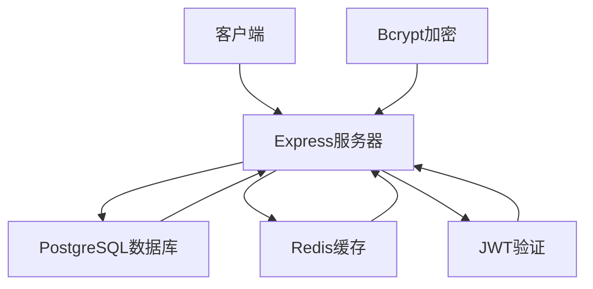
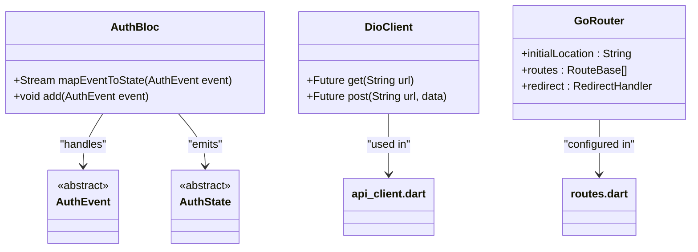
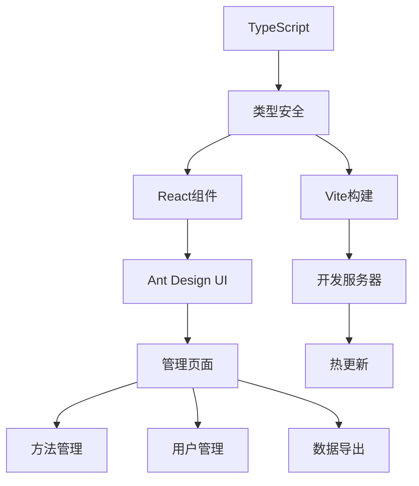

# 技术栈

<cite>
**本文档中引用的文件**  
- [package.json](file://backend/package.json)
- [pubspec.yaml](file://flutter_app/pubspec.yaml)
- [index.ts](file://backend/src/index.ts)
- [database.ts](file://backend/src/config/database.ts)
- [main.dart](file://flutter_app/lib/main.dart)
- [App.tsx](file://home/user/nian/admin-web/src/App.tsx)
- [routes.dart](file://flutter_app/lib/config/routes.dart)
- [tsconfig.json](file://backend/tsconfig.json)
- [vite.config.ts](file://home/user/nian/admin-web/vite.config.ts)
</cite>

## 目录
1. [后端技术栈](#后端技术栈)
2. [移动端技术栈](#移动端技术栈)
3. [管理后台技术栈](#管理后台技术栈)
4. [语言选型](#语言选型)
5. [依赖版本与兼容性矩阵](#依赖版本与兼容性矩阵)
6. [升级建议](#升级建议)
7. [新开发者学习曲线](#新开发者学习曲线)

## 后端技术栈

nian项目的后端采用Express框架作为核心Web服务器，结合PostgreSQL作为主数据库，Redis作为缓存层，JWT实现身份验证，Bcrypt进行密码加密。该技术组合提供了高性能、高安全性和良好的可扩展性。

Express作为轻量级Node.js框架，提供了灵活的路由系统和中间件机制，通过`src/index.ts`中的模块化路由设计（如`auth.routes`、`method.routes`等），实现了清晰的API分层。配合`helmet`、`cors`、`express-rate-limit`等安全中间件，增强了应用的安全防护能力。

PostgreSQL作为关系型数据库，通过`pg`库与应用连接，支持复杂查询和事务处理，适用于心理自助应用中用户、方法、练习记录等结构化数据的存储。Redis缓存通过`redis`客户端集成，用于存储会话信息和高频访问数据，显著提升响应速度。

JWT（JSON Web Token）通过`jsonwebtoken`库实现无状态身份验证，用户登录后生成token并存储于客户端，每次请求携带token进行验证。Bcrypt哈希算法确保用户密码安全存储，防止明文泄露风险。

**图示来源**  
- [index.ts](file://backend/src/index.ts#L1-L85)
- [database.ts](file://backend/src/config/database.ts#L1-L47)

**本节来源**  
- [package.json](file://backend/package.json#L1-L55)
- [index.ts](file://backend/src/index.ts#L1-L85)
- [database.ts](file://backend/src/config/database.ts#L1-L47)

## 移动端技术栈

移动端基于Flutter框架构建，采用flutter_bloc进行状态管理，dio作为网络请求库，go_router实现路由导航。该架构实现了UI与业务逻辑的分离，提升了代码可维护性和开发效率。

flutter_bloc遵循响应式编程模式，通过事件（Event）驱动状态（State）变更，确保应用状态的一致性和可预测性。在`main.dart`中，`AuthBloc`被注入到`BlocProvider`中，实现跨页面的状态共享。各功能模块（如方法、练习、用户方法）均采用独立的BLoC组件，形成清晰的层次结构。

dio作为现代化HTTP客户端，支持拦截器、请求取消、文件上传等功能，与`ApiClient`结合实现统一的API调用层。通过`DioClient`封装基础配置（如超时、头部信息），提高代码复用率。

go_router提供声明式路由配置，支持嵌套路由、参数传递和路由守卫。在`routes.dart`中定义了完整的路由表，并通过`_handleRedirect`实现登录状态校验，确保未授权用户无法访问受保护页面。

**图示来源**  
- [main.dart](file://flutter_app/lib/main.dart#L1-L105)
- [routes.dart](file://flutter_app/lib/config/routes.dart#L1-L242)

**本节来源**  
- [pubspec.yaml](file://flutter_app/pubspec.yaml#L1-L111)
- [main.dart](file://flutter_app/lib/main.dart#L1-L105)
- [routes.dart](file://flutter_app/lib/config/routes.dart#L1-L242)

## 管理后台技术栈

管理后台采用React + Ant Design + Vite的技术组合，兼顾开发效率与运行性能。React的组件化架构使得界面模块高度可复用，Ant Design提供企业级UI组件库，Vite作为现代构建工具大幅提升开发体验。

React通过函数式组件和Hooks（如`useState`、`useEffect`）实现状态管理，在`App.tsx`中构建了包含侧边栏、头部导航和内容区域的布局结构。路由系统基于`react-router-dom`实现，支持动态导航和权限控制。

Ant Design的`Layout`、`Menu`、`Table`等组件被广泛应用于管理后台，如`MethodList`、`UserManagement`等页面，快速搭建出专业美观的管理界面。图标系统集成`@ant-design/icons`，提升视觉一致性。

Vite作为构建工具，利用ES模块原生支持实现极速冷启动和热更新，显著提升开发效率。配合TypeScript提供类型检查，减少运行时错误。

**图示来源**  
- [App.tsx](file://home/user/nian/admin-web/src/App.tsx#L1-L154)
- [package.json](file://home/user/nian/admin-web/package.json#L1-L65)

**本节来源**  
- [package.json](file://home/user/nian/admin-web/package.json#L1-L65)
- [App.tsx](file://home/user/nian/admin-web/src/App.tsx#L1-L154)
- [vite.config.ts](file://home/user/nian/admin-web/vite.config.ts)

## 语言选型

项目采用TypeScript和Dart两种语言，分别服务于后端/管理后台和移动端，充分发挥各自优势。

TypeScript作为JavaScript的超集，在后端（Express）和管理后台（React）中提供静态类型检查。通过`tsconfig.json`配置严格的类型规则（如`strictNullChecks`、`noImplicitAny`），有效捕获潜在错误。接口定义在`types/index.ts`中集中管理，增强代码可读性和维护性。

Dart语言专为Flutter设计，具备AOT编译特性，确保移动端应用的高性能。其空安全（null safety）机制在`pubspec.yaml`中通过`sdk: '>=3.0.0'`启用，避免空指针异常。异步编程模型（Future/Stream）与BLoC模式完美契合，简化复杂状态流处理。

两种语言均支持现代开发特性，如模块化、泛型、异步操作等，为跨平台开发提供一致的开发体验。

**本节来源**  
- [tsconfig.json](file://backend/tsconfig.json#L1-L28)
- [pubspec.yaml](file://flutter_app/pubspec.yaml#L1-L111)

## 依赖版本与兼容性矩阵

根据`package.json`和`pubspec.yaml`中的依赖声明，整理关键依赖版本如下：

| 类别 | 技术 | 版本 | 兼容性说明 |
|------|------|------|------------|
| 后端框架 | Express | ^4.18.2 | 兼容Node.js 14+ |
| 数据库 | PostgreSQL | pg ^8.11.3 | 支持PostgreSQL 10+ |
| 缓存 | Redis | redis ^4.6.10 | 兼容Redis 6.0+ |
| 身份验证 | JWT | jsonwebtoken ^9.0.2 | 需Node.js 12+ |
| 加密 | Bcrypt | ^5.1.1 | 无特殊依赖 |
| 移动端框架 | Flutter | SDK >=3.0.0 | 需Dart 3.0+ |
| 状态管理 | flutter_bloc | ^8.1.3 | 兼容Flutter 3.x |
| 网络请求 | dio | ^5.4.0 | 支持Dart 2.17+ |
| 路由 | go_router | ^12.1.3 | 需Flutter 3.7+ |
| 前端框架 | React | ^18.2.0 | 需Node.js 14+ |
| UI库 | Ant Design | ^5.12.0 | 兼容React 18 |
| 构建工具 | Vite | ^5.0.8 | 需Node.js 14.18+ |

**本节来源**  
- [package.json](file://backend/package.json#L1-L55)
- [pubspec.yaml](file://flutter_app/pubspec.yaml#L1-L111)
- [package.json](file://home/user/nian/admin-web/package.json#L1-L65)

## 升级建议

建议定期更新依赖以获取安全补丁和新特性，但需注意版本兼容性：

1. **Express升级**：可考虑升级至Express 5.x预览版，但需测试中间件兼容性。
2. **PostgreSQL驱动**：`pg`库已稳定，建议保持当前版本。
3. **Redis客户端**：`redis`库4.x版本已成熟，无需紧急升级。
4. **JWT安全性**：`jsonwebtoken` 9.x版本修复了多个安全漏洞，建议保持更新。
5. **Flutter生态**：`flutter_bloc` 8.x与Flutter 3.x完全兼容，未来可平滑升级至9.x。
6. **go_router**：12.x版本支持Flutter 3.7+的新特性，建议保持同步更新。
7. **React生态**：React 18已稳定，Ant Design 5.x完美支持，无需降级。

所有升级应在测试环境中充分验证，特别是涉及breaking changes的主版本升级。

**本节来源**  
- [package.json](file://backend/package.json#L1-L55)
- [pubspec.yaml](file://flutter_app/pubspec.yaml#L1-L111)

## 新开发者学习曲线

以下技术点对新开发者可能具有较高学习门槛：

1. **flutter_bloc模式**：需理解事件-状态流、Stream、Sink等概念。建议学习[BLoC官方文档](https://bloclibrary.dev/)。
2. **go_router高级用法**：嵌套路由、守卫、参数解析等。参考[go_router GitHub仓库](https://github.com/flutter/packages/tree/main/packages/go_router)。
3. **Express中间件机制**：执行顺序、错误处理中间件等。建议阅读[Express官方指南](https://expressjs.com/)。
4. **React Hooks**：状态逻辑复用、自定义Hook设计。推荐[React官方文档](https://react.dev/)。
5. **TypeScript高级类型**：泛型、映射类型、条件类型等。学习[TypeScript手册](https://www.typescriptlang.org/docs/)。

项目已通过清晰的目录结构（如`data`、`domain`、`presentation`分层）降低理解难度，新成员可结合`FLUTTER_ARCHITECTURE.md`等文档快速上手。

**本节来源**  
- [main.dart](file://flutter_app/lib/main.dart#L1-L105)
- [routes.dart](file://flutter_app/lib/config/routes.dart#L1-L242)
- [index.ts](file://backend/src/index.ts#L1-L85)
- [App.tsx](file://home/user/nian/admin-web/src/App.tsx#L1-L154)