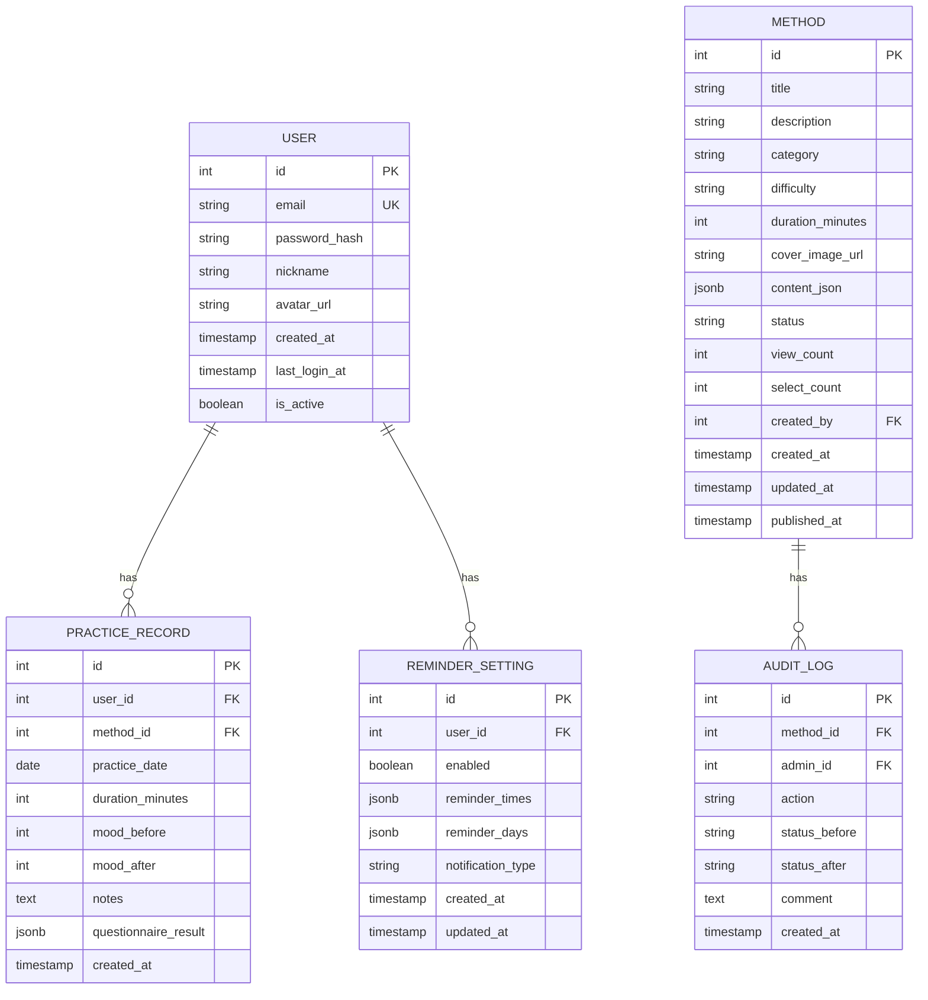
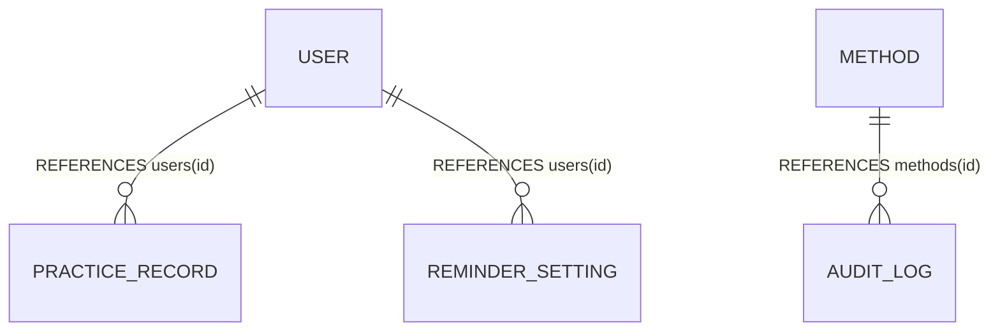
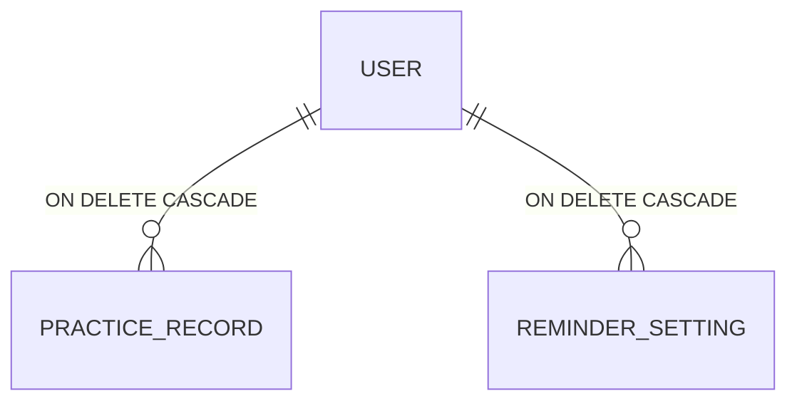
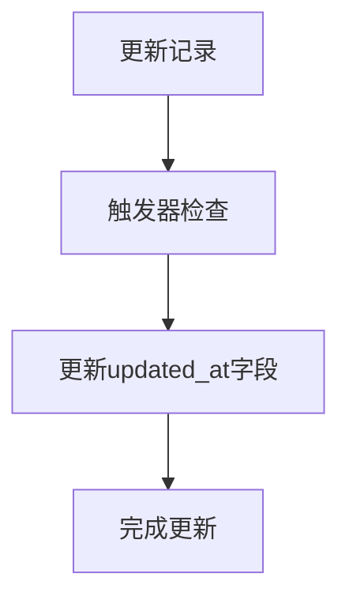
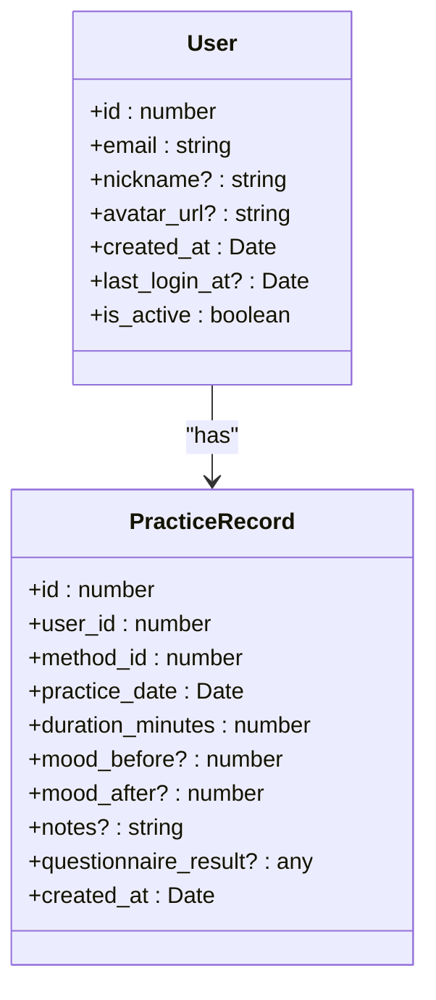
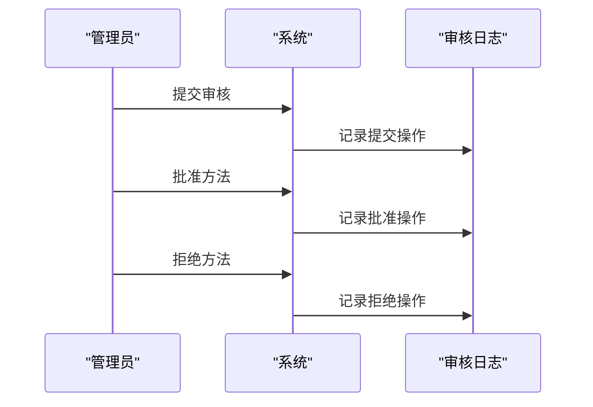

# 一对多关系

<cite>
**本文档中引用的文件**   
- [init.sql](file://database/init.sql)
- [index.ts](file://backend/src/types/index.ts)
- [userMethod.controller.ts](file://backend/src/controllers/userMethod.controller.ts)
- [practice.controller.ts](file://backend/src/controllers/practice.controller.ts)
- [admin.controller.ts](file://backend/src/controllers/admin.controller.ts)
- [database.ts](file://backend/src/config/database.ts)
- [user_model.dart](file://flutter_app/lib/data/models/user_model.dart)
- [practice_record_model.dart](file://flutter_app/lib/data/models/practice_record_model.dart)
- [method_model.dart](file://flutter_app/lib/data/models/method_model.dart)
</cite>

## 目录
1. [引言](#引言)
2. [核心一对多关系实现](#核心一对多关系实现)
3. [外键约束与数据完整性](#外键约束与数据完整性)
4. [级联删除行为](#级联删除行为)
5. [触发器与数据一致性](#触发器与数据一致性)
6. [应用层与数据层一致性](#应用层与数据层一致性)
7. [实际业务场景示例](#实际业务场景示例)
8. [结论](#结论)

## 引言
nian项目是一个全平台心理自助应用系统，其数据模型设计体现了典型的一对多关系。本文档详细解释了项目中用户与练习记录、用户与提醒设置、方法与审核记录等核心关联的实现机制。通过分析SQL表结构、TypeScript类型定义和控制器逻辑，展示外键约束如何确保数据完整性，ON DELETE CASCADE的级联删除行为如何防止孤儿记录，以及触发器在维护数据一致性中的作用。同时，结合实际业务场景，说明管理员操作方法审核时的审计追踪机制。

**Section sources**
- [init.sql](file://database/init.sql#L1-L349)
- [index.ts](file://backend/src/types/index.ts#L1-L126)

## 核心一对多关系实现
nian项目中的一对多关系主要体现在以下几个核心关联：

1. **用户与练习记录 (users → practice_records)**：一个用户可以有多个练习记录，每个练习记录属于一个用户。
2. **用户与提醒设置 (users → reminder_settings)**：一个用户有一个提醒设置，但通过外键关联形成一对多关系。
3. **方法与审核记录 (methods → audit_logs)**：一个方法可以有多个审核记录，每个审核记录关联一个方法。

这些关系在数据库表结构中通过外键约束实现，确保了数据的完整性和一致性。

**Diagram sources **
- [init.sql](file://database/init.sql#L5-L349)

**Section sources**
- [init.sql](file://database/init.sql#L5-L349)
- [index.ts](file://backend/src/types/index.ts#L4-L63)

## 外键约束与数据完整性
外键约束是确保数据完整性的关键机制。在nian项目中，外键约束通过以下方式实现：

- **用户与练习记录**：`practice_records`表中的`user_id`字段引用`users`表的`id`字段，确保每个练习记录都关联到一个有效的用户。
- **用户与提醒设置**：`reminder_settings`表中的`user_id`字段引用`users`表的`id`字段，确保每个提醒设置都关联到一个有效的用户。
- **方法与审核记录**：`audit_logs`表中的`method_id`字段引用`methods`表的`id`字段，确保每个审核记录都关联到一个有效的方法。

这些外键约束防止了无效数据的插入，确保了数据的完整性和一致性。

**Diagram sources **
- [init.sql](file://database/init.sql#L64-L74)
- [init.sql](file://database/init.sql#L82-L90)
- [init.sql](file://database/init.sql#L110-L119)

**Section sources**
- [init.sql](file://database/init.sql#L64-L74)
- [init.sql](file://database/init.sql#L82-L90)
- [init.sql](file://database/init.sql#L110-L119)

## 级联删除行为
ON DELETE CASCADE的级联删除行为是防止孤儿记录的重要机制。在nian项目中，级联删除行为通过以下方式实现：

- **用户与练习记录**：当用户被删除时，其所有练习记录也会被自动删除，防止产生孤儿记录。
- **用户与提醒设置**：当用户被删除时，其提醒设置也会被自动删除，确保数据的一致性。

这种级联删除行为通过在表定义中添加`ON DELETE CASCADE`子句实现，确保了数据的完整性和一致性。

**Diagram sources **
- [init.sql](file://database/init.sql#L65-L66)
- [init.sql](file://database/init.sql#L83-L84)

**Section sources**
- [init.sql](file://database/init.sql#L65-L66)
- [init.sql](file://database/init.sql#L83-L84)

## 触发器与数据一致性
触发器在维护数据一致性中起着重要作用。在nian项目中，触发器通过以下方式实现：

- **更新时间自动触发器**：`update_updated_at_column`触发器在`methods`和`reminder_settings`表的记录被更新时自动更新`updated_at`字段，确保了数据的时效性。

这种触发器机制通过在数据库中定义触发器函数和触发器实现，确保了数据的一致性和完整性。

**Diagram sources **
- [init.sql](file://database/init.sql#L301-L315)

**Section sources**
- [init.sql](file://database/init.sql#L301-L315)

## 应用层与数据层一致性
nian项目通过TypeScript类型定义和控制器逻辑确保应用层与数据层的一致性。TypeScript类型定义与数据库表结构保持一致，控制器逻辑通过事务和验证确保数据的完整性和一致性。

**Diagram sources **
- [index.ts](file://backend/src/types/index.ts#L4-L63)
- [practice.controller.ts](file://backend/src/controllers/practice.controller.ts#L6-L261)

**Section sources**
- [index.ts](file://backend/src/types/index.ts#L4-L63)
- [practice.controller.ts](file://backend/src/controllers/practice.controller.ts#L6-L261)

## 实际业务场景示例
### 用户删除时相关练习记录的自动清理
当用户被删除时，其所有练习记录也会被自动删除，防止产生孤儿记录。这种级联删除行为通过在`practice_records`表定义中添加`ON DELETE CASCADE`子句实现。

### 管理员操作方法审核时的审计追踪机制
当管理员提交、批准或拒绝方法时，系统会记录审核日志，包括操作类型、状态变化和评论。这种审计追踪机制通过在`audit_logs`表中插入记录实现，确保了操作的可追溯性。

**Diagram sources **
- [admin.controller.ts](file://backend/src/controllers/admin.controller.ts#L266-L387)

**Section sources**
- [admin.controller.ts](file://backend/src/controllers/admin.controller.ts#L266-L387)

## 结论
nian项目通过外键约束、级联删除行为和触发器机制，确保了数据的完整性和一致性。TypeScript类型定义和控制器逻辑确保了应用层与数据层的一致性。实际业务场景示例展示了这些机制在用户删除和管理员审核操作中的应用，体现了系统的健壮性和可维护性。